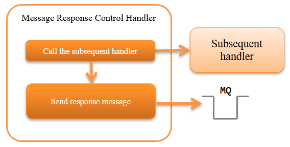

.. _message_reply_handler:

Message Response Control Handler
==================================================
.. contents:: Table of contents
  :depth: 3
  :local:

This handler creates a response message and returns (sends) it to the connection destination based on the results of the  :java:extdoc:`ResponseMessage <nablarch.fw.messaging.ResponseMessage>` object, 
which is the processing result of the subsequent handler.

This handler performs the following process:

* Sends the response message

The process flow is as follows.

  
Handler class name
--------------------------------------------------
* :java:extdoc:`nablarch.fw.messaging.handler.MessageReplyHandler`

Module list
--------------------------------------------------
.. code-block:: xml

  <dependency>
    <groupId>com.nablarch.framework</groupId>
    <artifactId>nablarch-fw-messaging</artifactId>
  </dependency>

Constraints
------------------------------
Configure this handler after the :ref:`messaging_context_handler` 
  This handler sends the response message (puts to the message queue) Therefore it is necessary to configure this handler after  :ref:`messaging_context_handler` , 
  which establishes a connection to MQ.

Positional relationship with the :ref:`transaction_management_handler` 
  The positional relationship with :ref:`transaction_management_handler`  changes depending on whether a two-phase commit is used.

  Two-phase commit is used
    Collates and commits the database transaction and message queue (Jakarta Messaging) transaction together in the transaction manager. 
    Therefore, a response message is required to be sent before the transaction control, and this handler has to be configured after the :ref:`transaction_management_handler` .

  Two-phase commit is not used
    It is necessary to determine the result of the business process before this handler sends a response. 
    Therefore, the  :ref:`transaction_management_handler` must be configured after this handler.

Configuring the framework control header
--------------------------------------------------
When changing the definition of the framework control header in the response message, the definition of the framework control header extended in the project has to be configured. 
If it is not configured, the default  :java:extdoc:`StandardFwHeaderDefinition <nablarch.fw.messaging.StandardFwHeaderDefinition>`  will be used.

For details of the framework control header, see  :ref:`framework control header <mom_system_messaging-fw_header>` .

A configuration example is shown below.

.. code-block:: xml

  <component class="nablarch.fw.messaging.handler.MessageReplyHandler">
    <!-- Configuring the framework control header -->
    <property name="fwHeaderDefinition">
      <component class="sample.SampleFwHeaderDefinition" />
    </property>
  </component> 
