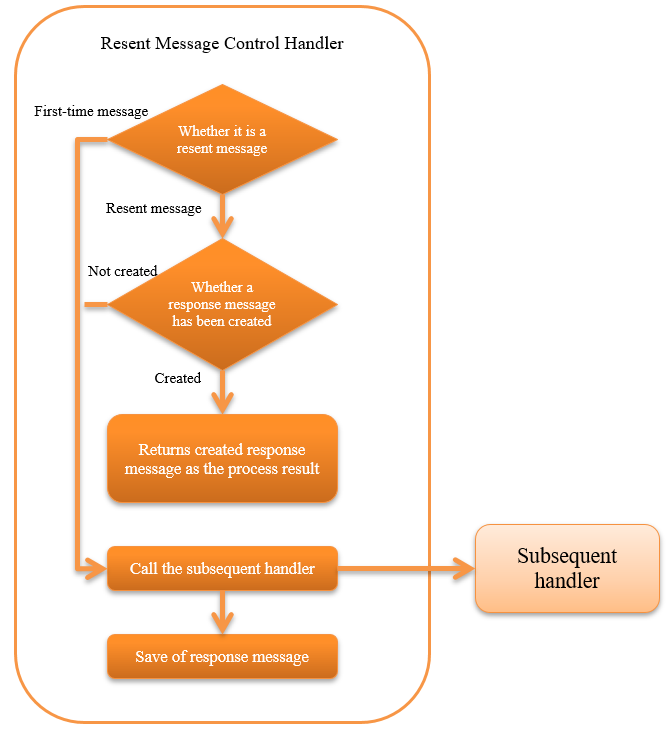

.. _message_resend_handler:

Resent Message Control Handler
==================================================
.. contents:: Table of contents
  :depth: 3
  :local:

This handler controls the resend when the same message is received repeatedly.

Specifically, when the same message is received repeatedly, it determines whether the processing for the message has been completed (whether a response message has been created). 
If the process has already been completed (if a response message has been created), the created response message is automatically sent instead of repeating the business process.

Refer to  :ref:`message_resend_handler-resent_message`  for the method to determine whether the message is the same.

.. tip::
  The advantages of applying this handler are as below:

  * If a response message has already been created, the system load can be reduced as the business process is omitted.
  * In the case of the registration process to the database, a logic for preventing double capture is not required as the business process is omitted.

This handler performs the following processes:

* Save process of the response message
* In the case of resent messages, send process of the saved response message
* In the case of other than resent message and stored resend message is not available, delegates processing to the subsequent handler

The process flow is as follows.

  
Handler class name
--------------------------------------------------
* :java:extdoc:`nablarch.fw.messaging.handler.MessageResendHandler`

Module list
--------------------------------------------------
.. code-block:: xml

  <dependency>
    <groupId>com.nablarch.framework</groupId>
    <artifactId>nablarch-fw-messaging</artifactId>
  </dependency>

Constraints
------------------------------
Configure this handler after the :ref:`message_reply_handler` .
  It is necessary to send the response message created by this handler. 
  Therefore it is necessary to configure this handler after  :ref:`message_reply_handler` , which sends the message.

Configure this handler after the :ref:`transaction_management_handler` .
  This handler saves the response message in the database. 
  Therefore it is necessary to configure this handler after the  :ref:`transaction_management_handler` , which realizes transaction control for the database.

Save destination of response message
--------------------------------------------------
The response message created in the subsequent handler is stored in the table on the database. 
Therefore, the storage table for response messages has to be prepared in advance.

The definition of the table that stores the response message is as below. 
For default table name or value of physical name, see  :java:extdoc:`SentMessageTableSchema <nablarch.fw.messaging.tableschema.SentMessageTableSchema>` .

.. list-table::
  :header-rows: 1
  :class: white-space-normal
  :widths: 30 30 40

  * - Column name
    - Constraints
    - Stored value

  * - Request ID
    - Primary key |br| String type
    - Request ID of request message

  * - Message ID
    - Primary key |br| String type
    - Message ID of request message

      In the case of a resent message, instead of the message ID use the correlation message ID.

      For details, see :ref:`message_resend_handler-resent_message` .

  * - Logical name of the destination queue
    - String type
    - Logical name of the destination queue for sending response message |br|
      (:java:extdoc:`InterSystemMessage#getDestination() <nablarch.fw.messaging.InterSystemMessage.getDestination()>`)

  * - Process result code
    - String type
    - Process result code of the response message: |br| 
      (:java:extdoc:`ResponseMessage#getStatusCode() <nablarch.fw.messaging.ResponseMessage.getStatusCode()>`)

  * - Response message
    - Binary type
    - Response message contents |br|
      (:java:extdoc:`ResponseMessage#getBodyBytes() <nablarch.fw.messaging.ResponseMessage.getBodyBytes()>`)

The default table name or column name can be changed with configuration.
For details, see :java:extdoc:`SentMessageTableSchema <nablarch.fw.messaging.tableschema.SentMessageTableSchema>`  and :java:extdoc:`sentMessageTableSchema property <nablarch.fw.messaging.handler.MessageResendHandler.setSentMessageTableSchema(nablarch.fw.messaging.tableschema.SentMessageTableSchema)>` .

.. _message_resend_handler-resent_message:

How to determine if it is the same message (resent message)
---------------------------------------------------------------------
If the message received by this handler satisfies the below conditions, it is determined that the request message received has already been processed and returns the saved response message as the process result.

* A value is configured in the resent request flag of the framework control header
* Data associated with the request ID and message ID of the request messages received is present in the table that stores the response message

For details of the framework control header, see :ref:`framework control header <mom_system_messaging-fw_header>` .

.. important::

  The following conditions must be satisfied when the partner system sends the request message. 
  The handler cannot be used if this constraint is not satisfied, and a new handler must be created to implement resent control in the project.

  * Configure the message ID of the request message used during the first send as the correlation message ID of the resent message
  * Configure a value in the resent request flag of the framework control header

Configuring the framework control header
--------------------------------------------------
When changing the definition of the framework control header in the response message, the definition of the framework control header extended in the project has to be configured. 
If it is not configured, the default :java:extdoc:`StandardFwHeaderDefinition <nablarch.fw.messaging.StandardFwHeaderDefinition>`  will be used.

For details of the framework control header, see  :ref:`framework control header <mom_system_messaging-fw_header>` .

A configuration example is shown below.

.. code-block:: xml

  <component class="nablarch.fw.messaging.handler.MessageResendHandler">
    <!-- Configuring the framework control header -->
    <property name="fwHeaderDefinition">
      <component class="sample.SampleFwHeaderDefinition" />
    </property>
  </component> 

.. |br| raw:: html

   

