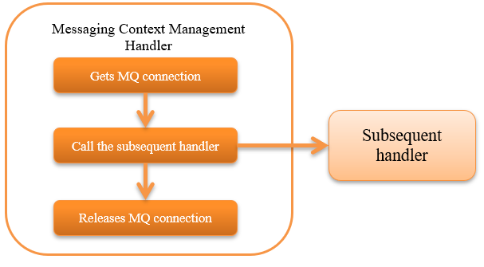

.. _messaging_context_handler:

Messaging Context Management Handler
==================================================

.. contents:: Table of contents
  :depth: 3
  :local:

This handler manages the MQ connection on the thread for use by the subsequent handler and library.

For details of MOM messaging, see  :ref:`system_messaging` .

This handler performs the following processes.

* Gets MQ connection
* Releases MQ connection

The process flow is as follows.

Handler class name
--------------------------------------------------
* :java:extdoc:`nablarch.fw.messaging.handler.MessagingContextHandler`

Module list
--------------------------------------------------
.. code-block:: xml

  <dependency>
    <groupId>com.nablarch.framework</groupId>
    <artifactId>nablarch-fw-messaging</artifactId>
  </dependency>

Constraints
------------------------------
None.

Configure the connection destination of MQ
--------------------------------------------------
This handler acquires the MQ connection using the provider class (  :java:extdoc:`MessagingProvider <nablarch.fw.messaging.MessagingProvider>` implementation class) configured in the  :java:extdoc:`messagingProvider <nablarch.fw.messaging.handler.MessagingContextHandler.setMessagingProvider(nablarch.fw.messaging.MessagingProvider)>` property.

A configuration example is shown below. 
For the configuration contents of provider class, refer to Javadoc of the implementation class :java:extdoc:`MessagingProvider <nablarch.fw.messaging.MessagingProvider>` .

.. code-block:: xml

 <!-- Message context management handler-->
 <component class="nablarch.fw.messaging.handler.MessagingContextHandler">
   <property name="messagingProvider" ref="messagingProvider" />
 </component>

 <!-- Provider class -->
 <component name="messagingProvider"
     class="nablarch.fw.messaging.provider.JmsMessagingProvider">
   <!-- Property configuration is omitted -->
 </component>
