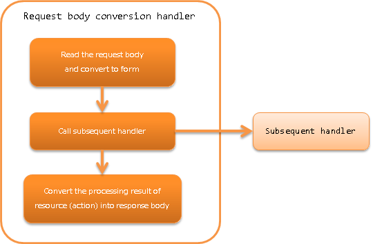

.. _body_convert_handler:

Request Body Conversion Handler
==================================================
.. contents:: Table of contents
  :depth: 3
  :local:

This handler performs conversion process of request body and response body.

The format used for conversion is specified in :java:extdoc:`Consumes <jakarta.ws.rs.Consumes>` and :java:extdoc:`Produces <jakarta.ws.rs.Produces>` annotations
which are configured in the method of resource (action) class that processes the request.

This handler performs the following process.

* Converts the request body to a form that can be accepted by the resource (action) class.
  For details, see :ref:`body_convert_handler-convert_request`.

* Converts the processing result of the resource (action) class to response body.
  For details, see :ref:`body_convert_handler-convert_response`.

The process flow is as follows.

Handler class name
--------------------------------------------------
* :java:extdoc:`nablarch.fw.jaxrs.BodyConvertHandler`

Module list
--------------------------------------------------
.. code-block:: xml

  <dependency>
    <groupId>com.nablarch.framework</groupId>
    <artifactId>nablarch-fw-jaxrs</artifactId>
  </dependency>

Constraints
------------------------------
Configure this handler after the :ref:`router_adaptor`
  This handler converts the request and response
  based on the annotation information configured in the method of the resource (action) class.
  Therefore, this handler should be configured after the :ref:`router_adaptor`, which specifies the dispatch destination.

Configure the converter that performs the conversion process
---------------------------------------------------------------------------------
This handler performs the conversion if request and response using the implementation class :java:extdoc:`BodyConverter <nablarch.fw.jaxrs.BodyConverter>`
that is configured in the :java:extdoc:`bodyConverters <nablarch.fw.jaxrs.BodyConvertHandler.setBodyConverters(java.util.List)>` property.
:java:extdoc:`BodyConverter <nablarch.fw.jaxrs.BodyConverter>` corresponding to the MIME used in the project
should be configured in the :java:extdoc:`bodyConverters <nablarch.fw.jaxrs.BodyConvertHandler.setBodyConverters(java.util.List)>` property.

An example is shown below.

.. code-block:: xml

  <component class="nablarch.fw.jaxrs.BodyConvertHandler">
    <property name="bodyConverters">
      <list>
        <!-- Request and response converter for application/xml -->
        <component class="nablarch.fw.jaxrs.JaxbBodyConverter" />
        <!-- Request and response converter for application/x-www-form-urlencoded -->
        <component class="nablarch.fw.jaxrs.FormUrlEncodedConverter" />
      </list>
    </property>
  </component>

.. tip::
  If the MIME used cannot be converted by the converter configured in the :java:extdoc:`bodyConverters <nablarch.fw.jaxrs.BodyConvertHandler.setBodyConverters(java.util.List)>` property,
  a status code (``415``) indicating that it is an unsupported media type　is returned.

.. _body_convert_handler-convert_request:

Convert request body to form
--------------------------------------------------
The format used for the request body conversion is determined by :java:extdoc:`Consumes <jakarta.ws.rs.Consumes>` configured in the method that processes the request.
If MIME different from the MIME configured in :java:extdoc:`Consumes <jakarta.ws.rs.Consumes>` is configured in the Content-Type of the request header,
a status code (``415``) indicating that it is an unsupported media type is returned.

An implementation example of the resource (action) method is shown below.

In this example, the request body is being converted to ``Person`` by :java:extdoc:`BodyConverter <nablarch.fw.jaxrs.BodyConverter>`
corresponding to the ``application/json`` indicated by ``MediaType.APPLICATION_JSON``.

.. code-block:: java

  @Consumes(MediaType.APPLICATION_JSON)
  @Valid
  public HttpResponse saveJson(Person person) {
      UniversalDao.insert(person);
      return new HttpResponse();
  }

.. _body_convert_handler-convert_response:

Convert the processing result of resource (action) to response body
----------------------------------------------------------------------
The format used for the response body conversion is determined by :java:extdoc:`Produces <jakarta.ws.rs.Produces>` configured in the method that processes the request.

An implementation example of the resource (action) method is shown below.

In this example, the request body is being converted to ``Person`` by :java:extdoc:`BodyConverter <nablarch.fw.jaxrs.BodyConverter>`
corresponding to the ``application/json`` indicated by ``MediaType.APPLICATION_JSON``.

.. code-block:: java

  GET
  @Produces(MediaType.APPLICATION_JSON)
  public List<Person> findJson() {
      return UniversalDao.findAll(Person.class);
  }

