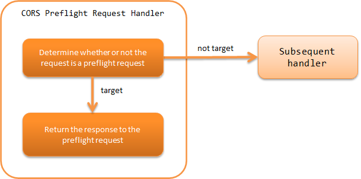

.. _cors_preflight_request_handler:

CORS Preflight Request Handler
==================================================
.. contents:: Table of contents
  :depth: 3
  :local:

This handler is used to implement Cross-Origin Resource Sharing (CORS) with :ref:`RESTful web service <restful_web_service>`.

Implementing CORS requires handling of the preflight request which is sent before the actual request and the actual request.
Preflight requests are handled by this handler, and handling for the actual request is handled by :java:extdoc:`CorsResponseFinisher <nablarch.fw.jaxrs.cors.CorsResponseFinisher>`,
which implements ResponseFinisher as described in :ref:`jaxrs_response_handler-response_finisher`.

This handler performs the following process.

* Return the response to the preflight request if the request is a preflight request.

The process flow is as follows.

Handler class name
--------------------------------------------------
* :java:extdoc:`nablarch.fw.jaxrs.CorsPreflightRequestHandler`

Module list
--------------------------------------------------
.. code-block:: xml

  <dependency>
    <groupId>com.nablarch.framework</groupId>
    <artifactId>nablarch-fw-jaxrs</artifactId>
  </dependency>

Constraints
------------------------------
Configure this handler after the :ref:`jaxrs_response_handler`
  The :java:extdoc:`HttpResponse <nablarch.fw.web.HttpResponse>` created by this handler is handled by :ref:`jaxrs_response_handler`,
  so the this handler should be placed after :ref:`jaxrs_response_handler`.

.. _cors_preflight_request_handler-setting:

Implementing CORS
--------------------------------------------------
To implement CORS, configure this handler and :java:extdoc:`CorsResponseFinisher <nablarch.fw.jaxrs.cors.CorsResponseFinisher>`.

CORS is handled by the :java:extdoc:`Cors <nablarch.fw.jaxrs.cors.Cors>` interface.
The framework provides the :java:extdoc:`BasicCors <nablarch.fw.jaxrs.cors.BasicCors>` class as a basic implementation of CORS.
Just specify BasicCors for this handler and CorsResponseFinisher.

The settings are shown below.

.. code-block:: xml

  <!-- BasicCors -->
  <component name="cors" class="nablarch.fw.jaxrs.cors.BasicCors">
    <!-- Specifies which Origin to allow. This setting is required -->
    <property name="allowOrigins">
      <list>
        <value>https://www.example.com</value>
      </list>
    </property>
  </component>

  <!-- Handler queue configuration -->
  <component name="webFrontController" class="nablarch.fw.web.servlet.WebFrontController">
    <property name="handlerQueue">
      <list>
        <!-- Other handlers are omitted -->

        <!-- JaxRsResponseHandler -->
        <component class="nablarch.fw.jaxrs.JaxRsResponseHandler">
          <property name="responseFinishers">
            <list>
              <!-- CorsResponseFinisher -->
              <component class="nablarch.fw.jaxrs.cors.CorsResponseFinisher">
                <!-- Specifies BasicCors -->
                <property name="cors" ref="cors" />
              </component>
            </list>
          </property>
        </component>

        <!-- CorsPreflightRequestHandler -->
        <component class="nablarch.fw.jaxrs.CorsPreflightRequestHandler">
          <!-- Specifies BasicCors -->
          <property name="cors" ref="cors" />
        </component>

      </list>
    </property>
  </component>

:java:extdoc:`BasicCors <nablarch.fw.jaxrs.cors.BasicCors>` performs the following processing by default.

Preflight Request (the process called by CorsPreflightRequestHandler)
  - A request is considered a preflight request if it satisfies all of the following conditions

      - HTTP method：OPTIONS
      - Origin header：exist
      - Access-Control-Request-Method header：exist

  - Return the following response if the request is a preflight request

      - Status code：204
      - Access-Control-Allow-Methods header：OPTIONS, GET, POST, PUT, DELETE, PATCH
      - Access-Control-Allow-Headers header：Content-Type, X-CSRF-TOKEN
      - Access-Control-Max-Age header：-1
      - The same response header as in the " Actual Request" below is also set.

Actual Request (the process called by CorusResponseFinisher)
  - Set the following response headers

      - Access-Control-Allow-Origin header：Origin header of the request

          - Set this header only if the request's Origin header is included in the allowed Origin
      - Vary header：Origin

          - Set this header only if the request's Origin header is included in the allowed Origin
      - Access-Control-Allow-Credentials header：true

Among the default processes, the contents of the response header can be changed in the settings.
See Javadoc in :java:extdoc:`BasicCors <nablarch.fw.jaxrs.cors.BasicCors>` for what can be changed in the configuration.
