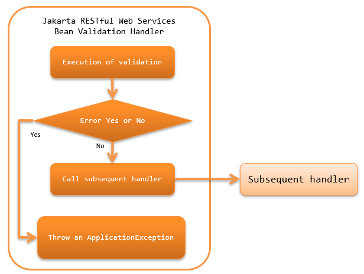

.. _jaxrs_bean_validation_handler:

JAX-RS BeanValidation Handler
==================================================
.. contents:: Table of contents
  :depth: 3
  :local:

This handler executes :ref:`bean_validation` for Form (Bean) received by the resource (action) class.
If a validation error occurs during validation, the process is not delegated to the subsequent handler,
and the process is ended after sending :java:extdoc:`ApplicationException <nablarch.core.message.ApplicationException>`.

This handler performs the following process.

* Performs :ref:`bean_validation` for the form received by the resource (action) class method.

The process flow is as follows.

Handler class name
--------------------------------------------------
* :java:extdoc:`nablarch.fw.jaxrs.JaxRsBeanValidationHandler`

Module list
--------------------------------------------------
.. code-block:: xml

  <dependency>
    <groupId>com.nablarch.framework</groupId>
    <artifactId>nablarch-fw-jaxrs</artifactId>
  </dependency>

  <!-- Bean Validation module -->
  <dependency>
    <groupId>com.nablarch.framework</groupId>
    <artifactId>nablarch-core-validation-ee</artifactId>
  </dependency>

Constraints
------------------------------
Configure this handler after the :ref:`body_convert_handler`
  Since this handler is for the validation of Form (Bean) converted from the request body by the :ref:`body_convert_handler`.

Execute validation for Form (Bean) received by resource (action)
----------------------------------------------------------------------------------------------------
To validate the Form (Bean) received by the resource (action) method,
configure :java:extdoc:`Valid <javax.validation.Valid>` annotation for that method.

An example is shown below.

.. code-block:: java

  // Since validation has to be performed on the Person object,
  // configure a Valid annotation.
  @POST
  @Consumes(MediaType.APPLICATION_JSON)
  @Valid
  public HttpResponse save(Person person) {
      UniversalDao.insert(person);
      return new HttpResponse();
  }
