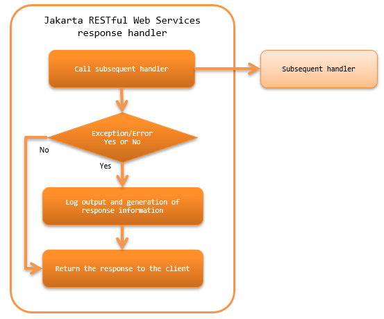

.. _jaxrs_response_handler:

JAX-RS Response Handler
==================================================
.. contents:: Table of contents
  :depth: 3
  :local:

This handler returns the response information from the subsequent handler (resource (action) class or :ref:`body_convert_handler`) to the client.
If an exception and error is thrown by the subsequent handler, constructs the response information corresponding to the error and exception,
and returns it to the client.

This handler performs the following process.

* Generates the response information when an exception and error occur.
  For details, see :ref:`jaxrs_response_handler-error_response`.
* Generates the log output when exception and error occur.
  For details, see :ref:`jaxrs_response_handler-error_log`.
* Returns the response to the client.

The process flow is as follows.

Handler class name
--------------------------------------------------
* :java:extdoc:`nablarch.fw.jaxrs.JaxRsResponseHandler`

Module list
--------------------------------------------------
.. code-block:: xml

  <dependency>
    <groupId>com.nablarch.framework</groupId>
    <artifactId>nablarch-fw-jaxrs</artifactId>
  </dependency>

Constraints
------------------------------
None.

.. _jaxrs_response_handler-error_response:

Generate responses in response to exceptions and errors
---------------------------------------------------------------------------
Generation of response information based on the exceptions and errors is performed by :java:extdoc:`ErrorResponseBuilder <nablarch.fw.jaxrs.ErrorResponseBuilder>`
configured in the :java:extdoc:`errorResponseBuilder <nablarch.fw.jaxrs.JaxRsResponseHandler.setErrorResponseBuilder(nablarch.fw.jaxrs.ErrorResponseBuilder)>` property.
However, when the exception class that has occurred is :java:extdoc:`HttpErrorResponse <nablarch.fw.web.HttpErrorResponse>`,
:java:extdoc:`HttpResponse <nablarch.fw.web.HttpResponse>` that is returned from
:java:extdoc:`HttpErrorResponse#getResponse() <nablarch.fw.web.HttpErrorResponse.getResponse()>` is returned to the client.

If the setting is omitted, :java:extdoc:`ErrorResponseBuilder <nablarch.fw.jaxrs.ErrorResponseBuilder>` of the default implementation will be used.
If the default implementation cannot meet the project requirements, inherit the default implementation class.

A configuration example is shown below.

.. code-block:: xml

  <component class="nablarch.fw.jaxrs.JaxRsResponseHandler">
    <property name="errorResponseBuilder">
      <component class="sample.SampleErrorResponseBuilder" />
    </property>
  </component>

.. important::
  Because ErrorResponseBuilder is responsible for generating responses in response to exceptions and errors, if an exception occurs during the processing of ErrorResponseBuilder,
  the response will not be generated and the response will not be returned to the client.
  Therefore, if you are customizing ErrorResponseBuilder in your project, ensure that no exceptions are thrown during the processing of ErrorResponseBuilder.
  If an exception is thrown during the processing of ErrorResponseBuilder, the framework logs the exception at the WARN level, generates a response with status code 500, and continues with the subsequent processing.

.. _jaxrs_response_handler-error_log:

Log output in response to exceptions and errors
--------------------------------------------------
Log output in response to exceptions and errors is performed by :java:extdoc:`JaxRsErrorLogWriter <nablarch.fw.jaxrs.JaxRsErrorLogWriter>`
configured in the property :java:extdoc:`errorLogWriter <nablarch.fw.jaxrs.JaxRsResponseHandler.setErrorLogWriter(nablarch.fw.jaxrs.JaxRsErrorLogWriter)>`.

If the setting is omitted, :java:extdoc:`JaxRsErrorLogWriter <nablarch.fw.jaxrs.JaxRsErrorLogWriter>` of the default implementation
will be used. If the default implementation cannot meet the project requirements, inherit the default implementation class.

A configuration example is shown below.

.. code-block:: xml

  <component class="nablarch.fw.jaxrs.JaxRsResponseHandler">
    <property name="errorLogWriter">
      <component class="sample.SampleJaxRsErrorLogWriter" />
    </property>
  </component>

Expansion example
--------------------------------------------------

.. _jaxrs_response_handler-error_response_body:

Configure a message in response to an error
~~~~~~~~~~~~~~~~~~~~~~~~~~~~~~~~~~~~~~~~~~~~~~~~~~~~~
In some cases, such as a validation error, etc., the error message may have to be configured in the response body and returned.
For such cases, support by creating an inherited class of :java:extdoc:`ErrorResponseBuilder <nablarch.fw.jaxrs.ErrorResponseBuilder>`.

An implementation example where a JSON format error message is configured in the response is shown below.

.. code-block:: java

  public class SampleErrorResponseBuilder extends ErrorResponseBuilder {

      private final ObjectMapper objectMapper = new ObjectMapper();

      @Override
      public HttpResponse build(final HttpRequest request,
              final ExecutionContext context, final Throwable throwable) {
          if (throwable instanceof ApplicationException) {
              return createResponseBody((ApplicationException) throwable);
          } else {
              return super.build(request, context, throwable);
          }
      }

      private HttpResponse createResponseBody(final ApplicationException ae) {
          final HttpResponse response = new HttpResponse(400);
          response.setContentType(MediaType.APPLICATION_JSON);

          // Generation process of error message is omitted

          try {
              response.write(objectMapper.writeValueAsString(errorMessages));
          } catch (JsonProcessingException ignored) {
              return new HttpResponse(500);
          }
          return response;
      }
  }

.. _jaxrs_response_handler-individually_error_response:

Return individually defined error response for specific errors
~~~~~~~~~~~~~~~~~~~~~~~~~~~~~~~~~~~~~~~~~~~~~~~~~~~~~~~~~~~~~~~~~~~~~~~~~~~~~~~~~~~~~~~~
For errors that occur in the subsequent process after this handler,
error response defined with a particular status code or body may have to be returned.

In such cases, create an inherited class from :java:extdoc:`ErrorResponseBuilder <nablarch.fw.jaxrs.ErrorResponseBuilder>`
and implement the response generation process individually corresponding to the exception thrown.

An implementation example is shown below.

.. code-block:: java

  public class SampleErrorResponseBuilder extends ErrorResponseBuilder {

      @Override
      public HttpResponse build(final HttpRequest request,
              final ExecutionContext context, final Throwable throwable) {
          if (throwable instanceof NoDataException) {
              return new HttpResponse(404);
          } else {
              return super.build(request, context, throwable);
          }
      }
  }

.. _jaxrs_response_handler-response_finisher:

Add common processing to the response returned to the client
~~~~~~~~~~~~~~~~~~~~~~~~~~~~~~~~~~~~~~~~~~~~~~~~~~~~~~~~~~~~~~~~~~~~~~~~~~~~
At any time, such as during normal times or when an error occurs, there are cases when the response returned to the client may want to specify a common response header to support CORS or security for the response.

To handle such cases, the framework provides the :java:extdoc:`ResponseFinisher <nablarch.fw.jaxrs.ResponseFinisher>` interface to finish the response.
If it is necessary to add common processing to the response,　simply create a class that implements the ResponseFinisher interface
and specify it in the responseFinishers property of this handler.

Implementation and configuration examples are shown below.

.. code-block:: java

  public class CustomResponseFinisher implements ResponseFinisher {
      @Override
      public void finish(HttpRequest request, HttpResponse response, ExecutionContext context) {
          // Common processing, such as setting the response header.
      }
  }

.. code-block:: xml

  <component class="nablarch.fw.jaxrs.JaxRsResponseHandler">
    <property name="responseFinishers">
      <list>
        <!-- Specify a class that implements ResponseFinisher -->
        <component class="sample.CustomResponseFinisher" />
      </list>
    </property>
  </component>

In some cases, an existing handler such as :ref:`secure_handler`, which sets security-related response headers, may be used as a ResponseFinisher.
To handle such cases, the framework provides the :java:extdoc:`AdoptHandlerResponseFinisher <nablarch.fw.jaxrs.AdoptHandlerResponseFinisher>` class
that applies the handler to ResponseFinisher.

The handlers that can be used with AdoptHandlerResponseFinisher are limited to handlers that do not create their own responses and change the responses returned by subsequent handlers.

An example of the use of AdoptHandlerResponseFinisher is shown below.

.. code-block:: xml

  <component class="nablarch.fw.jaxrs.JaxRsResponseHandler">
    <property name="responseFinishers">
      <list>
        <!-- AdoptHandlerResponseFinisher -->
        <component class="nablarch.fw.jaxrs.AdoptHandlerResponseFinisher">
          <!-- Specify the handler for the handler property -->
          <property name="handler" ref="secureHandler" />
        </component>
      </list>
    </property>
  </component>
