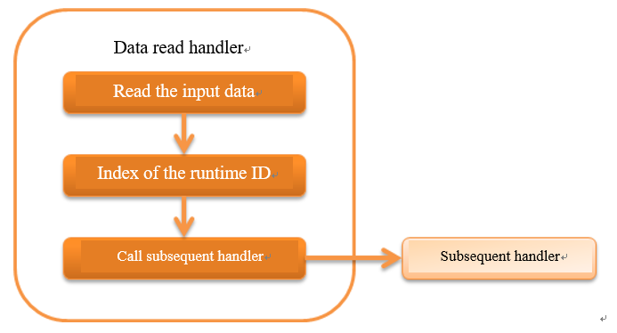

.. _data_read_handler:

Data Read Handler
========================================
.. contents:: Table of contents
  :depth: 3
  :local:

This handler sequentially reads the input data using the :ref:`data reader <nablarch_batch-data_reader>`.

This handler uses the :ref:`data reader <nablarch_batch-data_reader>` on the execution context to read the input data corresponding to the business process one by one and then with the read data as an argument,
delegates the process to the subsequent handler.
When the end of the :ref:`data reader <nablarch_batch-data_reader>` is reached, :java:extdoc:`NoMoreRecord <nablarch.fw.DataReader.NoMoreRecord>` is returned to indicate that end of data has been reached without executing the subsequent handler.

This handler performs the following process.

* Reads the input data using data reader
* Numbering of :ref:`execution ID <log-execution_id>`

The process flow is as follows.

Handler class name
--------------------------------------------------
* :java:extdoc:`nablarch.fw.handler.DataReadHandler`

Module list
--------------------------------------------------
.. code-block:: xml

  <dependency>
    <groupId>com.nablarch.framework</groupId>
    <artifactId>nablarch-fw-standalone</artifactId>
  </dependency>

Constraints
------------------------------
:java:extdoc:`DataReader <nablarch.fw.DataReader>` in :java:extdoc:`ExecutionContext <nablarch.fw.ExecutionContext>` must be configured in the handler before this handler.
If :java:extdoc:`DataReader <nablarch.fw.DataReader>` is not configured by the time this handler is called, it terminates process as if there is no process target data (returns :java:extdoc:`NoMoreRecord <nablarch.fw.DataReader.NoMoreRecord>`).

.. _data_read_handler-max_count:

Configure the maximum number of processing
--------------------------------------------------
The maximum number of processing can be configured in this handler. When the maximum number of data items have been processed, this handler returns :java:extdoc:`NoMoreRecord <nablarch.fw.DataReader.NoMoreRecord>` indicating that there is no more records to be processed.

This configuration value is specified when batch processing large amount of data that is processed for several days, etc.
This configured value can be used to implement a batch that processes a maximum of 1 million records over a period of 10 days with a maximum of 100,000 items per day.

A configuration example is shown below.

.. code-block:: xml

  <component class="nablarch.fw.handler.DataReadHandler">
    <!-- Up to 10,000 records can be processed -->
    <property name="maxCount" value="10000" />
  </component>

