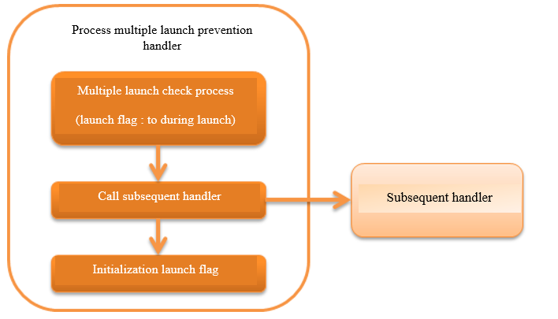

.. _duplicate_process_check_handler:

Process Multiple Launch Prevention Handler
==================================================
.. contents:: Table of contents
  :depth: 3
  :local:

This handler has the function to abnormally terminate the subsequent process that is executed when the same batch process is executed multiple times simultaneously.
This handler can be used to prevent the simultaneous execution of the same batch process and duplicate reading of the data can be avoided.

The request ID configured on the thread variable is used for the identification of same batch process.
Even if the batches are processed with the same batch actions and the request IDs are different, then they are handled as different batch processes.

.. important::
 As a rule, management should be performed by the job scheduler such as JP1.
 If the job scheduler cannot control, use this handler to prevent multiple launch at the application layer.

This handler performs the following processes.

* Multiple launch check processing of the process (change the startup flag to launching during multiple launch check)
* Change the flag to initialized (not launched)

The process flow is as follows.

Handler class name
--------------------------------------------------
* :java:extdoc:`nablarch.fw.handler.DuplicateProcessCheckHandler`

Module list
--------------------------------------------------
.. code-block:: xml

  <dependency>
    <groupId>com.nablarch.framework</groupId>
    <artifactId>nablarch-fw-batch</artifactId>
  </dependency>

Constraints
------------------------------

This handler must be configured after the thread context variable management handler.
  This handler performs multiple launch check based on the request ID configured on the thread context.
  This handler must be configured after the :ref:`thread_context_handler`.

.. _duplicate_process_check_handler-configuration:

Configuration to perform multiple launch prevention check
-----------------------------------------------------------
A class to perform multiple launch process prevention check of the batch process has to be configured for this handler.
For details of the configuration items, see :java:extdoc:`DuplicateProcessCheckHandler <nablarch.fw.handler.DuplicateProcessCheckHandler>`.

For the details of the class that performs the multiple launch prevention check, see :java:extdoc:`BasicDuplicateProcessChecker <nablarch.fw.handler.BasicDuplicateProcessChecker>`.

An example is shown below.

.. code-block:: xml

  <!-- Class that performs multiple launch prevention check -->
  <component name="duplicateProcessChecker" class="nablarch.fw.handler.BasicDuplicateProcessChecker">
    <!-- Transaction configuration for accessing the database -->
    <property name="dbTransactionManager" ref="transaction" />

    <!-- Definition information of the table used for check -->
    <property name="tableName" value="BATCH_REQUEST" />
    <property name="processIdentifierColumnName" value="REQUEST_ID" />
    <property name="processActiveFlgColumnName" value="PROCESS_ACTIVE_FLG" />
  </component>

  <!-- Process multiple launch prevention handler -->
  <component name="duplicateProcessCheckHandler"
      class="nablarch.fw.handler.DuplicateProcessCheckHandler">

    <!-- Configure the class that performs the multiple launch prevention check -->
    <property name="duplicateProcessChecker" ref="duplicateProcessChecker" />

    <!-- Configure the exit code (optional) -->
    <property name="exitCode" value="10" />
  </component>

  <!-- Since BasicDuplicateProcessChecker is a class that requires initialization, add it to the initialization list -->
  <component name="initializer"
      class="nablarch.core.repository.initialization.BasicApplicationInitializer">
    <property name="initializeList">
      <list>
        <component-ref name="duplicateProcessChecker" />
        <!-- Configuration of other components -->
      </list>
    </property>
  </component>

Customize the multiple launch prevention check process
--------------------------------------------------------
Customization of the multiple launch prevention check process can be handled by creating an implementation class :java:extdoc:`DuplicateProcessChecker <nablarch.fw.handler.DuplicateProcessChecker>`.

The implementation class can be configured and used in this handler as described in :ref:`duplicate_process_check_handler-configuration`.

