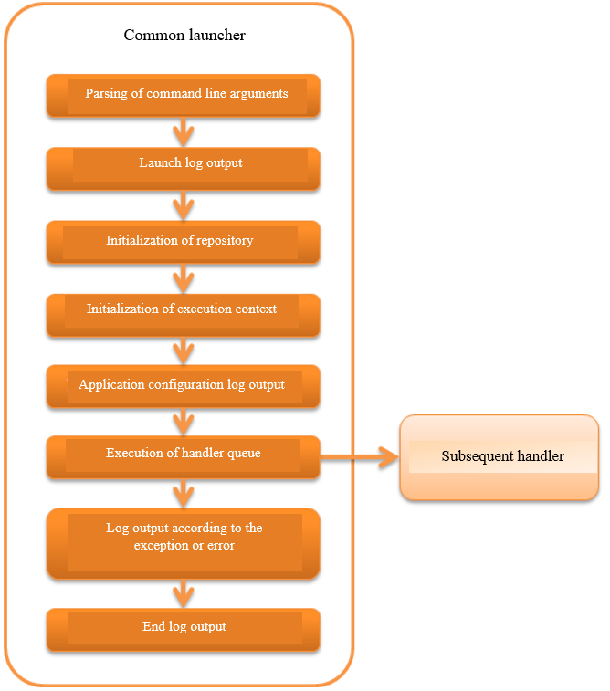

.. _`main`:

Common Launcher
==================================================

.. contents:: Table of contents
  :depth: 3
  :local:

This handler is the starting point for launching a standalone application.

Initialization of the system repository and execution of the handler queue defined in the repository can be performed by direct launch with a java command.

This handler performs the following processes.
See the Javadoc given within the parentheses for the processing details.

* Parsing of command line argument( :java:extdoc:`CommandLine<nablarch.fw.launcher.CommandLine>` )
* Outputs the launch log( :java:extdoc:`LauncherLogFormatter#getStartLogFormat<nablarch.fw.launcher.logging.LauncherLogFormatter.getStartLogFormat()>` )
* Initializes the system repository
* Initializes the execution context( :java:extdoc:`Main#setupExecutionContext <nablarch.fw.launcher.Main.setupExecutionContext(nablarch.fw.launcher.CommandLine,nablarch.fw.ExecutionContext)>` )
* Outputs the application configuration log( :java:extdoc:`ApplicationSettingLogFormatter<nablarch.core.log.app.ApplicationSettingLogFormatter>` )
* Executes the handler queue
* Outputs the log in response to exceptions and errors
* Outputs the end log ( :java:extdoc:`LauncherLogFormatter#getEndLogFormat<nablarch.fw.launcher.logging.LauncherLogFormatter.getEndLogFormat()>` )

The process flow is as follows.

Handler class name
--------------------------------------------------
* :java:extdoc:`nablarch.fw.launcher.Main`

Module list
--------------------------------------------------
.. code-block:: xml

  <dependency>
    <groupId>com.nablarch.framework</groupId>
    <artifactId>nablarch-fw-standalone</artifactId>
  </dependency>

.. _main-run_application:

Launch the application
--------------------------------------------------
Launch the application by specifying :java:extdoc:`Main class <nablarch.fw.launcher.Main>`.

The following three options must be specified for the framework operation.
Terminated immediately if any one of the following options is missing.(Exit code = 127)

\-diConfig
 Specifies the path of the system repository configuration file.
 Initializes the system repository using the path specified by this option.

\-requestPath
 Specifies the action to be executed and the request ID.

 Configures a string defined in the following format.

 .. code-block:: bash

  Executable action class name/Request ID

 The request path specified by this option is returned by
 :java:extdoc:`Request#getRequestPath<nablarch.fw.Request.getRequestPath()>`

\-userId
 Configure the user ID.
 This value is stored in the session context variable with the name ``user.id``.

An execution example is shown below.

.. code-block:: bash

 java nablarch.fw.launcher.Main \
   -diConfig file:./batch-config.xml \
   -requestPath admin.DataUnloadBatchAction/BC0012 \
   -userId testUser

.. _main-option_parameter:

Configure the options for launching the application
------------------------------------------------------
During the launch of :java:extdoc:`Main class <nablarch.fw.launcher.Main>` an any optional parameter can be specified.

Optional parameters are configured in pairs of "option name" and "option value".

For example, it is specified as shown below when the option name is ``optionName`` and value is ``optionValue``.

.. code-block:: bash

 java nablarch.fw.launcher.Main \
   -optionName optionValue

To use option in the application, acquire from :java:extdoc:`ExecutionContext <nablarch.fw.ExecutionContext>` .

.. code-block:: java

     @Override
    public Result handle(String inputData, ExecutionContext ctx) {
      // Specify the option name in getSessionScopedVar and acquire the value.
      final String value = ctx.getSessionScopedVar("optionName");

      // Process

      return new Result.Success();
    } 

.. tip::

  Refer to :ref:`main-run_application` for the options that must be specified while launching the application.

Processing contents according to the exceptions and errors
-----------------------------------------------------------
This handler returns the following processes and results depending on the contents of the exceptions and errors that are caught.

.. list-table::
  :header-rows: 1
  :class: white-space-normal
  :widths: 25 75

  * - Exception class
    - Processing contents

  * - :java:extdoc:`Result.Error <nablarch.fw.Result.Error>`

      (including subclass)

    - Performs FATAL level log output.

      After log output, the following values are returned as the process results of the handler.

       When the status code is 0 - 127
        Returns the status code without change.

       When the status code is other than 0 - 127
        Returns 127.

  * - Exception classes other than the above

    - Performs FATAL level log output.

      After log output, returns 127 as the process results of the handler.
