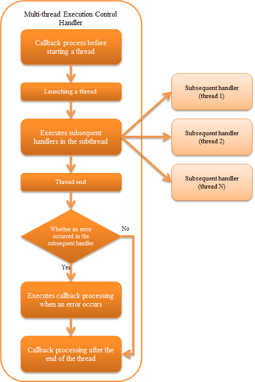
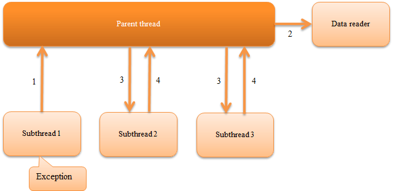

.. _multi_thread_execution_handler:

Multi-thread Execution Control Handler
==================================================
.. contents:: Table of contents
  :depth: 3
  :local:

This handler creates subthreads and parallelly executes the process of subsequent handlers on the handler queue on each subthread. The process result of this handler is an object (:java:extdoc:`MultiStatus <nablarch.fw.Result.MultiStatus>`) with the aggregate of the execution results of each subthread.

This handler performs the following process.

* :ref:`Performs a callback process before starting the subthread <multi_thread_execution_handler-callback>`
* :ref:`Starts a subthread <multi_thread_execution_handler-thread_count>`
* Executes subsequent handlers in the subthread
* :ref:`Performs a callback process when an exception or error occurs in the subthread <multi_thread_execution_handler-callback>`
* :ref:`Performs a callback process after the process ends in the subthread <multi_thread_execution_handler-callback>`

The process flow is as follows.

  
Handler class name
--------------------------------------------------
* :java:extdoc:`nablarch.fw.handler.MultiThreadExecutionHandler`

Module list
--------------------------------------------------
.. code-block:: xml

  <dependency>
    <groupId>com.nablarch.framework</groupId>
    <artifactId>nablarch-fw-standalone</artifactId>
  </dependency>

Constraints
------------------------------
None

.. _multi_thread_execution_handler-thread_count:

Specify the thread count
--------------------------------------------------
By default, this handler launches only one subsequent subthread and executes the handler.

If the performance can be improved by parallelizing the subsequent process (for example, batch action process), multiplexing of the subsequent handler processes can be done by changing the configuration value.

An example is shown below.

.. code-block:: xml

  <component class = "nablarch.fw.handler.MultiThreadExecutionHandler">
    <!-- Execute the subsequent handler in 8 multiplexes -->
    <property name="concurrentNumber" value="8" />
  </component>

.. important::

  If the processes after this handler are executed in multiple threads, make sure that the implementation of the subsequent handler or batch action is thread safe. Note that when a process that is not guaranteed to be thread safe is carelessly executed in multiple threads, unexpected exceptions may occur and may cause data inconsistency.

.. _multi_thread_execution_handler-callback:

Execute an arbitrary process before and after starting a thread
---------------------------------------------------------------
This handler performs a callback process before and after a subthread is activated.

The callback process is executed at the following three points.

* Before starting the subthread
* After the end of all threads following the exception that occurred in the subthread
* After all subthreads have ended (will be executed even if an exception occurs in the subthread)

The process to be called back is the handler that implements  :java:extdoc:`ExecutionHandlerCallback <nablarch.fw.handler.ExecutionHandlerCallback>` among the handlers configured after this handler. If multiple handlers implement  :java:extdoc:`ExecutionHandlerCallback <nablarch.fw.handler.ExecutionHandlerCallback>` , then the callback process is performed sequentially from the handler that has been configured earlier.

.. important::

  Note that if multiple handlers have implemented the callback process and an error or exception occurs during the callback process, the callback process for the remaining handlers is not performed.

.. important::

  The database process performed in the callback process uses the database connection and transaction configured in the handler queue of the parent thread. Therefore, the update process performed in these processes is confirmed (commit) by the :ref:`transaction_management_handler` configured in the parent thread after this handler ends.

  When it is necessary to immediately confirm the process performed in the callback process, use the individual transaction instead of the database connection configured in the parent thread and perform the processing.

  See below for details.

  * :ref:`Use individual transactions for Universal DAO <universal_dao-transaction>`
  * :ref:`Use individual transactions for database access function <database-new_transaction>`

An implementation example of the callback process is shown below.

.. code-block:: java

  public class SampleHandler implements Handler<Object, Result>, ExecutionHandlerCallback<Object, Result> {

    @Override
    public Result handle(Object input, ExecutionContext context) {
      // Implement handler process.
      return context.handleNext(input);
    }

    @Override
    public void preExecution(Object input, ExecutionContext context) {
      // Implement the callback process before the launch of the subthread
    }

    @Override
    public void errorInExecution(Throwable error, ExecutionContext context) {
      // Implement the callback process in the case of an error in the subthread
    }

    @Override
    public void postExecution(Result result, ExecutionContext context) {
      // Implement the callback process after the completion of the subthread
      // Whether the process of the subthread ended normally can be determined from the result of the argument.
      if (result.isSuccess()) {
          // Normal termination of subthread
      } else {
          // Abnormal termination of subthread
      }
    }
  }

Configuration related to the database connection
--------------------------------------------------
When a database connection is required for the process by the parent thread, :ref:`database_connection_management_handler` must be configured before this handler. When access to the database is necessary by the subthread, :ref:`database_connection_management_handler` must be configured in the handler configuration executed by the subthread after this handler. (Both parent thread and subthread need a handler that performs transaction control with the database connection as a set)

In the case of a handler configuration in which both the parent thread and subthread access the database, at least two database connections are used.
When there are multiple subthreads, database connection for the thread count is required.For example if there are 10 subthreads , then a total of 11 database connections are required.

Behavior when an exception occurs in a subthread
--------------------------------------------------
When an unexpected exception occurs in a subthread, call :java:extdoc:`ThreadPoolExecutor#shutdownNow()<java.util.concurrent.ThreadPoolExecutor.shutdownNow()>` for the abnormal termination of the batch application, safely end the processing of other subthreads that have not thrown an exception after data under process is completed.

When transaction management is done for each subthread by configuring :ref:`database_connection_management_handler` and :ref:`transaction_management_handler` on the subthread, operation of the parent thread and subthread when an exception occurs in the subthread is shown below.

1. Suspension and roll back of the subthread in which the exception occurs.
2. The parent thread closes the data reader being used by each subthread.
3. The parent thread sends a stop request to all subthreads.
4. Since the data reader of each subthread is already closed in  ``2.`` , the subthreads are normally terminated when the process under execution is completed.

.. important::

  If a :java:extdoc:`InterruptedException<java.lang.InterruptedException>` exception is caught, it indicates that the process cannot be performed securely due to an interrupt request. In this case, the process is aborted by throwing an exception.
