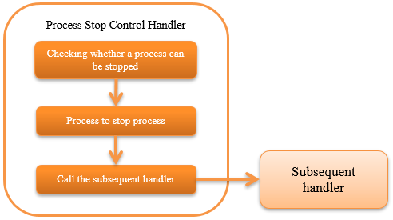

.. _process_stop_handler:

Process Stop Control Handler
==================================================

.. contents:: Table of contents
  :depth: 3
  :local:

This handler is placed as a subsequent handler to handlers such as those given below that control the loop
and provides the function to interrupt the loop and throw an exception indicating the process stop request.

* :ref:`process_resident_handler`
* :ref:`loop_handler`
* :ref:`request_thread_loop_handler`

This handler performs the following processes.

* Checks whether the process has to be stopped (if the process stop flag is "1", then it is determined as target for process stop)
* Process to stop process

.. tip::

  In on-demand batch, this handler is used to forcibly stop the process when process corresponding to a large amount of data is not yet completed.

.. important::

  Initialization of the process stop flag is not performed in this handler.
  The process stop flag should be initialized in advance before executing the same process for the second time.

The process flow is as follows.

Handler class name
--------------------------------------------------
* :java:extdoc:`nablarch.fw.handler.BasicProcessStopHandler`

Module list
--------------------------------------------------
.. code-block:: xml

  <dependency>
    <groupId>com.nablarch.framework</groupId>
    <artifactId>nablarch-fw-standalone</artifactId>
  </dependency>

  <dependency>
    <groupId>com.nablarch.framework</groupId>
    <artifactId>nablarch-fw-batch</artifactId>
  </dependency>

Constraints
--------------------------------------------------
Configure this handler after the :ref:`thread_context_handler`
  Since this handler performs the stop process based on the request ID of the thread context,
  it must be configured after the :ref:`thread_context_handler`.

Configuration for performing process stop control
--------------------------------------------------
To perform the process stop control, the configure table definition information used in the check whether the process has to be stopped has to be configured in this handler.
For details of the configuration items, see :java:extdoc:`BasicProcessStopHandler <nablarch.fw.handler.BasicProcessStopHandler>`.

A configuration example is shown below.

Point
  * When used in the On-demand batch, configure this handler on the subthread.
  * Configure this handler on the main thread when used in the resident batch.

.. code-block:: xml

  <component name="processStopHandler" class="nablarch.fw.handler.BasicProcessStopHandler">
    <!-- Transaction configuration for accessing the database -->
    <property name="dbTransactionManager" ref="simpleDbTransactionManager" />

    <!-- Definition information of the table used for check-->
    <property name="tableName" value="BATCH_REQUEST" />
    <property name="requestIdColumnName" value="REQUEST_ID" />
    <property name="processHaltColumnName" value="PROCESS_HALT_FLG" />

    <!-- Check interval for the process stop flag (optional) -->
    <property name="checkInterval" value="1" />

    <!-- Exit code when the process is stopped (optional) -->
    <property name="exitCode" value="50" />
  </component>
