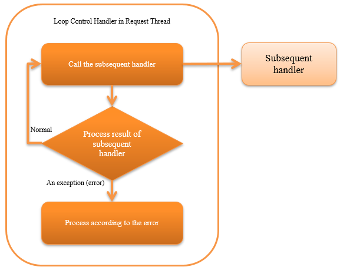

.. _request_thread_loop_handler:

Loop Control Handler in Request Thread
==================================================
.. contents:: Table of contents
  :depth: 3
  :local:

This handler repeatedly executes the subsequent handlers until there is a request to stop the process.
This handler is used in the process that monitors the message queue and table on the database and processes the unprocessed data as and when needed.

.. tip::

  Each request (data) is handled independently in the process that processes and monitors the message queue and the table on the database.
  Even if one request process causes an error, other request processes must be continued.
  Therefore, exceptions caught by this handler continue the process except when there is normal process termination request or in the case of some fatal exceptions.

  For details, see :ref:`request_thread_loop_handler-error_handling`.

This handler performs the following processes.

* Repeatedly executes the subsequent handlers
* Stops the execution of subsequent handlers when a process stop request exception occurs |br|
  For details, see :ref:`request_thread_loop_handler-stop`.
* Process (log output etc.) depending on the exception (error) that occurs in the subsequent handler |br|
  For details, see :ref:`request_thread_loop_handler-error_handling`.

The process flow is as follows.

  
Handler class name
--------------------------------------------------
* :java:extdoc:`nablarch.fw.handler.RequestThreadLoopHandler`

Module list
--------------------------------------------------
.. code-block:: xml

  <dependency>
    <groupId>com.nablarch.framework</groupId>
    <artifactId>nablarch-fw-standalone</artifactId>
  </dependency>

Constraints
------------------------------
Place this handler after the :ref:`retry_handler`
  This handler throws :java:extdoc:`Retryable exception <nablarch.fw.handler.retry.Retryable>` for exceptions where processing can be continued.
  Therefore, this handler must be configured after the :ref:`retry_handler`, which processes the retriable exceptions.

.. _request_thread_loop_handler-interval:

Configure the wait time for service shutdown
--------------------------------------------------
Wait time can be configured when the exception (:java:extdoc:`ServiceUnavailable <nablarch.fw.results.ServiceUnavailable>`) indicating service shutdown is thrown by a subsequent handler.
The check timing of whether the service is open can be adjusted by configuring this time.

If a long wait time is configured, the problem of the process not starting immediately even if there is a change in service while it is open may occur.
Hence configure a value as per the requirement. If this configuration is omitted, the subsequent handler will be re-executed after waiting for 1 second.

A configuration example is shown below.

.. code-block:: xml

  <component class="nablarch.fw.handler.RequestThreadLoopHandler">
    <!-- Configure 5 seconds for wait time -->
    <property name="serviceUnavailabilityRetryInterval" value="5000" />
  </component>

.. tip::
  If :ref:`ServiceAvailabilityCheckHandler` is not configured in the subsequent handler, it is not necessary to configure this configuration value.
  (even if configured, this value will not be used)

.. _request_thread_loop_handler-stop:

Method to stop this handler
--------------------------------------------------
This handler repeatedly delegates the process to subsequent handlers until an exception indicating process stop request occurs.
When it is necessary to stop the process for maintenance, etc.,
the :ref:`process_stop_handler` must be configured after this handler so that the process can be stopped from the outside.

Refer to :ref:`request_thread_loop_handler-error_handling` for the process contents when an exception indicating a process stop request occurs.

.. _request_thread_loop_handler-error_handling:

Process content according to the exception (error) that occurs in the subsequent handler
------------------------------------------------------------------------------------------
The process contents performed by this handler according to the exceptions (errors) that occur in the subsequent handler is described.

Exception during service shutdown (:java:extdoc:`ServiceUnavailable <nablarch.fw.results.ServiceUnavailable>`)
  After waiting for a certain period, the process is again delegated to the subsequent handler.
  For the method to configure the wait time, see :ref:`request_thread_loop_handler-interval`.

Exception indicating process stop request (:java:extdoc:`ProcessStop <nablarch.fw.handler.ProcessStopHandler.ProcessStop>`)
  Since the exception indicates the process stop request, processing of this handler is terminated.

Exception indicating abnormal termination of the process (:java:extdoc:`ProcessAbnormalEnd <nablarch.fw.launcher.ProcessAbnormalEnd>`)
  Rethrows the exception caught as the exception indicates abnormal termination of the process.

Service error indicating that the process could not be continued (:java:extdoc:`ServiceError <nablarch.fw.results.ServiceError>`)
  Delegates the log output process to the exception class that is caught and throws :java:extdoc:`Retryable exception <nablarch.fw.handler.retry.Retryable>`.

Exception indicating abnormal termination of the handler process (:java:extdoc:`Result.Error <nablarch.fw.Result.Error>`)
  Outputs ``FATAL`` level log, and throws :java:extdoc:`Retryable exception <nablarch.fw.handler.retry.Retryable>`.

Runtime exception (:java:extdoc:`RuntimeException <java.lang.RuntimeException>`)
  Outputs ``FATAL`` level log, and throws :java:extdoc:`Retryable exception <nablarch.fw.handler.retry.Retryable>`.
 
Exception indicating thread stop (:java:extdoc:`ThreadDeath <java.lang.ThreadDeath>`)
  Outputs ``INFO`` level log and rethrows the exception that is caught (ThreadDeath).

Stack overflow error (:java:extdoc:`StackOverflowError <java.lang.StackOverflowError>`)
  Outputs ``FATAL`` level log, and throws :java:extdoc:`Retryable exception <nablarch.fw.handler.retry.Retryable>`.

Insufficient heap error (:java:extdoc:`OutOfMemoryError <java.lang.OutOfMemoryError>`)
  Outputs a message indicating that insufficient heap has occurred to the standard error output and then outputs a ``FATAL`` level log.
  (Since there is possibility of insufficient heap occurring again during log output, the log is output after the output of the standard error message.)

  Since there is possibility that the process can be continued by removing the reference to the object that caused insufficient heap, :java:extdoc:`Retryable exception <nablarch.fw.handler.retry.Retryable>` is thrown.
  
Error indicating JVM error (:java:extdoc:`VirtualMachineError <java.lang.VirtualMachineError>`)
  Rethrows the exception that is raised

Error other than the above
  Outputs ``FATAL`` level log, and throws :java:extdoc:`Retryable exception <nablarch.fw.handler.retry.Retryable>`.

.. |br| raw:: html

   
