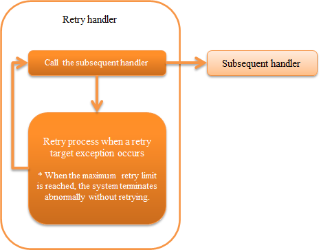

.. _retry_handler:

Retry Handler
========================================
.. contents:: Table of contents
  :depth: 3
  :local:

This handler controls automatic retries of errors than can be recovered with a simple retry such as deadlocks when accessing the database.

In this handler, the runtime exception implemented by :java:extdoc:`Retryable <nablarch.fw.handler.retry.Retryable>` is considered as a retriable error and subsequent handler is re-executed. The process related to the determination of the retry upper limit is externalized as an implementation class of :java:extdoc:`RetryContext <nablarch.fw.handler.RetryHandler.RetryContext>` . Implementations provided by default are given below.

* :java:extdoc:`Java Upper limit configuration of retry count <nablarch.fw.handler.retry.CountingRetryContext>`
* :java:extdoc:`Java Upper limit configuration of elapsed time <nablarch.fw.handler.retry.TimeRetryContext>`

This handler performs the following process.

* Retry process when a retry target exception occurs
*	Process that throws an exception when the upper limit of retries is reached.

The process flow is as follows.

  
Handler class name
--------------------------------------------------
* :java:extdoc:`nablarch.fw.handler.RetryHandler`

Module list
--------------------------------------------------
.. code-block:: xml

  <dependency>
    <groupId>com.nablarch.framework</groupId>
    <artifactId>nablarch-fw-standalone</artifactId>
  </dependency>

Constraints
------------------------------
The handler that throws the retry exception should be configured after this handler. Note that even if a retry exception is thrown before this handler, it will be processed only as an exception.

Configure the upper limit of retry
--------------------------------------------------
In this handler, the retry is not repeated indefinitely and if the process is not successful after a certain number of retries, it is regarded as a retry failure and the process is aborted. The upper limit has to be configured for the retry when using this handler.

The configuration for the upper limit can be selected from the following two types as mentioned above. Add an implementation in the project if both configurations do not match the project requirements.

* :java:extdoc:`Java Upper limit configuration of retry count <nablarch.fw.handler.retry.CountingRetryContext>`
* :java:extdoc:`Java Upper configuration of elapsed time <nablarch.fw.handler.retry.TimeRetryContext>`

An example of setting the upper limit based on the number of retries is given below.

.. code-block:: xml

  <component name="retryHandler" class="nablarch.fw.handler.RetryHandler">
    <property name="retryContextFactory">
      <component class="nablarch.fw.handler.retry.CountingRetryContextFactory">
        <property name="retryCount" value="3" />          <!-- Retry up to 3 times -->
        <property name="retryIntervals" value="5000" />   <!-- Wait for 5 seconds before retrying -->
      </component>
    </property>
  </component>

.. tip::

  For the value to be configured as the upper limit, configure the maximum recovery time plus alpha value.

  For example, if a maximum of 5 minutes is required to switch databases in an active/standby configuration, configure 5 minutes plus alpha time (for example 7 minutes) as the upper limit.

  To realize retries for multiple exceptions, configure the upper limit based on the exception that requires maximum recovery time.

