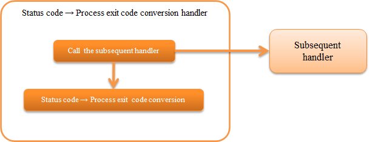

.. _status_code_convert_handler:

ステータスコード→プロセス終了コード変換ハンドラ
==================================================

.. contents:: 目次
  :depth: 3
  :local:

後続ハンドラによる処理結果のステータスコードをプロセスの終了コードに変換するハンドラ。

処理の流れは以下のとおり。

ハンドラクラス名
--------------------------------------------------
* :java:extdoc:`nablarch.fw.handler.StatusCodeConvertHandler`

モジュール一覧
--------------------------------------------------
.. code-block:: xml

  <dependency>
    <groupId>com.nablarch.framework</groupId>
    <artifactId>nablarch-fw-standalone</artifactId>
  </dependency>

制約
--------------------------------------------------
:ref:`main` の直後に設定すること
  本ハンドラが処理結果のステータスコードをプロセスの終了コードに変換するため。

.. _status_code_convert_handler-rules:

ステータスコード→プロセス終了コード変換
--------------------------------------------------------------
ステータスコード→プロセス終了コード変換は、以下のルールで行う。

.. important::
 アプリケーションのエラー処理でステータスコードを指定する場合は、
 100～199を使用する。

============================ ============================
ステータスコード             プロセス終了コード
============================ ============================
-1以下                       1
0～199                       0～199(変換は行わない)
200～399                     0
400                          10
401                          11
403                          12
404                          13
409                          14
上記以外の400～499           15
500以上                      20
============================ ============================

.. tip::
 このハンドラは、設定などで変換ルールを切り替えることはできない。
 このため、この変換ルールで要件を満たすことができない場合は、
 プロジェクト固有の変換用ハンドラを作成し対応すること。
