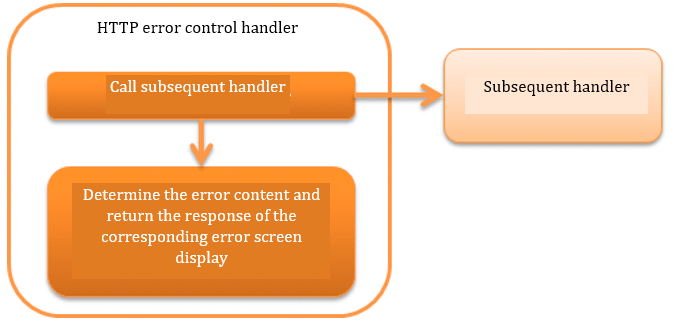

.. _http_error_handler:

HTTP Error Control Handler
============================

.. contents:: Table of contents
  :depth: 3
  :local:

This handler performs log output and conversion to response for the exception that occurred in the subsequent handler.

This handler performs the following processes.

* :ref:`Outputs log according to the type of exception <HttpErrorHandler_ErrorHandling>`
* :ref:`Generates and returns HttpResponse for error according to exception type  <HttpErrorHandler_ErrorHandling>`
* :ref:`Configuration of the default page <HttpErrorHandler_DefaultPage>`

The process flow is as follows.

Handler class name
--------------------------------------------------
* :java:extdoc:`nablarch.fw.web.handler.HttpErrorHandler`

Module list
--------------------------------------------------
.. code-block:: xml

  <dependency>
    <groupId>com.nablarch.framework</groupId>
    <artifactId>nablarch-fw-web</artifactId>
  </dependency>

Constraints
------------------------------

Place this handler after the :ref:`http_response_handler`
  Since HTTP response handler processes :java:extdoc:`HttpResponse <nablarch.fw.web.HttpResponse>` generated by this handler,
  it must be placed after :ref:`http_response_handler`.

Place this handler after the :ref:`http_access_log_handler`
  Since log output is based on :java:extdoc:`HttpResponse <nablarch.fw.web.HttpResponse>` generated by this handler for error,
  it must be placed after :ref:`http_access_log_handler`.

.. _HttpErrorHandler_ErrorHandling:

Processing according to the exception type and generation of response
-----------------------------------------------------------------------

:java:extdoc:`nablarch.fw.NoMoreHandlerException`
  :Log level: INFO
  :Response: 404
  :Description: It is recorded as a trace log since it means that the handler to process the request is not available.
         The response is configured to *404* because it means that the *action class* to be processed was not available.

:java:extdoc:`nablarch.fw.web.HttpErrorResponse`
  :Log level: No log output
  :Response: :java:extdoc:`HttpErrorResponse#getResponse() <nablarch.fw.web.HttpErrorResponse.getResponse()>`
  :Description: Log is not output because it means that a business exception (error response is thrown as a result of validation, etc.) was thrown in a subsequent handler.

        .. _http_error_handler-error_messages:

        If the cause of ``HttpErrorResponse`` exception is :java:extdoc:`ApplicationException <nablarch.core.message.ApplicationException>`,
        perform the following process so that error message can be handled in view.

        1. Message information held by ``ApplicationException`` is converted to :java:extdoc:`ErrorMessages <nablarch.fw.web.message.ErrorMessages>`.
        2. Configure ``ErrorMessages`` in the request scope.
           The key name when configuring to the request scope is ``errors`` by default. The key name can be changed in the component configuration file.

           Configuration example
             .. code-block:: xml

              <component name="webConfig" class="nablarch.common.web.WebConfig">
                <!-- Change key to messages -->
                <property name="errorMessageRequestAttributeName" value="messages" />
              </component>

:java:extdoc:`nablarch.fw.Result.Error`
  :Log level: Depends on the configuration
  :Response: :java:extdoc:`Error#getStatusCode() <nablarch.fw.Result.Error.getStatusCode()>`
  :Description: See `Log output of nablarch.fw.Result.Error`_ .

:java:extdoc:`java.lang.StackOverflowError`
  :Log level: FATAL
  :Response: 500
  :Description: Since it may be caused by a data or implementation bug, notified as a failure.
         The response is **500** because it is an unexpected error.

:java:extdoc:`java.lang.ThreadDeath` and :java:extdoc:`java.lang.VirtualMachineError` ( other than :java:extdoc:`java.lang.StackOverflowError` )
  :Log level: \-
  :Response: \-
  :Description: This handler does nothing and leaves the processing to the upper handler. (Resend error)

Exceptions and errors other than the above
  :Log level: FATAL
  :Response: 500
  :Description: For exceptions and errors that do not correspond to the above, log is output as a failure.
         The response is **500** because it is an unexpected exception or error.

Log output of nablarch.fw.Result.Error
~~~~~~~~~~~~~~~~~~~~~~~~~~~~~~~~~~~~~~~~~~~~~~
If the exception raised in the subsequent handler is :java:extdoc:`Error <nablarch.fw.Result.Error>`, then whether to output the log changes
depending on the value configured in :java:extdoc:`writeFailureLogPattern <nablarch.fw.web.handler.HttpErrorHandler.setWriteFailureLogPattern(java.lang.String)>`.
A regular expression can be configured to this property, and if the regular expression matches :java:extdoc:`Error#getStatusCode() <nablarch.fw.Result.Error.getStatusCode()>`, a `FATAL` level log is output.

.. _HttpErrorHandler_DefaultPage:

Configuration of the default page
-----------------------------------
Apply the default page to the :java:extdoc:`HttpResponse <nablarch.fw.web.HttpResponse>` created by error handling in subsequent handlers and this handler.
In this function, if :java:extdoc:`HttpResponse <nablarch.fw.web.HttpResponse>` is not configured,
apply the default page configured by :java:extdoc:`defaultPage <nablarch.fw.web.handler.HttpErrorHandler.setDefaultPage(java.lang.String,java.lang.String)>` and
:java:extdoc:`defaultPages <nablarch.fw.web.handler.HttpErrorHandler.setDefaultPages(java.util.Map)>`.

A configuration example is shown below.

.. code-block:: xml

 <component class="nablarch.fw.web.handler.HttpErrorHandler">
   <property name="defaultPages">
     <map>
       <entry key="4.." value="/USER_ERROR.jsp" />
       <entry key="404" value="/NOT_FOUND.jsp" />
       <entry key="5.." value="/ERROR.jsp" />
       <entry key="503" value="/NOT_IN_SERVICE.jsp" />
     </map>
   </property>
 </component>

.. important::

  When this function is used, JSP configuration must be duplicated with the error page configuration (`error-page` element) for `web.xml` specified by the Servlet API.
  If `web.xml` is not configured, the default error page of the web server will be displayed based on where the error occurred.

  Therefore, configuring the default error page in `web.xml` instead of using this function is recommended.

