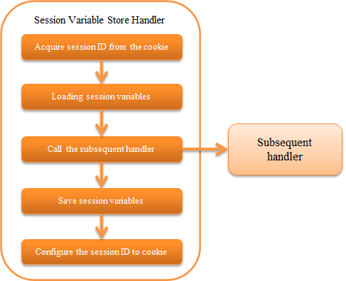

.. _session_store_handler:

Session Variable Store Handler
==============================

.. contents:: Table of contents
  :depth: 3
  :local:

This handler stores the session variables added/updated/deleted in subsequent handlers and libraries in the session store.

For details of session store functions, see :ref:`session_store` .

The process flow of this handler is as follows.

.. important:: 

  If processing of the same session is executed by multiple threads (for example, if there are requests from multiple tabs in the browser at the same time), then depending on the store being used, the request that comes last will be processed. See the below image for details.

  .. image:: ../images/SessionStoreHandler/multi-thread.png
    :scale: 80

  Therefore, it is necessary to fully understand the characteristics of the store to be used and select the store that meets the requirements. For details of the store, see :ref:`session_store-future_of_store` .

Handler class name
--------------------------------------------------
* :java:extdoc:`nablarch.common.web.session.SessionStoreHandler`

Module list
--------------------------------------------------
.. code-block:: xml

  <dependency>
    <groupId>com.nablarch.framework</groupId>
    <artifactId>nablarch-fw-web</artifactId>
  </dependency>

  <!-- Only when using the DB store or using save the expiration date in the database -->
  <dependency>
    <groupId>com.nablarch.framework</groupId>
    <artifactId>nablarch-fw-web-dbstore</artifactId>
  </dependency>

.. _session_store_handler-constraint:

Constraints
------------------------------
Place this handler after the :ref:`http_response_handler`
  During servlet forward, this handler must be placed after the :ref:`http_response_handler` so that the value of the session store can be accessed at the forward destination.

When using the HIDDEN store, place this handler after the :ref:`multipart_handler`
  This handler must be placed after the :ref:`multipart_handler` so that the request parameters can be accessed when using the HIDDEN store.

Place this handler before the :ref:`forwarding_handler`
  Although the session store is read and saved multiple times if the :ref:`forwarding_handler` is configured before this handler, the HIDDEN store reads the session variable from the request parameter and saves the session variable in the request scope. Therefore, there is a problem that the latest session variable cannot be obtained when using the HIDDEN store during internal forward. Therefore, place this handler before the :ref:`forwarding_handler` .

Configure for using session store
--------------------------------------------------------------
To use the session store, configure :java:extdoc:`SessionManager <nablarch.common.web.session.SessionManager>` which has been configured as given below to the property :java:extdoc:`sessionManager <nablarch.common.web.session.SessionStoreHandler.setSessionManager(nablarch.common.web.session.SessionManager)>` of this handler.

* Session store used by the application (multiple specifications possible)
* Session store name used by default

Configure the handler by referring to the configuration example given below.

.. code-block:: xml

  <component class="nablarch.common.web.session.SessionStoreHandler">
    <property name="sessionManager" ref="sessionManager"/>
  </component>

  <!-- Configure with the component name "sessionManager" -->
  <component name="sessionManager" class="nablarch.common.web.session.SessionManager">
    <!-- Property configuration is omitted -->
  </component>

For details of the property configured in :java:extdoc:`SessionManager <nablarch.common.web.session.SessionManager>` , see :ref:`session_store-use_config` .

Serialize the session variables and save to the session store
--------------------------------------------------------------
When saving the session variable in the session store with this handler, the serialization mechanism can be selected.

For details on the serialization mechanism that can be selected, see :ref:`session_store-serialize` .

Check the session store for tampering
--------------------------------------------------------------
When reading the session variables from the session store, check the session store for tampering.

When tampering of the HIDDEN store is detected
  :java:extdoc:`HttpErrorResponse <nablarch.fw.web.HttpErrorResponse>` of status code 400 is thrown.

When tampering of other stores is detected
  Exception that occurred during the decryption process of the session store is thrown without any changes.

.. _session_store_handler-error_forward_path:

Configure the transition destination during tampering error
--------------------------------------------------------------
The error page displayed when the tampering of the session store is detected must be described in `web.xml`. This handler must be configured before the :ref:`forwarding_handler` as described in the :ref:`session_store_handler-constraint` . In this case, :ref:`HttpErrorHandler_DefaultPage` cannot be applied to the exception that occurs in this handler for the following reasons. Therefore, configuration in `web.xml` is required.

Reason
  :ref:`forwarding_handler` must be configured before the :ref:`http_error_handler` . This configuration order is required to correctly handle the internal forward path specified for :ref:`HttpErrorHandler_DefaultPage` of the :ref:`http_error_handler` .

  As a result, when an exception occurs in the handler that is configured before the :ref:`forwarding_handler` , the configuration value in the :ref:`HttpErrorHandler_DefaultPage` cannot be applied. Therefore, configuration in `web.xml` is required.

Change the name and attributes of the cookie that holds the session ID
----------------------------------------------------------------------
The name and attributes of the cookie that holds the session ID can be changed to an arbitrary value.

The default configuration is as follows.

:Cookie name:         | NABLARCH_SID
:Path attribute:      | All paths under the host
                      | Set this option separately if you want to explicitly specify all paths that can be sent
:Domain attribute:    | Not specified
                      | Set this option separately if you want to explicitly specify all domains that can be sent
:Secure attribute:    | Not used
                      | To use in an HTTPS environment, configure to ``Use``
:MaxAge attribute:    | Not specified
                      | The MaxAge attribute is not used because the cookie holding the session ID is a session cookie (cookie that is destroyed when the browser is closed)
:HttpOnly attribute:  | Use
                      | The HttpOnly attribute is always used and cannot be changed from configuration files

.. important::
  By default, the expiry interval of the session store is saved in the HTTP session.
  If different expiry intervals are configured between multiple stores, use the value with the longest expiry interval.
  (If you want to change the storage location of the expiry interval to database, Refer to :ref:`db_managed_expiration` )

To change the cookie name or attribute, refer to the example given below.

.. code-block:: xml

    <component class="nablarch.common.web.session.SessionStoreHandler">
      <!-- Cookie name -->
      <property name="cookieName" value="NABLARCH_SID" />
      <!-- Path attribute -->
      <property name="cookiePath" value="/" />
      <!-- Domain attribute -->
      <property name="cookieDomain" value="" />
      <!-- Secure attribute -->
      <property name="cookieSecure" value="false" />
      <!-- Session manager -->
      <property name="sessionManager" ref="sessionManager"/>
    </component>

    <component name="sessionManager" class="nablarch.common.web.session.SessionManager">
      <property name="availableStores">
        <list>
          <component class="nablarch.common.web.session.store.DbStore">
            <!-- Expiry interval -->
            <property name="expires" value="1800" />
            <!-- Other properties are omitted -->
          </component>
        </list>
      </property>
      <!-- Other properties are omitted -->
    </component>

.. _`db_managed_expiration`:

Save the expiration date in the database
--------------------------------------------------------------
You can change where the session expiration date is stored.

By default, :java:extdoc:`HttpSessionManagedExpiration <nablarch.common.web.session.HttpSessionManagedExpiration>`
is used, so the session expiration is stored in the HTTP session.

You can save the session expiration  to the database by setting the :java:extdoc:`DbManagedExpiration <nablarch.common.web.session.DbManagedExpiration>`
to the :java:extdoc:`expiration <nablarch.common.web.session.SessionStoreHandler.setExpiration(nablarch.common.web.session.Expiration)>` property of this handler.

Usage
~~~~~~~~~~~~~~~~~~~~~~~~~~~~~~

The table used to store the expiratoin date on the database shall be the table described in the :ref:`DB store<session_store-use_config>` when using the DB store.

.. important::

  When saving the expiration date to the database, the SESSION_OBJECT column must not be a required attribute.
  The SESSION_OBJECT column will be registered as null on logout, etc., so it must be defined as a null-allowed attribute.
  In projects created from archetypes before 5u15, it is defined as a required attribute by default.
  It is necessary to issue ALTER statement or recreate the table if necessary.

If you change the table name and column names, define a component of the
:java:extdoc:`UserSessionSchema <nablarch.common.web.session.store.UserSessionSchema>` in
:java:extdoc:`DbManagedExpiration.userSessionSchema <nablarch.common.web.session.DbManagedExpiration.setUserSessionSchema(nablarch.common.web.session.store.UserSessionSchema)>`.
Change the table columns in the DB store to the same ones.

Also, the expiration date needs :ref:`initialize <repository-initialize_object>`.

An example setting is shown below.

.. code-block:: xml

  <component name="sessionStoreHandler" class="nablarch.common.web.session.SessionStoreHandler">
    <!-- Other properties are omitted -->
    <property name="expiration" ref="expiration" />
  </component>

  <component name="expiration" class="nablarch.common.web.session.DbManagedExpiration">
    <!-- A class that provides transaction control to the database -->
    <property name="dbManager">
      <component class="nablarch.core.db.transaction.SimpleDbTransactionManager">
        <property name="dbTransactionName" value="expirationTransaction"/>
      </component>
    </property>
    <!-- The following settings are required only when changing table names
         and column names from the above table definition -->
    <property name="userSessionSchema" ref="userSessionSchema" />
  </component>

  <!-- When you change the table definition, change the DB store definition as well -->
  <component name="dbStore" class="nablarch.common.web.session.store.DbStore">
    <!-- Other properties are omitted -->
    <property name="userSessionSchema" ref="userSessionSchema" />
  </component>

  <!-- The following settings are required only when changing table names
       and column names from the above table definition -->
  <component name="userSessionSchema" class="nablarch.common.web.session.store.UserSessionSchema">
    <property name="tableName" value="USER_SESSION_DB" />
    <property name="sessionIdName" value="SESSION_ID_COL" />
    <property name="sessionObjectName" value="SESSION_OBJECT_COL" />
    <property name="expirationDatetimeName" value="EXPIRATION_DATETIME_COL" />
  </component>

  <component name="initializer" class="nablarch.core.repository.initialization.BasicApplicationInitializer">
    <!-- Requires initialization for expiration date -->
    <property name="initializeList">
      <list>
        <component-ref name="expiration"/>
      </list>
    </property>
  </component>
