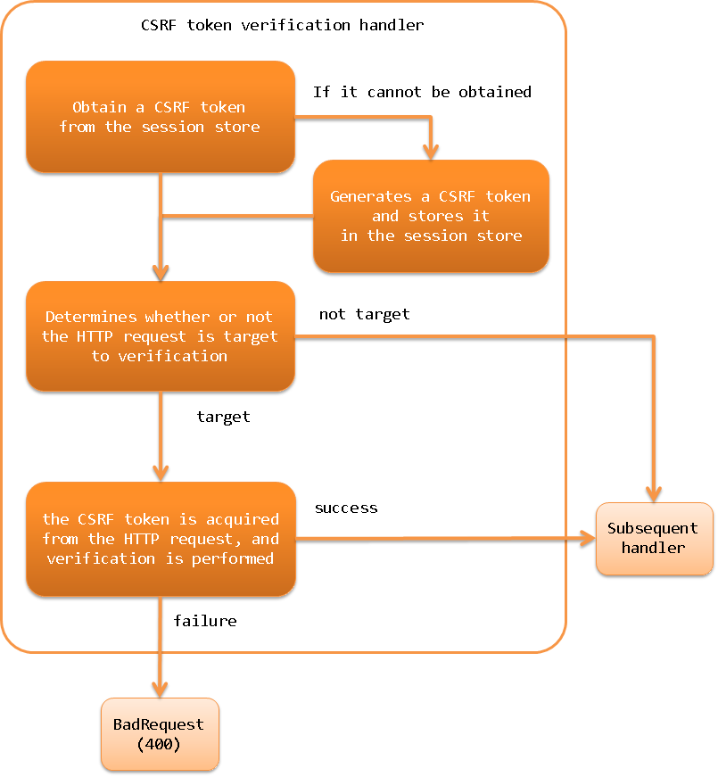

.. _csrf_token_verification_handler:

CSRF Token Verification Handler
==================================================
.. contents:: Table of contents
  :depth: 3
  :local:

This handler provides a general CSRF (Cross Site Request Forgeries) measure using tokens.
This handler can be used to implement the CSRF measure for :ref:`web application<web_application>` and :ref:`RESTful web service<restful_web_service>`.

If you include this handler in the handler configuration, the CSRF token is generated and verified in the request process,
and if you use :ref:`tag`, the CSRF token is automatically output to the screen.
Therefore, it is possible to implement CSRF measures for :ref:`web application<web_application>`
without the need for application programmers to implement them.

To enable CSRF measures in :ref:`RESTful web service<restful_web_service>`,
this handler obtains a CSRF token from the request header or request parameters.
The framework provides a utility class (
:java:extdoc:`CsrfTokenUtil <nablarch.common.web.csrf.CsrfTokenUtil>` ) for retrieving the generated CSRF token,
so you can implement a mechanism to send the CSRF token to the client, depending on the architecture of your project.

Since this handler stores the CSRF token in the session store, the use of :ref:`session_store` is required when using this handler.

This handler performs the following processes.

* Obtain a CSRF token from the session store
* If it cannot be obtained, it generates a CSRF token and stores it in the session store
* Determines whether or not the HTTP request is target to verification
* If it is a target of verification, the CSRF token is acquired from the HTTP request, and verification is performed
* If the validation fails, the response of BadRequest(400) is returned
* If the validation succeeds, the process is moved to the next handler

The process flow is as follows.

Handler class name
--------------------------------------------------
* :java:extdoc:`nablarch.fw.web.handler.CsrfTokenVerificationHandler`

Module list
--------------------------------------------------
.. code-block:: xml

  <dependency>
    <groupId>com.nablarch.framework</groupId>
    <artifactId>nablarch-fw-web</artifactId>
  </dependency>

Constraints
------------------------------
Place this handler after :ref:`session_store_handler`
  In order to store the CSRF token in the session store,
  this handler needs to be placed after :ref:`session_store_handler`.

.. tip::

  When uploading a file using :ref:`multipart_handler`,
  if you want to verify the CSRF token before saving the file, place this handler and :ref:`session_store_handler` before :ref:`multipart_handler`.

When using :ref:`tag`, this handler should be placed after :ref:`nablarch_tag_handler`.
  When using :ref:`tag`, :ref:`tag-hidden_encryption` is used to output the CSRF token to the screen,
  so this handler needs to be placed after :ref:`nablarch_tag_handler`.

.. _csrf_token_verification_handler-generation_verification:

Generate and verify CSRF token
--------------------------------------------------
When this handler is added to the handler configuration, the CSRF token is generated and verified.
The following is an example of how to use :ref:`tag`.

.. code-block:: xml

  <!-- Handler configuration -->
  <component name="webFrontController" class="nablarch.fw.web.servlet.WebFrontController">
    <property name="handlerQueue">
      <list>
        <!-- Other handlers are omitted -->

        <!-- Session store handler -->
        <component-ref name="sessionStoreHandler" />

        <!-- Nablarch custom tag control handler -->
        <component-ref name="nablarchTagHandler"/>

        <!-- CSRF token verification handler -->
        <component-ref name="csrfTokenVerificationHandler"/>
      </list>
    </property>
  </component>

  <component name="csrfTokenVerificationHandler"
             class="nablarch.fw.web.handler.CsrfTokenVerificationHandler" />

By default, the following processes are performed.

Obtain a CSRF token from the session store
  * The name to use when storing the CSRF token in the session store is ``nablarch_csrf-token``.

If it cannot be obtained, it generates a CSRF token and stores it in the session store
  * CSRF token generation is done by :java:extdoc:`CsrfTokenGenerator<nablarch.fw.web.handler.csrf.CsrfTokenGenerator>`.
    By default, the :java:extdoc:`UUIDv4CsrfTokenGenerator<nablarch.fw.web.handler.csrf.UUIDv4CsrfTokenGenerator>` is used to generate CSRF tokens using version 4 UUID.
  * CSRF tokens are stored in the default session store. (Store CSRF tokens without specifying the name of the session store.)

Determines whether or not the HTTP request is target to verification
  * The :java:extdoc:`VerificationTargetMatcher<nablarch.fw.web.handler.csrf.VerificationTargetMatcher>` determines whether the HTTP request is the target of the verification or not.
    By default, it uses the :java:extdoc:`HttpMethodVerificationTargetMatcher<nablarch.fw.web.handler.csrf.HttpMethodVerificationTargetMatcher>`, which determines if an HTTP request is a verification target from the HTTP method.
  * The :java:extdoc:`HttpMethodVerificationTargetMatcher<nablarch.fw.web.handler.csrf.HttpMethodVerificationTargetMatcher>` determines the HTTP method ``GET`` ``HEAD`` ``TRACE`` ``OPTIONS`` as **outside** the CSRF token for verification. (i.e., POST, PUT, etc. are targeted for verification.)

If it is a target of verification, the CSRF token is acquired from the HTTP request, and verification is performed
  * The name to be used to store the CSRF token in the HTTP request is as follows

    | HTTP request header ``X-CSRF-TOKEN``
    | HTTP request parameter ``csrf-token``

If the validation succeeds, the process is moved to the next handler, and if the validation fails, the response of BadRequest(400) is returned
  * If the verification fails, :java:extdoc:`VerificationFailureHandler<nablarch.fw.web.handler.csrf.VerificationFailureHandler>` handles it.
    By default, BadRequest(400) BadRequest(400) response is generated by using :java:extdoc:`BadRequestVerificationFailureHandler<nablarch.fw.web.handler.csrf.BadRequestVerificationFailureHandler>`.

You can change the default behavior by changing the settings. An example is shown below.

.. code-block:: xml

    <component class="nablarch.fw.web.handler.CsrfTokenVerificationHandler">
      <!-- Interface for CSRF token generation -->
      <property name="csrfTokenGenerator">
        <component class="com.sample.CustomCsrfTokenGenerator" />
      </property>
      <!-- Interface to determine if an HTTP request is a target of CSRF token verification -->
      <property name="verificationTargetMatcher">
        <component class="com.sample.CustomVerificationTargetMatcher" />
      </property>
      <!-- Interface for handling CSRF token validation failure -->
      <property name="verificationFailureHandler" />
        <component class="com.sample.CustomVerificationFailureHandler" />
      </property>
    </component>

    <component name="webConfig" class="nablarch.common.web.WebConfig">
      <!-- the name to use when retrieving the CSRF token from the HTTP request header  -->
      <property name="csrfTokenHeaderName" value="X-CUSTOM-CSRF-TOKEN" />
      <!-- the name to use when retrieving the CSRF token from the HTTP request parameters -->
      <property name="csrfTokenParameterName" value="custom-csrf-token" />
      <!-- the name used to store the CSRF token in the session store -->
      <property name="csrfTokenSessionStoredVarName" value="custom-csrf-token" />
      <!-- the name of the session store where the CSRF tokens are stored -->
      <property name="csrfTokenSavedStoreName" value="customStore" />
    </component>

.. important::

  When request unit testing is performed on an application using this handler using the testing framework,
  the CSRF token validation fails because the request does not go through the correct screen transition.
  Since the CSRF measure is not a part of the application programmer's implementation,
  you can disable the CSRF measure in the request unit test.
  You can disable the CSRF measure by replacing this handler with a handler that does not do anything in the test execution setting.
  The following is an example of the configuration.
  This example uses :java:extdoc:`NopHandler<nablarch.test.NopHandler>` , a handler that does not process anything provided by the testing framework.

  .. code-block:: xml

    <!-- Override the component definition of this handler in the test configuration.
         Overwriting is done by matching the component names. -->

    <!-- Disabling CSRF measures -->
    <component name="csrfTokenVerificationHandler" class="nablarch.test.NopHandler" />

.. _csrf_token_verification_handler-regeneration:

Regeneration of CSRF tokens
--------------------------------------------------
Suppose a malicious person somehow sends a user a CSRF token and a session ID for a session store that holds the token,
and the user logs in unaware of the token.
If the CSRF token is not regenerated, the malicious website could create a trap page with the CSRF token
and send an unintended attack request to the user by forcing him or her to click on a link.
To prevent this, we have to regenerate the CSRF token at login.

In order to regenerate the CSRF token, if the :java:extdoc:`CsrfTokenUtil.regenerateCsrfToken <nablarch.common.web.csrf.CsrfTokenUtil.regenerateCsrfToken(nablarch.fw.ExecutionContext)>`
method is called in the request process such as an action,
the CSRF token is regenerated in the response process of this handler.

If the implementation destroys and regenerates the session store on login, you don't need to use this method.
When the session store is destroyed, the CSRF token is also destroyed, and a new CSRF token is generated when the page is displayed afterwards.
If your implementation only re-generates the session ID instead of destroying the session store itself,
you must use this method to regenerate the CSRF token.

