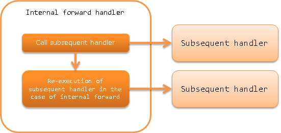

.. _forwarding_handler:

Internal Forward Handler
==================================================

.. contents:: Table of contents
  :depth: 3
  :local:

This handler re-executes the subsequent handler with the specified request path when the content in the response from the subsequent handler indicates an internal forward.

Internal forward is used when the transition destination screen is not a simple screen display and options such as check boxes and drop-down lists are acquired from the server.
For example, the input screen is not only redisplayed when an error occurs during input check, but also options for the input item is acquired from the server. For details, see :ref:`on_error-forward`.

This handler performs the following processes.

* Re-execution of subsequent handler during internal forward

The process flow is as follows.

Handler class name
--------------------------------------------------
* :java:extdoc:`nablarch.fw.web.handler.ForwardingHandler`

Module list
--------------------------------------------------
.. code-block:: xml

  <dependency>
    <groupId>com.nablarch.framework</groupId>
    <artifactId>nablarch-fw-web</artifactId>
  </dependency>

Constraints
--------------------------------------------------
Place this handler after the :ref:`session_store_handler`
  See :ref:`session_store_handler-error_forward_path` for
  why it should be placed after :ref:`session_store_handler`

Returns the response that indicates internal forward
---------------------------------------------------------------------------
When a response indicating an internal forward in a business action is returned,
start the content path indicated by the response with ``forward://``.

An example is shown below.

.. code-block:: java

    public HttpResponse sample(HttpRequest request, ExecutionContext context) {
      // Business process

      // Internal forward to initialize the same business action
      return new HttpResponse("forward://initialize");
    }

.. tip::

  For the status code, compare the during and after forward codes, and use the larger value as the response status code.

  An example is shown below.

  * If during forward is **200** and after forward is **500**, returns **500** to client.
  * If during forward is **400** and after forward is **200**, returns **400** to client.

Rules for the paths specified for internal forwards
---------------------------------------------------------------------------
Relative and absolute paths can be specified for the forward destination path specified by the internal forward.

Relative path
  Path starting from the current request URI.

Absolute path
  Path starting from the servlet context name.

  For absolute paths, start the path to be specified with ``/``.

An example is shown below.

If the current request URI is ``action/users/save``, the internal forward destination indicated by the relative and absolute paths below is the same.

.. code-block:: java

  // Relative path
  new HttpResponse("forward://initialize");

  // Absolute path
  new HttpResponse("forward:///action/users/initialize");

  
.. _internal_request_id:

Internal Request ID
-----------------------------------------------
The request ID of the forwarding destination is retained in the thread context as an internal request ID during internal forwarding.
