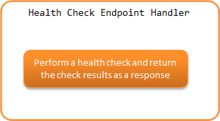

.. _health_check_endpoint_handler:

Health Check Endpoint Handler
==================================================
.. contents:: Table of contents
  :depth: 3
  :local:

This handler provides the functionality to perform a health check of the application.
Using this handler, an endpoint can be implemented that performs health checks on :ref:`web application <web_application>` and :ref:`RESTful web services <restful_web_service>`.

The framework provides :java:extdoc:`DB <nablarch.fw.web.handler.health.DbHealthChecker>` and :ref:`Redis<lettuce_adaptor>` health checks as the default implementation of health checks.

This handler performs the following processes.

* Perform a health check and return the check results as a response.

The process flow is as follows.

This handler is the endpoint of the health check and therefore does not call subsequent handlers.

Handler class name
--------------------------------------------------
* :java:extdoc:`nablarch.fw.web.handler.HealthCheckEndpointHandler`

Module list
--------------------------------------------------
.. code-block:: xml

  <dependency>
    <groupId>com.nablarch.framework</groupId>
    <artifactId>nablarch-fw-web</artifactId>
  </dependency>

  <!-- When performing a DB health check -->
  <dependency>
    <groupId>com.nablarch.framework</groupId>
    <artifactId>nablarch-core-jdbc</artifactId>
  </dependency>

Constraints
------------------------------
Place this handler after :ref:`http_response_handler` or :ref:`jaxrs_response_handler`
  The :java:extdoc:`HttpResponse <nablarch.fw.web.HttpResponse>` created by this handler is handled by :ref:`http_response_handler` or :ref:`jaxrs_response_handler`,
  so the this handler should be placed after :ref:`http_response_handler` or :ref:`jaxrs_response_handler`.

.. _health_check_endpoint_handler-health_check_endpoint:

Creating a health check endpoint
--------------------------------------------------
When this handler is added to the handler configuration, it will be an endpoint to perform a health check.
An example of this handler's configuration is shown below.

.. code-block:: xml

  <!-- Handler configuration -->
  <component name="webFrontController" class="nablarch.fw.web.servlet.WebFrontController">
    <property name="handlerQueue">
      <list>
        <!-- Other handlers are omitted -->

        <!-- Http Response Handler -->
        <component class="nablarch.fw.web.handler.HttpResponseHandler"/>

        <!--
             Health Check Endpoint Handler
             Configure it to run only for a specific path using RequestHandlerEntry.
        -->
        <component class="nablarch.fw.RequestHandlerEntry">
          <property name="requestPattern" value="/action/healthcheck" />
          <property name="handler">
            <component class="nablarch.fw.web.handler.HealthCheckEndpointHandler"/>
          </property>
        </component>

      </list>
    </property>
  </component>

By default, it does not perform health checks such as DB, etc., and returns the following JSON response with status code 200.

.. code-block:: json

  {"status":"UP"}

The health check of a resource such as DB is performed by an abstract class called :java:extdoc:`HealthChecker <nablarch.fw.web.handler.health.HealthChecker>`.
By specifying a class that extends :java:extdoc:`HealthChecker <nablarch.fw.web.handler.health.HealthChecker>` in the healthCheckers property of this handler,
it will be used as a health check for each target when this handler is executed.

An example of DB health check settings provided by default is shown below.

.. code-block:: xml

    <!-- Health Check Endpoint Handler -->
    <component class="nablarch.fw.web.handler.HealthCheckEndpointHandler">
      <!-- healthCheckers property specified by a list -->
      <property name="healthCheckers">
        <list>
          <!-- DB health check -->
          <component class="nablarch.fw.web.handler.health.DbHealthChecker">
            <!-- Specify the data source -->
            <property name="dataSource" ref="dataSource" />
            <!-- Specify the dialect -->
            <property name="dialect" ref="dialect" />
          </component>
        </list>
      </property>
    </component>

When this handler is executed with the above settings, the health check of the specified DB is performed and the response in JSON is returned.
The following is the response when the health check succeeds and fails.

.. code-block:: bash

  // Successful
  // Status code is 200
  {
    "status":"UP",
    "targets":[
      {"name":"DB","status":"UP"}
    ]
  }

  // Failed
  // Status code is 503
  {
    "status":"DOWN",
    "targets":[
      {"name":"DB","status":"DOWN"}
    ]
  }

By default, the overall health check results are output to the ``status`` just below the root, and the health check results for each target to ``targets``.

.. _health_check_endpoint_handler-add_health_checker:

Add a health check
--------------------------------------------------
As described in :ref:`health_check_endpoint_handler-health_check_endpoint`,
an abstract class called :java:extdoc:`HealthChecker <nablarch.fw.web.handler.health.HealthChecker>` performs health checks of resources such as DB.
Therefore, by creating a class that extends :java:extdoc:`HealthChecker <nablarch.fw.web.handler.health.HealthChecker>` and specifying it in the healthCheckers property of this handler,
health checks can be added.

Implementation and configuration examples are shown below.

.. code-block:: java

    public class CustomHealthChecker extends HealthChecker {

        public CustomHealthChecker() {
            // Specify a name that represents the target
            setName("Custom");
        }

        @Override
        protected boolean tryOut(HttpRequest request, ExecutionContext context) throws Exception {
            // Implement the process of trying as a health check
            // If the health check fails, return false or throw an exception
            // The following is an implementation image of a successful health check if no exceptions are thrown
            CustomClient client = ...;
            client.execute();
            return true;
        }
    }

.. code-block:: xml

    <!-- Health Check Endpoint Handler -->
    <component class="nablarch.fw.web.handler.HealthCheckEndpointHandler">
      <!-- healthCheckers property specified by a list -->
      <property name="healthCheckers">
        <list>
          <!-- DB health check -->
          <component class="nablarch.fw.web.handler.health.DbHealthChecker">
            <!-- Omitted -->
          </component>
          <!-- Specify a class created that extends HealthChecker -->
          <component class="com.example.CustomHealthChecker">
        </list>
      </property>
    </component>

.. _health_check_endpoint_handler-change_response:

Change the response of the health check results
--------------------------------------------------
The response of the health check result is created by the :java:extdoc:`HealthCheckResponseBuilder <nablarch.fw.web.handler.health.HealthCheckResponseBuilder>`.
The default response is the following.

Status code
  - Health check success: 200
  - Health check failure: 503

Response body
  - Content-Type：application/json
  - Format

    .. code-block:: bash

      {
        "status":"Overall health check results",
        "targets":[
          {
            "name":"Target1",
            "status":"Health check results for Target1"
          },
          {
            "name":"Target2",
            "status":"Health check results for Target2"
          },
          :
        ]
      }

    - The above is formatted for readability, although in actuality it will be a single line with no line breaks.
    - The overall health check result is a failure if any one of the targets health check results is unsuccessful.
    - The targets will contain as many as the specified number of :java:extdoc:`HealthChecker <nablarch.fw.web.handler.health.HealthChecker>`.

Health check results labels
  - Health check success: UP
  - Health check failure: DOWN

Status codes, health check result labels, and response body output or not can be changed in settings.
Examples of settings are shown below.

.. code-block:: xml

    <component class="nablarch.fw.web.handler.HealthCheckEndpointHandler">
      <property name="healthCheckers">
        <!-- Omitted -->
      </property>
      <property name="healthCheckResponseBuilder">
        <component class="nablarch.fw.web.handler.health.HealthCheckResponseBuilder">
          <!-- Status code for a successful health check -->
          <property name="healthyStatusCode" value="201" />
          <!-- Label for a successful health check -->
          <property name="healthyStatus" value="OK" />
          <!-- Status code for health check failure -->
          <property name="unhealthyStatusCode" value="500" />
          <!-- Label for health check failure -->
          <property name="unhealthyStatus" value="NG" />
          <!-- Whether to output the request body. Specify false if not to output -->
          <property name="writeBody" value="false" />
        </component>
      </property>
    </component>

If the content of the response body is to be changed, create a class that extends
:java:extdoc:`HealthCheckResponseBuilder <nablarch.fw.web.handler.health.HealthCheckResponseBuilder>`.

Implementation and configuration examples are shown below.

.. code-block:: java

    public class CustomHealthCheckResponseBuilder extends HealthCheckResponseBuilder {
        @Override
        protected String getContentType() {
            // Return the Content-Type.
            return "text/plain";
        }
        @Override
        protected String buildResponseBody(
                HttpRequest request, ExecutionContext context, HealthCheckResult result) {
            // Return the request body.
            // Create a response body using the HealthCheckResult, which contains the health check results.
            StringBuilder builder = new StringBuilder();
            builder.append("All=" + getStatus(result.isHealthy()));
            for (HealthCheckResult.Target target : result.getTargets()) {
                builder.append(", " + target.getName() + "=" + getStatus(target.isHealthy()));
            }
            return builder.toString();
        }
    }

.. code-block:: xml

    <component class="nablarch.fw.RequestHandlerEntry">
      <property name="requestPattern" value="/action/healthcheck" />
      <property name="handler">
        <component class="nablarch.fw.web.handler.HealthCheckEndpointHandler">
          <property name="healthCheckers">
            <!-- Omitted -->
          </property>
          <!-- Specify a class created that extends the HealthCheckResponseBuilder -->
          <property name="healthCheckResponseBuilder">
            <component class="com.nablarch.example.app.web.handler.health.CustomHealthCheckResponseBuilder" />
          </property>
        </component>
      </property>
    </component>

