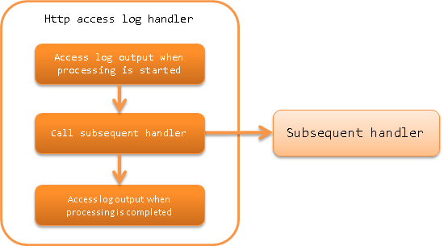

.. _http_access_log_handler:

HTTP Access Log Handler
==================================================
.. contents:: Table of contents
  :depth: 3
  :local:

This handler outputs the :ref:`HTTP access log <http_access_log>`.

The handler performs the following processes.

* Outputs access log at the start of the request process
* Outputs access log on completion of the request process

The process flow is as follows.

Handler class name
--------------------------------------------------
* :java:extdoc:`nablarch.common.web.handler.HttpAccessLogHandler`

Module list
--------------------------------------------------
.. code-block:: xml

  <dependency>
    <groupId>com.nablarch.framework</groupId>
    <artifactId>nablarch-fw-web</artifactId>
  </dependency>

Constraints
--------------------------------------------------

Place this handler after the :ref:`thread_context_handler`
  In the log output process called from this handler, the contents normally retained in :java:extdoc:`ThreadContext <nablarch.core.ThreadContext>` are required.
  Therefore, this handler must be placed after the :ref:`thread_context_handler`.

Place this handler before the :ref:`http_error_handler`
  Since an error code is required for log output at the time of completion, this handler must be placed before the :ref:`http_error_handler`.

Place this handler after the :ref:`session_store_handler`, if you want to output the session store ID.
  See :ref:`http_access_log-session_store_id` for details.

Switch the contents of access log output
--------------------------------------------------

For how to switch the output contents of the access log, see :ref:`log` and :ref:`http_access_log`.
