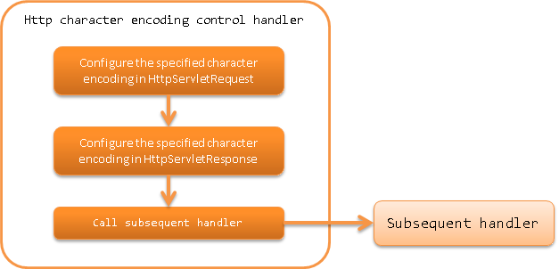

.. _http_character_encoding_handler:

HTTP Character Encoding Control Handler
==================================================
.. contents:: Table of contents
  :depth: 3
  :local:

In this handler, the specified character encoding is configured for the request ( :java:extdoc:`HttpServletRequest <javax.servlet.http.HttpServletRequest>` )
and response ( :java:extdoc:`HttpServletResponse <javax.servlet.http.HttpServletResponse>` ).

This handler performs the following process.

* Configures the default character encoding for request and response

The process flow is as follows.

Handler class name
--------------------------------------------------
* :java:extdoc:`nablarch.fw.web.handler.HttpCharacterEncodingHandler`

Module list
--------------------------------------------------
.. code-block:: xml

  <dependency>
    <groupId>com.nablarch.framework</groupId>
    <artifactId>nablarch-fw-web</artifactId>
  </dependency>

Constraints
------------------------------
This handler must be configured before any other handler.
  If other handlers are configured before this handler, the following problems may occur.

  * Default character encoding for the response is not configured
  * The specified character encoding configuration will not be valid when the request parameter is accessed and may cause garbled characters in the server.

  Therefore, place this handler before any other handler.

Configure default character encoding
--------------------------------------------------
Character encoding is configured for the :java:extdoc:`defaultEncoding <nablarch.fw.web.handler.HttpCharacterEncodingHandler.setDefaultEncoding(java.lang.String)>` property.
If character encoding is not configured, ``UTF-8`` is used.

An example for configuring ``Windows-31J`` is shown below.

.. code-block:: xml

  <component class="nablarch.fw.web.handler.HttpCharacterEncodingHandler">
    <property name="defaultEncoding" value="Windows-31J" />
  </component>

Switch the configuration of default character encoding for the response
--------------------------------------------------------------------------------
When the specified character encoding is configured for the response with this handler,
the character encoding is configured for all responses processed by the subsequent handlers.

For example, when an image is returned by a subsequent handler, the Content-Type header will be "image/jpeg;charset=UTF-8".
Therefore, the specified character encoding for the response is not configured by default in the default operation of this handler.

When it is necessary to configure the specified character encoding for all responses such as in WEB API,
configure ``true`` in the :java:extdoc:`appendResponseCharacterEncoding <nablarch.fw.web.handler.HttpCharacterEncodingHandler.setAppendResponseCharacterEncoding(boolean)>` property.

.. code-block:: xml

  <component class="nablarch.fw.web.handler.HttpCharacterEncodingHandler">
    <property name="appendResponseCharacterEncoding" value="true" />
  </component>

To change the character encoding for each request instead of using the same encoding
----------------------------------------------------------------------------------------------------------
To change the character encoding for each request, provide support by inheriting this handler.

For example, in a system that processes requests from external sites, this support is necessary when the encoding differs for each external site.

An example is shown below.

Point
  * To change the request encoding, override :java:extdoc:`resolveRequestEncoding <nablarch.fw.web.handler.HttpCharacterEncodingHandler.resolveRequestEncoding(javax.servlet.http.HttpServletRequest)>`.
  * To change the response encoding, override :java:extdoc:`resolveResponseEncoding <nablarch.fw.web.handler.HttpCharacterEncodingHandler.resolveResponseEncoding(javax.servlet.http.HttpServletRequest)>`.

.. code-block:: java

  public class CustomHttpCharacterEncodingHandler extends
          HttpCharacterEncodingHandler {

    @Override
    protected Charset resolveRequestEncoding(HttpServletRequest req) {
      return resolveCharacterEncoding(req);
    }

    @Override
    protected Charset resolveResponseEncoding(HttpServletRequest req) {
      return resolveCharacterEncoding(req);
    }

    /**
     * Resolve character encoding.  
     *
     *  If the URI contains {@code /shop1}, handle as {@code Windows-31J}.
     *
     * @param req Request
     * @return Character encoding
     */
    private Charset resolveCharacterEncoding(HttpServletRequest req) {
      if (req.getRequestURI().contains("/shop1")) {
        return Charset.forName("Windows-31J");
      }
      return getDefaultEncoding();
    }
  }
