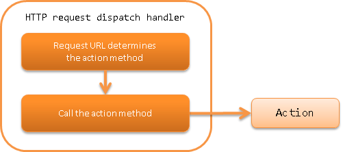
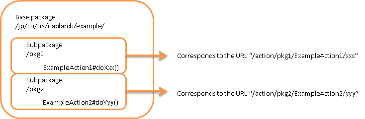

.. _http_request_java_package_mapping:

HTTP Request Dispatch Handler
==================================================

.. contents:: Table of contents
  :depth: 3
  :local:

This handler delegates processing to an action that describes the process to be performed for each function of the application.\
The delegated class and method are determined by the accessed URL.\
The URL format is assumed to be as follows for the dispatch using this class.

URL format
  /\<baseUri\>/\<className\>/\<methodName\>

Each of the parts enclosed by \<\> in the above format have the following meanings.

.. list-table::
  :class: white-space-normal
  :header-rows: 1
  :widths: 20 80

  * - Label
    - Description

  * - baseUri
    - Relative path from the context root

  * - className
    - Class name

  * - methodName
    - Implement method name of action class as HTTP method + method name.

      When the http method is ``post`` and URL methodName is ``register``,
      the action class method name is ``postRegister``.

      In addition, ``do`` can be used for ``get`` and ``post``.
      In the above example, it is ``doRegister``.

.. tip::
  Refer to :ref:`java_package_mapping_entry-dispatch_settings` on how to specify the mapping between URL and action.

.. _http_request_java_package_mapping-router_adaptor:

.. important::
  Since the URL is decided based on the class name in the HTTP request dispatch handler, flexible URL cannot be used.
  For example, to use ``/user/index`` as a URL, the class name has to be configured as ``user``.
  This violates the general Java conventions for class name and is not recommended.

  Therefore, rather than using this handler, the use of :ref:`router_adaptor` is recommended that can flexibly configure the mapping between URL and action class.

This handler performs the following process.

* Analyzes the URI and calls the method of the corresponding action.

The process flow is as follows.

Handler class name
--------------------------------------------------
* :java:extdoc:`nablarch.fw.web.handler.HttpRequestJavaPackageMapping`

Module list
--------------------------------------------------
.. code-block:: xml

  <dependency>
    <groupId>com.nablarch.framework</groupId>
    <artifactId>nablarch-fw-web</artifactId>
  </dependency>

Constraints
-----------------------

Should be placed at the end of the handler queue
  This handler does not call subsequent handlers.
  Therefore, place this handler at the end of the handler queue.

.. _java_package_mapping_entry-dispatch_settings:

Configure dispatch settings
----------------------------------------------------------------------------------------------------

When using this class, baseUri described above and package (base package) in which the action is placed are required to be configured.
Below is an example of configuring baseUri to ``action`` and base package to ``jp.co.tis.nablarch.example``.

.. code-block:: xml

  <component name="packageMapping"
             class="nablarch.fw.web.handler.HttpRequestJavaPackageMapping">
    <property name="baseUri" value="/action/"/>
    <property name="basePackage" value="jp.co.tis.nablarch.example"/>
  </component>

A dispatch example for the above configuration is shown below.

:URL: /action/UserAction/index
:Dispatch destination class: jp.co.tis.nablarch.example.UserAction

.. _java_package_mapping_entry-multi_package:

Configure settings when actions are placed in multiple packages
-------------------------------------------------------------------------------------

Actions can be placed across multiple packages.
In this case, configure the base package described in :ref:`java_package_mapping_entry-dispatch_settings` above to the package
where all Actions are placed, and describe the path from the base package to the corresponding Action in the URI class name.

An example of class allocation and URL mapping is shown below.

