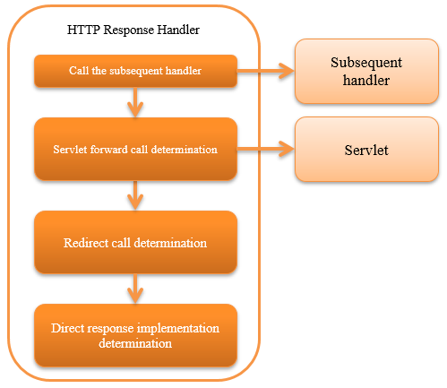

.. _http_response_handler:

HTTP Response Handler
==================================================
.. contents:: Table of contents
  :depth: 3
  :local:

This handler calls the servlet API and sends a response to the client according to :java:extdoc:`HttpResponse <nablarch.fw.web.HttpResponse>`
returned by the subsequent handler.
There are four response methods.

Servlet forward
  Forward to the servlet and draw the response. Mainly used for response using JSP.

Custom response writer
  The `custom response writer`_\ (described later) is used to perform arbitrary response output processing.\
  Mainly used for response using external library such as template engine.

Redirect
  Returns a response to redirect to the client.

Direct response
   Direct response using `getOutputStream` method of :java:extdoc:`ServletResponse <javax.servlet.ServletResponse>`.

The process flow is as follows.

Handler class name
--------------------------------------------------
* :java:extdoc:`nablarch.fw.web.handler.HttpResponseHandler`

Module list
--------------------------------------------------
.. code-block:: xml

  <dependency>
    <groupId>com.nablarch.framework</groupId>
    <artifactId>nablarch-fw-web</artifactId>
  </dependency>

Constraints
------------------------------

None.

How to convert the response
------------------------------------------------------

This handler changes the method of response to the client based on the scheme [#scheme]_ returned from the subsequent handler and status code [#statusCode]_.

The conversion conditions and response method are as shown in the table below.

.. list-table::
  :header-rows: 1
  :widths: 5,5
  :class: white-space-normal

  * -   Conversion condition
    -   Response method
  * -   When the scheme is a
        ``servlet``
    -   When the custom response writer determines that the process is to be processed, it is transferred to the custom response writer. In other cases, the process is forwarded to the servlet by content path.
  * -   When the scheme is a
        ``redirect``
    -   Redirects to specified URL
  * -   When the scheme is a
        ``http`` or ``https``
    -   Redirects to specified URL
  * -   If scheme is other than the above
        and status code is 400 or more
    -   Displays an error screen that matches the status code.
  * -   Other than the above
    -   Responds with the result HttpResponse#getBodyStream().

.. [#scheme]
      The "scheme" here refers to the return value of
      :java:extdoc:`getScheme() method <nablarch.fw.web.ResourceLocator.getScheme()>`
      of :java:extdoc:`ResourceLocator <nablarch.fw.web.ResourceLocator>` acquired with
      :java:extdoc:`HttpResponse#getContentPath() <nablarch.fw.web.HttpResponse.getContentPath()>` returned by the subsequent handler.
      If no scheme is explicitly specified, the default scheme is ``servlet`` .

.. [#statusCode]
      The "status code" here refers to the return value of
      the :java:extdoc:`getStatusCode() <nablarch.fw.web.HttpResponse.getStatusCode()>` method of
      :java:extdoc:`HttpResponse <nablarch.fw.web.HttpResponse>` class returned by the subsequent handler.

.. _http_response_handler-convert_status_code:

Custom response writer
--------------------------

By configuring the implementation class of
:java:extdoc:`CustomResponseWriter<nablarch.fw.web.handler.responsewriter.CustomResponseWriter>` to the ``customResponseWriter`` property of this handler,
an any response output process \ [#resp]_  can be  executed.

.. [#resp] A specific example is the case where a response is output using the template engine instead of JSP.
           :ref:`web_thymeleaf_adaptor` is an implementation provided by Nablarch.

Change the HTTP status code
------------------------------------------------------

This handler changes part of the status code and configures in the response to the client.

The conversion condition that determine the HTTP status code and error code of the response are as shown in the table below.

.. list-table::
  :header-rows: 1
  :widths: 3,7
  :class: white-space-normal

  * -   Conversion condition
    -   Error code
  * -   For Ajax requests
    -   Returns the original status code without change
  * -   When the original status code is 400
    -   Returns status code 200
  * -   Other than the above
    -   Returns the status code result without change

.. _http_response_handler-change_content_path:

Switching the content path for each language
------------------------------------------------------

This handler has a function to dynamically switch the forwarding destination based on the language configuration included in the HTTP request.
By using this function, the function to switch the JSP to be forwarded according to the language selected by the user can be realized.

When using this function, configure one of the following classes in ``contentPathRule`` property of this handler.

============================================================================================================================= ============================================================================================
Class name                                                                                                                      Description
============================================================================================================================= ============================================================================================
:java:extdoc:`DirectoryBasedResourcePathRule <nablarch.fw.web.i18n.DirectoryBasedResourcePathRule>`                           A class that
                                                                                                                              |br|
                                                                                                                              uses the directory directly under the context root for switching the language.

                                                                                                                               .. code-block:: bash

                                                                                                                                # Placement example when supporting /management/user/search.jsp
                                                                                                                                # with Japanese (ja) and English (en)
                                                                                                                                # Create a directory for each language directly under the context root.
                                                                                                                                # The directory name is the language name.
                                                                                                                                Context root
                                                                                                                                ├─en
                                                                                                                                │  └─management
                                                                                                                                │      └─user
                                                                                                                                │           search.jsp
                                                                                                                                └─ja
                                                                                                                                    └─management
                                                                                                                                        └─user
                                                                                                                                             search.jsp

:java:extdoc:`FilenameBasedResourcePathRule <nablarch.fw.web.i18n.FilenameBasedResourcePathRule>`                             A class that uses file names to switch the languages.

                                                                                                                                .. code-block:: bash

                                                                                                                                 # Placement example when supporting /management/user/search.jsp
                                                                                                                                 # with Japanese (ja) and English (en)
                                                                                                                                 # Create a file for each language.
                                                                                                                                 # Add the suffix "'_' + language name" to the file name.
                                                                                                                                 Context root
                                                                                                                                 └─management
                                                                                                                                         └─user
                                                                                                                                              search_en.jsp
                                                                                                                                              search_ja.jsp
============================================================================================================================= ============================================================================================

The configuration example for this is as follows.

.. code-block:: xml

  <!-- Resource path rules -->
  <component name="resourcePathRule" class="nablarch.fw.web.i18n.DirectoryBasedResourcePathRule" />

  <!-- HTTP response handler-->
  <component class="nablarch.fw.web.handler.HttpResponseHandler">
    <property name="contentPathRule" ref="resourcePathRule" />
  </component>

To switch contents by a method other than the above, create a class that inherits :java:extdoc:`ResourcePathRule <nablarch.fw.web.i18n.ResourcePathRule>`
class and configure the created class in the ``resourcePathRule`` property as above.

.. tip::
   This function cannot be used when the response is output by the `custom response writer`_.
   This is to ensure that it is not mixed with the multilingual function of the template engine.

How to handle fatal errors that occur in this handler
-------------------------------------------------------

When the following events occur in the processing in this handler,
it is determined that a normal response cannot be returned and a fixed response with status code 500 is returned to the client.

* When a ServletException occurs during servlet forward
* When an exception of RuntimeException and its subclass occurs
* When an exception of Error and its subclass occurs

The response for these cases is the following HTML.

.. code-block:: html

  <html>
    <head>
      <title>A system error occurred.</title>
    </head>
    <body>
      

        We are sorry not to be able to proceed your request. 
        Please contact the system administrator of our system.
      

    </body>
  </html>

.. important::

    The above HTML response is fixed and cannot be changed with configuration.

    This response is used only in rare cases where an exception occurs in this handler.
    This specification does not usually cause a problem, but for systems where this response should not be issued under any circumstances,
    consider preparing handlers with reference to this handler.

.. |br| raw:: html

   
