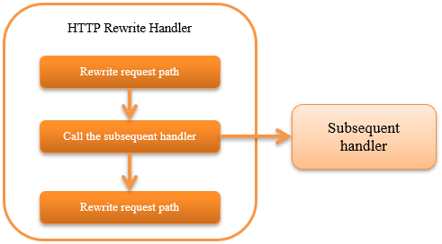

.. _http_rewrite_handler:

HTTP Rewrite Handler
==================================================
.. contents:: Table of contents
  :depth: 3
  :local:

This handler provides a function to rewrite the request path, content path
and variables for HTTP requests and responses.
This handler is used when a special transition such as
"forced transition to login screen when not logged in" is required.

This handler performs the following processes.

* Rewrites the request path
* Rewrites the content path

The process flow is as follows.

Handler class name
--------------------------------------------------
* :java:extdoc:`nablarch.fw.web.handler.HttpRewriteHandler`

Module list
--------------------------------------------------
.. code-block:: xml

  <dependency>
    <groupId>com.nablarch.framework</groupId>
    <artifactId>nablarch-fw-web</artifactId>
  </dependency>

Constraints
------------------------------

Place this handler after the :ref:`http_response_handler`
  The content path rewritten by this handler is used by the response handler.
  Therefore, this handler must be placed after the :ref:`http_response_handler`.

Place this handler before the :ref:`thread_context_handler`
  This handler rewrites the request path placed in the thread context.
  Therefore, this handler must be placed before the :ref:`thread_context_handler`.

Rewrite settings
------------------------------

Rewrite settings are performed for properties requestPathRewriteRules or contentPathRewriteRules of :java:extdoc:`handler  <nablarch.fw.web.handler.HttpRewriteHandler>`.

A configuration example is shown below.

.. code-block:: xml

  <component class="nablarch.fw.web.handler.HttpRewriteHandler">
    <!-- Rewrite rules for request path -->
    <property name="requestPathRewriteRules">
      <list>
        <!-- If the login has already been established for access to the servlet context root,
             transitions to the menu screen. -->
        <component class="nablarch.fw.web.handler.HttpRequestRewriteRule">
          <property name="pattern" value="^/$" />
          <property name="conditions">
          <list>
            <value>%{session:user.id} ^\S+$</value>
          </list>
          </property>
          <property name="rewriteTo" value="/action/MenuAction/show" />
        </component>

        <!-- If the login has not been established, transitions to the log-in screen. -->
        <component class="nablarch.fw.web.handler.HttpRequestRewriteRule">
          <property name="pattern"   value="^/$" />
          <property name="rewriteTo" value="/action/LoginAction/authenticate" />
        </component>
      </list>
    </property>

    <!-- Rewrite rules for response content path -->
    <property name="contentPathRewriteRules">
      <list>

        <!-- If the status code is 401, transitions to login screen -->
        <component class="nablarch.fw.web.handler.ContentPathRewriteRule">
          <property name="pattern"   value="^.*" />
          <property name="rewriteTo" value="redirect:///action/LoginAction/authenticate" />
          <property name="conditions">
            <list>
            <value>%{statusCode} ^401$</value>
            </list>
          </property>
        </component>
      </list>
    </property>
  </component>

As you can see from this example, :java:extdoc:`HttpRequestRewriteRule <nablarch.fw.web.handler.HttpRequestRewriteRule>`
(to rewrite the request path) or :java:extdoc:`ContentPathRewriteRule <nablarch.fw.web.handler.ContentPathRewriteRule>`
(to rewrite the content path) has been used for the configuration.

The following properties are present in :java:extdoc:`HttpRequestRewriteRule <nablarch.fw.web.handler.HttpRequestRewriteRule>`
and :java:extdoc:`ContentPathRewriteRule <nablarch.fw.web.handler.ContentPathRewriteRule>`
(Properties are defined in superclass :java:extdoc:`RewriteRule <nablarch.fw.handler.RewriteRule>`.)

==================== ====================================================
Property name         Description
==================== ====================================================
pattern              Path pattern to apply
rewriteTo            String after rewriting
conditions           Additional conditions other than path
exports              Rewrite settings of variables
==================== ====================================================

Variables can be used to configure conditions in :java:extdoc:`HttpRequestRewriteRule <nablarch.fw.web.handler.HttpRequestRewriteRule>`
and :java:extdoc:`ContentPathRewriteRule <nablarch.fw.web.handler.ContentPathRewriteRule>`

The variables available for :java:extdoc:`HttpRequestRewriteRule <nablarch.fw.web.handler.HttpRequestRewriteRule>`
and :java:extdoc:`ContentPathRewriteRule <nablarch.fw.web.handler.ContentPathRewriteRule>`
are as follows.

============================ ============================== ===========================================================
Variable type                Format                         Applicable class
============================ ============================== ===========================================================
Session scope                %{session:(variable name)}     HttpRequestRewriteRule / ContentPathRewriteRule
Request scope                % {request:(variable name)}    HttpRequestRewriteRule / ContentPathRewriteRule
Thread context               % {thread:(variable name)}     HttpRequestRewriteRule / ContentPathRewriteRule
Request parameters           % {param:(variable name)}      HttpRequestRewriteRule
HTTP header                  % {header: (header name)}      HttpRequestRewriteRule / ContentPathRewriteRule
HTTP request method          %{httpMethod}                  HttpRequestRewriteRule
HTTP version                 %{httpVersion}                 HttpRequestRewriteRule
All request parameter names  %{paramNames}                  HttpRequestRewriteRule
Status code                  %{statusCode}                  ContentPathRewriteRule
============================ ============================== ===========================================================

Configure value to variable
-----------------------------

In the HTTP rewrite handler, variables can be configured in the  request scope, session scope,
thread context and window scope in addition to path rewrite.

To configure a variable, configure the export properties of :java:extdoc:`HttpRequestRewriteRule <nablarch.fw.web.handler.HttpRequestRewriteRule>`
or :java:extdoc:`ContentPathRewriteRule <nablarch.fw.web.handler.ContentPathRewriteRule>`

A configuration example is shown below.

.. code-block:: xml

  <!--If referrer header is sent, configure its value in request scope. -->
  <component class="nablarch.fw.web.handler.HttpRequestRewriteRule">
    <!-- For all requests. -->
    <property name="pattern" value=".*" />
    <!-- Applies only when referrer header is defined.-->
    <property name="conditions">
      <list>
        <value>%{header:Referer} ^\S+$</value>
      </list>
    </property>
    <!-- Configure the value of referrer header in the variable prevUrl of the request scope.-->
    <property name="exports">
      <list>
        <value>%{request:prevUrl} ${header:Referer}</value>
      </list>
    </property>
  </component>

In this way, by configuring "variable name to be configured" ("%{request:prevUrl}" in the above example)
and "value to be configured" ("${header:Referer}" in the above example) in the property with a list,
variables can be configured for each scope.

The variable scope that can be configured to "variable name to be configured" in exports is as follows.

============================ ============================ ========================================================
Variable scope               Format                       Subjects
============================ ============================ ========================================================
Session scope                %{session:(variable name)}   HttpRequestRewriteRule / ContentPathRewriteRule
Request scope                % {request:(variable name)}  HttpRequestRewriteRule / ContentPathRewriteRule
Thread context               % {thread:(variable name)}   HttpRequestRewriteRule / ContentPathRewriteRule
Window scope                 % {param:(variable name)}    HttpRequestRewriteRule
============================ ============================ ========================================================
