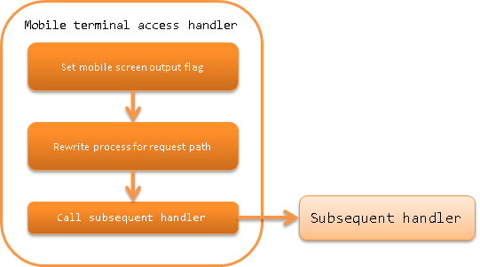

.. _keitai_access_handler:

Mobile Terminal Access Handler
==================================================

.. contents:: Table of contents
  :depth: 3
  :local:

This handler implements the following to operate a web application in an environment where JavaScript does not work,
such as the mobile phone (so called feature phone).

* From the button name of the button pressed on the screen, dispatch to the expected URL
* Configure the variables so that the JavaScript is not output on JSP

The process flow is as follows.

Handler class name
--------------------------------------------------
* :java:extdoc:`nablarch.fw.web.handler.KeitaiAccessHandler`

Module list
--------------------------------------------------
.. code-block:: xml

  <dependency>
    <groupId>com.nablarch.framework</groupId>
    <artifactId>nablarch-fw-web</artifactId>
  </dependency>

Constraints
------------------------------

Place this handler after the :ref:`http_response_handler`
  Since this handler normally configures variables so that JavaScript is not output on JSP from the client,
  it must be placed after the :ref:`http_response_handler` that performs forward processing to JSP.

Place this handler before the :ref:`thread_context_handler`
  This handler must be placed before the :ref:`thread_context_handler` that uses URI, because it includes the process of determining the URI,
  which is determined by JavaScript output by JSP.

Tags that suppress the JavaScript output
--------------------------------------------------

When accessing the URL using the mobile device access handler,
the JavaScript normally output by the Nablarch tag library below will not be output at all.

 * :ref:`n:form tag <tag-form_tag>`
 * :ref:`n:script tag <tag-script_tag>`
 * :ref:`Tags associated with submit <tag_reference_submit>`

 .. important::
   The following tags cannot be used because the originally expected functions cannot be realized.

   * :ref:`n:submitLink tag <tag-submit_link_tag>`

   Use n:a tag as an alternative to the n:submitLink tag.
   Especially, request parameters must be sent as GET method parameters.

URL association
--------------------

When the mobile device access handler is applied, rewriting of the form URI attribute, which is normally performed by JavaScript in Nablarch with the following operation, is done in the server.

1. Operation during JSP display

  1.1. Regarding the HTML input tag that is output at the location where n:submit, n:button is described, the value to be configured in the name attribute is output to ``nablarch_uri_override_<name attribute on JSP>|<URI of submit destination>``.

  1.2. In n:form tag, just an HTML <form> tag is output.
  That is, when the button is pressed, the name attribute of the pressed button is sent to the URL described in the HTML <form> tag.
  (Normally, in the close tag </form>, JavaScript that changes the URI attribute of the <form> tag is inserted in the URL that matches the pressed button.)

2. Operation during form submission

  2.1. The KeitaiAccessHandler gets the URI attribute configured in the original JSP tag from the name attribute (string starting with ``nablarch_uri_override_`` configured in 1.1.) configured in the button pressed at the time of submission.

  2.2. The KeitaiAccessHandler configures the URI attribute acquired by the parameter key ``nablarch_submit`` that is treated as the URI to be processed by the request parameter.
  (That is, rewriting of the form URI attribute that is normally done by JavaScript in Nablarch, is executed in the server)

  2.3. Delegate to the subsequent process. (The subsequent operations are the same as when the URI corresponding to the button is specified by the request from the client)
