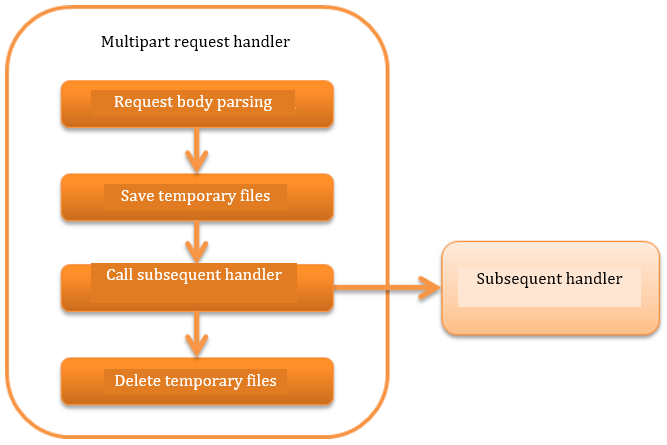

.. _multipart_handler:

Multipart Request Handler
==================================================
.. contents:: Table of contents
  :depth: 3
  :local:

This handler parses the body part and saves the uploaded file as a temporary file when the HTTP request is in the multipart format.

This handler performs the following processes.

* Parses multi-part requests
* Saves upload files as temporary files
* Deletes saved temporary files

The process flow is as follows.

Handler class name
--------------------------------------------------
* :java:extdoc:`nablarch.fw.web.upload.MultipartHandler`

Module list
--------------------------------------------------
.. code-block:: xml

  <dependency>
    <groupId>com.nablarch.framework</groupId>
    <artifactId>nablarch-fw-web</artifactId>
  </dependency>

  <!-- Only when specifying the temporary storage location -->
  <dependency>
    <groupId>com.nablarch.framework</groupId>
    <artifactId>nablarch-core</artifactId>
  </dependency>

.. _multipart_handler-constraint:

Constraints
--------------------------------------------------
None.

Operating conditions of this handler
--------------------------------------------------
This handler parses the request body only for multipart requests. Whether the request is in a multipart format is determined based on the ``Content-Type`` of the request header.

When the ``Content-Type`` matches the ``multipart/form-data``, the request is determined to be in multipart format and the body is parsed.
In case of other requests, this handler does nothing and delegates processing to the subsequent handlers.

Specify the temporary storage location for upload files
---------------------------------------------------------
Configure the temporary storage directory for upload file in :ref:`file_path_management`.

If the temporary storage destination directory is not specified in file path management, the value of system property `java.io.tmpdir` is used as the default storage destination.

Below is a configuration example for the destination directory for temporary files.

Point
  * The logical name of the storage destination directory should be ``uploadFileTmpDir``.

.. code-block:: xml

  <component name="filePathSetting" class="nablarch.core.util.FilePathSetting">
    <!-- Configuration of directory-->
    <property name="basePathSettings">
      <map>
        <!-- Temporary storage directory for the upload file -->
        <entry key="uploadFileTmpDir" value="file:/var/nablarch/uploadTmpDir" />
      </map>
    </property>
  </component>

.. tip::

  In the above example, the storage destination directory is specified directly, but this value will change depending on the environment.
  Therefore, it is recommended that the directory be configured in the environment configuration file instead of configuring the directory directly in the component configuration file.

  For details, see :ref:`repository-environment_configuration`.

.. _multipart_handler-file_limit:

Prevent uploading of large files
--------------------------------------------------
If a large file is uploaded, the system may not operate normally due to insufficient disc space.
Therefore, this handler returns 413 (Payload Too Large) to the client when the maximum upload size is exceeded.

The upper limit of upload size is configured in bytes. If the value is not configured, there is no limit to the upload size.
Always set a maximum upload size to prevent DoS attacks.

A configuration example for the upload size is shown below.

.. code-block:: xml

  <component class="nablarch.fw.web.upload.MultipartHandler" name="multipartHandler">
    <property name="uploadSettings">
      <component class="nablarch.fw.web.upload.UploadSettings">
        <!-- Upload size (Content-Length) upper limit (about 1MB) -->
        <property name="contentLengthLimit" value="1000000" />
      </component>
    </property>
  </component>

.. tip::

  The upper limit of the upload size is not for a file, but for one request.

  Therefore, when multiple files are uploaded, the upper limit check is based on the total of the file sizes (strictly speaking, by Content-Length).

  If the size of each file is to be checked, implement the check in the action.

.. _multipart_handler-max_file_count:

Prevent uploading of mass files
--------------------------------------------------
Even if you set the maximum upload size, a large number of files can be uploaded at once by reducing the size of each file.
To reduce unnecessary processing, this handler allows you to set a limit on the number of files that can be uploaded at once.
This handler returns 400 (Bad Request) to the client when a file exceeding the limit is uploaded.

A setting example is shown below.

.. code-block:: xml

  <component class="nablarch.fw.web.upload.MultipartHandler" name="multipartHandler">
    <property name="uploadSettings">
      <component class="nablarch.fw.web.upload.UploadSettings">
        <!-- Maximum number of uploaded files -->
        <property name="maxFileCount" value="100" />
      </component>
    </property>
  </component>

If ``maxFileCount`` is set to a value greater than or equal to 0, that value will be the maximum number of files that can be uploaded at once.
A negative number means unlimited.
Defaults to -1 if not set.

Delete (clean) temporary files
--------------------------------------------------
Clean the upload files based on the following conditions.

* If an exception occurs while parsing of the body is in progress
* When automatic deletion configuration is enabled on the return path of the handler

The automatic deletion configuration is enabled by default.
Note that if this setting is disabled in the production environment, a large number of temporary files will remain on the disk, and may cause the disk to become full in the worst case.

To invalidate the configuration value, configure :java:extdoc:`UploadSettings#autoCleaning <nablarch.fw.web.upload.UploadSettings.setAutoCleaning(boolean)>` to `false`.

Configure the transition destination screen for multipart parsing error and file size upper limit are exceeded
----------------------------------------------------------------------------------------------------------------
This handler returns `400(BadRequest)` to the client,
when multipart parsing error [#part_error]_ or :ref:`file size exceeds the upper limit <multipart_handler-file_limit>` is encountered.

Therefore, the error page corresponding to `400(BadRequest)` must be configured in `web.xml`.
If the error page is not configured in `web.xml`, the default page of web application server is returned to the client.

.. important::

  This handler must be configured before the :ref:`session_store_handler` as described in :ref:`session_store_handler-constraint`.
  Therefore, :ref:`HttpErrorHandler_DefaultPage` of the :ref:`http_error_handler`, configured after the :ref:`session_store_handler` cannot be used.

.. [#part_error]
  Case of multipart parsing error

  * If there is a disconnect request from the client during upload and the body part is incomplete
  * When there is no boundary

.. _multipart_handler-read_upload_file:

Read the upload file
------------------------------------------------------------
The uploaded file (temporarily saved file) is acquired from :java:extdoc:`HttpRequest <nablarch.fw.web.HttpRequest>`.

An implementation example is shown below.

Point
  * The upload file is acquired by calling :java:extdoc:`HttpRequest#getPart <nablarch.fw.web.HttpRequest.getPart(java.lang.String)>`.
  * The parameter name is specified in the argument of :java:extdoc:`HttpRequest#getPart <nablarch.fw.web.HttpRequest.getPart(java.lang.String)>`.

.. code-block:: java

  public HttpResponse upload(HttpRequest request, ExecutionContext context) throws IOException {
    // Acquire the uploaded file
    List<PartInfo> partInfoList = request.getPart("uploadFile");

    if (partInfoList.isEmpty()) {
      // Business error if the uploaded file is not specified
    }

    // Process the uploaded file
    InputStream file = partInfoList.get(0).getInputStream()

    // The read process of the uploaded file is performed below.
  }

For the detailed implementation method to process the upload file, refer to the following document.
As described in :ref:`data_converter`, :ref:`data_bind` is recommended.
(If the format cannot be handled by :ref:`data_bind`, use :ref:`data_format`.)

* :ref:`Process the upload files using data bind <data_bind-upload_file>`
* :ref:`Process the upload files using general data format <data_format-load_upload_file>`

.. tip::

  If the uploaded file is a binary file such as an image file, use the binary data that has been read for processing.

  The byte data of the uploaded file can be read with the following implementation.

  .. code-block:: java

    File savedFile = partInfo.getSavedFile();
    try {
        byte[] bytes = Files.readAllBytes(savedFile.toPath());
    } catch (IOException e) {
        throw new RuntimeException(e);
    }
