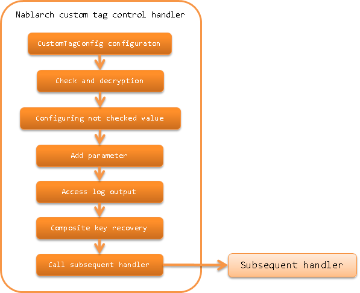

.. _nablarch_tag_handler:

Nablarch Custom Tag Control Handler
==================================================

.. contents:: Table of contents
  :depth: 3
  :local:

This handler performs request processing required for Nablarch :ref:`tag`.

This handler performs the following processes.

* Configure :java:extdoc:`CustomTagConfig<nablarch.common.web.tag.CustomTagConfig>` in the request scope
  so that the default value of custom tag can be referenced in JSP.
* Performs tampering check and decryption corresponding to :ref:`hidden encryption<tag-hidden_encryption>`.
* For :ref:`specify the value for checkbox that is not checked<tag-checkbox_off_value>`, configure the corresponding value in the request without checking.
* For :ref:`add parameters for each button or link<tag-submit_change_parameter>`, add parameters to the request.
* Output the request parameter of :ref:`http_access_log`.
* Restore the composite key to set :ref:`handle composite key<tag-composite_key>`.

.. tip::
 In the case of GET request, hidden parameter is not output in the custom tag.
 Refer to :ref:`tag-using_get` for the reason why hidden parameters are not output.

 In accordance with the custom tag, this handler also does not perform the process related to the hidden parameter in the case of GET request,
 but only restores the composite key.

The process flow is as follows.

Handler class name
--------------------------------------------------
* :java:extdoc:`nablarch.common.web.handler.NablarchTagHandler`

Module list
---------------------------------------------------------------------
.. code-block:: xml

  <dependency>
    <groupId>com.nablarch.framework</groupId>
    <artifactId>nablarch-fw-web-tag</artifactId>
  </dependency>

Constraints
------------------------------
Configure this handler after the :ref:`multipart_handler`
  This handler is used to access request parameters in the request process required for the :ref:`tag`.

When using :ref:`hidden encryption<tag-hidden_encryption>`, configure this handler after the :ref:`thread_context_handler`
  To acquire the request ID from the thread context to determine whether the request is a hidden encryption target.

Configure the error page when decryption fails (tampering error, session invalidation error)
--------------------------------------------------------------------------------------------------------------------------
Decryption process of :ref:`hidden encryption<tag-hidden_encryption>` may fail in the following two cases.
For the tampering determination criteria, see :ref:`decryption process<tag-hidden_encryption_decryption>`.

* If the encrypted data has been tampered with (tampering error)
* If the key used for decryption cannot be obtained from the session (session invalidation error)

The error page and status code
when an error occurs can be specified in the configuration of
:java:extdoc:`NablarchTagHandler<nablarch.common.web.handler.NablarchTagHandler>`.

.. code-block:: xml

  <component name="nablarchTagHandler"
             class="nablarch.common.web.handler.NablarchTagHandler">
    <!--
      Configuration when a tampering error occurs
    -->
    <property name="path" value="/TAMPERING-DETECTED.jsp" />
    <property name="statusCode" value="400" />
    <!--
      Configuration when session invalidation error occurs
      If omitted, the configuration of tampering error is used.
    -->
    <property name="sessionExpirePath" value="/SESSION-EXPIRED.jsp" />
    <property name="sessionExpireStatusCode" value="400" />

  </component>