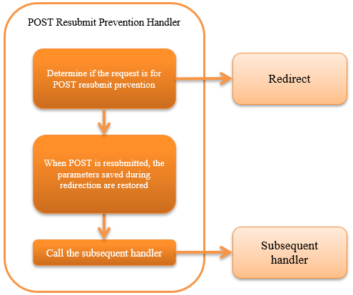

.. _post_resubmit_prevent_handler:

POST Resubmit Prevention Handler
==================================================

.. contents:: Table of contents
  :depth: 3
  :local:

This handler uses redirect to accept the request again for the request accepted by POST.
By this process, it is used for the purpose of preventing unintentional resubmit of POST request due to erroneous operation such as reload process on the browser.

.. important::

  This handler is not recommended to be used in new projects.

.. important::

  This handler stores the POST information in the session when a request to prevent POST resubmit is sent and discards the POST information from the session with the next redirect process.
  When many requests are sent, the POST information is collected in the session without being released and is a burden on the memory.
  That is, it is vulnerable to a DOS attack that sends continuous POST requests.

  To prevent POST information from being resubmitted from the browser without using this handler, consider implementing the return of a redirect response in a business action.

This handler performs the following processes.

* If the request is subject to POST resubmit prevention, saves the request parameters in the session and redirects to the redirect destination.
  (The following 2 points are the conditions for whether to prevent POST resubmit.)

    * The request is a POST.
    * Request parameter includes "POST_RESUBMIT_PREVENT_PARAM". (If preventPostResubmit in the form tag is configured to true, this parameter will be configured automatically.)

* If the request is a GET request with POST resubmit prevention, restores the request parameters retained in the session and deletes it from the session.
  If the parameter does not exist in the session, a predetermined error screen is displayed in the resubmit process.

The process flow is as follows.

Handler class name
--------------------------------------------------
* :java:extdoc:`nablarch.fw.web.post.PostResubmitPreventHandler`

Module list
--------------------------------------------------
.. code-block:: xml

  <dependency>
    <groupId>com.nablarch.framework</groupId>
    <artifactId>nablarch-fw-web</artifactId>
  </dependency>

Constraints
------------------------------

Place this handler before the :ref:`nablarch_tag_handler`
  This handler redirects the process while holding the request contents in the session.
  This handler must be placed before the :ref:`nablarch_tag_handler` as it is necessary to redirect before sending the encryption parameter in the custom tag control handler.

How to use post resubmit prevention
------------------------------------------------------------

Post resubmit prevention can be used by configuring this handler on the handler queue and configuring the preventPostResubmit attribute of the n:form tag in the JSP file to true.

Map the request destination to the transition destination path
----------------------------------------------------------------------------

The request destination and transition destination can be configured with the prefix match of the request ID.
The configuration example is as follows.

.. code-block:: xml

  <!-- POST resubmit prevention handler -->
  <component name="postResubmitPreventHandler"
      class="nablarch.fw.web.post.PostResubmitPreventHandler">

    <!--
    Configure the mapping of the transition destination path when GET request after redirect is sent multiple times.

    When the request ID is specified by a key, the request transits to the path configured by value.
    When multiple keys match, the request transits to the path of the value corresponding to the key with the longest number of characters.
    -->
    <property name="forwardPathMapping">
      <map>
        <entry key="/"  value="redirect:///action/error/index" />
        <entry key="/action/func1/" value="redirect:///action/error/index2" />
        <entry key="/action/func2/" value="/error.jsp" />
      </map>
    </property>
  </component>

For request IDs with multiple matches with prefix match of multiple request IDs, such as request ID "/action/func1/index" in this configuration example,
the redirect destination that matches the longest key (in the above case, "redirect:///action/error/index2") will be selected.
