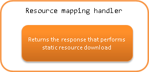

.. _resource_mapping:

Resource Mapping Handler
==================================================
.. contents:: Table of contents
  :depth: 3
  :local:

This handler provides the function to return the response without going through the business action.
This function is used to download static resources through the Nablarch handler.

.. important::
  The method of downloading static resources using this handler has disadvantages such as "a large amount of log is output"
  and "a server which is highly accessed, which places a heavy load on the application server".

  Therefore, using this handler for downloading static resources that do not need to go through
  the handler is not recommended.
  Download static resources using the function of the web container or web server,
  and use this handler only for contents that need to go through other handlers
  such as "authorization is required to be performed for contents download".

This handler performs the following process.

* Returns the response that performs static resource download

.. important::
  This handler is mainly used in combination with the :ref:`request_handler_entry` handler
  to realize the function of "download static resource in the case of specific extensions".

  For examples of the applications, see :ref:`usage example of request handler entry <request_handler_entry_usage>`.

The process flow is as follows.
As shown in the figure, this handler does not call subsequent handlers.

Handler class name
--------------------------------------------------
* :java:extdoc:`nablarch.fw.web.handler.ResourceMapping`

Module list
--------------------------------------------------
.. code-block:: xml

  <dependency>
    <groupId>com.nablarch.framework</groupId>
    <artifactId>nablarch-fw-web</artifactId>
  </dependency>

Constraints
------------------------------

Place this handler after the :ref:`forwarding_handler`
  This handler can use the ``forward://`` scheme provided by the function of the :ref:`forwarding_handler`.
  Therefore, this handler must be placed after the :ref:`forwarding_handler`.

Place this handler after the :ref:`http_response_handler`
  This handler can use the ``servlet://``, ``file://`` and ``classpath://`` schemes provided by the function of the :ref:`http_response_handler`.
  Returns a 404 (Not Found) response when an error occurs.
  Therefore, this handler must be placed after the :ref:`http_response_handler` to process these responses.

.. _resource_mapping_usage:

Download static resources
------------------------------

When downloading static resources, which is the main use of this handler, configure the two properties ``baseUri`` and ``basePath`` as follows.

.. code-block:: xml

  <!-- Handler that downloads static resources for image file -->
  <component name="imgMapping"
             class="nablarch.fw.web.handler.ResourceMapping">
    <property name="baseUri" value="/"/>
    <property name="basePath" value="servlet:///"/>
  </component>

The meaning of each configuration item is as follows

============================= ==========================================================
Configuration item            Description
============================= ==========================================================
baseUri                       URL to be processed. If it does not match this URL,
                              |br|
                              the handler returns a HTTP status 404 (Not Found) response.
basePath                      Base URL of the response if it matches baseUri.
                              |br|
                              If the schema specification is omitted, ``servlet://`` schema is used.
============================= ==========================================================

However, if the handler with the above configuration is just added to the handler queue,
all URLs sent to the server are processed as static resources.
In other words, all handlers after this handler in the handler queue will not be executed.

Therefore, this handler must be used in combination with :ref:`request_handler_entry` as described in :ref:`request_handler_entry_usage`.

.. |br| raw:: html

    
