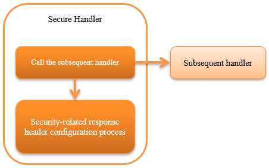

.. _secure_handler:

Secure Handler
==================================================
.. contents:: Table of contents
  :depth: 3
  :local:

This handler handles processing and header settings related to web application security.

By default, the following response headers are configured for the response object(:java:extdoc:`HttpResponse <nablarch.fw.web.HttpResponse>`).

* X-Frame-Options: SAMEORIGIN
* X-XSS-Protection: 1; mode=block
* X-Content-Type-Options: nosniff
* Referrer-Policy: strict-origin-when-cross-origin
* Cache-Control: no-store

This handler performs the following process.

* Generate nonce for Content-Security-Policy
* Security-related response header configuration process

The process flow is as follows.

  
Handler class name
--------------------------------------------------
* :java:extdoc:`nablarch.fw.web.handler.SecureHandler`

Module list
--------------------------------------------------
.. code-block:: xml

  <dependency>
    <groupId>com.nablarch.framework</groupId>
    <artifactId>nablarch-fw-web</artifactId>
  </dependency>

Constraints
------------------------------
Configure this handler after the :ref:`http_response_handler`
  To set the response header set in this handler to the response object of Servlet API by the :ref:`http_response_handler`.

To change the value of the header applied by default
------------------------------------------------------
Depending on the requirement, the value of security-related header applied by default may have to be changed.

For example, to disallow all the displays in the frame, the value of the ``X-Frame-Options`` header has to be changed to ``DENY``.
In such a case, the settings in the component configuration file is configured explicitly.

An example is shown below.

.. code-block:: xml

  <component class="nablarch.fw.web.handler.SecureHandler">
    <property name="secureResponseHeaderList">
      <list>
        <!-- Explicitly specify the value for X-Frame-Options -->
        <component class="nablarch.fw.web.handler.secure.FrameOptionsHeader">
          <property name="option" value="DENY" />
        </component>

        <!-- Default vales are used for headers other than the above -->
        <component class="nablarch.fw.web.handler.secure.XssProtectionHeader" />
        <component class="nablarch.fw.web.handler.secure.ContentTypeOptionsHeader" />
        <component class="nablarch.fw.web.handler.secure.ReferrerPolicyHeader" />
        <component class="nablarch.fw.web.handler.secure.CacheControlHeader" />
      </list>
    </property>
  </component>

.. tip::

  Refer to the following class for details of the property to change the value.

  * :java:extdoc:`FrameOptionsHeader <nablarch.fw.web.handler.secure.FrameOptionsHeader>`
  * :java:extdoc:`ContentTypeOptionsHeader <nablarch.fw.web.handler.secure.ContentTypeOptionsHeader>`
  * :java:extdoc:`XssProtectionHeader <nablarch.fw.web.handler.secure.XssProtectionHeader>`
  * :java:extdoc:`ReferrerPolicyHeader <nablarch.fw.web.handler.secure.ReferrerPolicyHeader>`
  * :java:extdoc:`CacheControlHeader <nablarch.fw.web.handler.secure.CacheControlHeader>`

Configure a response header other than the default
-------------------------------------------------------
The procedure for configuring the security-related response headers other than the default is shown below.

1. Specify the field name and value to be configured for the response header in the implementation class
   of the :java:extdoc:`SecureResponseHeader <nablarch.fw.web.handler.secure.SecureResponseHeader>` interface.

  .. tip::
    If a simple response header with no logic is created, it can be created by extending :java:extdoc:`SecureResponseHeaderSupport <nablarch.fw.web.handler.secure.SecureResponseHeaderSupport>`.

2. Configure the class created in ``No1`` in this handler (:java:extdoc:`SecureHandler <nablarch.fw.web.handler.SecureHandler>`).

.. important::

  When configuring the implementation class :java:extdoc:`SecureResponseHeader <nablarch.fw.web.handler.secure.SecureResponseHeader>`,
  configure the component that is applied by default.

  An example of the configuration file is shown below.

  .. code-block:: xml

    <component class="nablarch.fw.web.handler.SecureHandler">
      <property name="secureResponseHeaderList">
        <list>
          <component class="nablarch.fw.web.handler.secure.FrameOptionsHeader" />
          <component class="nablarch.fw.web.handler.secure.XssProtectionHeader" />
          <component class="nablarch.fw.web.handler.secure.ContentTypeOptionsHeader" />
          <component class="nablarch.fw.web.handler.secure.ReferrerPolicyHeader" />
          <component class="nablarch.fw.web.handler.secure.CacheControlHeader" />

          <!-- Additional component created -->
          <component class="nablarch.fw.web.handler.secure.SampleSecurityHeader" />
        </list>
      </property>
    </component>

.. _content_security_policy:

Support Content Security Policy (CSP)
-------------------------------------------------------
You can enable CSP-related features by combining this handler setting with ``ContentSecurityPolicyHeader`` and :ref:`CSP support for Jakarta Server Pages Custom Tags <tag-content_security_policy>`.

.. tip::
    Content Security Policy (CSP) is a mechanism that can be added to detect and mitigate the impact of content injection attacks such as cross-site scripting.
    For more information on CSP, see `Content Security Policy Level 3 (external site) <https://www.w3.org/TR/CSP3/>`_ and `Content Security Policy Level 2 (external site) <https://www.w3.org/TR/CSP2/>`_.

When using :ref:`tag`, some custom tags output JavaScript, so use the function of this handler to generate a nonce and embed it in response headers, script elements, etc.

The Content-Security-Policy header can be output with ``ContentSecurityPolicyHeader``.
This allows embedding the nonce generated by this handler in the header.

Set a fixed Content-Security-Policy header
^^^^^^^^^^^^^^^^^^^^^^^^^^^^^^^^^^^^^^^^^^^^^^^^^^^^^^^^^
The procedure for setting a fixed Content-Security-Policy header is shown below.

1. Configure ``ContentSecurityPolicyHeader`` to this handler (:java:extdoc:`SecureHandler <nablarch.fw.web.handler.SecureHandler>`).

2. Configure ``policy`` to ``ContentSecurityPolicyHeader``.

An example is shown below.

.. code-block:: xml

  <component class="nablarch.fw.web.handler.SecureHandler">
    <property name="secureResponseHeaderList">
      <list>
        <component class="nablarch.fw.web.handler.secure.FrameOptionsHeader" />
        <component class="nablarch.fw.web.handler.secure.XssProtectionHeader" />
        <component class="nablarch.fw.web.handler.secure.ContentTypeOptionsHeader" />
        <component class="nablarch.fw.web.handler.secure.ReferrerPolicyHeader" />
        <component class="nablarch.fw.web.handler.secure.CacheControlHeader" />

        <!-- Component that assigns Content-Security-Policy -->
        <component class="nablarch.fw.web.handler.secure.ContentSecurityPolicyHeader">
          <!-- Configure the policy -->
          <property name="policy" value="default-src 'self'" />
        </component>
      </list>
    </property>
  </component>

In this case, response header such as ``Content-Security-Policy: default-src 'self'`` is exported.

Generate nonce and configure Content-Security-Policy header
^^^^^^^^^^^^^^^^^^^^^^^^^^^^^^^^^^^^^^^^^^^^^^^^^^^^^^^^^^^^^^^^^^^^^^^^
The procedure for generating a nonce and configuring it in the Content-Security-Policy header is shown below.

1. Configure ``generateCspNonce`` property of this handler (:java:extdoc:`SecureHandler <nablarch.fw.web.handler.SecureHandler>`) to ``true``.

2. Configure ``ContentSecurityPolicyHeader`` to this handler.

3. Configure ``ContentSecurityPolicyHeader`` to ``policy`` and include the placeholder ``$cspNonceSource$`` .

An example is shown below.

.. code-block:: xml

  <component class="nablarch.fw.web.handler.SecureHandler">
    <!-- Configure generate nonce -->
    <property name="generateCspNonce" value="true" />
    <property name="secureResponseHeaderList">
      <list>
        <component class="nablarch.fw.web.handler.secure.FrameOptionsHeader" />
        <component class="nablarch.fw.web.handler.secure.XssProtectionHeader" />
        <component class="nablarch.fw.web.handler.secure.ContentTypeOptionsHeader" />
        <component class="nablarch.fw.web.handler.secure.ReferrerPolicyHeader" />
        <component class="nablarch.fw.web.handler.secure.CacheControlHeader" />

        <!-- Component that assigns Content-Security-Policy -->
        <component class="nablarch.fw.web.handler.secure.ContentSecurityPolicyHeader">
          <!-- Configure the policy to include nonce -->
          <property name="policy" value="default-src 'self' '$cspNonceSource$'" />
        </component>
      </list>
    </property>
  </component>

In this case the placeholder ``$cspNonceSource$`` is replaced by ``nonce-[nonce generated by this handler]`` and response header such as ``Content-Security-Policy: default-src 'self' 'nonce-DhcnhD3 khTMePgXwdayK9BsMqXjhguVV'`` is exported.

This handler generate a nonce for each request.
The generated a nonce is stored in the request scope, and the :ref:`tag` is changed as follows.

* For custom tags that generate a script element, automatically set the generated nonce to the nonce attribute.
* Custom tags that generate function calls for submitting in the onclick attribute will change the target to the script element.

Also, custom tags that can be used to set nonce on any elements will be enabled.

See :ref:`CSP support for Jakarta Server Pages Custom Tags <tag-content_security_policy>` for details.

Operate in report-only mode
^^^^^^^^^^^^^^^^^^^^^^^^^^^^^^^^^^^^^^^^^^^^^^^^^^^^^^^^^^^^^^^^^^^^^^^^
To operate in report-only mode, configure ``reportOnly`` to ``true``.

An example is shown below.

.. code-block:: xml

  <component class="nablarch.fw.web.handler.SecureHandler">
    <property name="secureResponseHeaderList">
      <list>
        <component class="nablarch.fw.web.handler.secure.FrameOptionsHeader" />
        <component class="nablarch.fw.web.handler.secure.XssProtectionHeader" />
        <component class="nablarch.fw.web.handler.secure.ContentTypeOptionsHeader" />
        <component class="nablarch.fw.web.handler.secure.ReferrerPolicyHeader" />
        <component class="nablarch.fw.web.handler.secure.CacheControlHeader" />

        <component class="nablarch.fw.web.handler.secure.ContentSecurityPolicyHeader">
          <property name="policy" value="default-src 'self'; report-uri http://example.com/report" />
          <!-- Operate in the report-only mode -->
          <property name="reportOnly" value="true" />
        </component>
      </list>
    </property>
  </component>

In this case, response header such as ``Content-Security-Policy-Report-Only: default-src 'src'; report-uri http://example.com/report`` is exported.
