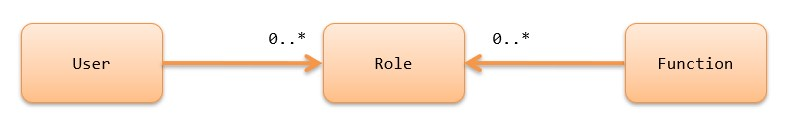
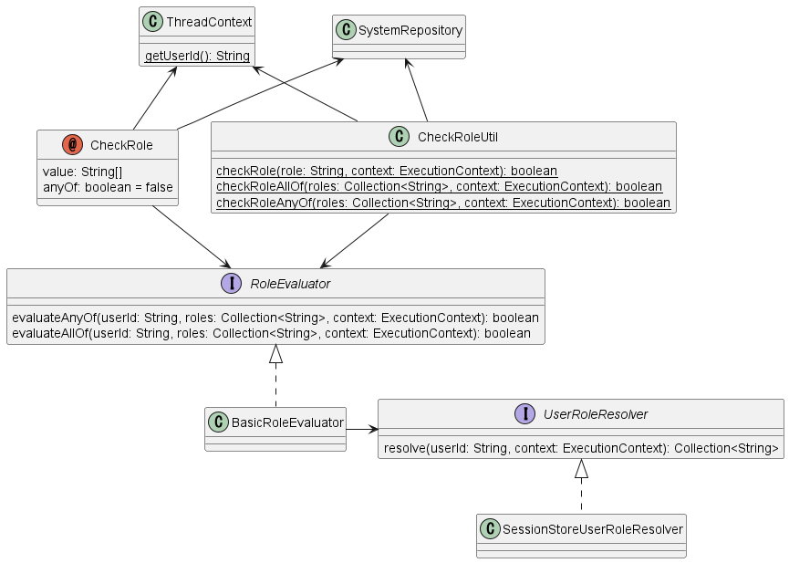

.. _`role_check`:

Permission Check by annotation
=====================================================================

.. contents:: Table of contents
  :depth: 3
  :local:

This function, like :doc:`permission_check`, performs permission checks on the functions provided by the application.

Function overview
---------------------------------------------------------------------

Permission checks can be performed without complicated data management
~~~~~~~~~~~~~~~~~~~~~~~~~~~~~~~~~~~~~~~~~~~~~~~~~~~~~~~~~~~~~~~~~~~~~~~~~~

Permission check by annotation assigns roles to users.
Also, for functions that you want to check for authorization, assign the roles necessary to perform them.
Then authorization is determined by whether the current user has the role assigned to the function to be performed.

Roles are basically assigned to functions by an annotation.
You can choose any method for assigning users and roles, because the framework does not specify any particular method.

Thus, the permission check by annotation can manage authorization with a simpler data structure than :doc:`permission_check`.

You can check the permission by the annotation
~~~~~~~~~~~~~~~~~~~~~~~~~~~~~~~~~~~~~~~~~~~~~~~~~~~~~~~~~~~~~~~~~~~~~

.. code-block:: java

  @CheckRole("ADMIN")
  public HttpResponse index(HttpRequest request, ExecutionContext context) {

In the permission check by annotation, roles can be assigned to methods of the action class using annotations.
The above example defines that the ``ADMIN`` role is required to execute the ``index`` method.

Difference from permission check by handler function
~~~~~~~~~~~~~~~~~~~~~~~~~~~~~~~~~~~~~~~~~~~~~~~~~~~~~~~~~~~~~~~~~~~~~

This section explains the criteria for using this permission check by annotation versus :doc:`permission_check`.

Permission check by annotation manages authorization in units of roles as described above.
And the mechanism for assigning roles and functions is through Java annotations.
Therefore, the use of this permission check by annotation is appropriate when the increase or decrease of roles themselves or changes in functions assigned to roles do not occur frequently.

For example, if the types of roles and combinations of functions that require authorization management have been determined and are not expected to change significantly in the future, this permission check by annotation can be used to easily perform permission checks.

On the other hand, in a system where users want to control permissions according to the department to which they belong, it is expected that the composition of departments and the combination of available functions will change significantly due to organizational changes. If this permission check by annotation is used in such a system, the annotations will need to be rewritten for each change, which will require a large amount of man-hours for modification.
In such a system, it is recommended that :doc:`permission_check` be used to manage the combination of authorizations with data.

Module list
---------------------------------------------------------------------

.. code-block:: xml

  <dependency>
    <groupId>com.nablarch.framework</groupId>
    <artifactId>nablarch-common-auth</artifactId>
  </dependency>
  <dependency>
    <groupId>com.nablarch.framework</groupId>
    <artifactId>nablarch-common-auth-session</artifactId>
  </dependency>
  <!-- When using the default configuration -->
  <dependency>
    <groupId>com.nablarch.configuration</groupId>
    <artifactId>nablarch-main-default-configuration</artifactId>
  </dependency>

How to use
---------------------------------------------------------------------

Advance preparation
~~~~~~~~~~~~~~~~~~~~~~~~~~~~~~~~~~~~~~~~~~~~~~~~~~~~~~~~~~~~~~~~~~~~~

Define components
*********************************************************************

.. code-block:: xml

  <component name="roleEvaluator"
             class="nablarch.common.authorization.role.BasicRoleEvaluator">
      <property name="userRoleResolver" ref="userRoleResolver" />
  </component>

  <component name="userRoleResolver"
             class="nablarch.common.authorization.role.session.SessionStoreUserRoleResolver" />

To use the permission check by annotation, first define the component of the :java:extdoc:`BasicRoleEvaluator <nablarch.common.authorization.role.BasicRoleEvaluator>`.
And set the :java:extdoc:`SessionStoreUserRoleResolver <nablarch.common.authorization.role.session.SessionStoreUserRoleResolver>`  to the ``userRoleResolver`` property.

Note that this setting is also provided as the default configuration.
When using the default configuration, the same settings can be made by importing the file as follows.

.. code-block:: xml

  <import file="nablarch/common/authorization/role/session/authorization-session.xml" />

Add to interceptorsOrder
*********************************************************************

Checking by annotation is realized using Nablarch's :java:extdoc:`interceptor <nablarch.fw.Interceptor>` mechanism.
Therefore, if you have already defined ``interceptorsOrder`` in your component definition, you need to add the :java:extdoc:`CheckRole <nablarch.common.authorization.role.CheckRole>`.

.. code-block:: xml

  <!-- The definition of execution order of interceptors. -->
  <list name="interceptorsOrder">
    <!-- Add the CheckRole -->
    <value>nablarch.common.authorization.role.CheckRole</value>
    <!-- Other interceptor descriptions are omitted. -->
  </list>

If ``interceptorsOrder`` is not defined, this step is not required.

Also, if the default configuration ``nablarch/webui/interceptors.xml`` is loaded, no special action is required.

Define the roles
*********************************************************************

.. code-block:: java

  public class Roles {
      /** The role of the system administrator. */
      public static final String ROLE_ADMIN = "ADMIN";
      /** The role of the project manager. */
      public static final String ROLE_PROJECT_MANAGER = "PROJECT_MANAGER";
  }

Define the roles to be used in the annotation.

Roles are defined as any strings.
There are no restrictions on character type or format as long as the system can handle it, but it is recommended that the value be easy to understand what the role is for ease of management.

Although it is also possible to directly specify string literals instead of constants when specifying with annotations, it is recommended that they be managed as constants to facilitate modification.
In the above example, a dedicated constant class is provided, but if a more appropriate class is available, it may be modified to suit the project's circumstances.

Save the user's roles
*********************************************************************

The permission check by annotation provides by default an implementation that stores the roles assigned to users in the session store.
By resolving the role assigned to the user and storing it in the session store at login, subsequent permission checks can be performed using the role information stored in the session store.

Below is an example implementation that stores roles in the session store upon login.

.. code-block:: java

  List<String> userRoles = resolveUserRoles(loginId);
  SessionStoreUserRoleUtil.save(userRoles, executionContext);

In this example, the list of roles assigned to the user is resolved based on the login ID, which is then stored in the session store using the ``save`` method of :java:extdoc:`SessionStoreUserRoleUtil <nablarch.common.authorization.role.session.SessionStoreUserRoleUtil>`.

.. tip::
  The framework does not specify how the ``resolveUserRoles`` method resolves roles from the user.
  Therefore, the implementation that resolves the roles will be built to suit the circumstances of each project.
  
  In many cases, it is expected to be resolved from the database.
  For example, in a system where the only role is "administrator," the solution could be to look at the value of the "administrator flag" in the table that manages user information.
  In a system that assigns several roles to a user, it is possible to resolve the user's role by searching a table that associates users with roles.

Assign roles to methods of actions with annotations
~~~~~~~~~~~~~~~~~~~~~~~~~~~~~~~~~~~~~~~~~~~~~~~~~~~~~~~~~~~~~~~~~~~~~

.. code-block:: java

  @CheckRole(Roles.ROLE_ADMIN)
  public HttpResponse index(HttpRequest request, ExecutionContext context) {

You can assign roles to an action method by the ``value`` of :java:extdoc:`CheckRole <nablarch.common.authorization.role.CheckRole>` annotation.
In the above example, the ``ADMIN`` role is assigned to the ``index`` method.
This allows the ``index`` method to be executed only by users with the ``ADMIN`` role.
If a user without the ``ADMIN`` role tries to execute a method, :java:extdoc:`Forbidden <nablarch.fw.results.Forbidden>` is thrown.

If you want assign multiple roles, you can specify by an array.
An example implementation is shown below.

.. code-block:: java

  @CheckRole({Roles.ROLE_ADMIN, Roles.ROLE_PROJECT_MANAGER})
  public HttpResponse index(HttpRequest request, ExecutionContext context) {

In this case, the ``ADMIN`` and ``PROJECT_MANAGER`` roles must both be held (AND condition) in order to execute the ``index`` method.

Set ``anyOf`` to ``true`` if you want an OR condition.
An example implementation is shown below.

.. code-block:: java

  @CheckRole(
      value = {Roles.ROLE_ADMIN, Roles.ROLE_PROJECT_MANAGER},
      anyOf = true
  )
  public HttpResponse index(HttpRequest request, ExecutionContext context) {

In the above example, to execute the ``index`` method, a user need to have either the ``ADMIN`` or ``PROJECT_MANAGER`` role.

List CheckRole settings
~~~~~~~~~~~~~~~~~~~~~~~~~~~~~~~~~~~~~~~~~~~~~~~~~~~~~~~~~~~~~~~~~~~~~

To check for errors in :java:extdoc:`CheckRole <nablarch.common.authorization.role.CheckRole>` annotations set for action methods, this function is provided to list the annotation setting status.
By using this function, it will be possible to check whether there are any omissions in the annotation settings and whether the set contents are excessive or insufficient.

This function is achieved by collecting annotation setting information at system startup and outputting them to the log at the debug level.
The configuration method is described below.

First, define the :java:extdoc:`CheckRoleLogger <nablarch.common.authorization.role.CheckRoleLogger>` component as follows.

.. code-block:: xml

  <!-- Components that need to be initialized -->
  <component name="initializer"
             class="nablarch.core.repository.initialization.BasicApplicationInitializer">
    <property name="initializeList">
      <list>
        <!-- Omit other components that require initialization. -->

        <component class="nablarch.common.authorization.role.CheckRoleLogger">
          <property name="targetPackage" value="com.nablarch.example.app.web.action" />
        </component>
      </list>
    </property>
  </component>

:java:extdoc:`CheckRoleLogger <nablarch.common.authorization.role.CheckRoleLogger>` is set in the ``initializeList`` of the :java:extdoc:`BasicApplicationInitializer <nablarch.core.repository.initialization.BasicApplicationInitializer>` as the component that needs to be initialized.
Also, at this time, specify the package in which action classes exist in the ``targetPackage`` property (including subpackages).

By default, classes with names ending in ``Action`` are processed.
This setting can be changed by specifying any regular expression for the ``targetClassPattern`` property.
See :java:extdoc:`CheckRoleLogger <nablarch.common.authorization.role.CheckRoleLogger>`'s Javadoc for details.

After completing the above settings, start the system with the log level set to debug level.
This will result in the following log output at system startup.

.. code-block:: text

  2023-01-11 14:29:31.643 -DEBUG- nablarch.common.authorization.role.CheckRoleLogger [null] boot_proc = [] proc_sys = [nablarch-example-web] req_id = [null] usr_id = [null] CheckRole Annotation Settings
  class	signature	role	anyOf
  com.nablarch.example.app.web.action.AuthenticationAction	index(nablarch.fw.web.HttpRequest, nablarch.fw.ExecutionContext)		
  (omission)
  com.nablarch.example.app.web.action.ProjectBulkAction	update(nablarch.fw.web.HttpRequest, nablarch.fw.ExecutionContext)		
  com.nablarch.example.app.web.action.ProjectUploadAction	index(nablarch.fw.web.HttpRequest, nablarch.fw.ExecutionContext)	ADMIN	true
  com.nablarch.example.app.web.action.ProjectUploadAction	index(nablarch.fw.web.HttpRequest, nablarch.fw.ExecutionContext)	PROJECT_MANAGER	true

The following elements are output in the log, separated by tabs.

.. list-table:: log output element
   :widths: 1, 5, 10
   :header-rows: 1
   :stub-columns: 0

   * - Element
     - Description
     - Output example
   * - ``class``
     - Fully qualified name of the class.
     - ``com.nablarch.example.app.web.action.ProjectUploadAction``
   * - ``signature``
     - Method signature
     - ``upload(nablarch.fw.web.HttpRequest, nablarch.fw.ExecutionContext)``
   * - ``role``
     - Role assigned (empty if not annotated).
     - ``ADMIN``
   * - ``anyOf``
     - The value set to ``anyOf`` in ``@CheckRole`` (empty if not annotated).
     - ``false``

If multiple roles are assigned, each role is output on a separate line.
For example, in the above output example, we see that the ``index`` method of ``ProjectUploadAction`` is assigned two roles, ``ADMIN`` and ``PROJECT_MANAGER``.
When replaced by an implementation, this would be set up as follows.

.. code-block:: java

  @CheckRole(
      value = {Roles.ROLE_ADMIN, Roles.ROLE_PROJECT_MANAGER},
      anyOf = true
  )
  public HttpResponse index(HttpRequest request, ExecutionContext context) {

Programmatic check
~~~~~~~~~~~~~~~~~~~~~~~~~~~~~~~~~~~~~~~~~~~~~~~~~~~~~~~~~~~~~~~~~~~~~

The presence or absence of a role can be checked anywhere in the program.

.. code-block:: java

  if (CheckRoleUtil.checkRole(Roles.ROLE_ADMIN, executionContext)) {
      // Processing when user has the ADMIN role
  }

To programmatic check the presence or absence of a role, use :java:extdoc:`CheckRoleUtil <nablarch.common.authorization.role.CheckRoleUtil>`.
In the above example, the ``checkRole`` method is used to check if the current user has the ``ADMIN`` role.

Multiple roles can be checked using the ``checkRoleAllOf`` or ``checkRoleAnyOf`` methods.

Check in JSP
~~~~~~~~~~~~~~~~~~~~~~~~~~~~~~~~~~~~~~~~~~~~~~~~~~~~~~~~~~~~~~~~~~~~~

:doc:`permission_check` provides a mechanism for JSP custom tags to perform permision checks and automatically show or hide buttons.
However, this permission check by annotation does not provide such a mechanism.

Therefore, this section describes how to control the display of tags in JSP by role after adopting this permission check by annotation.

The control of display by role is achieved by storing the results of the check on the server side in a session store or other location.
An example implementation is shown below.

.. code-block:: java

  UserContext userContext = new UserContext();
  userContext.setAdmin(CheckRoleUtil.checkRole(Roles.ROLE_ADMIN, executionContext));
  userContext.setProjectManager(CheckRoleUtil.checkRole(Roles.ROLE_PROJECT_MANAGER, executionContext));

  SessionUtil.put(executionContext, "userContext", userContext);

In this example, the result of check the user's role at login is stored in the ``UserContext`` class and stored in the session store (``UserContext`` is just Java Beans, created as needed for each project).
This will allow you to use EL expressions and JSTL in JSP to control the display as follows

.. code-block:: jsp

  <c:if test="${userContext.admin}">
    <%-- Show when a user has the ADMIN role --%>
  </c:if>
  <c:if test="${userContext.projectManager}">
    <%-- Show when a user has the PROJECT_MANAGER role  --%>
  </c:if>

Architecture
---------------------------------------------------------------------

This section explains how the permission check by annotation works.

The execution of the check process using annotations is realized using Nablarch's :java:extdoc:`interceptor <nablarch.fw.Interceptor>` mechanism.
The :java:extdoc:`CheckRole <nablarch.common.authorization.role.CheckRole>` annotation is an implementation of this interceptor.

:java:extdoc:`CheckRole <nablarch.common.authorization.role.CheckRole>` and :java:extdoc:`CheckRoleUtil <nablarch.common.authorization.role.CheckRoleUtil>` themselves do not perform permission checks directly, but delegate the process to the :java:extdoc:`RoleEvaluator <nablarch.common.authorization.role.RoleEvaluator>`.
The instace of the :java:extdoc:`RoleEvaluator <nablarch.common.authorization.role.RoleEvaluator>` is obtained from the :java:extdoc:`SystemRepository <nablarch.core.repository.SystemRepository>` by name ``roleEvaluator``
The user ID to be passed to the check process is obtained from the ``getUserId`` method of the :java:extdoc:`ThreadContext <nablarch.core.ThreadContext>`.

As the default implementation class of :java:extdoc:`RoleEvaluator <nablarch.common.authorization.role.RoleEvaluator>`, the permission check by annotation provides a class called :java:extdoc:`BasicRoleEvaluator <nablarch.common.authorization.role.BasicRoleEvaluator>`.
This class is simple enough to compare the roles associated with a user with the roles passed as an argument and check if the condition is met.
And, that the resolution of roles associated with a user is delegated to :java:extdoc:`UserRoleResolver <nablarch.common.authorization.role.UserRoleResolver>`.

The :java:extdoc:`SessionStoreUserRoleResolver <nablarch.common.authorization.role.session.SessionStoreUserRoleResolver>` is provided as the default implementation of :java:extdoc:`UserRoleResolver <nablarch.common.authorization.role.UserRoleResolver>`.
This class resolves the user's roles with information stored in the session store.

Extension method
---------------------------------------------------------------------

From the foregoing description of the mechanism, it can be seen that you can extend to any processing by replacing the :java:extdoc:`RoleEvaluator <nablarch.common.authorization.role.RoleEvaluator>` or :java:extdoc:`UserRoleResolver <nablarch.common.authorization.role.UserRoleResolver>` entity.

Replacing the :java:extdoc:`RoleEvaluator <nablarch.common.authorization.role.RoleEvaluator>` entity can be accomplished by creating your own class that implements the :java:extdoc:`RoleEvaluator <nablarch.common.authorization.role.RoleEvaluator>` and registering that class as a component under the name ``roleEvaluator``.

.. code-block:: xml

  <component name="roleEvaluator" class="com.example.CustomRoleEvaluator" />

If you want to use :java:extdoc:`BasicRoleEvaluator <nablarch.common.authorization.role.BasicRoleEvaluator>` for the :java:extdoc:`RoleEvaluator <nablarch.common.authorization.role.RoleEvaluator>` entity and replace only the :java:extdoc:`UserRoleResolver <nablarch.common.authorization.role.UserRoleResolver>` entity, simply replace the component that is set to the ``userRoleResolver`` property of :java:extdoc:`BasicRoleEvaluator <nablarch.common.authorization.role.BasicRoleEvaluator>`.
If you are using the default configuration, it is defined to set a component named ``userRoleResolver``, which can be replaced by defining a component of your own class with the same name.

.. code-block:: xml

  <component name="userRoleResolver" class="com.example.CustomUserRoleResolver" />
