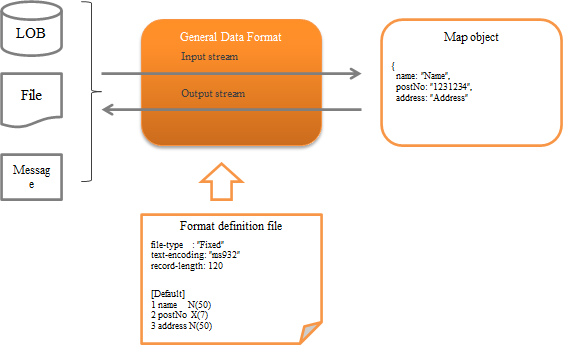

.. _data_format:

General Data Format
==================================================

.. contents:: Table of contents
  :depth: 3
  :local:

Provides a general-purpose input/output library function that supports various data formats handled by the system.

The general configuration of this function is as follows.

Function overview
--------------------------------------------------

.. _data_format-support_type:

Several formats are supported as standard
~~~~~~~~~~~~~~~~~~~~~~~~~~~~~~~~~~~~~~~~~~~~~~~~~~
The following formats are supported as standard.

The fixed-length and variable-length data formats are compatible even with multi-layout data having a different layout for each record. (XML and JSON do not have the concept of a record.)

* fixed-length
* Variable length (csv, tsv, etc.)
* JSON
* XML

.. important::

  The following are the disadvantages of this function.

  * A complex :ref:`Format definition file <data_format-format_definition_file>` needs to be created.
  * Implementation errors are likely to occur with input/output being limited to :java:extdoc:`Map <java.util.Map>` .

    * The field name is required to be specified as a string, and errors during implementation are likely to occur as IDE support cannot be used.
    * It is necessary to downcast the value fetched from Map on the application side. (If a mistake is made, an exception is thrown during runtime.)

  * Since :java:extdoc:`BeanUtil <nablarch.core.beans.BeanUtil>` is not used for mapping the data and Java object, the mapping method is different from other functions.
  * Method of handling the output target of :java:extdoc:`Map <java.util.Map>` depends on the format. For this reason, if the function is used to make the same data correspond to multiple formats, normal operation may not be performed such as an exception thrown depending on the format.
    
    For example, some problem cases are given below.
    
    When null is specified for required items in XML and JSON:
      * XML: Value is output as an empty character
      * JSON: Throws a required exception
  
  * Depending on the output target data, JSON specifications may not be satisfied.
  
    For example, if :java:extdoc:`numeric type <nablarch.core.dataformat.convertor.datatype.JsonNumber>` and :java:extdoc:`boolean type <nablarch.core.dataformat.convertor.datatype.JsonBoolean>` is used and the output target data type does not correspond to these types, then an invalid JSON is output.
    
    Example: When a numeric format is specified and the output target "data" is a string, invalid JSON such as {"number": data} is output.
  
  * It is difficult to extend because the implementation class of :java:extdoc:`data type <nablarch.core.dataformat.convertor.datatype.DataType>` that can be used depends on the data format. Also, errors in this configuration cannot be detected until run time.
  
  Therefore, as a principle, this function is deprecated except when it is inevitable. Since :ref:`messaging` uses this function internally, the use of alternative functions is not possible.

  Alternative to this function
    :fixed-length: Use :ref:`data_bind` .
    :Variable length: Use  :ref:`data_bind` .
    :XML: :java:extdoc:`JAXB <javax.xml.bind>` is recommended.
    :JSON: Use of OSS is recommended. For example, `Jackson (external site) <https://github.com/FasterXML/jackson>`_ is widely used.

Supports various character sets, character types and data formats
~~~~~~~~~~~~~~~~~~~~~~~~~~~~~~~~~~~~~~~~~~~~~~~~~~~~~~~~~~~~~~~~~
It supports not only string and decimal number formats, but also packed decimal and zoned decimal that are often handled by hosts. In addition to character sets such as UTF-8 and Shift_JIS, EBCDIC are also supported.

.. tip::
  
  Character set supported by the JVM of the execution environment can be used.

.. _data_format-value_convertor:

Supports conversion processes such as padding and trimming
~~~~~~~~~~~~~~~~~~~~~~~~~~~~~~~~~~~~~~~~~~~~~~~~~~~~~~~~~~
Spaces, zero (0) padding and trimming that are often used in fixed-length files are supported. Therefore, there is no need for the application to perform padding or trimming.

For more information on padding and trimming, see :ref:`data_format-field_convertor_list` .

Module list
---------------------------------------------------------------------
* To use :ref:`upload helper <data_format-upload_helper>` , add ``nablarch-fw-web-extension`` .
* To use :ref:`file download <data_format-file_download>` , add ``nablarch-fw-web-extension`` .

.. code-block:: xml

  <!-- General data format -->
  <dependency>
    <groupId>com.nablarch.framework</groupId>
    <artifactId>nablarch-core-dataformat</artifactId>
  </dependency>

  <!--
  Add the following when using the upload helper and download
   -->
  <dependency>
    <groupId>com.nablarch.framework</groupId>
    <artifactId>nablarch-fw-web-extension</artifactId>
  </dependency>

How to use
--------------------------------------------------

.. _data_format-format_definition_file:

Define the format of input/output data
~~~~~~~~~~~~~~~~~~~~~~~~~~~~~~~~~~~~~~~~~~~~~~~~~~
The format of input/output data is defined in the format definition file.

The format definition file is created in a text file format as below. For detailed specifications, see :doc:`data_format/format_definition` .

.. code-block:: bash

  file-type:        "Variable" # Variable length
  text-encoding:    "MS932"    # Character encoding of the string type field
  record-separator: "\r\n"     # Carriage return and Line feed (crlf)
  field-separator:  ","        # csv

  # Define record identification field
  [Classifier]
  1 dataKbn X     # First field
  3 type    X     # Third field

  [parentData]
  dataKbn = "1"
  type    = "01"
  1 dataKbn X
  2 ?filler X
  3 type    X
  4 data    X

  [childData]
  dataKbn = "1"
  type    = "02"
  1 dataKbn X
  2 ?filler X
  3 type    X
  4 data    X
  

.. toctree::
  :hidden:

  data_format/format_definition

Output data to file
~~~~~~~~~~~~~~~~~~~~~~~~~~~~~~~~~~~~~~~~~~~~~~~~~~
This section describes how to output the data record contents to a file.

Data output to a file can be realized by using :java:extdoc:`FileRecordWriterHolder <nablarch.common.io.FileRecordWriterHolder>` .

An implementation example is shown below.

Point
  * Prepare data to be written to the file as :java:extdoc:`Map <java.util.Map>` .
  * The key value of :java:extdoc:`Map <java.util.Map>` is configured as the field name defined in :ref:`data_format-format_definition_file` . (It is not case-sensitive)
  * Call the `open` method of :java:extdoc:`FileRecordWriterHolder <nablarch.common.io.FileRecordWriterHolder>` and make the file source writable.
  * Call the write method of :java:extdoc:`FileRecordWriterHolder <nablarch.common.io.FileRecordWriterHolder>` and `write` the data to the file.

.. code-block:: java

  // Data to be written
  Map<String, Object> user = new HashMap<>();
  user.put("name", "Name");
  user.put("age", 20);

  // Open the file to be written
  FileRecordWriterHolder.open("users.csv", "user_csv_format");

  // Write the data
  FileRecordWriterHolder.write(user, "user.csv");

.. tip::

  To use :java:extdoc:`FileRecordWriterHolder <nablarch.common.io.FileRecordWriterHolder>` , it is necessary to configure the deployment directory of the format definition file :ref:`Format definition file <data_format-format_definition_file>` , output destination directory, etc. to :ref:`file_path_management` .

  For the necessary directory configuration, see :java:extdoc:`FileRecordWriterHolder <nablarch.common.io.FileRecordWriterHolder>` .

.. important::

  The file resource opened by :java:extdoc:`FileRecordWriterHolder <nablarch.common.io.FileRecordWriterHolder>` is automatically released by :ref:`file_record_writer_dispose_handler` . Therefore, when using :java:extdoc:`FileRecordWriterHolder <nablarch.common.io.FileRecordWriterHolder>` , it is necessary to configure :ref:`file_record_writer_dispose_handler` to the handler queue.

.. important::
  If an invalid value is configured in the output data, it may not be processed correctly, therefore check in advance for invalid values in the application.

.. important::

  The default behavior is to write to the file for each record.
  When outputting a large amount of data, writing each record to a file may not meet the performance requirements.
  In such a case, the default behavior should be changed to write in the specified buffer size instead of per record.

  By adding the following component definition, it can be made to write in the specified buffer size instead of each record.

  .. code-block:: xml

    <!-- The component name should be dataFormatConfig. -->
    <component name="dataFormatConfig" class="nablarch.core.dataformat.DataFormatConfig">
      <property name="flushEachRecordInWriting" value="false" />
    </component>

  The buffer size used for output can be specified with the `open` method of :java:extdoc:`FileRecordWriterHolder <nablarch.common.io.FileRecordWriterHolder>`.

.. _data_format-file_download:
  
Used for file download
~~~~~~~~~~~~~~~~~~~~~~~~~~~~~~~~~~~~~~~~~~~~~~~~~~
This section describes how to respond to the client with the data record contents in file download format.

Response of file download format can be realized by using :java:extdoc:`DataRecordResponse <nablarch.common.web.download.DataRecordResponse>` .

An implementation example is shown below.

Point
  * When generating :java:extdoc:`DataRecordResponse <nablarch.common.web.download.DataRecordResponse>` , specify the logical path name where the format definition file is stored and the format definition file name.
  * Use :java:extdoc:`DataRecordResponse#write <nablarch.common.web.download.DataRecordResponse.write(java.util.Map)>` to output the data. (When downloading multiple records, output is repeated)
  * Configure `Content-Type` and `Content-Disposition` .
  * Returns :java:extdoc:`DataRecordResponse <nablarch.common.web.download.DataRecordResponse>` from the business action.

.. code-block:: java

  public HttpResponse download(HttpRequest request, ExecutionContext context) {

    // Business process

    // Create Map that stores the download data.
    Map<String, Object> user = new hashMap<>()
    user.put("name", "Name");
    user.put("age", 30);

    // Generate DataRecordResponse by specifying the logical path name where the
    // format definition file is stored and name of the format definition file.
    DataRecordResponse response = new DataRecordResponse("format", "users_csv");

    // Output downloaded data.
    response.write(user);

    // Configure Content-Type header and Content-Disposition header
    response.setContentType("text/csv; charset=Shift_JIS");
    response.setContentDisposition("Message list.csv");

    return response;
  }
  

.. tip::
  The storage path of the format definition file should be configured in :ref:`file_path_management` .

.. _data_format-load_upload_file:

Read the upload file
~~~~~~~~~~~~~~~~~~~~~~~~~~~~~~~~~~~~~~~~~~~~~~~~~~
This section describes how to read the upload file.

Upload files can be read by the following two methods with this function. As described in :ref:`reading using upload helper <data_format-upload_helper>` , reading using only :ref:`the general data format (this function) <data_format-native_upload_file_load>` is recommended.

* :ref:`Reading using only the general data format (this function) <data_format-native_upload_file_load>`
* :ref:`Reading using upload helper <data_format-upload_helper>`

.. _data_format-native_upload_file_load:

Reading of upload file using only the general data format (this function)
  This section explains the loading process of upload file using the API of this function without using the upload helper that is described later.

  An implementation example is shown below.

  Point
    * The upload file is acquired by calling :java:extdoc:`HttpRequest#getPart <nablarch.fw.web.HttpRequest.getPart(java.lang.String)>` .
    * The parameter name is specified in the argument of :java:extdoc:`HttpRequest#getPart <nablarch.fw.web.HttpRequest.getPart(java.lang.String)>` .
    * The object :java:extdoc:`File <java.io.File>` of the format definition file is obtained from :java:extdoc:`FilePathSetting <nablarch.core.util.FilePathSetting>` .
    * Create :java:extdoc:`DataRecordFormatter <nablarch.core.dataformat.DataRecordFormatter>` from :java:extdoc:`FormatterFactory <nablarch.core.dataformat.FormatterFactory>` by specifying the format definition file.
    * Configure :java:extdoc:`InputStream <java.io.InputStream>` in :java:extdoc:`DataRecordFormatter <nablarch.core.dataformat.DataRecordFormatter>` to read the upload file. Implementation class of :java:extdoc:`InputStream <java.io.InputStream>` that is configured must be supported by :java:extdoc:`mark <java.io.InputStream.mark(int)>`/:java:extdoc:`reset <java.io.InputStream.reset()>`.
    * Call the API of :java:extdoc:`DataRecordFormatter <nablarch.core.dataformat.DataRecordFormatter>` and read the record of the upload file.

  .. code-block:: java

    public HttpResponse upload(HttpRequest req, ExecutionContext ctx) {

      // Get information of the upload file
      final List<PartInfo> partInfoList = request.getPart("users");

      // Get file object of the format definition file
      final File format = FilePathSetting.getInstance()
                                         .getFile("format", "users-layout");

      // Get format definition file and generate the formatter to read the upload file.
      try (final DataRecordFormatter formatter = FormatterFactory.getInstance()
                                                                 .createFormatter(format)) {

        // Configure InputStream to read the upload file in formatter and initialize.
        // Wrapped in BufferedInputStream as mark/reset is required to be supported.
        formatter.setInputStream(new BufferedInputStream(partInfoList.get(0).getInputStream()))
                 .initialize();

        // Repeat the process until there are no more records.
        while (formatter.hasNext()) {
          // Read the records.
          final DataRecord record = formatter.readRecord();

          // Process the records
          final Users users = BeanUtil.createAndCopy(Users.class, record);

          // Rest is omitted
        }
      } catch (IOException e) {
        throw new RuntimeException(e);
      }
    }

.. _data_format-upload_helper:

Loading an upload file using the upload helper
  If an upload helper ( :java:extdoc:`UploadHelper <nablarch.fw.web.upload.util.UploadHelper>` ) is used, reading of files, validation and saving files to a database can be executed easily.

  However, since this function has the following restrictions (disadvantages), use of :ref:`Reading of upload file using only the general data format (this function) <data_format-native_upload_file_load>` is recommended.

  * The check of input values is limited to :ref:`nablarch_validation` . ( :ref:`bean_validation` , which is recommended cannot be used.)
  * Although expansion is possible, the degree of difficulty is high and cannot be easily implemented to meet the requirements.

  Below is an example of checking the input and registration to the database for a single layout upload file.

  Point
    * The upload file is acquired by calling :java:extdoc:`HttpRequest#getPart <nablarch.fw.web.HttpRequest.getPart(java.lang.String)>` .
    * The parameter name is specified in the argument of :java:extdoc:`HttpRequest#getPart <nablarch.fw.web.HttpRequest.getPart(java.lang.String)>` .
    * Generate :java:extdoc:`UploadHelper <nablarch.fw.web.upload.util.UploadHelper>` based on the upload file acquired.
    * Configure the format definition file using :java:extdoc:`UploadHelper#applyFormat <nablarch.fw.web.upload.util.UploadHelper.applyFormat(java.lang.String)>` .

    * Configure the message ID for validation error using :java:extdoc:`setUpMessageIdOnError <nablarch.fw.web.upload.util.BulkValidator.setUpMessageIdOnError(java.lang.String-java.lang.String-java.lang.String)>` .
    * Configure the Java Beans class that executes validation and the validation method using :java:extdoc:`validateWith <nablarch.fw.web.upload.util.BulkValidator.ErrorHandlingBulkValidator.validateWith(java.lang.Class-java.lang.String)>` .
    * Register the validated Javabeans object in DB using :java:extdoc:`importWith <nablarch.fw.web.upload.util.BulkValidationResult.importWith(nablarch.core.db.support.DbAccessSupport-java.lang.String)>` .

  .. code-block:: java

    public HttpResponse upload(HttpRequest req, ExecutionContext ctx) {

      PartInfo partInfo = req.getPart("fileToSave").get(0);

      // Register all records at once
      UploadHelper helper = new UploadHelper(partInfo);
      int cnt = helper
          .applyFormat("N11AC002")                     // Apply the format
          .setUpMessageIdOnError("format.error",       // Specify the message ID for format error
                                 "validation.error",   // Specify the message ID for validation error
                                 "file.empty.error")   // Specify the message ID when the file is empty
          .validateWith(UserInfoTempEntity.class,      // Specify the validation method
                        "validateRegister")
          .importWith(this, "INSERT_SQL");             //  Specify the SQL ID of INSERT statement

    }

  .. tip::

    Also see the documentation of the classes in the :java:extdoc:`nablarch.fw.web.upload.util` package.

.. _data_format-structured_data:

Read and write the data of JSON and XML hierarchical structure
~~~~~~~~~~~~~~~~~~~~~~~~~~~~~~~~~~~~~~~~~~~~~~~~~~~~~~~~~~~~~~
This section describes the Map structure when reading/writing the hierarchical structure data of JSON and XML.

When hierarchical data such as JSON or XML is read, the key value of Map is the value of the element name of each hierarchy that is enclosed by dots ( ``.`` ).

An example is shown below.

Format definition file
  In the case of JSON, replace the `file-type` with ``JSON`` . For the method of defining the format definition file that represents the hierarchical structure, refer to the :ref:`definition of hierarchical structure <data_format-nest_object>` .

  .. code-block:: bash

    file-type:        "XML"
    text-encoding:    "UTF-8"

    [users]              # Root element
    1 user    [0..*] OB

    [user]               # Nested element
    1 name    [0..1] N   # Bottom layer element
    2 age     [0..1] X9
    3 address [0..1] N

  .. important::

    The parent element is arbitrary, it does not support the configuration of the child element being required only if parent element exists. Therefore, when defining hierarchical structure data in the format definition file, it is recommended to define all items as optional.

Map structure
  The structure of map that outputs data to XML and JSON using the above format definition file is as follows.

  Point
    * In the case of hierarchical structure, configure the value in Map with the " `parent element name` + ``.`` + `child element name` " format.
    * In the case of deep hierarchical structure, element names are further concatenated with ``.`` .
    * The top-level element names are not required to be included in the key
    * For array elements, configure the subscript (starting from 0).

  .. code-block:: java

    Map<String, Object> data = new HashMap<String, Object>();

    // First element of the user array element
    data.put("user[0].name", "Name1");
    data.put("user[0].address", "Mailing address1");
    data.put("user[0].age", 30);

    // Second element of the user array element
    data.put("user[1].name", "Name2");
    data.put("user[1].address", "Mailing address2");
    data.put("user[1].age", 31);

XML and JSON structure
  The structure of XML and JSON corresponding to the above format definition file is as given below.

  XML
    .. code-block:: xml

      <?xml version="1.0" encoding="UTF-8"?>
      <users>
        <user>
          <name>Name1</name>
          <address>Mailing address1</address>
          <age>30</age>
        </user>
        <user>
          <name>Name2</name>
          <address>Mailing address2</address>
          <age>31</age>
        </user>
      </users>    

  JSON
    .. code-block:: json

      {
        "user": [
          {
            "name": "Name1",
            "address": "Mailing address1",
            "age": 30
          },
          {
            "name": "Name2",
            "address": "Mailing address2",
            "age": 31
          }
        ]
      }

~~~~~~~~~~~~~~~~~~~~~~~~~~~~~~~~~~~~~~~~~~~~~~~~~~
Use DTD with XML
~~~~~~~~~~~~~~~~~~~~~~~~~~~~~~~~~~~~~~~~~~~~~~~~~~
.. important::

  When XML is input with this function, DTD cannot be used by default. Exceptions occur when trying to read XML that has used DTD. This is a measure to prevent `XML external entity reference (XXE) <https://owasp.org/www-community/vulnerabilities/XML_External_Entity_(XXE)_Processing>`_ .

If the target XML to be read is reliable, use of DTD can be allowed using the ``allowDTD`` property of :java:extdoc:`XmlDataParser<nablarch.core.dataformat.XmlDataParser>` . How to use is given below.

Configure by explicitly mentioning the name ``XmlDataParser`` in the configuration of the component configuration file and permit the use of DTD.

.. code-block:: xml

  <?xml version="1.0" encoding="UTF-8"?>
    <component-configuration
        xmlns="http://tis.co.jp/nablarch/component-configuration"
        xmlns:xsi="http://www.w3.org/2001/XMLSchema-instance"
        xsi:schemaLocation="http://tis.co.jp/nablarch/component-configuration component-configuration.xsd">

      <component name="XmlDataParser" class="nablarch.core.dataformat.XmlDataParser">
        <!--
            Allow the use of DTD.
            As there is risk of XXE attacks, only reliable XML must be used.
         -->
        <property name="allowDTD" value="true" />
      </component>
    </component-configuration>

.. tip::

  The API of the below versions of JDK has a bug, and a ``NullPointerException`` occurs when this function is used. To avoid this bug, update the version of JDK.
  
  - JDK6 6u65 or below
  - JDK7 7u6 b15 or below

  For details of the failure, see `JDK-7157610 : NullPointerException occurs when parsing XML doc <https://bugs.java.com/bugdatabase/view_bug.do?bug_id=7157610>`_ .

Using namespaces in XML
~~~~~~~~~~~~~~~~~~~~~~~~~~~~~~~~~~~~~~~~~~~~~~~~~~
Namespaces may have to be used for the connection requirements with the connection destination system. Such cases are managed by defining the namespace in the format definition file.

An example is shown below.

Point
  * A namespace is defined as " `?@Xmlns:` + namespace" in the element using the namespace. ``X`` is the type and the URI is specified in the field converter section.
  * A namespace is expressed in the format of "namespace + ``:`` + element name".
  * The key value of Map of input/output target data is "namespace + element name (first letter uppercase)".

Format definition file
  .. code-block:: bash

    file-type:        "XML"
    text-encoding:    "UTF-8"

    [testns:data]
    # Namespace definition
    1 ?@xmlns:testns X "http://testns.hoge.jp/apply"
    2 testns:key1 X

XML data
  The XML corresponding to the above format definition file is as given below.

  .. code-block:: xml

    <?xml version="1.0" encoding="UTF-8"?>
    <testns:data xmlns:testns="http://testns.hoge.jp/apply">
      <testns:key1>value1</testns:key1>
    </testns:data>

Map data
  The map structure for input and output is as follows.

  .. code-block:: java

    Map<String, Object> data = new HashMap<String, Object>();
    data.put("testnsKey1", "value1");

Define the content for an element with XML attributes
~~~~~~~~~~~~~~~~~~~~~~~~~~~~~~~~~~~~~~~~~~~~~~~~~~~~~
Define the content of an element with attributes in XML by defining the fields that represent the content in the format definition file.

The configuration example shown below.

Point
  * Specify ``body`` in the field name that represents the content. To change the default field name that represents the context, see :ref:`data_format-xml_content_name_change`

Format definition file
  .. code-block:: bash

    file-type:        "XML"
    text-encoding:    "UTF-8"

    [parent]
    1 child   OB

    [child]
    1 @attr   X
    2 body    X

XML data
  The XML corresponding to the above format definition file is as given below.

  .. code-block:: xml

    <?xml version="1.0" encoding="UTF-8"?>
    <parent>
      <child attr="value1">value2</child>
    </parent>

Map data
  The map structure for input and output is as follows.

  .. code-block:: java

    Map<String, Object> data = new HashMap<String, Object>();
    data.put("child.attr", "value1");
    data.put("child.body", "value2");

.. _data_format-replacement:

Replace (collate) the characters
~~~~~~~~~~~~~~~~~~~~~~~~~~~~~~~~~~~~~~~~~~~~~~~~~~
The collate function is used to replace with any character available in the system when reading external data.

The usage method is shown below.

Create a property to define the replacement rules.
  In the properties file, define the replacement rule in the "Character before replacement = Character after replacement" format.

  Only one character can be defined as the value for the character before and after replacement. Also, surrogate pairs are not supported.

  For description rules on comments, see :java:extdoc:`java.util.Properties` .

  .. code-block:: properties

    髙=高
    﨑=崎
    唖=■

  .. tip::
    To define the replacement rules for each connection destination, create multiple properties files.

Add the replacement rule configuration to the component configuration file
  Point
    * Configure :java:extdoc:`CharacterReplacementManager <nablarch.core.dataformat.CharacterReplacementManager>` with component name ``characterReplacementManager`` .
    * Configure :java:extdoc:`CharacterReplacementConfig <nablarch.core.dataformat.CharacterReplacementConfig>` in list format to the :java:extdoc:`configList <nablarch.core.dataformat.CharacterReplacementManager.setConfigList(java.util.List)>` property.
    * To define multiple properties files, configure different names for the :java:extdoc:`typeName <nablarch.core.dataformat.CharacterReplacementConfig.setTypeName(java.lang.String)>` property.

  .. code-block:: xml

    <component name="characterReplacementManager"
        class="nablarch.core.dataformat.CharacterReplacementManager">
      <property name="configList">
        <list>
          <!-- Collation rules for system A -->
          <component class="nablarch.core.dataformat.CharacterReplacementConfig">
            <property name="typeName" value="a_system"/>
            <property name="filePath" value="classpath:a-system.properties"/>
            <property name="encoding" value="UTF-8"/>
          </component>
          <!-- Collation rules for system B -->
          <component class="nablarch.core.dataformat.CharacterReplacementConfig">
            <property name="typeName" value="b_system"/>
            <property name="filePath" value="classpath:b-system.properties"/>
            <property name="encoding" value="UTF-8"/>
          </component>
        </list>
      </property>
    </component>

Configuration of initialization component
  Configure :java:extdoc:`CharacterReplacementManager <nablarch.core.dataformat.CharacterReplacementManager>` that have been configured above to the initialization list.

    .. code-block:: xml

      <component name="initializer"
          class="nablarch.core.repository.initialization.BasicApplicationInitializer">

        <property name="initializeList">
          <list>
            <!-- Omitted -->
            <component-ref name="characterReplacementManager" />
          </list>
        </property>
      </component>

Define which replacement rule to use in the format definition file
  To replace characters during input/output, use :ref:`replacement <data_format-replacement_convertor>` .

  For `replacement` arguments, configure the `typeName` of the replacement rules configured above.

  .. code-block:: bash
    
    # Apply the replacement rules for system A
    1 name N(100) replacement("a_system")

    # Apply the replacement rules for system B
    1 name N(100) replacement("b_system")

.. _data_format-formatter:

Format the display format of the output data
~~~~~~~~~~~~~~~~~~~~~~~~~~~~~~~~~~~~~~~~~~~~~~~~~~
When the data is output, display format of the data such as date and numbers can be formatted by using :ref:`format` .

For details, see :ref:`format` .

Expansion example
--------------------------------------------------

.. _data_format-field_type_add:

Add a field type
~~~~~~~~~~~~~~~~~~~~~~~~~~~~~~~~~~~~~~~~~~~~~~~~~~
In some cases, the requirements cannot be met with :ref:`standard data types provided by Nablarch <data_format-field_type_list>` . For example, cases where the padding character of string type is binary.

In such cases, the requirements are supported by defining project-specific field types.

The procedure is shown below.

#. Create the :java:extdoc:`DataType<nablarch.core.dataformat.convertor.datatype.DataType>` implementation class to handle field types.
#. Create a factory inheritance class according to the format to enable the field type that is added.
#. Configure the created factory class in the property of the configuration class according to the format.

The detailed procedure is as follows.

Add data type implementation corresponding to the field type
  Create a class that implements :java:extdoc:`DataType<nablarch.core.dataformat.convertor.datatype.DataType>` .

  .. tip::
    
    The standard field type implementation is placed under the :java:extdoc:`nablarch.core.dataformat.convertor.datatype` package. Referring to these classes when adding implementation is recommended.

Create factory inheritance class according to the format
  Create a factory inheritance class according to the format to enable the field type that is added.

  The factory class for each format is shown below

  .. list-table::
    :class: white-space-normal
    :header-rows: 1

    * - Format
      - Factory class name

    * - Fixed (fixed-length)
      - :java:extdoc:`FixedLengthConvertorFactory <nablarch.core.dataformat.convertor.FixedLengthConvertorFactory>`
    * - Variable (variable length)
      - :java:extdoc:`VariableLengthConvertorFactory <nablarch.core.dataformat.convertor.VariableLengthConvertorFactory>`
    * - JSON
      - :java:extdoc:`JsonDataConvertorFactory <nablarch.core.dataformat.convertor.JsonDataConvertorFactory>`
    * - XML
      - :java:extdoc:`XmlDataConvertorFactory <nablarch.core.dataformat.convertor.XmlDataConvertorFactory>`

  Implementation example for fixed (fixed-length) is shown below.

  .. code-block:: java

    public class CustomFixedLengthConvertorFactory extends FixedLengthConvertorFactory {
        @Override
        protected Map<String, Class<?>> getDefaultConvertorTable() {
            final Map<String, Class<?>> defaultConvertorTable = new CaseInsensitiveMap<Class<?>>(
                    new ConcurrentHashMap<String, Class<?>>(super.getDefaultConvertorTable()));
            defaultConvertorTable.put("custom", CustomType.class);
            return Collections.unmodifiableMap(defaultConvertorTable);
        }
    }

Configure in the property of the configuration class according to the format
  Configure the factory class created earlier in the property of the configuration class according to the format.

  The configuration classes and properties for each format are shown below.

  .. list-table::
    :class: white-space-normal
    :header-rows: 1

    * - Format
      - Configuration class name (component name)
      - Property name

    * - Fixed (fixed-length)
      - :java:extdoc:`FixedLengthConvertorSetting <nablarch.core.dataformat.convertor.FixedLengthConvertorSetting>`
        (fixedLengthConvertorSetting)
      - :java:extdoc:`fixedLengthConvertorFactory <nablarch.core.dataformat.convertor.FixedLengthConvertorSetting.setFixedLengthConvertorFactory(nablarch.core.dataformat.convertor.FixedLengthConvertorFactory)>`
    * - Variable (variable length)
      - :java:extdoc:`VariableLengthConvertorSetting <nablarch.core.dataformat.convertor.VariableLengthConvertorSetting>`
        (variableLengthConvertorSetting)
      - :java:extdoc:`variableLengthConvertorFactory <nablarch.core.dataformat.convertor.VariableLengthConvertorSetting.setVariableLengthConvertorFactory(nablarch.core.dataformat.convertor.VariableLengthConvertorFactory)>`
    * - JSON
      - :java:extdoc:`JsonDataConvertorSetting <nablarch.core.dataformat.convertor.JsonDataConvertorSetting>`
        (jsonDataConvertorSetting)
      - :java:extdoc:`jsonDataConvertorFactory <nablarch.core.dataformat.convertor.JsonDataConvertorSetting.setJsonDataConvertorFactory(nablarch.core.dataformat.convertor.JsonDataConvertorFactory)>`
    * - XML
      - :java:extdoc:`XmlDataConvertorSetting <nablarch.core.dataformat.convertor.XmlDataConvertorSetting>`
        (xmlDataConvertorSetting)
      - :java:extdoc:`xmlDataConvertorFactory <nablarch.core.dataformat.convertor.XmlDataConvertorSetting.setXmlDataConvertorFactory(nablarch.core.dataformat.convertor.XmlDataConvertorFactory)>`

  A configuration example for Fixed (fixed-length) is shown below.

  .. code-block:: xml

    <component name="fixedLengthConvertorSetting"
        class="nablarch.core.dataformat.convertor.FixedLengthConvertorSetting">
      <property name="fixedLengthConvertorFactory">
        <component class="com.sample.CustomFixedLengthConvertorFactory" />
      </property>
    </component>

.. important::

  Though the field type can be added using the `convertorTable` property of configuration class according to the format, its use is not recommended for the following reasons.

  * In addition to the field type to be added, all field types originally defined by default have to be configured. Therefore, if the default field type changes due to the version upgrade, the change is not automatically applied and the configuration must be manually corrected, which requires more effort.
  * The default definition is implemented in the factory class, and it is easy to make a configuration error as the definition has to be added to the component configuration file based on the source code.

.. _data_format-xml_content_name_change:

Change the content name of an element with XML attributes
~~~~~~~~~~~~~~~~~~~~~~~~~~~~~~~~~~~~~~~~~~~~~~~~~~~~~~~~~
To change the content name of an element with attributes, configure the following class in the component configuration file, and configure the changed content name in the ``contentName`` property.

* :java:extdoc:`XmlDataParser<nablarch.core.dataformat.XmlDataParser>`
* :java:extdoc:`XmlDataBuilder<nablarch.core.dataformat.XmlDataBuilder>`

The configuration example of the component configuration file is shown below.

Point
 * Configure the component name of :java:extdoc:`XmlDataParser<nablarch.core.dataformat.XmlDataParser>` to ``XmlDataParser`` .
 * Configure the component name of :java:extdoc:`XmlDataBuilder<nablarch.core.dataformat.XmlDataBuilder>` to ``XmlDataBuilder`` .

.. code-block:: xml

  <component name="XmlDataParser" class="nablarch.core.dataformat.XmlDataParser">
    <property name="contentName" value="change" />
  </component>

  <component name="XmlDataBuilder" class="nablarch.core.dataformat.XmlDataBuilder">
    <property name="contentName" value="change" />
  </component>
