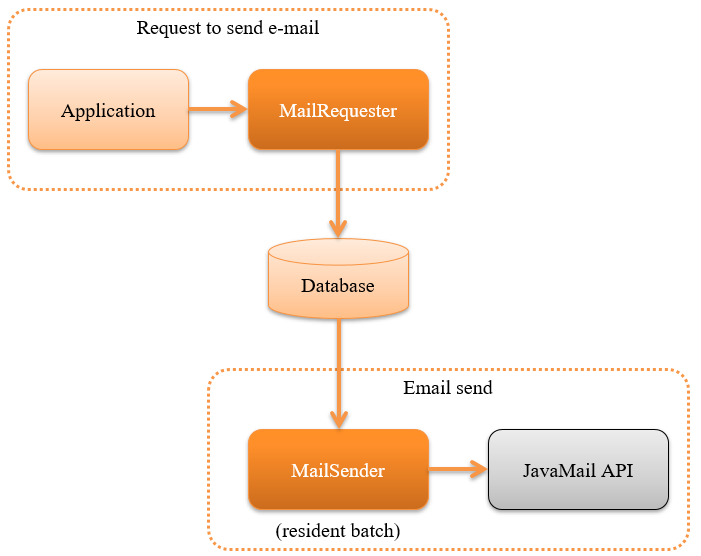

.. _mail:

Sending Emails
==================================================

.. contents:: Table of contents
  :depth: 3
  :local:

.. |JavaMail| raw:: html

  <a href="https://javamail.java.net/nonav/docs/api/" target="_blank">JavaMail API(External site)</a>

Provides the function to send emails.

This function uses a architecture called delayed online process,
wherein instead of sending the emails immediately, the email send requests are briefly stored in the database
and sent asynchronously using the :ref:`resident batch <nablarch_batch-resident_batch>`.

The reasons for using this architecture are as below.

* The sending of emails can be included as a business transaction in applications that issue email send requests.
* There will be no effect on the application process, even when there is an email send failure due to email server or network failure.

This function provides two functions to implement the architecture mentioned above.

* :ref:`A function to register the email send requests in the database<mail-request>`
* :ref:`A batch function that sends email based on the email send request<mail-send>`

Each time the application issues an email send request,
one email send request is created and one email is sent per request.

.. tip::
  This function does not provide an API for sending the emails immediately.
  In this case, use |JavaMail| directly.

Function overview
--------------------------------------------------

.. _`mail-template`:

A standard email can be sent using a template.
~~~~~~~~~~~~~~~~~~~~~~~~~~~~~~~~~~~~~~~~~~~~~~~~~~
The email send of system has to send many emails such as the registration completion notification email with the same wordings with difference in only some items.
Therefore, this function provides the functionality for creating the subject and body by preparing a template and changing the placeholders.
For details of the function, see :ref:`mail-request`.

.. important::

 From Nablarch 5u13, standard email which uses the template engine is supported.
 
 The standard email function up to 5u12 was also a part of the template engine
 and could be used by configuring ``TinyTemplateEngineMailProcessor``, but the function was limited as given below.

 * Placeholders can only be replaced with simple strings and structured objects are not supported.
 * Control syntax such as conditional branching and iterations are not supported.

 Instead of the existing standard email function, the standard email functions using the following template engine that is more advanced is recommended.

 * :ref:`mail_sender_freemarker_adaptor`
 * :ref:`mail_sender_thymeleaf_adaptor`
 * :ref:`mail_sender_velocity_adaptor`

.. _`do-not-use-for-campaign-mail`:

Sending of mass emails such as campaign notifications is not supported
~~~~~~~~~~~~~~~~~~~~~~~~~~~~~~~~~~~~~~~~~~~~~~~~~~~~~~~~~~~~~~~~~~~~~~~~
This function does not support simultaneous sending of emails such as campaign notifications.
The use of a specialized products is recommended when the following is applicable.

* Sending mass emails such as campaign notifications and email newsletters.
* Measure the opening rate of the delivered email and effectiveness of click count.
* The client device (for example, whether it is a feature phone) is identified with the email address and emails sent are switched accordingly.

Module list
--------------------------------------------------
.. code-block:: xml

  <dependency>
    <groupId>com.nablarch.framework</groupId>
    <artifactId>nablarch-mail-sender</artifactId>
  </dependency>

  <!-- Used for numbering the email send request ID -->
  <dependency>
    <groupId>com.nablarch.framework</groupId>
    <artifactId>nablarch-common-idgenerator</artifactId>
  </dependency>
  <dependency>
    <groupId>com.nablarch.framework</groupId>
    <artifactId>nablarch-common-idgenerator-jdbc</artifactId>
  </dependency>

How to use
--------------------------------------------------

.. _`mail-settings`:

Configure settings to use email send
~~~~~~~~~~~~~~~~~~~~~~~~~~~~~~~~~~~~~~~~~~~~~~~~~~~~~~~~~~~~~~~~~~~~~
This function uses a database to manage the data used for email send.
The table layout is as follows.

.. |br| raw:: html

    

.. list-table:: Request to send email
  :header-rows: 0
  :class: white-space-normal
  :widths: 24,18,58

  * - Request to send email ID ``PK``
    - String type
    - ID that uniquely identifies the email send request
  * - Email send pattern ID (optional item)
    - String type
    - ID to identify the pattern of email send method. |br| Define while extracting the unsent data that used the pattern.(Refer to :ref:`Conditions for extracting unsent data<mail-mail_send_pattern>`）
  * - Process ID of email send batch (optional item)
    - String type
    - Column used for pessimistic locking of records by each process when executing multiple processes. |br| Define while executing multiple processes.(See  :ref:`mail-mail_multi_process`)
  * - Subject line
    - String type
    -
  * - Sender email address
    - String type
    - Email address specified in From header of email
  * - Default reply email address
    - String type
    - Email address specified in Reply-To header of the email
  * - Return email address
    - String type
    - Email address specified in the Return-Path header of the email
  * - Character set
    - String type
    - Character set specified in the Content-Type header of the email
  * - Status
    - String type
    - Code value that indicates the send status of the email (unsent/sent/failed)
  * - Request date and time
    - Timestamp type
    -
  * - Send date and time
    - Timestamp type
    -
  * - Main text
    - String type
    -

.. list-table:: Email send recipient
  :header-rows: 0
  :class: white-space-normal
  :widths: 24,18,58

  * - Request to send email ID ``PK``
    - String type
    -
  * - Serial number ``PK``
    - Numeric type
    - Serial number of one email send request
  * - Destination category
    - String type
    - Code value indicating the recipient classification (TO/CC/BCC) of the email
  * - email address
    - String type
    -

.. list-table:: Email attachment files
  :header-rows: 0
  :class: white-space-normal
  :widths: 24,18,58

  * - Request to send email ID ``PK``
    - String type
    -
  * - Serial number ``PK``
    - Numeric type
    - Serial number of one email send request
  * - Name of the attachment file
    - String type
    -
  * - Content-Type
    - String type
    -
  * - Attachment files
    - Byte array type
    -

.. list-table:: Email template
  :header-rows: 0
  :class: white-space-normal
  :widths: 24,18,58

  * - Email template ID ``PK``
    - String type
    -
  * - Language ``PK``
    - String type
    -
  * - Subject line
    - String type
    -
  * - Main text
    - String type
    -
  * - Character set
    - String type
    - Character set specified when sending an email

Configure the following configuration to use email send

* :ref:`Common configuration for email send request and email send batch<mail-common_settings>`
* :ref:`Configuration of email send request<mail-mail_requester_settings>`
* :ref:`Configuration of email send batch<mail-mail_sender_settings>`

.. _mail-common_settings:

Common configuration for email send request and email send batch
 In common configuration, configure the following.

 * :ref:`Table schema<mail-common_settings_table_schema>`
 * :ref:`Code value and message<mail-common_settings_mail_config>`

 .. _mail-common_settings_table_schema:

 Table schema
  Add the following class configuration to the component definition.
  For details of the configuration items, refer to the linked Javadoc.

  * :java:extdoc:`MailRequestTable<nablarch.common.mail.MailRequestTable>` (Request to send email table)
  * :java:extdoc:`MailRecipientTable<nablarch.common.mail.MailRecipientTable>` (Email send recipient table)
  * :java:extdoc:`MailAttachedFileTable<nablarch.common.mail.MailAttachedFileTable>` (Attachment files table)
  * :java:extdoc:`MailTemplateTable<nablarch.common.mail.MailTemplateTable>` (Email template table)

  The configuration example shown below.

  .. code-block:: xml

   <!-- Schema of email send request table-->
   <component name="mailRequestTable" class="nablarch.common.mail.MailRequestTable">
     <!-- Specify the table name and column name. It is omitted here. -->
   </component>

   <!-- Schema of email send recipient table -->
   <component name="mailRecipientTable" class="nablarch.common.mail.MailRecipientTable">
     <!-- Specify the table name and column name. It is omitted here. -->
   </component>

   <!-- Schema of attachment file table -->
   <component name="mailAttachedFileTable" class="nablarch.common.mail.MailAttachedFileTable">
     <!-- Specify the table name and column name. It is omitted here. -->
   </component>

   <!-- Schema of email template table -->
   <component name="mailTemplateTable" class="nablarch.common.mail.MailTemplateTable">
     <!-- Specify the table name and column name. It is omitted here. -->
   </component>

   <!-- Initialization configuration -->
   <component name="initializer"
              class="nablarch.core.repository.initialization.BasicApplicationInitializer">
     <property name="initializeList">
       <list>
         <!-- Other components are omitted -->
         <component-ref name="mailRequestTable" />
         <component-ref name="mailRecipientTable" />
         <component-ref name="mailAttachedFileTable" />
         <component-ref name="mailTemplateTable" />
       </list>
     </property>
   </component>

 .. tip::

   The mailSendPatternIdColumnName property and sendProcessIdColumnName property of MailRequestTable are optional items and configured to use the function.
   For mailSendPatternIdColumnName property, refer to :ref:`Conditions for extracting unsent data<mail-mail_send_pattern>`
   and for sendProcessIdColumnName property, refer to :ref:`mail-mail_multi_process`.

 .. _mail-common_settings_mail_config:

 Code value and message
  Configure the code value used while sending email, message ID and failure code.
  Add the configuration of :java:extdoc:`MailConfig<nablarch.common.mail.MailConfig>` to the component definition.
  For details of the configuration items, refer to  :java:extdoc:`Javadoc of MailConfig<nablarch.common.mail.MailConfig>`.

  The configuration example shown below.

  .. code-block:: xml

   <component name="mailConfig" class="nablarch.common.mail.MailConfig">

     <!-- Numbering target identification ID of email send request ID -->
     <property name="mailRequestSbnId" value="MAIL_REQUEST_ID" />

     <!-- A code value that indicates the email recipient classification (TO/CC/BCC) -->
     <property name="recipientTypeTO" value="0" />
     <property name="recipientTypeCC" value="1" />
     <property name="recipientTypeBCC" value="2" />

     <!-- A code value that indicates the email status (unsent/sent/failed) -->
     <property name="statusUnsent" value="0" />
     <property name="statusSent" value="1" />
     <property name="statusFailure" value="2" />

     <!-- Message ID to output the number of email send requests -->
     <property name="mailRequestCountMessageId" value="mail.request.count" />

     <!-- Message ID for email sent successfully -->
     <property name="sendSuccessMessageId" value="mail.send.success" />

     <!-- Failure code when send fails -->
     <property name="sendFailureCode" value="mail.send.failure" />

     <!-- Exit code when send fails -->
     <property name="abnormalEndExitCode" value="199" />

   </component>

.. _mail-mail_requester_settings:

Configuration of email send request
 Add the following class to the component definition.
 For details of the configuration items, refer to the linked Javadoc.

 * :java:extdoc:`MailRequester<nablarch.common.mail.MailRequester>` (component that registers email send requests in the database)
 * :java:extdoc:`MailRequestConfig<nablarch.common.mail.MailRequestConfig>` (class that retains the configuration value during email send request)

 :java:extdoc:`MailRequester<nablarch.common.mail.MailRequester>` generates
 a email send request ID using index :ref:`Numbering <generator>`
 when registering the email send request ID in the database.
 Therefore, separate configuration of :ref:`Numbering <generator>` is required.

 The configuration example shown below.

 Point
  * Since :java:extdoc:`MailRequester<nablarch.common.mail.MailRequester>` is looked up with name,
    specify ``mailRequester`` component name.

 .. code-block:: xml

  <!-- Email send request component. -->
  <component name="mailRequester" class="nablarch.common.mail.MailRequester">

    <!-- Configuration value during email send request (refer to the component definition below) -->
    <property name="mailRequestConfig" ref="mailRequestConfig" />

    <!-- IdGenerator used for numbering the email send request ID -->
    <property name="mailRequestIdGenerator" ref="idGenerator" />

    <!-- Table schema -->
    <property name="mailRequestTable" ref="mailRequestTable" />
    <property name="mailRecipientTable" ref="mailRecipientTable" />
    <property name="mailAttachedFileTable" ref="mailAttachedFileTable" />
    <property name="templateEngineMailProcessor">
      <component class="nablarch.common.mail.TinyTemplateEngineMailProcessor">
        <property name="mailTemplateTable" ref="mailTemplateTable" />
      </component>
    </property>

  </component>

  <!-- Configuration value during email send request -->
  <component name="mailRequestConfig" class="nablarch.common.mail.MailRequestConfig">

    <!-- Default reply email address -->
    <property name="defaultReplyTo" value="default.reply.to@nablarch.sample" />

    <!-- Default return email address -->
    <property name="defaultReturnPath" value="default.return.path@nablarch.sample" />

    <!-- Default character set -->
    <property name="defaultCharset" value="ISO-2022-JP" />

    <!-- Maximum number of recipients -->
    <property name="maxRecipientCount" value="100" />

    <!-- Maximum attached file size (bytes) -->
    <property name="maxAttachedFileSize" value="2097152" />

  </component>

``TinyTemplateEngineMailProcessor`` is used here only for explanation and it has limited functionality and use template engines such as FreeMarker is recommended.
For details, see :ref:`mail-template`.

.. _mail-mail_sender_settings:

Configuration of email send batch
 Configure the connection information of the SMTP server used by the email send batch.
 Add the configuration of :java:extdoc:`MailSessionConfig<nablarch.common.mail.MailSessionConfig>`.
 For details of the configuration items, refer to the linked Javadoc.

 The configuration example shown below.

 .. code-block:: xml

  <component name="mailSessionConfig" class="nablarch.common.mail.MailSessionConfig">
    <property name="mailSmtpHost" value="localhost" />
    <property name="mailHost" value="localhost" />
    <property name="mailSmtpPort" value="25" />
    <property name="mailSmtpConnectionTimeout" value="100000" />
    <property name="mailSmtpTimeout" value="100000" />
  </component>

.. _`mail-request`:

Register an email send request
~~~~~~~~~~~~~~~~~~~~~~~~~~~~~~~~~~~~~~~~~~~~~~~~~~~~~~~~~~~~~~~~~~~~~
The following class is used to register the email send request.

* :java:extdoc:`MailRequester<nablarch.common.mail.MailRequester>` (register the email send request in the database)
* :java:extdoc:`MailUtil<nablarch.common.mail.MailUtil>` (acquires :java:extdoc:`MailRequester<nablarch.common.mail.MailRequester>`)
* :java:extdoc:`FreeTextMailContext<nablarch.common.mail.FreeTextMailContext>` (non-standard email send request)
* :java:extdoc:`TemplateMailContext<nablarch.common.mail.TemplateMailContext>` (standard email send request)
* :java:extdoc:`AttachedFile<nablarch.common.mail.AttachedFile>` (Attachment file)

This function supports free-format non-standard emails,
and standard emails that use preregistered templates,
and creates the email send requests by using the corresponding classes.

An implementation example of a standard email is shown below.

.. code-block:: java

 // Create an email send request
 TemplateMailContext mailRequest = new TemplateMailContext();
 mailRequest.setFrom("from@tis.co.jp");
 mailRequest.addTo("to@tis.co.jp");
 mailRequest.addCc("cc@tis.co.jp");
 mailRequest.addBcc("bcc@tis.co.jp");
 mailRequest.setSubject("Subject");
 mailRequest.setTemplateId("Template ID");
 mailRequest.setLang("ja");

 // Configure the value for the template placeholder.
 mailRequest.setVariable("name", "Name");
 mailRequest.setVariable("address", "Mailing address");
 mailRequest.setVariable("tel", "Telephone number");
 // When null is configured to the value, it is replaced by an empty string as shown below.
 mailRequest.setVariable("option", null);

 // Configure the attachment file.
 AttachedFile attachedFile = new AttachedFile("text/plain", new File("path/to/file"));
 mailRequest.addAttachedFile(attachedFile);

 // Register the email send request.
 MailRequester requester = MailUtil.getMailRequester();
 String mailRequestId = requester.requestToSend(mailRequest);

.. important::
 Note the following points when setting the values for the placeholder template in the standard email.

 - An exception is thrown when ``null`` is specified in the key.
 - When ``null`` is specified in the value, replace it with an empty string.
 - Consistency between the template placeholder and key/value configured for the placeholder is not checked.
   Therefore, irrespective of whether a placeholder is present in the template, if the value is not set, then the email is sent without changing the placeholder.
   Conversely, values configured without a corresponding placeholder are simply ignored and the email is sent.

.. _`mail-send`:

Send the emails (execute the email send batch)
~~~~~~~~~~~~~~~~~~~~~~~~~~~~~~~~~~~~~~~~~~~~~~~~~~~~~~~~~~~~~~~~~~~~~
Email send batch uses :java:extdoc:`MailSender<nablarch.common.mail.MailSender>`.
:java:extdoc:`MailSender<nablarch.common.mail.MailSender>` is created as batch action
that operates using :ref:`resident batch<nablarch_batch-resident_batch>`.

To not send the same email multiple times when a failure occurs, the following process is followed in email send process.
As a result, when an email is sent, the status is updated and sending of the email twice is prevented.

Email send process flow
  .. image:: images/mail/mail_sender_flow.png
    :scale: 75

.. important::
  When an exception (for example, exception thrown during database or network failure) occurs while updating the status (change to send failure) during email send failure, the status remains as sent.
  In this case, a patch is required to be attached to the relevant data (change the status to send failure).
  A message is added to the exception to prompt patch application.

.. tip::
  As shown in the above figure, the status update process is executed in another transaction.
  Therefore, the transaction to be used in these processes is required to be configured.
  The component name of this transaction should be registered in the component configuration file as ``statusUpdateTransaction``.
  For details, see  :ref:`database-new_transaction`.

An execution example is shown below.
Refer to  :ref:`main-run_application` for the details on execution.

Point
 * Specify :java:extdoc:`MailSender<nablarch.common.mail.MailSender>` in the requestPath option.

.. code-block:: bash

 java nablarch.fw.launcher.Main \
   -diConfig file:./mail-batch-config.xml \
   -requestPath nablarch.common.mail.MailSender/SENDMAIL00 \
   -userId mailBatchUser

.. _`mail-mail_send_pattern`:

Conditions for extracting unsent data
 :java:extdoc:`MailSender<nablarch.common.mail.MailSender>` extracts unsent data
 from the email send request table and sends the email.
 The conditions for extracting unsent data can be selected from the following two options.

  * Extract unsent data from the entire table
  * Extract unsent data from each email send pattern ID

 To use email send pattern ID,
 for example, a system that can handle high priority emails that require the shortest possible time to send the mail
 and low priority emails which are okay to be sent once every hour can be considered.

 To extract the unsent data from every email send pattern ID,
 start an email send batch process for each email send pattern ID to be monitored.
 Therefore, at process startup, specify the email send pattern ID (mailSendPatternId) to be processed as the startup argument.

 An execution example is shown below.

 Point
  * Specify the email send pattern ID in the option with the name ``mailSendPatternId``.

 .. code-block:: bash

  java nablarch.fw.launcher.Main \
    -diConfig file:./mail-batch-config.xml \
    -requestPath nablarch.common.mail.MailSender/SENDMAIL00 \
    -userId mailBatchUser
    -mailSendPatternId 02

.. _`mail-mail_error_process`:

Error process while sending emails
~~~~~~~~~~~~~~~~~~~~~~~~~~~~~~~~~~~~~~~~~~~~~~~~~~~~~~~~~~~~~~~~~~~~~
When an exception caused by external input data (address or header) or an exception of email send failure occurs,
:java:extdoc:`MailSender<nablarch.common.mail.MailSender>` sets the target email send request status as send failure and processes the next email send.
When an exception other than the above occurs, email send request status is set as send failure and retried.

The following table shows the exception types and their error handling.

 .. list-table:: Exception and process while sending emails
  :class: white-space-normal
  :header-rows: 1

  * - Exception
    - Processing
  * - `AddressException of JavaMail <https://javaee.github.io/javamail/docs/api/javax/mail/internet/AddressException.html>`_ when changing the email address of the send request
    - Log output of the address that failed during conversion (log level: ERROR)
  * - :java:extdoc:`InvalidCharacterException<nablarch.common.mail.InvalidCharacterException>` in :ref:`mail-mail_header_injection`
    - Log output of header string (log level: ERROR).
  * - `SendFailureException of JavaMail <https://javaee.github.io/javamail/docs/api/javax/mail/SendFailedException.html>`_ when email send fails
    - Log output of sent address, unsent address and invalid address (log level: ERROR)
  * - :java:extdoc:`Exception <java.lang.Exception>` other than the above during email send
    - Wraps the exception and throws retry exception.

When update to status send failure fails or when the retry limit has reached, the email send batch is abnormally terminated.

 .. important::
  Send failure detection is required to be supported by checking the log file in another process.

To change the log output process or retry process, refer :ref:`mail-mail_extension_sample`.

.. _`mail-mail_multi_process`:

Multiple process email send
~~~~~~~~~~~~~~~~~~~~~~~~~~~~~~~~~~~~~~~~~~~~~~~~~~~~~~~~~~~~~~~~~~~~~
Perform pessimistic lock using the process ID column of the email send request table
so that multiple processes do not process the same send request when using multiple process for email send (example, when executing on a redundant server).
The following configuration is required to use this function.

 1. Define the process ID column of email send batch in email send request table
 2. Configure the process ID column name of the email send batch in the property value sendProcessIdColumnName of :java:extdoc:`MailRequestTable<nablarch.common.mail.MailRequestTable>` and add it to the component definition
 3. Add the transaction to update the process ID of the email send batch to the component definition with the name ``mailMultiProcessTransaction`` (refer to :ref:`database-new_transaction` for the transaction configuration)

 .. important::

   If the configuration mentioned in step 2 is not done, then there is a possibility of multiple processes processing a single email send request as there is no exclusive control.
   However, the email send batch apparently continues to operate, and detecting the omission of this configuration is difficult.
   Configure the above without fail for multiple processing of email send.

 .. important::

  Nablarch's email-sending feature :ref:`doesn't support mass emails such as campaign notifications <do-not-use-for-campaign-mail>` . 
  The purpose of multi-processing is not to distribute a large amount of mail but to continue the mail transmission function
  even if a failure occurs in a part of servers in a redundant configuration.
  Therefore, the mail sent by each process is all the mail (*) not sent at the time of starting the process,
  and it is not distributed evenly among the processes.

  * When a mail sending pattern ID is specified, all unsent mail of the corresponding mail sending pattern ID is subject to the processing.

.. _`mail-mail_header_injection`:

Measures against email header injection attacks
~~~~~~~~~~~~~~~~~~~~~~~~~~~~~~~~~~~~~~~~~~~~~~~~~~~~~~~~~~~~~~~~~~~~~
The following should be implemented as a fundamental measure against email header injection attacks.

* Use a fixed value for the email header. Do not use the external input values.
* Send email using the standard API of programming language. For Java, use  |JavaMail| .

Use a fixed value for the email header. Do not use the external input values.
 This has to be supported in the project.
 When a fixed value cannot be used, change the line feed code or remove from the project.

Send email using the standard API of programming language. For Java, use |JavaMail| .
 This function uses |JavaMail| .
 However, even if |JavaMail| is used, there are items that can be sent by email even if some of the items in the email header include a line feed code.
 Therefore, as a security measure, a check functionality is provided to prevent an email send when a line feed code is included in these items.
 If line feed code is included,
 :java:extdoc:`InvalidCharacterException<nablarch.common.mail.InvalidCharacterException>`
 is thrown and log is output (log level: ERROR), and the sending process is handled as a failure for the corresponding email.

 This security measure covers the following items that may be vulnerable.

 * Subject line
 * Return email address

.. _`mail-mail_extension_sample`:

Expansion example
---------------------------------------------------------------------

Change the email send process such as add digital signature and encryption email body
~~~~~~~~~~~~~~~~~~~~~~~~~~~~~~~~~~~~~~~~~~~~~~~~~~~~~~~~~~~~~~~~~~~~~~~~~~~~~~~~~~~~~~~~
:java:extdoc:`MailSender<nablarch.common.mail.MailSender>`
sends the contents specified in email send request or template without any change.
Depending on the application requirements, addition of digital signature or encryption the email body is required.

For such cases, support by creating an inherited class of
:java:extdoc:`MailSender<nablarch.common.mail.MailSender>` in the project.
For details, see :java:extdoc:`Javadoc of MailSender<nablarch.common.mail.MailSender>`.

Change the process when email send fails
~~~~~~~~~~~~~~~~~~~~~~~~~~~~~~~~~~~~~~~~~~~~~~~~~~~~~~~~~~~~~~~~~~~~~~~~~~~~~~~~~~~
Error process when an email send fails (for details, refer to :ref:`mail-mail_error_process`) may have to be changed
based on the requirement of the application such as changing the log level and retry exception, etc.

For such cases, like in the above cases, support by creating an inherited class of :java:extdoc:`MailSender<nablarch.common.mail.MailSender>`.

Specify the transaction used during email send request
~~~~~~~~~~~~~~~~~~~~~~~~~~~~~~~~~~~~~~~~~~~~~~~~~~~~~~~~~~~~~~~~~~~~~~~~~~~~~~~~~~~
When the email send request is to be performed securely even when a business application fails,
the transaction executed in the email send request :java:extdoc:`MailRequester<nablarch.common.mail.MailRequester>`
and :ref:`numbering<generator>` of email send request ID may have to specified independent of the business application transaction.

A configuration example for this case is shown below.

 Point
  * Use the same transaction name in the numbering of the email send request and the transaction manager.

 .. code-block:: xml

  <!-- Email send request component -->
  <component name="mailRequester" class="nablarch.common.mail.MailRequester">
    <!-- Specify the transaction used in email send -->
    <property name="mailTransactionManager" ref="txManager" />
  </component>

  <!-- Transaction manager  -->
  <component name="txManager" class="nablarch.core.db.transaction.SimpleDbTransactionManager">
    <property name="dbTransactionName" value="mail-transaction" />
  </component>

  <!-- Email send request ID generator -->
  <component name="mailRequestIdGenerator"
      class="nablarch.common.idgenerator.TableIdGenerator">
      <!-- Specify the transaction name specified in the transaction manager  -->
      <property name="dbTransactionName" value="mail-transaction" />
  </component>
