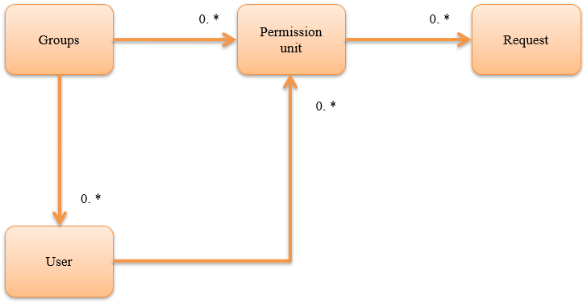

.. _`permission_check`:

Permission Check
=====================================================================

.. contents:: Table of contents
  :depth: 3
  :local:

This function checks the permission for the functions provided by the application.
This function enables access control such as limiting the functions that can be used by each user on the web.

.. important::
 This function should be used only when the application requirements are met.

 This function manages the permission data used for permission check using the database and sets the permission for each request
 (see the conceptual model shown in :ref:`permission_check-authority_model`).
 For example, a web registration function is generally composed of multiple requests such as initial display/confirmation/return/registration.

 Therefore, while permission can be configured in detail for this function, data design is also required in detail,
 which may reduce productivity during development and increase operational load after release.

Function overview
---------------------------------------------------------------------

Permission check can be performed on a request basis
~~~~~~~~~~~~~~~~~~~~~~~~~~~~~~~~~~~~~~~~~~~~~~~~~~~~~~~~~~~~~~~~~~~~~
Permission check is possible for by configuring
:ref:`permission_check_handler` in the handler queue.

See below for details.

* :ref:`permission_check-settings`
* :ref:`permission_check-server_side_check`
* :ref:`permission_check-view_control`

.. _`permission_check-authority_model`:

Permissions can be configured in combination with group and user units
~~~~~~~~~~~~~~~~~~~~~~~~~~~~~~~~~~~~~~~~~~~~~~~~~~~~~~~~~~~~~~~~~~~~~~~~
The conceptual model of permission configuration used for permission check is as follows.

Groups are used for assigning permission to organization units such as departments.

The permission check unit represents the minimum unit of permission check by collecting multiple requests.
Requests required to realize the permission check, that is, multiple events on the screen for web, are associated with the permission check unit.
For example, the data is as follows for a user registration function.

Permission check unit
 | User registration

Request associated with permission check unit "user registration"
 | Initial display of input screen
 | Confirmation button of input screen
 | Registration button of confirmation screen
 | Return button of confirmation screen

By configuring the relationship between the group and user, and the group and permission check unit, permission can be set for each group.
Furthermore, since the permission check unit can be set directly to the user, irregular permission to a specific user can be configured.

Module list
--------------------------------------------------
.. code-block:: xml

  <dependency>
    <groupId>com.nablarch.framework</groupId>
    <artifactId>nablarch-common-auth</artifactId>
  </dependency>
  <dependency>
    <groupId>com.nablarch.framework</groupId>
    <artifactId>nablarch-common-auth-jdbc</artifactId>
  </dependency>

How to use
---------------------------------------------------------------------

.. _`permission_check-settings`:

Configure settings to use permission check
~~~~~~~~~~~~~~~~~~~~~~~~~~~~~~~~~~~~~~~~~~~~~~~~~~~~~~~~~~~~~~~~~~~~~
This function uses a database to manage the permission data used for permission check.
The table layout is as follows.

Groups
 ============================== ===========================================================
 Group ID (PK)                  Values for identifying the group. String type
 ============================== ===========================================================

System account
 ============================== ===========================================================
 User ID (PK)                   Values for identifying the user. String type
 User ID lock status            Lock status of user ID. String type.
 Effective date (From)          Effective date (From) of the user. String type.
 Effective date (To)            Effective date (To) of the user. String type.
 ============================== ===========================================================

 :User ID lock status: "0" if user is not locked, other than "0" if user is locked
 :Effective date (From): In yyyyMMdd format, "19000101" if not specified
 :Effective date (To): In yyyyMMdd format, "99991231" if not specified

Group system account
 ============================== ===========================================================
 Group ID(PK)                   Values for identifying the group. String type
 User ID(PK)                    Values for identifying the user. String type
 Effective date (From)(PK)      Effective date (From) of the user. String type
 Effective date (To)            Effective date (To) of the user. String type
 ============================== ===========================================================

 :Effective date (From): In yyyyMMdd format, "19000101" if not specified
 :Effective date (To): In yyyyMMdd format, "99991231" if not specified

Permission check unit
 ============================= ================================================================
 Permission check unit ID (PK) A value for identifying the permission check unit. String type
 ============================= ================================================================

Permission check unit request
 ============================== ================================================================
 Permission check unit ID (PK)  A value for identifying the permission check unit. String type
 Request ID (PK)                Values for identifying the request. String type
 ============================== ================================================================

Group permission
 ============================== ================================================================
 Group ID (PK)                  Values for identifying the group. String type
 Permission check unit ID (PK)  A value for identifying the permission check unit. String type
 ============================== ================================================================

System account permission
 ============================== ================================================================
 User ID (PK)                   Values for identifying the user. String type
 Permission check unit ID (PK)  A value for identifying the permission check unit. String type
 ============================== ================================================================

Configure the following settings to use permission check

* Add the configuration of :java:extdoc:`BasicPermissionFactory <nablarch.common.permission.BasicPermissionFactory>`
  to the component definition.
* Since :java:extdoc:`BasicPermissionFactory <nablarch.common.permission.BasicPermissionFactory>`
  is used by configuring to :ref:`permission_check_handler`, specify any name as the component name.

.. code-block:: xml

 <component name="permissionFactory" class="nablarch.common.permission.BasicPermissionFactory">

   <!-- Group schema -->
   <property name="groupTableSchema">
     <component class="nablarch.common.permission.schema.GroupTableSchema">
       <!-- Configuration of property is omitted -->
     </component>
   </property>

   <!-- System account schema -->
   <property name="systemAccountTableSchema">
     <component class="nablarch.common.permission.schema.SystemAccountTableSchema">
       <!-- Configuration of property is omitted -->
     </component>
   </property>

   <!-- Group system account schema -->
   <property name="groupSystemAccountTableSchema">
     <component class="nablarch.common.permission.schema.GroupSystemAccountTableSchema">
       <!-- Configuration of property is omitted -->
     </component>
   </property>

   <!-- Permission check unit schema -->
   <property name="permissionUnitTableSchema">
     <component class="nablarch.common.permission.schema.PermissionUnitTableSchema">
       <!-- Configuration of property is omitted -->
     </component>
   </property>

   <!-- Permission check unit request schema -->
   <property name="permissionUnitRequestTableSchema">
     <component class="nablarch.common.permission.schema.PermissionUnitRequestTableSchema">
       <!-- Configuration of property is omitted -->
     </component>
   </property>

   <!-- Group permission schema -->
   <property name="groupAuthorityTableSchema">
     <component class="nablarch.common.permission.schema.GroupAuthorityTableSchema">
       <!-- Configuration of property is omitted -->
     </component>
   </property>

   <!-- System account permission schema -->
   <property name="systemAccountAuthorityTableSchema">
     <component class="nablarch.common.permission.schema.SystemAccountAuthorityTableSchema">
       <!-- Configuration of property is omitted -->
     </component>
   </property>

   <!-- Transaction manager used for database access -->
   <property name="dbManager" ref="permissionCheckDbManager"/>

   <!-- Provider giving the business date used to determine the effective date (FROM/TO) -->
   <property name="businessDateProvider" ref="businessDateProvider" />
 </component>

Add the following component definition as
:java:extdoc:`BasicPermissionFactory <nablarch.common.permission.BasicPermissionFactory>` requires initialization.

.. code-block:: xml

 <component name="initializer"
            class="nablarch.core.repository.initialization.BasicApplicationInitializer">
   <property name="initializeList">
     <list>
       <!-- Initialize BasicPermissionFactory -->
       <component-ref name="permissionFactory" />
     </list>
   </property>
 </component>

.. _`permission_check-server_side_check`:

Perform permission check on the server
~~~~~~~~~~~~~~~~~~~~~~~~~~~~~~~~~~~~~~~~~~~~~~~~~~~~~~~~~~~~~~~~~~~~~
Use :java:extdoc:`Permission <nablarch.common.permission.Permission>` for the permission check.
Since :java:extdoc:`Permission <nablarch.common.permission.Permission>`
is configured to the thread context by :ref:`permission_check_handler`,
acquire by using :java:extdoc:`PermissionUtil.getPermission <nablarch.common.permission.PermissionUtil.getPermission()>`.

.. code-block:: java

 Permission permission = PermissionUtil.getPermission();
 if (permission.permit("/action/user/unlock")) {
     // The process comes here when the permission check is OK
 }

.. _`permission_check-view_control`:

Control screen display according to the permission
~~~~~~~~~~~~~~~~~~~~~~~~~~~~~~~~~~~~~~~~~~~~~~~~~~~~~~~~~~~~~~~~~~~~~
Use a custom tag to control the non-display (inactivity) of buttons and links according to permission availability.
See :ref:`tag-submit_display_control`.

Access permission data
~~~~~~~~~~~~~~~~~~~~~~~~~~~~~~~~~~~~~~~~~~~~~~~~~~~~~~~~~~~~~~~~~~~~~
Depending on the application requirements, access to permission data may be required,
such as acquiring the list of users belonging to a specific group.
However, this function checks only for the permission.

Therefore, to access the permission data, use :ref:`universal_dao`
to provide support by creating SQL.

Expansion example
---------------------------------------------------------------------
None.
