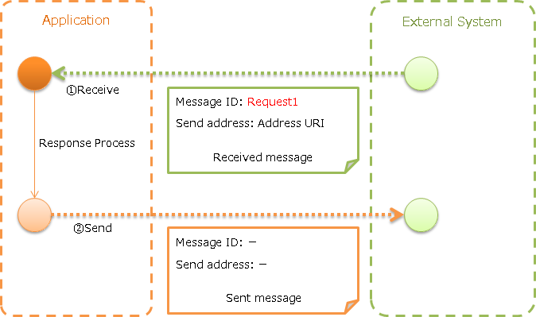
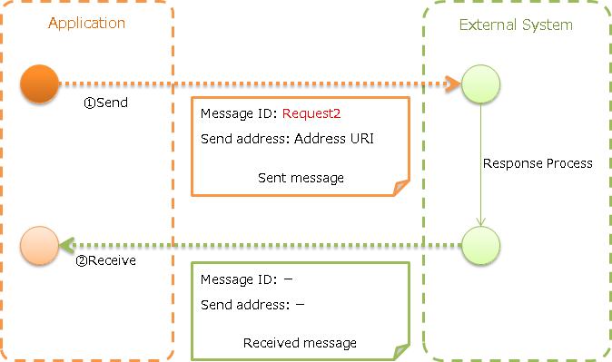
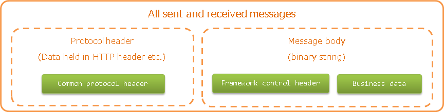

.. _http_system_messaging:

HTTP Messaging
==================================================

.. contents:: Table of contents
  :depth: 3
  :local:

Provides a function to send and receive messages using HTTP.

The data model shown in :ref:`http_system_messaging-data_model` is assumed for HTTP messaging.
Also, :ref:`data_format` is used for the message format.

.. important::
 In the :ref:`http_system_messaging-data_model`,
 the :ref:`framework control header<mom_system_messaging-fw_header>` is an item specified independently by Nablarch,
 and it is assumed to be included in the :ref:`message body<http_system_messaging-message_body>`.

 There is no problem if the message format can be designed in the project, but the requirement may not be met if the message format is already specified by the external system.

 Therefore, using the following functions is recommended.

 * The use of :ref:`RESTful Web service <restful_web_service>` is recommended for the server (message receive).
 * The use of Client function provided by Jakarta RESTful Web Services is recommended for client (message send).

 If the use of this function is unavoidable, refer to :ref:`http_system_messaging-change_fw_header` and handle by adding the implementation in the project.

The assumed runtime platform differs for HTTP messaging depending on the type of send and receive.

.. list-table::
   :header-rows: 1
   :class: white-space-normal
   :widths: 50, 50

   * - Type of send and receive
     - Runtime platform
   * - :ref:`HTTP receive message <http_system_messaging-message_receive>`
     - :ref:`HTTP messaging <http_messaging>`
   * - :ref:`HTTP send message <http_system_messaging-message_send>`
     - Does not depend on the runtime platform

Function overview
--------------------------

Can be prepared in the same way as :ref:`mom_system_messaging`
~~~~~~~~~~~~~~~~~~~~~~~~~~~~~~~~~~~~~~~~~~~~~~~~~~~~~~~~~~~~~~~~~~~~~~~~~~~~~~~
Message send/receive is implemented in HTTP messaging using the same API as :ref:`mom_system_messaging` given below.
Therefore, if users have experience in using :ref:`mom_system_messaging`, implementation time can be minimized.

* :java:extdoc:`MessagingAction<nablarch.fw.messaging.action.MessagingAction>`
* :java:extdoc:`MessageSender<nablarch.fw.messaging.MessageSender>`

Module list
--------------------------------------------------
.. code-block:: xml

  <dependency>
    <groupId>com.nablarch.framework</groupId>
    <artifactId>nablarch-fw-messaging</artifactId>
  </dependency>
  <dependency>
    <groupId>com.nablarch.framework</groupId>
    <artifactId>nablarch-fw-messaging-http</artifactId>
  </dependency>

How to use
---------------------------

.. _http_system_messaging-settings:

Configure settings to use HTTP messaging
~~~~~~~~~~~~~~~~~~~~~~~~~~~~~~~~~~~~~~~~~~~~~~~~~~
In the case of receive message, no special configuration is required other than the handler configuration of the runtime platform.

In the case of send message, add the following classes to the component definition.

* :java:extdoc:`MessageSenderClient<nablarch.fw.messaging.MessageSenderClient>` implementation class (HTTP send/receive)

A configuration example is shown below.

Point
  * :java:extdoc:`HttpMessagingClient<nablarch.fw.messaging.realtime.http.client.HttpMessagingClient>` is provided as the default implementation
    of :java:extdoc:`MessageSenderClient<nablarch.fw.messaging.MessageSenderClient>`.
  * Component name is specified as ``messageSenderClient`` because it is used as a lookup.

.. code-block:: xml

 <component name="messageSenderClient"
            class="nablarch.fw.messaging.realtime.http.client.HttpMessagingClient" />

.. _http_system_messaging-message_receive:

Receive message (HTTP receive message)
~~~~~~~~~~~~~~~~~~~~~~~~~~~~~~~~~~~~~~~~~~~~~~~~~~~~~~~~~~~~~~
Receive a message from an external system and send a response.

Implementation examples
 Point
   * HTTP message receive is created with :java:extdoc:`MessagingAction<nablarch.fw.messaging.action.MessagingAction>`.
   * Create the response message with :java:extdoc:`RequestMessage.reply<nablarch.fw.messaging.RequestMessage.reply()>`.

 .. code-block:: java

  public class SampleAction extends MessagingAction {
      protected ResponseMessage onReceive(RequestMessage request,
                                          ExecutionContext context) {
          // Receive data process
          Map<String, Object> reqData = request.getParamMap();

          // (Omitted)

          // Returns response data
          return request.reply()
                  .setStatusCodeHeader("200")
                  .addRecord(new HashMap() {{     // Content of message body
                       put("FIcode",     "9999");
                       put("FIname",     "Nablarch bank");
                       put("officeCode", "111");
                       /*
                        * (Rest is omitted)
                        */
                    }});
      }
  }

.. _http_system_messaging-message_send:

Send message (HTTP send message)
~~~~~~~~~~~~~~~~~~~~~~~~~~~~~~~~~~~~~~~~~~~~~~~~~~~~~~~~~~~~~~
Send a message to an external system and receive the response.
Wait until a response message is received or the wait timeout expires.

If a timeout occurs because a response cannot be received within the specified time, a compensation process needs to be performed.

Implementation examples
 Point
   * Create the request message with :java:extdoc:`SyncMessage<nablarch.fw.messaging.SyncMessage>`.
   * To send a message, use :java:extdoc:`MessageSender#sendSync<nablarch.fw.messaging.MessageSender.sendSync(nablarch.fw.messaging.SyncMessage)>`.
     For details of how to use, refer to the linked Javadoc.

 .. code-block:: java

  // Create a request message
  SyncMessage requestMessage = new SyncMessage("RM11AC0202")        // Configure the message ID
                                 .addDataRecord(new HashMap() {{    // Content of message body
                                      put("FIcode",     "9999");
                                      put("FIname",     "Nablarch bank");
                                      put("officeCode", "111");
                                      /*
                                       * (Rest is omitted)
                                       */
                                  }})
  // Send request message
  SyncMessage responseMessage = MessageSender.sendSync(requestMessage);

 To send an unique text as HTTP header, configure in the header record of the message created as follows.

 .. code-block:: java

  // Message header content
  requestMessage.getHeaderRecord().put("Accept-Charset", "UTF-8");

Expansion example
--------------------------------------------------

.. _http_system_messaging-change_fw_header:

Change the reading and writing of the framework control header
~~~~~~~~~~~~~~~~~~~~~~~~~~~~~~~~~~~~~~~~~~~~~~~~~~~~~~~~~~~~~~~~~~~~~~
In some cases, reading and writing of the framework control header may require to be changed
when the message format is already defined in the external system.
To support this, add the implementation in the project.
The following shows the support method for each type of send and receive.

For HTTP send message
 The framework control header is read and written according to the format definition of the message body.
 Therefore, the format definition of the message body may be changed according to the content.

For HTTP receive message
 Reading and writing to the framework control header is performed by the class with the
 :java:extdoc:`FwHeaderDefinition<nablarch.fw.messaging.FwHeaderDefinition>` interface implementation.
 :java:extdoc:`StandardFwHeaderDefinition<nablarch.fw.messaging.StandardFwHeaderDefinition>` is used by default.

 Therefore, referring to :java:extdoc:`StandardFwHeaderDefinition<nablarch.fw.messaging.StandardFwHeaderDefinition>`,
 a class that implements the :java:extdoc:`FwHeaderDefinition<nablarch.fw.messaging.FwHeaderDefinition>` interface is created in the project
 and configured in :ref:`http_messaging_request_parsing_handler` and :ref:`http_messaging_response_building_handler`.

.. tip::

  Whether to use the framework control header is optional.
  Framework control header need not be used unless there are special requirements.

.. _http_system_messaging-change_http_client_process:

Change the HTTP client process of HTTP send message
~~~~~~~~~~~~~~~~~~~~~~~~~~~~~~~~~~~~~~~~~~~~~~~~~~~~~~~~~~~~~~~~~~~~~~~
As explained in :ref:`http_system_messaging-settings`,
:java:extdoc:`HttpMessagingClient<nablarch.fw.messaging.realtime.http.client.HttpMessagingClient>` is used for HTTP send message.

:java:extdoc:`HttpMessagingClient<nablarch.fw.messaging.realtime.http.client.HttpMessagingClient>`
performs various processes as an HTTP client.
For example, ``Accept: text/json,text/xml`` is fixedly configured in the HTTP header of the message to be sent.

If the default operation of :java:extdoc:`HttpMessagingClient<nablarch.fw.messaging.realtime.http.client.HttpMessagingClient>`
does not meet the project requirements,
customize by creating a class that inherits :java:extdoc:`HttpMessagingClient<nablarch.fw.messaging.realtime.http.client.HttpMessagingClient>`
and configuring to the component definition with the method given in :ref:`http_system_messaging-settings`.

.. _http_system_messaging-data_model:

Data model of sent and received messages
--------------------------------------------------
In HTTP messaging, the contents of sent and received messages are expressed with the following data model.

.. _http_system_messaging-protocol_header:

Protocol header
 This header area mainly stores information used in message send and receive process of web container.
 The protocol header can be accessed with the Map interface.

.. _http_system_messaging-common_protocol_header:

Common protocol header
 The following headers among the protocol headers used by the framework can be accessed with a specific key name.
 The key name is shown in parentheses.

 Message ID (X-Message-Id)
  Uniquely numbered string for each message

  :Sending: Value numbered during send process
  :Receiving: Value issued by the sender

 Correlation message ID (X-Correlation-Id)
  Message ID of the message to which the message is related

  :Response message: Message ID of request message
  :Resend request: Message ID of request message requesting the resend of response

.. _http_system_messaging-message_body:

Message body
 The data area of the HTTP request is called the message body.
 The framework function uses only the protocol header area in principle.
 The other data areas are handled as unanalyzed simple binary data.

 The message body is analyzed by :ref:`data_format`.
 This enables reading and writing the content of the message in Map format with the field name as a key.

.. _http_system_messaging-fw_header:

Framework control header
 Many of the functions provided by this framework are designed on the assumption that specific control items are defined in the message.
 Such control items are called ``framework control headers``.

 The correspondence between the framework control header and the handler using it are as follows.

 Request ID
  ID to identify the business process that should be executed by the application that received this message.

  Main handlers that use this header:

  | :ref:`request_path_java_package_mapping`
  | :ref:`message_resend_handler`
  | :ref:`permission_check_handler`
  | :ref:`ServiceAvailabilityCheckHandler`

 User ID
  A character string that indicates the execution permission of this message

  Main handlers that use this header:

  | :ref:`permission_check_handler`

 Resend request flag
  Flag set when sending a resend request message

  Main handlers that use this header:

  | :ref:`message_resend_handler`

 Status code
  Code value that represents the processing result for the request message

  Main handlers that use this header:

  | :ref:`message_reply_handler`

 The framework control header must be defined
 with the following field names in the first data record of the message body by default.

  :Request ID: requestId
  :User ID: userId
  :Resend request flag: resendFlag
  :Status code: statusCode

 The following is an example of a standard framework control header definition.

 .. code-block:: bash

  #===================================================================
  # Framework control header part (50 bytes)
  #===================================================================
  [NablarchHeader]
  1   requestId   X(10)       # Request ID
  11  userId      X(10)       # User ID
  21  resendFlag  X(1)  "0"   # Resend request flag (0: Initial send 1: Resend request)
  22  statusCode  X(4)  "200" # Status code
  26 ?filler      X(25)       # Reserve area
  #====================================================================

 When items other than the framework control header are included in the format definition,
 the items can be accessed as optional header items of framework control header
 and used for the purpose of simple expansion of the framework control header for each project.

 It is highly recommended to provide a reserve area to add headers that are required to manage optional items
 and framework functions that may be added in the future.

