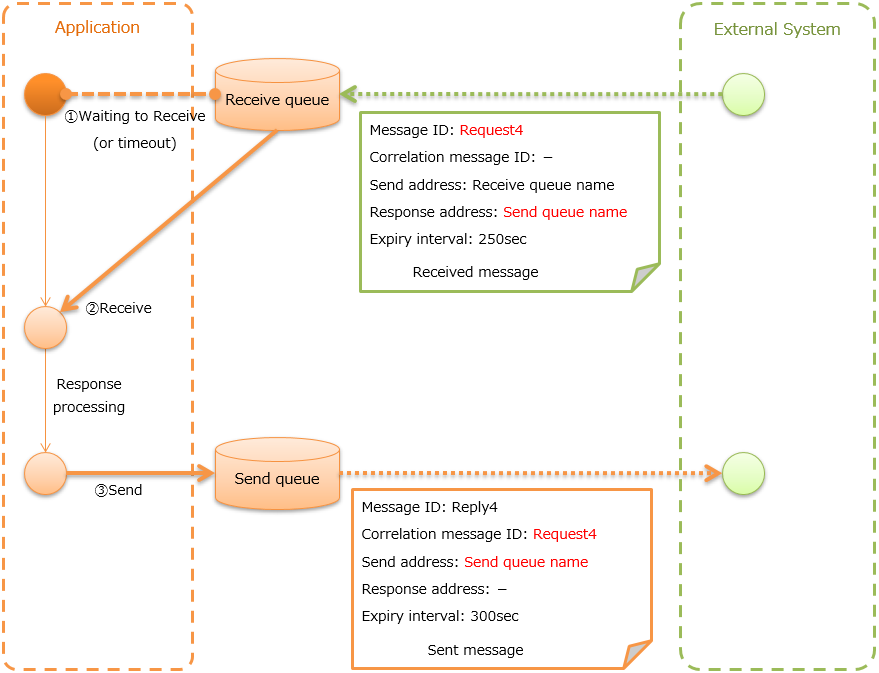

.. _mom_system_messaging:

MOM Messaging
==================================================

.. contents:: Table of contents
  :depth: 3
  :local:

Provides a function to send and receive messages using MOM.
In this chapter, the message queue used for MOM messaging is referred to as MQ.

The data model shown in :ref:`mom_system_messaging-data_model` is assumed for MOM messaging.
Also, :ref:`data_format` is used for the message format.

.. important::
 In the :ref:`mom_system_messaging-data_model`,
 the :ref:`framework control header<mom_system_messaging-fw_header>` is an item specified independently by Nablarch,
 and it is assumed to be included in the :ref:`message body<mom_system_messaging-message_body>`.

 There is no problem if the message format can be designed in the project,
 but the requirement may not be met
 if the message format is already specified by the external system.

 Such cases must be supported by adding the implementation in the project
 by referring to :ref:`mom_system_messaging-change_fw_header`.

The assumed execution control platform differs for MOM messaging depending on the type of send and receive.

.. list-table::
   :header-rows: 1
   :class: white-space-normal
   :widths: 50, 50

   * - Type of send and receive
     - Execution control platform
   * - :ref:`Sending asynchronous message <mom_system_messaging-async_message_send>`
     - :ref:`nablarch_batch`
   * - :ref:`Sending synchronous message <mom_system_messaging-sync_message_send>`
     - Does not depend on the execution control platform
   * - :ref:`Receiving asynchronous message <mom_system_messaging-async_message_receive>`
     - :ref:`mom_messaging`
   * - :ref:`Receiving synchronous message <mom_system_messaging-sync_message_receive>`
     - :ref:`mom_messaging`

Function overview
--------------------------

Compatible with various MOMs
~~~~~~~~~~~~~~~~~~~~~~~~~~~~~~~~~~~~~~~~~~~~~~~~~~~~~~~~~~~~~~~~~~~~
Since MOM messaging various MOMs,
the :java:extdoc:`MessagingProvider<nablarch.fw.messaging.MessagingProvider>` interface is provided.
MQ connection that depends on MOM and message send/receive are performed by the class that implements this interface.
Therefore, this function can be used in various MOMs
by creating a class that implements the :java:extdoc:`MessagingProvider<nablarch.fw.messaging.MessagingProvider>` interface.

MOM messaging is compatible with JMS
and offers :java:extdoc:`JmsMessagingProvider<nablarch.fw.messaging.provider.JmsMessagingProvider>`.
For details, refer to the linked Javadoc.

It also supports IBM MQ,
which is widely used as a MOM. For details, see :ref:`webspheremq_adaptor`.

Module list
--------------------------------------------------
.. code-block:: xml

  <dependency>
    <groupId>com.nablarch.framework</groupId>
    <artifactId>nablarch-fw-messaging</artifactId>
  </dependency>
  <dependency>
    <groupId>com.nablarch.framework</groupId>
    <artifactId>nablarch-fw-messaging-mom</artifactId>
  </dependency>

How to use
---------------------------

.. _mom_system_messaging-settings:

Configure settings to use MOM messaging
~~~~~~~~~~~~~~~~~~~~~~~~~~~~~~~~~~~~~~~~~~~~~~~~~~
In MOM messaging, add the following classes to the component definition.

* Implementation class :java:extdoc:`MessagingProvider<nablarch.fw.messaging.MessagingProvider>` (MQ connection, MQ send to/receive from)
* :ref:`messaging_context_handler` (MQ connection management)

A configuration example is shown below.

.. code-block:: xml

 <!-- Implementation class of MessagingProvider -->
 <component name="messagingProvider"
            class="nablarch.fw.messaging.provider.JmsMessagingProvider">
   <!-- See Javadoc for configuration items-->
 </component>

 <!-- Messaging context management handler -->
 <component name="messagingContextHandler"
            class="nablarch.fw.messaging.handler.MessagingContextHandler">
   <property name="messagingProvider" ref="messagingProvider" />
 </component>

In the case of messages are received, it is necessary to set the data reader.
Add the following class to the component definition.

* :java:extdoc:`MessageReader<nablarch.fw.messaging.reader.MessageReader>` (reads messages from MQ)
* :java:extdoc:`FwHeaderReader<nablarch.fw.messaging.reader.FwHeaderReader>` (reads the framework control header from the message)

A configuration example is shown below.

Point
  * Specify ``dataReader`` in the component name of the data reader.
  * Specify :java:extdoc:`MessageReader<nablarch.fw.messaging.reader.MessageReader>`
    in the :java:extdoc:`messageReader<nablarch.fw.messaging.reader.FwHeaderReader.setMessageReader(nablarch.fw.DataReader)>`
    property
    of :java:extdoc:`FwHeaderReader<nablarch.fw.messaging.reader.FwHeaderReader>`.

.. code-block:: xml

 <!-- FwHeaderReader -->
 <component name="dataReader"
            class="nablarch.fw.messaging.reader.FwHeaderReader">
   <!-- MessageReader -->
   <property name="messageReader">
     <component class = "nablarch.fw.messaging.reader.MessageReader">
       <!-- See Javadoc for configuration items-->
     </component>
   </property>
 </component>

.. _mom_system_messaging-async_message_send:

Send message with asynchronous response (Sending asynchronous message)
~~~~~~~~~~~~~~~~~~~~~~~~~~~~~~~~~~~~~~~~~~~~~~~~~~~~~~~~~~~~~~~~~~~~~~~~~~~~~~~~~~~~~~~
Send a message to an external system.

.. image:: ../images/system_messaging/mom_system_messaging-async_message_send.png
  :scale: 80

Contents of Common protocol header :ref:`Common protocol header<mom_system_messaging-common_protocol_header>` configured in send message
 Basically, only the send address header needs to be set.

  :Message ID: Configuration not required (numbered after sending)
  :Correlation message ID: Configuration not required
  :Send address: Logical name of the send address
  :Reply to address: Configuration not required
  :Expiry interval: Any

Sending asynchronous message provides
:java:extdoc:`AsyncMessageSendAction<nablarch.fw.messaging.action.AsyncMessageSendAction>`
as a common action to acquire the data to be sent from the table (called a temporary table) held by the send message data,
and create and send messages.
:java:extdoc:`AsyncMessageSendAction<nablarch.fw.messaging.action.AsyncMessageSendAction>` is an action class
that works with :ref:`nablarch_batch`.

.. tip::
 Registration of the send message in the temporary table is assumed to be done
 using :ref:`database_management` with :ref:`web_application` or :ref:`batch_application`.

Only the following deliverables are required to be created using
:java:extdoc:`AsyncMessageSendAction<nablarch.fw.messaging.action.AsyncMessageSendAction>`
and the message send process can be implemented very easily.

* Temporary table that holds the data of send message
* Format definition file that represents the message layout
* SQL file (defines three types of SQL statements)

 * SELECT statement for acquiring data with not sent status
 * UPDATE statement to update the status of the relevant data to processed when the message is sent successfully
 * UPDATE statement for updating the status of the relevant data to send failure when the message send fails

* Form class for status update

.. tip::
 The only properties required for the form class are those that correspond to the table items required for status update.
 As a result, by defining a common table layout of the temporary table for the project,
 a single form class can be used in all sending asynchronous message.

Below is an implementation example based on
:ref:`Example application<example_application-mom_system_messaging>` to send project information.

Implementation examples
 \

 Temporary table that holds the data of send message
  Point
   * The primary key is the column that stores the ID that uniquely identifies the message.
   * The attribute information of the table defines the columns corresponding to each item of the message to be sent.
   * Define common items (update user ID, update date, etc.) according to each project architecture.

  INS_PROJECT_SEND_MESSAGE
   ================================ ======================
   Send message serial number (PK)  SEND_MESSAGE_SEQUENCE
   Project name                     PROJECT_NAME
   Project type                     PROJECT_TYPE
   Project classification           PROJECT_CLASS
       : (Omitted)
   Status                           STATUS
   Update user ID                   UPDATED_USER_ID
   Update date and time             UPDATED_DATE
   ================================ ======================

 Format definition file
  Point
   * The file name is ``<Request ID of send message>_SEND.fmt``.

  ProjectInsertMessage_SEND.fmt
   .. code-block:: bash

    file-type:        "Fixed" # Fixed-length
    text-encoding:    "MS932" # Character encoding of string type field
    record-length:    2120    # Length of each record

    [userData]
    Item definition omitted

 SQL file
  Point
   * The file name is ``<Request ID of send message>.sql``.
   * SQL_ID is as follows.

    * ``SELECT_SEND_DATA``: SELECT statement for acquiring data with not sent status
    * ``UPDATE_NORMAL_END``: UPDATE statement to update the status to processed
    * ``UPDATE_ABNORMAL_END``: UPDATE statement to update the status to send failure

  ProjectInsertMessage.sql
   .. code-block:: bash

    SELECT_SEND_DATA =
    SELECT
        Omitted
    FROM
        INS_PROJECT_SEND_MESSAGE
    WHERE
        STATUS = '0'
    ORDER BY
        SEND_MESSAGE_SEQUENCE

    UPDATE_NORMAL_END =
    UPDATE
        INS_PROJECT_SEND_MESSAGE
    SET
        STATUS = '1',
        UPDATED_USER_ID = :updatedUserId,
        UPDATED_DATE = :updatedDate
    WHERE
        SEND_MESSAGE_SEQUENCE = :sendMessageSequence

    UPDATE_ABNORMAL_END =
    UPDATE
        INS_PROJECT_SEND_MESSAGE
    SET
        STATUS = '9',
        UPDATED_USER_ID = :updatedUserId,
        UPDATED_DATE = :updatedDate
    WHERE
        SEND_MESSAGE_SEQUENCE = :sendMessageSequence

 Form class for status update
  Point
   * Since this form class is for status update only,
     all the attributes of the temporary table are not required to be retained as properties.

  SendMessagingForm.java
   .. code-block:: java

    public class SendMessagingForm {

        /** Send message serial number */
        private String sendMessageSequence;

        /** Update user ID */
        @UserId
        private String updatedUserId;

        /** Update date and time */
        @CurrentDateTime
        private java.sql.Timestamp updatedDate;

        // Constructor and accessor are omitted
    }

 Configuration of AsyncMessageSendAction
  Point
   * When :java:extdoc:`AsyncMessageSendAction<nablarch.fw.messaging.action.AsyncMessageSendAction>` is used,
     configuration of queue name of send destination and storage directory of format definition file are required.
     Configured by adding
     :java:extdoc:`AsyncMessageSendActionSettings<nablarch.fw.messaging.action.AsyncMessageSendActionSettings>`
     to the component definition.
     For the configuration items, refer to the Javadoc link.

  messaging-async-send-component-configuration.xml
   .. code-block:: xml

    <component name="asyncMessageSendActionSettings"
               class="nablarch.fw.messaging.action.AsyncMessageSendActionSettings">
      <property name="formatDir" value="format" />
      <property name="headerFormatName" value="header" />
      <property name="queueName" value="TEST.REQUEST" />
      <property name="sqlFilePackage" value="com.nablarch.example.sql" />
      <property name="formClassName"
                value="com.nablarch.example.form.SendMessagingForm" />
      <property name="headerItemList">
        <list>
          <value>sendMessageSequence</value>
        </list>
      </property>
    </component>

 Applying AsyncMessageSendAction
  Point
   * To make :java:extdoc:`AsyncMessageSendAction<nablarch.fw.messaging.action.AsyncMessageSendAction>`
     work with :ref:`nablarch_batch`,
     specify :java:extdoc:`AsyncMessageSendAction<nablarch.fw.messaging.action.AsyncMessageSendAction>` in the component definition
     of :ref:`request_path_java_package_mapping`.

  messaging-async-send-component-configuration.xml
   .. code-block:: xml

    <component class="nablarch.fw.handler.RequestPathJavaPackageMapping">
      <property name="basePackage"
                value="com.nablarch.example.action.ExampleAsyncMessageSendAction" />
      <property name="immediate" value="false" />
    </component>

.. _mom_system_messaging-sync_message_send:

Send message with synchronous response (Sending synchronous message)
~~~~~~~~~~~~~~~~~~~~~~~~~~~~~~~~~~~~~~~~~~~~~~~~~~~~~~~~~~~~~~~~~~~~~~~~~~~~~~~~~~~~~~~
Send a message to an external system and wait for the reply. Block until a response message is received or the wait timeout expires.

.. image:: ../images/system_messaging/mom_system_messaging-sync_message_send.png
  :scale: 80

Since a response message is received unlike :ref:`mom_system_messaging-async_message_send`,
it can be guaranteed to some extent that the process worked correctly at the destination.
However, if a response is not received within the specified time due to some problem and a timeout occurs, it is necessary to perform error processing (for example, message retry or failure notification).

Contents of :ref:`Common protocol header<mom_system_messaging-common_protocol_header>` configured in send message
 In addition to the send address header, it is necessary to set the reply to address header, which is the send address for the response.

  :Message ID: Configuration not required (numbered after sending)
  :Correlation message ID: Configuration not required
  :Send address: Logical name of the send address
  :Reply to address: Logical name of reply to address
  :Expiry interval: Any

Content of :ref:`Common protocol header<mom_system_messaging-common_protocol_header>` of response message created by the external system
 After the send process is completed, the application waits until a message with the same correlation message ID
 as that of the send message is received at the reply to address. Therefore, the external system must configure the correlation message ID in the response message.

  :Message ID: Configuration not required (numbered after sending)
  :Correlation message ID: Value of message ID header of send message
  :Send address: Reply to address header of send message
  :Reply to address: Configuration not required
  :Expiry interval: Any

Sending synchronous message provides
:java:extdoc:`MessageSender<nablarch.fw.messaging.MessageSender>` as a utility class that wraps routine processing.
Only the following deliverables are required to be created using
:java:extdoc:`MessageSender<nablarch.fw.messaging.MessageSender>`
and the send synchronous response message can be created very easily.

* Format definition file used to send and receive
* Send/receive process with :java:extdoc:`MessageSender<nablarch.fw.messaging.MessageSender>`

The following is an implementation example of sending project information
by batch action from the data stored in the table based on
:ref:`Example application<example_application-mom_system_messaging>`.
Since the section to read data from the table is not related to sending of messages, the implementation example is omitted.

Implementation examples
 \

 Format definition file used to send and receive
  Point
   * The file name is as follows.

    * To send: ``<Message request ID>_SEND.fmt``
    * To receive: ``<Message request ID>_RECEIVE.fmt``

   * The record type name is fixed to ``data``.

  ProjectInsertMessage_SEND.fmt
   .. code-block:: bash

    file-type:        "Fixed" # Fixed-length
    text-encoding:    "MS932" # Character encoding of string type field
    record-length:    2120    # Length of each record
    record-separator: "\r\n"  # Carriage return and Line feed

    [data]
    Item definition omitted

  ProjectInsertMessage_RECEIVE.fmt
   .. code-block:: bash

    file-type:        "Fixed" # Fixed-length
    text-encoding:    "MS932" # Character encoding of string type field
    record-length:    130     # Length of each record
    record-separator: "\r\n"  # Carriage return and Line feed

    [data]
    Item definition omitted

 Send/receive process using MessageSender
  Point
   * Create the request message with :java:extdoc:`SyncMessage<nablarch.fw.messaging.SyncMessage>`.
   * To send a message,
     use
     :java:extdoc:`MessageSender#sendSync<nablarch.fw.messaging.MessageSender.sendSync(nablarch.fw.messaging.SyncMessage)>`.
     For How to Use, refer to the linked Javadoc.

  SendProjectInsertMessageAction.java
   .. code-block:: java

        public Result handle(SqlRow inputData, ExecutionContext ctx) {

            // Business process using input data is omitted

            SyncMessage responseMessage = null;
            try {
                responseMessage = MessageSender.sendSync(
                    new SyncMessage("ProjectInsertMessage").addDataRecord(inputData));
            } catch (MessagingException e) {
                // Send error
                throw new TransactionAbnormalEnd(100, e, "error.sendServer.fail");
            }

            Map<String, Object> responseDataRecord = responseMessage.getDataRecord();

            // Business process using response data is omitted

            return new Success();
        }

 Configuration of MessageSender
  Point
     * When :java:extdoc:`MessageSender<nablarch.fw.messaging.MessageSender>` is used,
       configuration of queue name of send and receive destination and storage directory of format definition file are required.
       Configured by :ref:`repository-environment_configuration`.
       For configuration items,
       see
       :java:extdoc:`MessageSenderSettings<nablarch.fw.messaging.MessageSenderSettings.MessageSenderSettings(java.lang.String)>`.
     * If you want to change the conversion process of sent and received messages,
       you can change it by defining a class that inherits :java:extdoc:`SyncMessageConvertor<nablarch.fw.messaging.SyncMessageConvertor>`
       in the component definition file and specifying the name of the component in ``messageSender.DEFAULT.messageConvertorName``.
       For details, see :ref:`Change the reading and writing of the framework control header(For sending synchronous message)<mom_system_messaging-change_fw_header_sync_ex>`.

  messaging.properties
   .. code-block:: properties

    messageSender.DEFAULT.messagingProviderName=defaultMessagingProvider
    messageSender.DEFAULT.destination=TEST.REQUEST
    messageSender.DEFAULT.replyTo=TEST.RESPONSE
    messageSender.DEFAULT.retryCount=10
    messageSender.DEFAULT.formatDir=format
    messageSender.DEFAULT.headerFormatName=HEADER

  component definition file
   .. code-block:: xml

    <!-- Load MessageSender settings -->
    <config-file file="messaging/messaging.properties"/>

.. _mom_system_messaging-async_message_receive:

Receive message with asynchronous response (Receiving asynchronous message)
~~~~~~~~~~~~~~~~~~~~~~~~~~~~~~~~~~~~~~~~~~~~~~~~~~~~~~~~~~~~~~~~~~~~~~~~~~~~~~~~~~~~~~~
Receive a message that is sent to a specific destination. Block until a message is received or the wait timeout expires.

.. image:: ../images/system_messaging/mom_system_messaging-async_message_receive.png
  :scale: 80

Content of common protocol header :ref:`Common protocol header<mom_system_messaging-common_protocol_header>` of received message created by the external system
  :Message ID: Configuration not required (numbered after sending)
  :Correlation message ID: Configuration not required
  :Send address: Logical name of the address
  :Reply to address: Configuration not required
  :Expiry interval: Any

Receiving asynchronous message provides
:java:extdoc:`AsyncMessageReceiveAction<nablarch.fw.messaging.action.AsyncMessageReceiveAction>`
as a common action to save the received message in the temporary table (message receive table).
:java:extdoc:`AsyncMessageReceiveAction<nablarch.fw.messaging.action.AsyncMessageReceiveAction>`
is an action class that works with :ref:`mom_messaging`.

.. tip::
 Assumption is that the data stored in the temporary table will be imported to this table in the system
 using the :ref:`batch_application`.

Only the following deliverables are required to be created using :java:extdoc:`AsyncMessageReceiveAction<nablarch.fw.messaging.action.AsyncMessageReceiveAction>`
and the messages can be saved in the table very easily.

* Temporary table to register the messages
* Format definition file that represents the message layout
* INSERT statement (SQL file) for registering a message
* Form class used to register a message

Below is an implementation example based on
:ref:`Example application<example_application-mom_system_messaging>` to receive project information.

Implementation examples
 \

 Temporary table to register the messages
  Point
   * Received messages are saved in a dedicated temporary table for each message type.
   * The primary key is the column that stores the ID that uniquely identifies the message.
     The value to be stored in this column is numbered by the framework using :ref:`generator`.
   * The attribute information of the table defines the columns corresponding to each item of the message to be received.
   * Define common items (registration user ID, registration date and time, etc.) according to each project architecture.

  INS_PROJECT_RECEIVE_MESSAGE
   ===================================== ======================
   Receive message serial number (PK)    RECEIVED_MESSAGE_SEQUENCE
   Project name                          PROJECT_NAME
   Project type                          PROJECT_TYPE
   Project classification                PROJECT_CLASS
       : (Omitted)
   Status                                STATUS
   Registered user ID                    INSERT_USER_ID
   Registration date and time            INSERT_DATE
   ===================================== ======================

 Format definition file
  Point
   * The file name is ``<Request ID of received message>_RECEIVE.fmt``.

  ProjectInsertMessage_RECEIVE.fmt
   .. code-block:: bash

    file-type:        "Fixed" # Fixed-length
    text-encoding:    "MS932" # Character encoding of string type field
    record-length:    2120    # Length of each record

    [userData]
    Item definition omitted

 SQL file
  Point
   * The file name is ``<Request ID of received message>.sql``.
   * SQL_ID is ``INSERT_MESSAGE``.

  ProjectInsertMessage.sql
   .. code-block:: bash

    INSERT_MESSAGE =
    INSERT INTO INS_PROJECT_RECEIVE_MESSAGE (
        RECEIVED_MESSAGE_SEQUENCE,
        PROJECT_NAME,
        PROJECT_TYPE,
        PROJECT_CLASS,
        Below omitted

 Form class used to register a message
  Point
   * The file name is ``<Request ID of received message>Form``.
   * Define a constructor with two arguments: :java:extdoc:`String<java.lang.String>`, :java:extdoc:`RequestMessage<nablarch.fw.messaging.RequestMessage>`.
     The meaning of each parameter is as follows.

     * :java:extdoc:`String<java.lang.String>` -> Received message serial number
     * :java:extdoc:`RequestMessage<nablarch.fw.messaging.RequestMessage>` -> Received message

  ProjectInsertMessageForm.java
   .. code-block:: java

    public class ProjectInsertMessageForm {

        /** Received message serial number */
        private String receivedMessageSequence;

        /** Project name */
        private String projectName;

        // Other fields are omitted

        public ProjectInsertMessageForm(
                String receivedMessageSequence, RequestMessage message) {
            this.receivedMessageSequence = receivedMessageSequence;

            DataRecord data = message.getRecordOf("userData");

            projectName = data.getString("projectName");

            // Subsequent process is omitted
        }

        // Accessor is omitted
    }

 Configuration of AsyncMessageReceiveAction
  Point
   * When :java:extdoc:`AsyncMessageReceiveAction<nablarch.fw.messaging.action.AsyncMessageReceiveAction>`
     is used, configuration of format definition file and SQL file location, etc. are required.
     Configured by adding
     :java:extdoc:`AsyncMessageReceiveActionSettings<nablarch.fw.messaging.action.AsyncMessageReceiveActionSettings>`
     to the component definition.
     For the configuration items, refer to the Javadoc link.

  messaging-async-receive-component-configuration.xml
   .. code-block:: xml

    <component name="asyncMessageReceiveActionSettings"
               class="nablarch.fw.messaging.action.AsyncMessageReceiveActionSettings">
      <property name="formClassPackage" value="com.nablarch.example.form" />
      <property name="receivedSequenceFormatter">
        <component class="nablarch.common.idgenerator.formatter.LpadFormatter">
          <property name="length" value="10" />
          <property name="paddingChar" value="0" />
        </component>
      </property>
      <property name="receivedSequenceGenerator" ref="idGenerator" />
      <property name="targetGenerateId" value="9991" />
      <property name="sqlFilePackage" value="com.nablarch.example.sql" />
    </component>

 Applying AsyncMessageReceiveAction
  Point
   * To make :java:extdoc:`AsyncMessageReceiveAction<nablarch.fw.messaging.action.AsyncMessageReceiveAction>`
     work with :ref:`mom_messaging`,
     specify :java:extdoc:`AsyncMessageReceiveAction<nablarch.fw.messaging.action.AsyncMessageReceiveAction>` in the component definition
     of :ref:`request_path_java_package_mapping`.

  messaging-async-receive-component-configuration.xml
   .. code-block:: xml

    <component class="nablarch.fw.handler.RequestPathJavaPackageMapping">
      <property name="basePackage"
                value="nablarch.fw.messaging.action.AsyncMessageReceiveAction" />
      <property name="immediate" value="false" />
    </component>

.. _mom_system_messaging-sync_message_receive:

Receive message with synchronous response (Receiving synchronous message)
~~~~~~~~~~~~~~~~~~~~~~~~~~~~~~~~~~~~~~~~~~~~~~~~~~~~~~~~~~~~~~~~~~~~~~~~~~~~~~~~~~~~~~~
It receives a message sent to a specific destination from a communication destination, and sends a response message to the reply to address configured in the message.
At this time, the value of the message ID header of the received message is configured in the correlation message ID header of the response message.

Contents of :ref:`Common protocol header<mom_system_messaging-common_protocol_header>` configured in send message

  :Message ID: Configuration not required (numbered after sending)
  :Correlation message ID: Value of message ID header of received message
  :Send address: Value of the reply to address header of received message
  :Reply to address: Configuration not required
  :Expiry interval: Any

Receiving synchronous message provides :java:extdoc:`MessagingAction<nablarch.fw.messaging.action.MessagingAction>` as a template class
that performs routine processing.
:java:extdoc:`MessagingAction<nablarch.fw.messaging.action.MessagingAction>` is an action class
that works with :ref:`mom_messaging`.

Only the following deliverables are required to be created by using
:java:extdoc:`MessagingAction<nablarch.fw.messaging.action.MessagingAction>`.

* Format definition file that represents the message layout
* Process when a message is received and when an error occurs (action class)

Below is an implementation example based on :ref:`Example application<example_application-mom_system_messaging>`
to receive project information.

Implementation examples
 \

 Format definition file
  Point
   * The file name is as follows.

    * To receive: ``<Message request ID>_RECEIVE.fmt``
    * To send: ``<Message request ID>_SEND.fmt``

  ProjectInsertMessage_RECEIVE.fmt
   .. code-block:: bash

    file-type:        "Fixed" # Fixed-length
    text-encoding:    "MS932" # Character encoding of string type field
    record-length:    2120    # Length of each record
    record-separator: "\r\n"  # Carriage return and Line feed

    [data]
    Item definition omitted

  ProjectInsertMessage_SEND.fmt
   .. code-block:: bash

    file-type:        "Fixed" # Fixed-length
    text-encoding:    "MS932" # Character encoding of string type field
    record-length:    130     # Length of each record
    record-separator: "\r\n"  # Carriage return and Line feed

    [data]
    Item definition omitted

 Process when a message is received and when an error occurs (action class)
  Point
   * Inherit :java:extdoc:`MessagingAction<nablarch.fw.messaging.action.MessagingAction>`
     and override the following method.

      * :java:extdoc:`MessagingAction#onReceive<nablarch.fw.messaging.action.MessagingAction.onReceive(nablarch.fw.messaging.RequestMessage-nablarch.fw.ExecutionContext)>`
      * :java:extdoc:`MessagingAction#onError<nablarch.fw.messaging.action.MessagingAction.onError(java.lang.Throwable-nablarch.fw.messaging.RequestMessage-nablarch.fw.ExecutionContext)>`

   * Create the response message with :java:extdoc:`RequestMessage#reply<nablarch.fw.messaging.RequestMessage.reply()>`.
   * To retain the contents of request/response message, create a form class corresponding to each.

  ProjectInsertMessageAction.java
   .. code-block:: java

    public class ProjectInsertMessageAction extends MessagingAction {

        @Override
        protected ResponseMessage onReceive(
                RequestMessage request, ExecutionContext context) {
             ProjectInsertMessageForm projectInsertMessageForm
                = BeanUtil.createAndCopy(
                    ProjectInsertMessageForm.class, request.getParamMap());

            // Perform the validation process.ApplicationException is thrown when an error is detected.
            ValidatorUtil.validate(projectInsertMessageForm);

            ProjectTemp projectTemp
                = BeanUtil.createAndCopy(
                    ProjectTemp.class, projectInsertMessageForm);

            // Data configuration is omitted

            UniversalDao.insert(projectTemp);

            // Returns response data
            ProjectInsertMessageResponseForm resForm = new ProjectInsertMessageResponseForm("success", "");
            return request.reply().addRecord(resForm);
        }

        @Override
        protected ResponseMessage onError(
                Throwable e, RequestMessage request, ExecutionContext context) {

            if (e instanceof InvalidDataFormatException) {
                //Invalid request message data record section layout
                resForm = new ProjectInsertMessageResponseForm("fatal", "invalid layout.");
            } else if (e instanceof ApplicationException) {
                //Request message data record section item validation error
                resForm = new ProjectInsertMessageResponseForm("error.validation", "");
            } else {
                resForm = new ProjectInsertMessageResponseForm("fatal", "unexpected exception.");
            }
            return request.reply().addRecord(resForm);
        }
    }

Expansion example
--------------------------------------------------

.. _mom_system_messaging-change_fw_header:

Change the reading and writing of the framework control header
~~~~~~~~~~~~~~~~~~~~~~~~~~~~~~~~~~~~~~~~~~~~~~~~~~~~~~~~~~~~~~~~~~~~~~~~~~~
In some cases, reading and writing of the framework control header may require to be changed
when the message format is already defined in the external system.
To support this, add the implementation in the project.
The following shows the support method for each type of send and receive.

For sending asynchronous message
 Since writing of the framework control header is performed by the following method,
 support is provided by overriding the following method.

 * :java:extdoc:`AsyncMessageSendAction#createHeaderRecordFormatter<nablarch.fw.messaging.action.AsyncMessageSendAction.createHeaderRecordFormatter()>`
 * :java:extdoc:`AsyncMessageSendAction#createHeaderRecord<nablarch.fw.messaging.action.AsyncMessageSendAction.createHeaderRecord(nablarch.core.db.statement.SqlRow)>`

.. _mom_system_messaging-change_fw_header_sync_ex:

For sending synchronous message
 :java:extdoc:`MessageSender<nablarch.fw.messaging.MessageSender>` delegates the conversion process to
 :java:extdoc:`SyncMessageConvertor<nablarch.fw.messaging.SyncMessageConvertor>` so the conversion process of sent and received messages can be changed,
 and this class reads and writes the framework control headers.

 Therefore, create a class that inherits :java:extdoc:`SyncMessageConvertor<nablarch.fw.messaging.SyncMessageConvertor>`,
 and specify in the configuration of :java:extdoc:`MessageSender<nablarch.fw.messaging.MessageSender>`.
 See :java:extdoc:`MessageSenderSettings<nablarch.fw.messaging.MessageSenderSettings>`
 for the configuration of :java:extdoc:`MessageSender<nablarch.fw.messaging.MessageSender>`.

.. _mom_system_messaging-change_fw_header_async_receive:

For receiving asynchronous message
 The framework control header is read by a class
 that implements the :java:extdoc:`FwHeaderDefinition<nablarch.fw.messaging.FwHeaderDefinition>` interface
 configured in :java:extdoc:`FwHeaderReader<nablarch.fw.messaging.reader.FwHeaderReader>`.
 :java:extdoc:`StandardFwHeaderDefinition<nablarch.fw.messaging.StandardFwHeaderDefinition>` is used by default.

 Therefore, referring to :java:extdoc:`StandardFwHeaderDefinition<nablarch.fw.messaging.StandardFwHeaderDefinition>`,
 a class that implements the :java:extdoc:`FwHeaderDefinition<nablarch.fw.messaging.FwHeaderDefinition>` interface can be created in the project
 and specified as the
 :java:extdoc:`FwHeaderReader#fwHeaderDefinition<nablarch.fw.messaging.reader.FwHeaderReader.setFwHeaderDefinition(nablarch.fw.messaging.FwHeaderDefinition)>`
 property in the component definition.

For receiving synchronous message
 Reading the framework control header is the same as
 :ref:`receiving asynchronous message <mom_system_messaging-change_fw_header_async_receive>`.

 Even when writing framework control header,
 creating the class with the implementation of :java:extdoc:`FwHeaderDefinition<nablarch.fw.messaging.FwHeaderDefinition>` interface is the same,
 but the class created with component definition can be specified in the
 :java:extdoc:`fwHeaderDefinition<nablarch.fw.messaging.handler.MessageReplyHandler.setFwHeaderDefinition(nablarch.fw.messaging.FwHeaderDefinition)>`
 property of :ref:`message_reply_handler`.

.. _mom_system_messaging-data_model:

Data model of sent and received messages
--------------------------------------------------
In MOM messaging, the contents of sent and received messages are expressed with the following data model.

.. image:: ../images/system_messaging/mom_system_messaging-data_model.png
  :scale: 80

.. _mom_system_messaging-protocol_header:

Protocol header
 This header area mainly stores information used in message send and receive process of MOM.
 The protocol header can be accessed with the Map interface.

.. _mom_system_messaging-common_protocol_header:

Common protocol header
 The following headers among the protocol headers used by the framework can be accessed with a specific key name.
 The key name is shown in parentheses.

 Message ID (MessageId)
  String assigned by MOM for each message

  :Sending: Value assigned by MOM
  :Receiving: The value issued by the sender MOM

 Correlation message ID (CorrelationId)
  Message ID of the message to which the message is related

  :Response message: Message ID of request message
  :Resend request: Message ID of request message requesting the resend of response

 Send address (Destination)
  Logical name that represents the send address of the message

  :Sending: Logical name of the send queue
  :Receiving: Logical name of the receive queue

 Reply to address (ReplyTo)
  Logical name that represents the address used when sending a response to this message

  :Sending: Logical name of the receive response queue for synchronous responses.
            Configuration not required if no response is required
  :Receiving: Logical name of the reply to address queue for synchronous responses.
                    Usually not configured if no response is required

 Expiry interval (TimeToLive)
  Expiry interval (msec) of message starting from the send process start point

  :Sending: Expiry interval of sent message
  :Receiving: Not set

 .. tip::
  Headers other than the common protocol header can be defined arbitrarily in each messaging provider.
  Such headers are called **individual protocol headers**.
  For example, in the case of JMS messaging provider, all JMS headers, JMS extension headers and optional attributes are handled as individual protocol headers.

.. _mom_system_messaging-message_body:

Message body
 The data area of the message excluding the protocol header is called the message body.
 As a general rule, :java:extdoc:`MessagingProvider<nablarch.fw.messaging.MessagingProvider>`,
 which depends on MON, uses only the protocol header area.
 The other data areas are handled as unanalyzed simple binary data.

 The message body is analyzed by :ref:`data_format`.
 This enables reading and writing the content of the message in Map format with the field name as a key.

.. _mom_system_messaging-fw_header:

Framework control header
 Many of the functions provided by this framework are designed on the assumption that specific control items are defined in the message.
 Such control items are called ``framework control headers``.

 The correspondence between the framework control header and the handler using it are as follows.

 Request ID
  ID to identify the business process that should be executed by the application that received this message.

  Main handlers that use this header:

  | :ref:`request_path_java_package_mapping`
  | :ref:`message_resend_handler`
  | :ref:`permission_check_handler`
  | :ref:`ServiceAvailabilityCheckHandler`

 User ID
  A character string that indicates the execution permission of this message

  Main handlers that use this header:

  | :ref:`permission_check_handler`

 Resend request flag
  Flag set when sending a resend request message

  Main handlers that use this header:

  | :ref:`message_resend_handler`

 Status code
  Code value that represents the processing result for the request message

  Main handlers that use this header:

  | :ref:`message_reply_handler`

 The framework control header must be defined with the following field names
 in the first data record of the message body by default.

  :Request ID: requestId
  :User ID: userId
  :Resend request flag: resendFlag
  :Status code: statusCode

 The following is an example of a standard framework control header definition.

 .. code-block:: bash

  #===================================================================
  # Framework control header part (50 bytes)
  #===================================================================
  [NablarchHeader]
  1   requestId   X(10)       # Request ID
  11  userId      X(10)       # User ID
  21  resendFlag  X(1)  "0"   # Resend request flag (0: Initial send 1: Resend request)
  22  statusCode  X(4)  "200" # Status code
  26 ?filler      X(25)       # Reserve area
  #====================================================================

 When items other than the framework control header are included in the format definition,
 the items can be accessed as optional header items of framework control header
 and used for the purpose of simple expansion of the framework control header for each project.

 It is highly recommended to provide a reserve area to add headers
 that are required to manage optional items and framework functions that may be added in the future.
