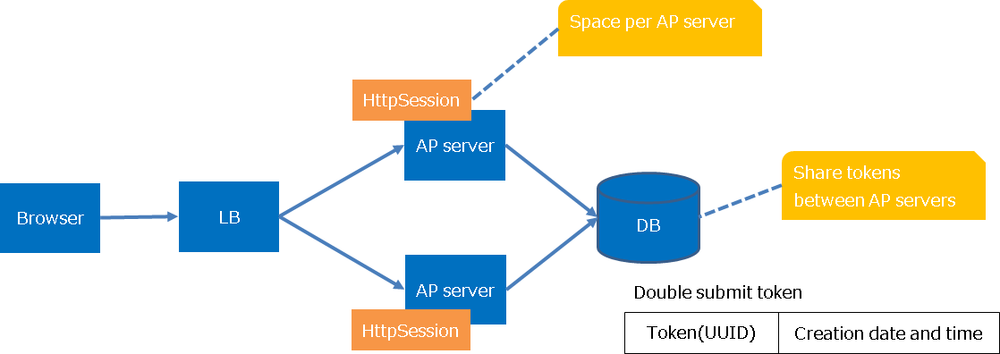

.. _`tag`:

Jakarta Server Pages Custom Tags
==================================================

.. contents:: Table of contents
  :depth: 3
  :local:

.. toctree::
  :maxdepth: 1
  :hidden:

  tag/tag_reference

.. tip::
  This function was called "JSP Custom Tags" until Nablarch5.
  However, as Java EE was transferred to the Eclipse Foundation and the specification name changed, the name was changed to "Jakarta Server Pages Custom Tags".

  Only the name has changed, there is no functional difference.

  For other features renamed in Nablarch 6, see :ref:`renamed_features_in_nablarch_6`.

This function provides custom tags supporting creation of screens for web applications.

Custom tags have the following limitations:

* They function in web containers supporting Jakarta Server Pages 3.1 and above.
* They use Jakarta Standard Tag Library for controlling conditional branches and loops etc.
* They support attributes compatible with XHTML 1.0 Transitional. 
* It is required to have JavaScript in the client. (See :ref:`tag-onclick_override`)
* Some custom tags cannot be used with GET request. (See :ref:`tag-using_get`)

.. important::
 Attributes added in HTML5 can be described using :ref:`dynamic attribute <dynamic_attribute>` .
 However, the following attributes that are likely to be used frequently are defined as custom tag attributes in advance.
 In addition, each input element added in HTML5 has the following tags added based on :ref:`tag-text_tag` .
 Since the attributes specific to each input element are not defined individually in the custom tag, they need to be specified by dynamic attributes.

 * added attributes (Write the HTML tag name with the attribute added in the parentheses.)

  * autocomplete(input、password、form)
  * autofocus(input、textarea、select、button)
  * placeholder(text、password、textarea)
  * maxlength(textarea)
  * multiple(input)

 * added input elements
  
  * :ref:`tag-search_tag` (search)
  * :ref:`tag-tel_tag` (tel)
  * :ref:`tag-url_tag` (URL)
  * :ref:`tag-email_tag` (email)
  * :ref:`tag-date_tag` (date)
  * :ref:`tag-month_tag` (month)
  * :ref:`tag-week_tag` (week)
  * :ref:`tag-time_tag` (time)
  * :ref:`tag-datetimeLocal_tag` (datetimeLocal)
  * :ref:`tag-number_tag` (number)
  * :ref:`tag-range_tag` (range)
  * :ref:`tag-color_tag` (color)

.. important::
 Custom tags are meant for web applications in which simple screen transition as shown below is performed.
 For this reason, custom tags are not compatible with creation of screens with rich content focusing on operability and SPAs (Single Page Application).

 * Search screen → Search/Detail Display based on detail screen
 * Register/Update/Delete using Input Screen → Confirmation Screen → Completion Screen
 * Input assistance by pop-up (separate windows and separate tabs)

 When JavaScript is frequently used in a project,
 be careful so that JavaScript output by the custom tags and JavaScript created in the project do not produce any side effects.
 Refer to :ref:`tag-onclick_override` for JavaScript output by the custom tags.

Function overview
---------------------------------------------------------------------

Prevent omission of HTML escape
~~~~~~~~~~~~~~~~~~~~~~~~~~~~~~~~~~~~~~~~~~~~~~~~~~~~~~~~~~~~~~~~~~~~~
In HTML, characters such as "<", ">" and """ have a special meaning. Hence,
if values containing these characters are output as it is in JSP,
then a malicious user can easily inject a script, which leads to a vulnerability called Cross-Site Scripting (XSS).
Therefore, perform HTML escape when input values are output.

However, if values are output using EL expression in JSP, HTML escape is not performed.
For this reason, when values are output, it is always necessary that HTML escape is taken into consideration during implementation, which leads to reduced productivity.

Since HTML escape is performed by default in custom tags,
as long as custom tags are used for implementation, HTML escape cannot be skipped.

.. important::
  Since escape processing is not provided for JavaScript,
  dynamic values (input data, etc.) must not be embedded in the part where JavaScript is written, such as the script tag body and onclick attribute, etc.
  When embedding dynamic values (such as input data, etc.) in the part where JavaScript is written, the escape process should be performed at a project level.

See below for details of HTML escape.

* :ref:`tag-html_escape`
* :ref:`tag-html_unescape`

Reduce implementation by having common JSP for input screen and confirmation screen
~~~~~~~~~~~~~~~~~~~~~~~~~~~~~~~~~~~~~~~~~~~~~~~~~~~~~~~~~~~~~~~~~~~~~~~~~~~~~~~~~~~~~~~~~~~~~~~~~~~~~
In many systems, the layout is the same for input screen and confirmation screen,
and similar JSPs are created.

Since custom tags provide a function by which it is possible to have common JSP for input screen and confirmation screen,
confirmation screen can be created by adding only the features (e.g. buttons etc.) that are specific to the confirmation screen on the JSP
created for the input screen, and improvement in productivity can be expected.

See below for how to create a common JSP for input screen and confirmation screen.

* :ref:`tag-make_common`

Module list
---------------------------------------------------------------------
.. code-block:: xml

  <dependency>
    <groupId>com.nablarch.framework</groupId>
    <artifactId>nablarch-fw-web-tag</artifactId>
  </dependency>

  <!-- Only when using hidden encryption -->
  <dependency>
    <groupId>com.nablarch.framework</groupId>
    <artifactId>nablarch-common-encryption</artifactId>
  </dependency>

  <!-- Only when using file download -->
  <dependency>
    <groupId>com.nablarch.framework</groupId>
    <artifactId>nablarch-fw-web-extension</artifactId>
  </dependency>

How to use
---------------------------------------------------------------------

.. tip::
 Since all attributes have not been described in the description of custom tags,
 refer to :ref:`tag_reference` for attributes that can be specified for each custom tag.

.. _`tag-setting`:

Configure custom tags
~~~~~~~~~~~~~~~~~~~~~~~~~~~~~~~~~~~~~~~~~~~~~~~~~~~~~~~~~~~~~~~~~~~~~
Custom tags are configured
using :ref:`nablarch_tag_handler`
and :java:extdoc:`CustomTagConfig<nablarch.common.web.tag.CustomTagConfig>`.

:ref:`nablarch_tag_handler`
 Handler for pre-process that is required for the following functions when processing of requests that use custom tags.
 Configuring this handler is required when using custom tags.

 * :ref:`tag-checkbox_off_value`
 * :ref:`tag-hidden_encryption`
 * :ref:`tag-submit_change_parameter`
 * :ref:`tag-composite_key`

 Refer to :ref:`nablarch_tag_handler` for values to be configured in this handler.

:java:extdoc:`CustomTagConfig<nablarch.common.web.tag.CustomTagConfig>`
 Class in which default values of custom tags are configured.
 Sometimes, for custom tag attributes such as label pattern etc. of a selection item,
 default values that are standardized throughout the application rather than configuring the values each time on individual screens may be required.
 Therefore, the default values of custom tags are configured in this class.

 For configuration of default values, add this class to component definition with the name ``customTagConfig``.
 For configuration items, refer to :java:extdoc:`CustomTagConfig<nablarch.common.web.tag.CustomTagConfig>`.

.. _`tag-specify_taglib`:

Using custom tags (method of specifying taglib directive)
~~~~~~~~~~~~~~~~~~~~~~~~~~~~~~~~~~~~~~~~~~~~~~~~~~~~~~~~~~~~~~~~~~~~~
Since it is assumed that custom tags and JSTL will be used, specify the taglib directive for each.

.. code-block:: jsp

 <%@ taglib prefix="c" uri="jakarta.tags.core" %>
 <%@ taglib prefix="n" uri="http://tis.co.jp/nablarch" %>

.. _`tag-input_form`:

Create an input form
~~~~~~~~~~~~~~~~~~~~~~~~~~~~~~~~~~~~~~~~~~~~~~~~~~~~~~~~~~~~~~~~~~~~~
The input form is created using the following custom tags.
For more information on the custom tags listed below, see :ref:`tag_reference`.

* :ref:`tag-form_tag`
* Custom tag for input such as :ref:`tag-text_tag`
* Custom tags to submit such as :ref:`tag-submit_tag`
* Custom tag that displays error such as :ref:`tag-error_tag`

Points for creating an input form
 \

 Restoration of input values
  When the input form is redisplayed due to validation error etc., input values are restored from the request parameters associated with the custom tags.

 Output of the initial value
  To output the initial value in the input item, set the object with initial value set in the request scope of the action.
  Specify the name attribute such that the name attribute of the custom tag corresponds to the variable name in the request scope.
  Refer to :ref:`tag-access_rule` for details of the specification method and implementation example.

 Specifying submit URI
  In custom tags, each of the multiple buttons/links placed on a form can be submitted to a different URI.
  URIs to which buttons/links are submitted, are specified to uri attribute.
  Refer to :ref:`tag-specify_uri` for details of the specification method and implementation example.

Implementation examples
 \

 .. code-block:: jsp

  <n:form>
    

      <label>User ID</label>
      <n:text name="form.userId" />
      <n:error name="form.userId" messageFormat="span" errorCss="alert alert-danger" />
    

    

      <label>Password</label>
      <n:password name="form.password" />
      <n:error name="form.password" messageFormat="span" errorCss="alert alert-danger" />
    

    

      <n:submit type="submit" uri="/action/login" value="Login" />
    

  </n:form>

Output result
 \

 .. image:: images/tag/login_form.png

\

.. tip::

 .. _'tag-input_form_name_constraint':

 The name attribute of :ref:`tag-form_tag` has the following limitations:

 * Specify a unique name for the name attribute within the screen
 * Specify a value in accordance with the variable name syntax of JavaScript

 Specify a unique name for the name attribute within the screen
  In custom tags, JavaScript is used for controlling Submit.
  Refer to :ref:`tag-onclick_override` for JavaScript.

  In this JavaScript, name attribute of
  :ref:`tag-form_tag` is used for identifying the form to be submitted.
  Therefore, when specifying the name attribute of :ref:`tag-form_tag`,
  it is necessary to specify a unique name for the name attribute within the screen.

  If name attribute of :ref:`tag-form_tag` is not specified in the application,
  then the custom tag configures a unique value for the name attribute.

 Specify a value in accordance with the variable name syntax of JavaScript
  Since name attribute of :ref:`tag-form_tag` is used by JavaScript,
  it is necessary to specify a value in accordance with the variable name syntax of JavaScript.

  Variable name syntax
   * Starts with an English alphabet
   * Subsequent values are alphanumeric or underscores

.. _`tag-selection`:

Displaying selection items (pull-down/radio button/check box)
~~~~~~~~~~~~~~~~~~~~~~~~~~~~~~~~~~~~~~~~~~~~~~~~~~~~~~~~~~~~~~~~~~~~~
The following custom tags are used for selection items:

* :ref:`tag-select_tag` (pull-down)
* :ref:`tag-radio_buttons_tag` (multiple radio button)
* :ref:`tag-checkboxes_tag` (multiple checkboxes)

Configure the options list (list of objects having the labels and values of options) in the request scope for the action
and display the options list using the custom tags.

.. tip::
 Selection state is determined after performing :java:extdoc:`Object#toString <java.lang.Object.toString()>`
 for both selected value and option value.

Implementation examples
 \

 Option class
  \

  .. code-block:: java

   public class Plan {

       // Option values
       private String planId;

       // Option labels
       private String planName;

       public Plan(String planId, String planName) {
           this.planId = planId;
           this.planName = planName;
       }

       // Custom tags acquire the option values from this property.
       public String getPlanId() {
           return planId;
       }

       // Custom tags acquire the option labels from this property.
       public String getPlanName() {
           return planName;
       }
   }

 Action
  \

  .. code-block:: java

   // Configure the options list in the request scope.
   List<Plan> plans = Arrays.asList(new Plan("A", "Free"),
                                    new Plan("B", "Basic"),
                                    new Plan("C", "Premium"));

   // Custom tags acquire the options list from the request scope using the name specified here.
   context.setRequestScopedVar("plans", plans);

 Pull-down
  JSP
   .. code-block:: jsp

    <!--
      Access the contents of the options by specifying the following attributes.
      listName attribute: Name of the options list
      elementLabelProperty attribute: Property name showing the label
      elementValueProperty attribute: Property name showing the value
    -->
    <n:select name="form.plan1"
              listName="plans"
              elementLabelProperty="planName"
              elementValueProperty="planId" />

  Output HTML
   .. code-block:: html

    <!--
      When the value of "form.plan1" is "A".
    -->
    <select name="form.plan1">
      <option value="A" selected="selected">Free</option>
      <option value="B">Basic</option>
      <option value="C">Premium</option>
    </select>

 Radio button
  JSP
   .. code-block:: jsp

    <!—- Specification of the attribute is same as the select tag. -->
    <n:radioButtons name="form.plan2"
                    listName="plans"
                    elementLabelProperty="planName"
                    elementValueProperty="planId" />

  Output HTML
   .. code-block:: html

    <!--
     When the value of "form.plan2" is "B".
     Output using br tag if default.
     listFormat attribute can be specified and changed to div tag, span tag, ul tag, ol tag and space delimiter.
    -->
    <input id="nablarch_radio1" type="radio" name="form.plan2" value="A" />
    <label for="nablarch_radio1">Free</label> 
    <input id="nablarch_radio2" type="radio" name="form.plan2" value="B" checked="checked" />
    <label for="nablarch_radio2">Basic</label> 
    <input id="nablarch_radio3" type="radio" name="form.plan2" value="C" />
    <label for="nablarch_radio3">Premium</label> 

 Checkbox
  JSP
   .. code-block:: jsp

    <!—- Specification of the attribute is same as the select tag. -->
    <n:checkboxes name="form.plan4"
                  listName="plans"
                  elementLabelProperty="planName"
                  elementValueProperty="planId" />

  Output HTML
   .. code-block:: html

    <!--
     When the value of "form.plan4" is "C".
     Output using br tag if default.
     listFormat attribute can be specified and changed to div tag, span tag, ul tag, ol tag and space delimiter.
    -->
    <input id="nablarch_checkbox1" type="checkbox" name="form.plan4" value="A"
           checked="checked" />
    <label for="nablarch_checkbox1">Free</label> 
    <input id="nablarch_checkbox2" type="checkbox" name="form.plan4" value="B" />
    <label for="nablarch_checkbox2">Basic</label> 
    <input id="nablarch_checkbox3" type="checkbox" name="form.plan4" value="C" />
    <label for="nablarch_checkbox3">Premium</label> 

.. important::
 While on one hand, :ref:`tag-radio_buttons_tag` and :ref:`tag-checkboxes_tag`
 can easily output selection items, on the other hand, all options are output in the custom tags;
 hence there is always a limitation on the HTML that is output.
 When design cannot be controlled in the project, such as carrying out development based on the HTML created by a design company,
 there are cases where the HTML output by :ref:`tag-radio_buttons_tag` and :ref:`tag-checkboxes_tag` does not match with the design.

 In such cases, if implementation is carried out using c:forEach tag of JSTL and :ref:`tag-radio_tag` or :ref:`tag-checkbox_tag`,
 then HTML displaying the options can be implemented without restriction.

 .. code-block:: jsp

  <c:forEach items="${plans}" var="plan">
    <!-- HTML of users choice can be added before and after. -->
    <n:radioButton name="form.plan3" label="${plan.planName}" value="${plan.planId}" />
  </c:forEach>

.. _`tag-checkbox_off_value`:

Specify the value for unchecked checkboxes
~~~~~~~~~~~~~~~~~~~~~~~~~~~~~~~~~~~~~~~~~~~~~~~~~~~~~~~~~~~~~~~~~~~~~
In the HTML checkbox tag, request parameter is not sent when checkboxes are unchecked.
When using the checkbox tag for a single input item, the checkbox tag often corresponds to a data item expressed as a flag in the database,
and usually some value is configured to it even in the unchecked state.
Therefore, a function is provided in the :ref:`tag-checkbox_tag`, which enables specification of a value corresponding to the unchecked state.

Implementation examples
 .. code-block:: jsp

  <!--
   By specifying the following attribute, actions in the case of unchecked state are controlled.
   useOffValue attribute: Whether to use the value configuration without the checkmark. Default is true
                          Specify false in the case of multiple selection for bulk deletion, etc.
   offLabel attribute: The label used when there is no checkmark.
                       The label displayed on the confirmation screen when a common JSP is used for the input and confirmation screens.
   offValue attribute: The value used when there is no checkmark. Default is 0.
  -->
  <n:checkbox name="form.useMail" value="true" label="Used"
              offLabel="Not used" offValue="false" />

.. tip::
 This function is implemented using :ref:`nablarch_tag_handler` and :ref:`hidden encryption <tag-hidden_encryption>`.
 When the checkbox tag is output, the value corresponding to the unchecked state is output in the hidden tag,
 and when :ref:`nablarch_tag_handler` receives the request, the value corresponding to the unchecked state is configured in the request parameter
 only if the checkbox tag is unchecked.

.. _`tag-window_scope`:

Retaining the input data across screens (window scope)
~~~~~~~~~~~~~~~~~~~~~~~~~~~~~~~~~~~~~~~~~~~~~~~~~~~~~~~~~~~~~~~~~~~~~
.. important::
 There are two methods to retain input data, the method explained here,
 in which window scope is used, and the method in which :ref:`session_store` of library is used.
 :ref:`session_store` should be used to retain input data across screens for the following reasons:

 * In window scope, a Bean cannot be stored as it is, since data is retained in key/value pairs.
   If data retained by a Bean is to be stored, the data will be fragmented, and implementation will become very complicated.

   .. code-block:: java

    // Let us assume such a Bean.
    Person person = new Person();
    person.setName("Name");
    person.setAge("Age");

    // Set to window scope (when done using action)
    request.setParam("person.name", person.getName());
    request.setParam("person.age", person.getAge());

    // Set to window scope (when done using JSP)
    <n:hidden name="person.name" />
    <n:hidden name="person.age" />

 * Since input data is configured to the window scope by specifying custom tag attributes, movement of data is difficult to comprehend. (degree of difficulty of implementation is high)

Input data is retained on the client as hidden tag.
Compared to retaining the data in the server (session), when data is retained on the client, there are less restrictions on using the browser,
such as use of multiple windows and use of the back button on the browser, and it becomes possible to have a flexible screen design.

The storage destination of data retained in the client is called a window scope.
The data in the window scope is encrypted using :ref:`hidden encryption<tag-hidden_encryption>`.

.. important::
 The data in the window scope is encrypted using :ref:`hidden encryption<tag-hidden_encryption>` and output in the hidden tag.
 Therefore, the contents of the window scope cannot be overwritten in the client, such as overwriting with the data acquired using Ajax.

Data is configured to the window scope by specifying windowScopePrefixes attribute of :ref:`tag-form_tag`.

.. important::
 When windowScopePrefixes attribute is specified, among the request parameters,
 those with **prefix match** of the parameter name matching
 with the value specified for this attribute are configured to the window scope.

 For example, if ``windowScopePrefixes="user"`` is specified,
 then the parameters that start with ``users`` are also configured to the window scope.

Implementation examples
 Search condition of search function and input data of update function are retained across screens.
 Screen transition and movement of the data stored in hidden are as follows:

 .. image:: images/tag/window_scope.png

 \ The request parameter of the search condition is ``searchCondition.*``
 and that of the input data is ``user.*``.

 Search screen
  .. code-block:: jsp

   <!-- Data in the window scope is not sent. -->
   <n:form>

 Update screen
  .. code-block:: jsp

   <!-- Only search condition is sent. -->
   <n:form windowScopePrefixes="searchCondition">

 Update confirmation screen
  .. code-block:: jsp

   <!--
     Search condition and input data are sent.
     When specifying more than one, separate by comma.
   -->
   <n:form windowScopePrefixes="searchCondition,user">

 Update completion screen
  .. code-block:: jsp

   <!-- Only search condition is sent. -->
   <n:form windowScopePrefixes="searchCondition">

.. important::
 Data in the database should be kept to the necessary minimum, such as the primary key for identifying the data to be updated, data for optimistic locking, etc.
 Especially, data that is displayed on the input screen and confirmation screen (items only to be displayed and not the input items)
 should be acquired from the database whenever required rather than passing the data using hidden.
 If there is too much of data in hidden, communication speed will decrease and this can result in insufficient memory.

.. important::
 The data stored in the window scope is output in the hidden tag and passed across screens as request parameters.
 Therefore, when using the data stored in the window scope for the action,
 it is necessary to perform :ref:`validation<validation>`.

.. tip::
 In :ref:`tag-form_tag`, instead of uniform output of all request parameters in the hidden tag,
 request parameters that have already been output as input items are excluded from the output in the hidden tag.

.. tip::
 Information such as login information, that is necessary for all tasks is retained in the server (session).

.. _`tag-hidden_encryption`:

Encryption of data held in the client (hidden encryption)
~~~~~~~~~~~~~~~~~~~~~~~~~~~~~~~~~~~~~~~~~~~~~~~~~~~~~~~~~~~~~~~~~~~~~
The values of :ref:`window scope<tag-window_scope>` and :ref:`tag-hidden_tag`
can be tampered with in the client or can be easily referenced from the HTML source.
For this reason, hidden encryption function is provided in the custom tags with the goal to prevent the hidden tag from being tampered or referenced.

Encryption is performed for all :ref:`tag-form_tag`, and decryption and tampering check are performed for all requests by default.
Therefore, the application programmer need not implement hidden encryption function.

.. important::

 Since the specifications are complicated and cannot be used easily, and also, since the use of encrypted data,
 such as the data in the :ref:`window scope <tag-window_scope>` is deprecated, this function is also deprecated.
 Therefore, :ref:`useHiddenEncryption <tag-use_hidden_encryption>` should be configured to ``false``, unless there is a particular reason.

hidden encryption
 Hidden encryption is implemented via :ref:`tag-form_tag` and :ref:`nablarch_tag_handler`.
 The image of hidden encryption process is shown below:
 Encryption is performed through :ref:`tag-form_tag`, and decryption and tampering check are performed via :ref:`nablarch_tag_handler`.

 .. image:: images/tag/hidden_encryption.png

 \

Encryption process
 Encryption is performed by the class that implements :java:extdoc:`Encryptor <nablarch.common.encryption.Encryptor>` interface.
 In the framework, ``AES (128bit)`` is used as a default encryption algorithm.
 To change the encryption algorithm, add the class that implements
 :java:extdoc:`Encryptor <nablarch.common.encryption.Encryptor>`
 to the component definition with the name ``hiddenEncryptor``.

 In encryption, for each :ref:`tag-form_tag`, the following data contained in :ref:`tag-form_tag` is collectively encrypted
 and output in 1 hidden tag.

 * Hidden parameter specified explicitly using the custom tag :ref:`tag-hidden_tag`
 * Value of the :ref:`window scope<tag-window_scope>`
 * Request ID specified in the :ref:`custom tag that performs submit <tag_reference_submit>`
 * :ref:`Parameter<tag-submit_change_parameter>` added in the :ref:`custom tag that performs submit <tag_reference_submit>`

 In encryption, a hash value generated from the above data is included to detect tampering.
 The request ID is used to detect tampering when encrypted values are replaced across different input forms,
 while the hash value is used for detecting tampering by overwriting of values.
 The encrypted data is encoded using BASE64 and output in the hidden tag.

 .. tip::
  Since the hidden parameter explicitly specified in the custom tag :ref:`tag-hidden_tag` is included in the encryption,
  the value cannot be manipulated using JavaScript in the client.
  To manipulate the hidden parameter using JavaScript in the client,
  output the unencrypted hidden tag, using :ref:`tag-plain_hidden_tag`.

.. _`tag-hidden_encryption_decryption`:

Decryption process
 The decryption process is performed through :ref:`nablarch_tag_handler`.
 The following cases are judged as tampering by the :ref:`nablarch_tag_handler`, and the screen is transitioned to the screen specified in the configuration.

 * Encrypted hidden parameter (nablarch_hidden) does not exist.
 * Decoding of BASE64 fails.
 * Decryption fails.
 * The hash value generated during encryption and hash value generated using the decrypted value do not match.
 * The request ID added during encryption and request ID of the received request do not match.

Storage location of the key used for encryption
 The key used for encryption is generated for each session to minimize the expiry interval of the key as much as possible.
 Therefore, if the same user logs in again, the process cannot be continued from the screen used before the login.

hidden encryption configuration
 In hidden encryption, the following can be configured by :ref:`tag-setting`:

 .. _tag-use_hidden_encryption:

 useHiddenEncryption property
  Whether to use hidden encryption.
  Default is true.

 noHiddenEncryptionRequestIds property
  Request ID for which hidden encryption is not performed.

 Specify the requests for which hidden encryption cannot be used, to noHiddenEncryptionRequestIds property, as shown below:

 * Requests such as login screen, which serve as entry to an application
 * Requests transitioning from bookmarks
 * Requests transitioning from external sites

 Since these requests do not have the encrypted hidden parameter (nablarch_hidden)
 or the key generated for each session, a tampering error will occur if noHiddenEncryptionRequestIds property is not configured.

 The value configured in the noHiddenEncryptionRequestIds property is referenced by
 :ref:`tag-form_tag` and :ref:`nablarch_tag_handler`
 when performing the encryption and decryption process respectively.

 :ref:`tag-form_tag`
  Encryption is performed if at least one request ID to be encrypted is included in the :ref:`tag-form_tag`.
  Conversely, if a request ID to be encrypted is not included, encryption is not performed for the :ref:`tag-form_tag`.

 :ref:`nablarch_tag_handler`
  Decryption is performed only when the requested request ID has been encrypted.

.. _`tag-composite_key`:

Creating radio buttons and checkboxes associated with a composite key
~~~~~~~~~~~~~~~~~~~~~~~~~~~~~~~~~~~~~~~~~~~~~~~~~~~~~~~~~~~~~~~~~~~~~~~~~~~~~~~~~~~~~~~~
When selecting data on the list screen, radio buttons and checkboxes are used.
If a single value identifies the data, then :ref:`tag-radio_tag` and :ref:`tag-checkbox_tag` can be used,
however, implementation is not easy in the case of a composite key.

In custom tags, radio buttons and checkboxes supporting composite keys are provided.

* :ref:`tag-composite_key_radio_button_tag` (radio button supporting composite keys)
* :ref:`tag-composite_key_checkbox_tag` (checkbox supporting composite keys)

.. important::
 To use this function, it is necessary to add
 :java:extdoc:`CompositeKeyConvertor <nablarch.common.web.compositekey.CompositeKeyConvertor>` and
 :java:extdoc:`CompositeKeyArrayConvertor <nablarch.common.web.compositekey.CompositeKeyArrayConvertor>`
 to the component definition.
 For the configuration method, refer to :ref:`nablarch_validation-definition_validator_convertor`.

.. important::
 This function works only with :ref:`nablarch_validation` as
 :java:extdoc:`CompositeKeyConvertor <nablarch.common.web.compositekey.CompositeKeyConvertor>` and
 :java:extdoc:`CompositeKeyArrayConvertor <nablarch.common.web.compositekey.CompositeKeyArrayConvertor>`
 are used.
 Does not support :ref:`bean_validation`.

Implementation examples
 Implementation method is explained based on an example in which a checkbox with a composite key is used for list display.

 Form
  In the form,
  property that holds the composite key is defined as
  :java:extdoc:`CompositeKey<nablarch.common.web.compositekey.CompositeKey>`.

  .. code-block:: java

   public class OrderItemsForm {

       // This time, since a composite key for multiple data is received in the list display,
       // it is defined as a string.
       public CompositeKey[] orderItems;

       // Getter, constructor, etc. are omitted.

       // Specify the size of the composite key in the CompositeKeyType annotation.
       @CompositeKeyType(keySize = 2)
       public void setOrderItems(CompositeKey[] orderItems) {
           this.orderItems = orderItems;
       }
   }

 JSP
  .. code-block:: jsp

   <table>
     <thead>
       <tr>
         <!-- Header output is omitted. -->
       </tr>
     </thead>
     <tbody>
       <c:forEach var="orderItem" items="${orderItems}">
       <tr>
         <td>
           <!--
             Specify the following attributes.
             name attribute: Specify according to the property name of the form.
             valueObject attribute: Specify the object having the value of the composite key.
             keyNames attribute: Specify the property name used when getting the value of the composite key
                                 from the object specified in the valueObejct attribute.
                                 Set to the CompositeKey in the order specified here.
             namePrefix attribute: Used when expanding the value of the composite key in request parameters
                                   Specify a prefix.
                                   It is necessary to specify a value that is different from the name attribute.
           -->
           <n:compositeKeyCheckbox
             name="form.orderItems"
             label=""
             valueObject="${orderItem}"
             keyNames="orderId,productId"
             namePrefix="orderItems" />
         </td>
         <!-- Rest is omitted-->
       </tr>
       </c:forEach>
     </tbody>
   </table>

.. _`tag-submit`:

Submitting a form from multiple buttons/links
~~~~~~~~~~~~~~~~~~~~~~~~~~~~~~~~~~~~~~~~~~~~~~~~~~~~~~~~~~~~~~~~~~~~~
Form submission is supported by buttons and links, and is performed using the following custom tags:
Multiple buttons and links can be placed on one form.

Submit form
 | :ref:`tag-submit_tag` (button of input tag)
 | :ref:`tag-button_tag` (button of button tag)
 | :ref:`tag-submit_link_tag` (link)

Open another window and submit (pop-up)
 | :ref:`tag-popup_submit_tag` (button of input tag)
 | :ref:`tag-popup_button_tag` (button of button tag)
 | :ref:`tag-popup_link_tag` (link)

Submit for download
 | :ref:`tag-download_submit_tag` (button of input tag)
 | :ref:`tag-download_button_tag` (button of button tag)
 | :ref:`tag-download_link_tag` (link)

Tags with the tag name starting with ``popup`` open a new window
and perform submit for the opened window.
Tags with the tag name starting with ``download`` perform submit for download.
See below for details of each.

* :ref:`tag-submit_popup`
* :ref:`tag-submit_download`

In these custom tags, name attribute and uri attribute are specified to link the buttons/links with URI.
name attribute specifies a unique name within a form.If name attribute is not specified, then a unique name is automatically output in the custom tag.
Refer to :ref:`tag-specify_uri` for the method to specify uri attribute.

Implementation examples
 .. code-block:: jsp

  <!—- name attribute is automatically output and need not be specified. -->
  <n:submit type="submit" uri="login" value="Login" />

.. _`tag-onclick_override`:

Adding a process before submission
~~~~~~~~~~~~~~~~~~~~~~~~~~~~~~~~~~~~~~~~~~~~~~~~~~~~~~~~~~~~~~~~~~~~~
Form submission is implemented by assembling the URI for each button/link using JavaScript.
The custom tags output this JavaScript function in the global area
and output the HTML with the function call configured to the onclick attribute of the button/link.

.. _`tag-submit_function`:

Signature of the JavaScript function output by the custom tag
 .. code-block:: javascript

  /**
   * @param event Event object
   * @param element Event source element (button or link). If not specified, the element of the event source is obtained from the first argument, event, in the order of precedence of the currentTarget and target properties.
   * @return Always false as the event is not propagated
   */
  function nablarch_submit(event, element)

An output example is shown below.

JSP
 .. code-block:: jsp

  <n:form>
    <!-- Omitted -->
    <n:submit type="submit" uri="login" value="Login" />
  </n:form>

HTML
 .. code-block:: html

  
  <form name="nablarch_form1" method="post">
    <!-- JavaScript function for submission control is set to the onclick attribute. -->
    <input type="submit" name="nablarch_form1_1" value="Login"
           onclick="return window.nablarch_submit(event, this);" />
  </form>

To add a process before submission, specify the JavaScript function created in the application to the onclick attribute.
When the onclick attribute is specified, the custom tag does not specify the JavaScript function for submission.
In such cases, it is necessary to call the :ref:`JavaScript function <tag-submit_function>` configured by the custom tag, using the JavaScript created in the application.

.. important::
  When complying with the Content Security Policy (CSP), JavaScript directly in the onclick attribute will use
  ``unsafe-inline`` or ``unsafe-hashes``, which will reduce the level of security.
  For this reason, it is recommended that additional processing be implemented in external scripts or script elements
  with nonce attributes according to the :ref:`tag-content_security_policy` procedure.

Implementation examples
 A confirmation dialog box is displayed before submission.

 JavaScript
  .. code-block:: javascript

   function popUpConfirmation(event, element) {
     if (window.confirm("Will register. Are you sure?")) {
       // Explicitly call the JavaScript function output by the custom tag.
       return nablarch_submit(event, element);
     } else {
       // Cancel
       return false;
     }
   }

 JSP
  .. code-block:: jsp

   <n:submit type="submit" uri="register" value="Register"
             onclick="return popUpConfirmation(event, this);" />

.. _`tag-onchange_submit`:

Trigger submit on screen operations such as changing the selection in a pull-down
~~~~~~~~~~~~~~~~~~~~~~~~~~~~~~~~~~~~~~~~~~~~~~~~~~~~~~~~~~~~~~~~~~~~~~~~~~~~~~~~~~~~~~~~~~
The custom tags use JavaScript for submission control,
and operate on the premise that the JavaScript function for submission control is specified in the event handler of a button or a link (onclick attribute).
Refer to :ref:`tag-onclick_override` for JavaScript details.

Therefore, to trigger submit on a screen operation such as changing the selection in a pull-down, generate the click event of the corresponding submit button.

.. important::
  When complying with the Content Security Policy (CSP), JavaScript directly in the onclick attribute will use
  ``unsafe-inline`` or ``unsafe-hashes``, which will reduce the level of security.
  For this reason, it is recommended that additional processing be implemented in external scripts or script elements
  with nonce attributes according to the :ref:`tag-content_security_policy` procedure.

The implementation example of submission with change of a pull-down is shown.

Implementation examples
 .. code-block:: jsp

  <!-- Call the click function of the corresponding submit button element using the onchange attribute. -->
  <n:select name="form.plan"
            listName="plans"
            elementLabelProperty="planName"
            elementValueProperty="planId"
            onchange="window.document.getElementById('register').click(); return false;" />

  <n:submit id="register" type="submit" uri="register" value="Register" />

 .. important::
  In the above implementation example, JavaScript is written directly in the onchange event handler because it is easy to explain,
  however, in a live project, it is recommended to dynamically bind the process by using the open source JavaScript library, etc.

.. _`tag-submit_change_parameter`:

Adding parameters for each button/link
~~~~~~~~~~~~~~~~~~~~~~~~~~~~~~~~~~~~~~~~~~~~~~~~~~~~~~~~~~~~~~~~~~~~~
At the time of transition from the list screen to the details screen in the update function, etc.,
displaying links with the same URL but different parameters may be required.

Custom tags are provided for adding parameters for each button or link on the form.

* :ref:`tag-param_tag` (specification of parameters to be added at the time of submission)

Implementation examples
 Add parameters for each link on the list screen based on the search results.

 .. code-block:: jsp

  <n:form>
    <table>
      <!-- Table header row is omitted  -->
      <c:forEach var="person" items="${persons}">
        <tr>
          <td>
            <n:submitLink uri="/action/person/show">
              <n:write name="person.personName" />
              <!-- "personId" is specified in the parameter name. -->
              <n:param paramName="personId" name="person.personId" />
            </n:submitLink>
          </td>
        </tr>
      </c:forEach>
    </table>
  </n:form>

.. important::
 When adding parameters, the volume of request data increases depending on the number of parameters.
 Therefore, when adding parameters for each link on the list screen to the details screen,
 add only minimum required parameters, such as adding only the primary key as parameter, etc.

.. _`tag-submit_display_control`:

Switching between display/no display of the button/link depending on permission check/service availability
~~~~~~~~~~~~~~~~~~~~~~~~~~~~~~~~~~~~~~~~~~~~~~~~~~~~~~~~~~~~~~~~~~~~~~~~~~~~~~~~~~~~~~~~~~~~~~~~~~~~~~~~~~~~~~~~~~~
A function is provided for switching the display of the :ref:`button/link for submitting a form<tag_reference_submit>`,
depending on the result of :ref:`permission_check` and :ref:`service_availability`.
By doing this, it is possible to determine whether the said function can be used before the user selects the button/link, thereby improving usability.

:ref:`permission_check` and :ref:`service_availability` are performed for the request ID
specified in the :ref:`button/link for submitting a form<tag_reference_submit>`
and the display is switched when there is ``no permission`` or ``service is unavailable``.

There are 3 patterns for switching the display method:

No display
 Tags are not output.

Disabled
 Tags are disabled.
 For buttons, disabled attribute is enabled.
 For links, either only the label is displayed or JSP for displaying an inactive link is included.
 To include JSP, specify
 :java:extdoc:`submitLinkDisabledJsp property<nablarch.common.web.tag.CustomTagConfig.setSubmitLinkDisabledJsp(java.lang.String)>`
 in :ref:`tag-setting`.

Normal display
 Tags are output as usual.
 Display method is not switched.

The default is ``Normal display``.
Default can be changed by specifying
:java:extdoc:`displayMethod property <nablarch.common.web.tag.CustomTagConfig.setDisplayMethod(java.lang.String)>`
in :ref:`tag-setting`.

To change the display method individually, specify in the displayMethod attribute.

Implementation examples
 .. code-block:: jsp

  <!--
    Specify one of the NODISPLAY, DISABLED and NORMAL.
    This tag is always displayed.
  -->
  <n:submit type="button" uri="login" value="Login" displayMethod="NORMAL" />

.. tip::
 To change the judgment process used for display control in the application,
 refer to :ref:`tag-submit_display_control_change`.

.. _`tag-submit_popup`:

Creating a button/link to open a separate window/tab (pop-up)
~~~~~~~~~~~~~~~~~~~~~~~~~~~~~~~~~~~~~~~~~~~~~~~~~~~~~~~~~~~~~~~~~~~~~
Sometimes, multiple windows are required to be opened for improving operability.
For example, there are cases where the search screen is opened in a separate window to perform input assistance such as searching a mailing address from the zip code input field.

There are custom tags that support opening of multiple windows (hereinafter referred to as pop-up tags).

* :ref:`tag-popup_submit_tag` (button of input tag)
* :ref:`tag-popup_button_tag` (button of button tag)
* :ref:`tag-popup_link_tag` (link)

.. important::

  These tags are not recommended due to the following problems:

  * When a link or button is created to an external site, the page is not opened in a new window in some browsers. (for example, this occurs when IE protection mode is enabled)

    This problem can be avoided by using :ref:`tag-a_tag` or HTML tags.

  * Screen transition using a sub-window is less convenient.

    The architecture of displaying a pop-up window on a page is common, and search using a sub-window is now obsolete.
    Display process of a pop-up window on a page can be handled by using an open source library.

The pop-up tags differ from the custom tags that are associated with submit of the form on the screen, in the following aspects:

* A new window is opened and submit is performed for the opened window.
* Parameter names of input items can be changed.

Popups are implemented using the JavaScript window.open function.

Implementation examples
 A search button that opens a window in a specified style is created.

 .. code-block:: jsp

  <!--
    The operation to open the window is controlled by the following attribute specifications.
    popupWindowName attribute: Window name of pop-up:
                               Specified to the second argument of the window.open function when opening a new window.
    popupOption attribute: Pop-up option information.
                           Specify to the third argument of the window.open function when opening a new window.
  -->
  <n:popupButton uri="/action/person/list"
                 popupWindowName="postalCodeSupport"
                 popupOption="width=400, height=300, menubar=no, toolbar=no, scrollbars=yes">
    Search
  </n:popupButton>

If the popupWindowName attribute is not specified, then the default value specified in
:java:extdoc:`popupWindowName property <nablarch.common.web.tag.CustomTagConfig.setPopupWindowName(java.lang.String)>`
by the :ref:`tag-setting` is used.
If no default value is configured, the custom tag uses the current time (milliseconds) acquired from the JavaScript date function for the name of the new window.
The default action of a pop-up is determined as follows depending on whether the default value is specified.

 When a default value is specified
  Only one window is opened since the same window name is always used.

 When a default value is not specified
  Always a new window is opened since every time a different window name is used.

.. _`tag-submit_change_param_name`:

Parameter name change
 The pop-up tags dynamically add and submit all input elements contained in the form of the source screen.
 The parameter names do not always match in the action of the window opened by the pop-up tag and action of the source screen.
 Therefore, the following custom tags are provided to change the parameter names of input items on the source screen.

 * :ref:`tag-change_param_name_tag` (change parameter name when submitting for pop-up)

 Implementation examples
  The screen image is shown below.

  .. image:: images/tag/popup_postal_code.png

  \

  When the search button is selected, a different window is opened for searching the mailing address corresponding to the number entered in the zip code field.

  .. code-block:: jsp

   <n:form>
     

       <label>Postal code</label>
       <n:text name="form.postalCode" />
       <n:popupButton uri="/action/postalCode/show">
         Search
         <!--
           Change the zip code parameter name "form.postalCode" to "condition.postalCode".
         -->
         <n:changeParamName inputName="form.postalCode" paramName="condition.postalCode" />
         <!--
           Parameters can also be added.
         -->
         <n:param paramName="condition.max" value="10" />
       </n:popupButton>
     

   </n:form>

.. _`tag-submit_access_open_window`:

How to access open windows
 When there is a screen transition from the source screen while other windows are open, access the window opened by the application may be required,
 by closing all windows that are unnecessary at the time of source screen transition.
 Therefore, custom tags hold a reference to the opened windows in a JavaScript global variable.
 The variable name in which the opened windows are retained is shown below:

 .. code-block:: javascript

  // key is the window name
  var nablarch_opened_windows = {};

 The implementation example when closing all windows that become unnecessary during source screen transition, is shown below.

 .. code-block:: javascript

  // Bind to the onunload event handler.
  // Call close function of the windows held in nablarch_opened_windows variable.
  onunload = function() {
    for (var key in nablarch_opened_windows) {
      var openedWindow = nablarch_opened_windows[key];
      if (openedWindow && !openedWindow.closed) {
        openedWindow.close();
      }
    }
    return true;
  };

.. _`tag-submit_download`:

Creating a button/link to download a file
~~~~~~~~~~~~~~~~~~~~~~~~~~~~~~~~~~~~~~~~~~~~~~~~~~~~~~~~~~~~~~~~~~~~~
To create a button/link for file download,
the custom tags that submit exclusively for download (hereinafter referred to as download tags)
and the :java:extdoc:`HttpResponse <nablarch.fw.web.HttpResponse>` subclass
that facilitates the implementation of the action (hereinafter referred to as download utility) are provided.

Download tags
 * :ref:`tag-download_submit_tag` (button of input tag)
 * :ref:`tag-download_button_tag` (button of button tag)
 * :ref:`tag-download_link_tag` (link)

Download utility
 :java:extdoc:`StreamResponse <nablarch.common.web.download.StreamResponse>`
  This class generates HTTP response message from stream.
  Used to download binary data stored in a file in the file system or in a BLOB column of a database.
  Supports download of :java:extdoc:`File <java.io.File>` or :java:extdoc:`Blob <java.sql.Blob>`.

 :java:extdoc:`DataRecordResponse <nablarch.common.web.download.DataRecordResponse>`
  This class generates HTTP response message from a data record.
  Used to download data used in the application, such as search result etc.
  The downloaded data is formatted using :ref:`data_format`.
  Supports download of Map<String, ?> type data (:java:extdoc:`SqlRow <nablarch.core.db.statement.SqlRow>`, etc.)

.. important::
 Since custom tags use JavaScript for form submission control,
 if downloaded by submitting the form (:ref:`tag-submit_tag`, etc.) on the screen,
 other submissions in the same form stop functioning.
 For this reason, download tags are provided in the custom tags for submitting without affecting the form on the screen.
 Make sure to use the download tags for download buttons and links.

The download tags differ from the custom tags that submit the form on the screen, in the following aspects:

* A new form is created and submit is performed for the newly created form.
* Parameter names of input items can be changed.

:ref:`tag-change_param_name_tag` is used to change parameter names.
Since the method of using :ref:`tag-change_param_name_tag` is same as that of the pop-up tags,
refer to :ref:`Change parameter names for pop-up <tag-submit_change_param_name>`.

Implementation example of file download
 Download a file on the server by clicking a button.

 JSP
  .. code-block:: jsp

   <!-- Create the download button using downloadButton tag. -->
   <n:downloadButton uri="/action/download/tempFile">Download</n:downloadButton>

 Action
  .. code-block:: java

   public HttpResponse doTempFile(HttpRequest request, ExecutionContext context) {

       // The process of acquiring a file follows the project implementation architecture.
       File file = getTempFile();

       // Use StreamResponse for file download.
       // In the constructor argument, specify true to delete
       //  the file to be downloaded and the file at the end of request process, otherwise specify false to not delete the file.
       // The file is deleted by the framework.
       // Configure to true as files for download are not usually required after downloading.
       StreamResponse response = new StreamResponse(file, true);

       // Configure Content-Type header and Content-Disposition header.
       response.setContentType("application/pdf");
       response.setContentDisposition(file.getName());

       return response;
   }

Implementation example of downloading a BLOB column
 Display a link for each row data in the table
 and download the data corresponding to a selected link.

 Table
  ====================== ======================= =============== ====================
  Column (logical name)  Column (physical name)  Data type       Supplementary notes
  File ID                FILE_ID                 CHAR(3)         PK
  File name              FILE_NAME               NVARCHAR2(100)
  File data              FILE_DATA               BLOB
  ====================== ======================= =============== ====================

 JSP
  .. code-block:: jsp

   <!--
     Assume that a list of row data
     is configured in the request scope with the name records.
   -->
   <c:forEach var="record" items="${records}" varStatus="status">
     <n:set var="fileId" name="record.fileId" />
     

       <!-- Create a link using downloadLink tag. -->
       <n:downloadLink uri="/action/download/tempFile">
         <n:write name="record.fileName" />(<n:write name="fileId" />)
         <!-- Configure the fileId parameter in the param tag to distinguish the selected link. -->
         <n:param paramName="fileId" name="fileId" />
       </n:downloadLink>
     

   </c:forEach>

 Action
  .. code-block:: java

   public HttpResponse tempFile(HttpRequest request, ExecutionContext context) {

       // Acquire row data corresponding to the link selected using fileId parameter.
       SqlRow record = getRecord(request);

       // Use StreamResponse class for downloading BLOB.
       StreamResponse response = new StreamResponse((Blob) record.get("FILE_DATA"));

       // Configure Content-Type header and Content-Disposition header.*/
       response.setContentType("image/jpeg");
       response.setContentDisposition(record.getString("FILE_NAME"));
       return response;
   }

Implementation example of downloading a data record
 Download all the data in a table in CSV format.

 Table
  ====================== ======================= =============== ====================
  Column (logical name)  Column (physical name)  Data type       Supplementary notes
  Message ID             MESSAGE_ID              CHAR(8)         PK
  Language               LANG                    CHAR(2)         PK
  Message                MESSAGE                 NVARCHAR2(200)
  ====================== ======================= =============== ====================

 Format definition
  .. code-block:: bash

   #-------------------------------------------------------------------------------
   # Message list in CSV file format
   # Place in the location specified in the project with the file name N11AA001.fmt.
   #-------------------------------------------------------------------------------
   file-type:        "Variable"
   text-encoding:    "Shift_JIS" # Character encoding of string type field
   record-separator: "\n"        # Record delimiting character
   field-separator:  ","         # Field delimiting character

   [header]
   1   messageId    N "Message ID"
   2   lang         N "Language"
   3   message      N "Message"

   [data]
   1   messageId    X # Message ID
   2   lang         X # Language
   3   message      N # Message

 JSP
  .. code-block:: jsp

   <!-- Implement the download button using downloadSubmit tag. -->
   <n:downloadSubmit type="button" uri="/action/download/tempFile" value="Download" />

 Action
  .. code-block:: java

   public HttpResponse doCsvDataRecord(HttpRequest request, ExecutionContext context) {

       // Acquire the record.
       SqlResultSet records = getRecords(request);

       // Use DataRecordResponse class for downloading data records.
       // Specify the logical name of base path and
       //  file name of the format definition to the constructor argument.
       DataRecordResponse response = new DataRecordResponse("format", "N11AA001");

       // Write the header using DataRecordResponse#write method.
       // To use the default header information specified in the format definition,
       // specify an empty map.
       response.write("header", Collections.<String, Object>emptyMap());

       // Write the record using DataRecordResponse#write method.
       for (SqlRow record : records) {

           // Edit the record here.

           response.write("data", record);
       }

       // Configure Content-Type header and Content-Disposition header.*/
       response.setContentType("text/csv; charset=Shift_JIS");
       response.setContentDisposition("Message list.csv");

       return response;
   }

.. _`tag-double_submission`:

Preventing double submission
~~~~~~~~~~~~~~~~~~~~~~~~~~~~~~~~~~~~~~~~~~~~~~~~~~~~~~~~~~~~~~~~~~~~~
Double submission prevention is used on screens requesting processes that result in a commit to the database.
There are two methods for preventing double submission, in the client method and in the server method, which are used in combination.

In the client, if the user double-clicks a button by mistake,
or if the user sends a request but clicks the button again because no response is returned from the server,
then the request is prevented from being sent more than once.

In the server, the application is prevented from receiving requests that are already processed so that the requests are not processed redundantly by the application,
for example, when the screen navigates from the completion screen to the confirmation screen using the back button of the browser and is submitted again.

.. important::
 On the screen that prevents double submission, there are the following concerns if only the client method or the server method is used:

 * If only the client method is used, then there is a risk that the request will be processed redundantly.
 * If only the server method is used, and if a request is sent twice by double-clicking the button,
   then a double submission error may be returned depending on the processing order in the server, and the process result may not be returned to the user.

.. _`tag-double_submission_client_side`:

Preventing double submission in the client
 This is implemented by using JavaScript in the client.
 When the user submits for the first time, the onclick attribute of the element associated with submit is overwritten, and the subsequent submissions are prevented by not sending the requests to the server .
 In the case of a button, the disabled attribute is configured so that the button cannot be clicked on the screen.

 The following custom tags can be used:

 Submit form
  | :ref:`tag-submit_tag` (button of input tag)
  | :ref:`tag-button_tag` (button of button tag)
  | :ref:`tag-submit_link_tag` (link)
 Submit for download
  | :ref:`tag-download_submit_tag` (button of input tag)
  | :ref:`tag-download_button_tag` (button of button tag)
  | :ref:`tag-download_link_tag` (link)

 By configuring the allowDoubleSubmission attribute of the above custom tags to ``false``,
 double submission is prevented only for specific buttons and links.

 Implementation examples
  Since the register button commits to the database, prevent double submission only for the register button.

  .. code-block:: jsp

   <!--
     allowDoubleSubmission attribute: Whether to allow double submission.
                                      Configure to true when allowing double submission; otherwise configure to false.
                                      Default is true.
   -->
   <n:submit type="button" name="back" value="Back" uri="./back" />
   <n:submit type="button" name="register" value="Register" uri="./register"
             allowDoubleSubmission="false" />

 .. tip::
  In a client screen where double submission is prevented,
  if the user clicks the stop button of the browser because there is no response returned from the server following a submission
  (when there is significant processing load in the server, etc.),
  the button becomes disabled (inactive due to disabled attribute) and the user cannot submit again.
  In such cases, the user can continue the process by using a button or a link other than the button used for submission.

 .. tip::
  To add a behavior following an occurrence of double submission in the application,
  refer to :ref:`tag-double_submission_client_side_change`.

.. _`tag-double_submission_server_side`:

Preventing double submission in the server
 In the server, a unique token is issued, which is retained in the server (session) and client (hidden tag)
 and double submission is prevented by matching in the server. This token is valid for one check only.

 For preventing double submission in the server, work is required for both,
 configuration of the token using JSP or action, and checking the token using action.

 .. _`tag-double_submission_token_setting`:

 Configure the token using JSP
  The token is configured by specifying useToken attribute of :ref:`tag-form_tag`.

  Implementation examples
   .. code-block:: jsp

    <!--
      useToken attribute: Whether to configure the token.
                          Configure to true when configuring the token; otherwise configure to false.
                          Default is false.
                          When having a common JSP for the input and confirmation screens, default is configured to true for the confirmation screen.
                          Hence, there is no need to configure when having a common JSP for the input and confirmation screens.
    -->
    <n:form useToken="true">

 Configure the token using action
  This configuration method is used when a template engine other than JSP is used.
  Configure the token using :ref:`use_token_interceptor`.
  Refer to :ref:`use_token_interceptor` for the detailed method of use.

 Token check
  To check the token, use :ref:`on_double_submission_interceptor`.
  Refer to :ref:`on_double_submission_interceptor` for the detailed method of use.

 Change the key stored in the session scope
  The issued token is saved with the key "/nablarch_session_token" in the session scope.
  This key can be changed in the component configuration file.

  Configuration example
   .. code-block:: xml

    <component name="webConfig" class="nablarch.common.web.WebConfig">
      <!-- Change the key to "sessionToken" -->
      <property name="doubleSubmissionTokenSessionAttributeName" value="sessionToken" />
    </component>

 Change the key stored in the request scope
  The issued token is stored with the key "nablarch_request_token" in the request scope so that it can be used when embedding in a template such as Thymeleaf.
  This key can be changed in the component configuration file.

  Configuration example
   .. code-block:: xml

    <component name="webConfig" class="nablarch.common.web.WebConfig">
      <!-- Change the key to "requestToken" -->
      <property name="doubleSubmissionTokenRequestAttributeName" value="requestToken" />
    </component>

 Change the name attribute when embedding in hidden
  When embedding the token in hidden, the value "nablarch_token" is configured to the name attribute.
  This name attribute value can be changed in the component configuration file.

  Configuration example
   .. code-block:: xml

    <component name="webConfig" class="nablarch.common.web.WebConfig">
      <!-- Change the value configured to the name attribute to "hiddenToken" -->
      <property name="doubleSubmissionTokenParameterName" value="hiddenToken" />
    </component>

 .. important::
  When preventing double submission in the server, since the token is stored in the session on the server,
  the token cannot be checked separately for multiple requests from the same user.

  Only the transition of screens where double submission is prevented in the server
  (Registration confirmation → Registration completion and Update confirmation → Update completion) cannot be performed in parallel
  using multiple windows and multiple tabs by the same user.

  When the screen transitions are performed in parallel, the process is continued only for the screen that transitions to the confirmation screen later,
  and for the screen that transitions to the confirmation screen first, double submission error occurs as the token is old.

 .. tip::
  Token is issued by :java:extdoc:`UUIDV4TokenGenerator <nablarch.common.web.token.UUIDV4TokenGenerator>`.
  Random character strings of 36 characters are generated by
  :java:extdoc:`UUIDV4TokenGenerator <nablarch.common.web.token.UUIDV4TokenGenerator>`.
  To change the token issuing process, refer to :ref:`tag-double_submission_server_side_change`.

Storing server-side tokens in the database
++++++++++++++++++++++++++++++++++++++++++++++++++++++

In the default implementation, server-side tokens are stored in an HTTP session.
Therefore, sticky sessions and session replication must be used when scaling out the application server.

By using an implementation that stores server-side tokens in a database,
tokens can be shared among multiple application servers without the need for any particular application server configuration.

See :ref:`db_double_submit` for details.

.. _`tag-make_common`:

Common JSP for input screen and confirmation screen
~~~~~~~~~~~~~~~~~~~~~~~~~~~~~~~~~~~~~~~~~~~~~~~~~~~~~~~~~~~~~~~~~~~~~
The :ref:`custom tag for input items <tag_reference_input>` can be used to perform output
for the confirmation screen using exactly the same JSP written for the input screen.

Use the following custom tags on the common JSP for input screen and confirmation screen.

:ref:`tag-confirmation_page_tag`
 Used for specifying the path to the JSP of the input screen on the JSP of the confirmation screen, thus enabling the use of a common JSP for the input screen and the confirmation screen.

:ref:`tag-for_input_page_tag`
 Used for specifying the part to be displayed only on the input screen.

:ref:`tag-for_confirmation_page_tag`
 Used for specifying the part to be displayed only on the confirmation screen.

:ref:`tag-ignore_confirmation_tag`
 Used for specifying the part of the display for the Confirmation screen to be disabled on the confirmation screen.
 For example, this is used when there is an item that uses checkbox and for this item a check field is to be displayed on the confirmation screen.

.. tip::

  Display control of the input and confirmation screens is performed for the input tags.
  However, the operation is different for the following tags:

  :ref:`tag-plain_hidden_tag`
    This tag is output on both the input and confirmation screens, assuming that the tag is used for passing on the screen transition status etc. across screens.

  :ref:`tag-hidden_store_tag`
    This tag is output on both the input and confirmation screens since the tag is used for passing on the data stored in :ref:`session_store` across screens.

Implementation examples
 Implementation example of a JSP that outputs the following screen, is shown.

 .. image:: images/tag/make_common_input_confirm.png

 \

 JSP of the Input screen
  .. code-block:: jsp

   <n:form>
     <!--
       For input fields, the same JSP is written for the input and confirmation screens.
     -->
     

       <label>Name</label>
       <n:text name="form.name" />
     

     

       <label>Email</label>
       <n:checkbox name="form.useMail" label="Used" offLabel="Not used" />
     

     

       <label>Plan</label>
       <n:select name="form.plan"
                 listName="plans"
                 elementLabelProperty="planName"
                 elementValueProperty="planId" />
     

     <!--
      Since the button display differs between the input and confirmation screens,
      use forInputPage tag and forConfirmationPage tag.
     -->
     

       <n:forInputPage>
         <n:submit type="submit" uri="/action/sample/confirm" value="Confirm" />
       </n:forInputPage>
       <n:forConfirmationPage>
         <n:submit type="submit" uri="/action/sample/showNew" value="Back" />
         <n:submit type="submit" uri="/action/sample/register" value="Register" />
       </n:forConfirmationPage>
     

   </n:form>

 JSP of the confirmation screen
  .. code-block:: jsp

   <!--
     Specify the path to the JSP of the input screen.
   -->
   <n:confirmationPage path="./input.jsp" />

.. _`tag-set_variable`:

Configuring a value to a variable
~~~~~~~~~~~~~~~~~~~~~~~~~~~~~~~~~~~~~~~~~~~~~~~~~~~~~~~~~~~~~~~~~~~~~
For values output with the same content to multiple places within a page, such as screen title, maintainability
can be improved by referencing a value stored in a variable in the JSP.

The custom tag :ref:`tag-set_tag` is provided for configuring a value to a variable.

Implementation examples
 Screen title is used by configuring to a variable.

 .. code-block:: jsp

  <!-- Specify the variable name for the var attribute. -->
  <n:set var="title" value="User information registration" />
  <head>
    <!-- Use write tag to output the variable. -->
    <title><n:write name="title" /></title>
  </head>
  <body>
    <h1><n:write name="title" /></h1>
  </body>

.. important::
 Since HTML escape process is not implemented with :ref:`tag-set_tag` when output using the variable configured using :ref:`tag-set_tag`,
 :ref:`tag-write_tag` should be used for output as shown in the implementation example.

Specify the scope for storing the variable
 The scope for storing the variable is specified with the scope attribute.
 Specify “request” or “page” for the scope attribute.

 When the scope attribute is not specified, the variable is configured in the request scope.

 Page scope is used when creating UI widgets that are shared throughout the application, and to prevent conflict with other JSP variables.

Set an array or a collection value to a variable
 :ref:`tag-set_tag` acquires the value as a single value by default when name attribute is specified.
 In single value acquisition, if the value corresponding to the name attribute is an array or collection, the first element is returned.

 In many cases, there is no problem if single value is returned by default,
 however, when UI widgets that are shared throughout the application are created, sometimes the array or collection may have to be acquired without any changes.

 In such cases, by configuring the bySingleValue attribute of :ref:`tag-set_tag` to ``false``,
 it is possible to acquire the array or collection without any change.

.. _`tag-using_get`:

Using GET request
~~~~~~~~~~~~~~~~~~~~~~~~~~~~~~~~~~~~~~~~~~~~~~~~~~~~~~~~~~~~~~~~~~~~~
In some cases, it is necessary to use GET request to support search engines crawlers, etc. and make it possible for users to bookmark URLs.

Custom tags output and use the hidden parameter since they implement functions
such as :ref:`hidden encryption<tag-hidden_encryption>`
and :ref:`parameter addition<tag-submit_change_parameter>`.
Therefore, if GET request is performed using :ref:`tag-form_tag`,
this hidden parameter is added to the URL in addition to the parameters required for the business function.
As a result, in addition to unnecessary parameters getting added, the request may not be performed properly due to the limitation on the length of the URL.

If GET is specified in the :ref:`tag-form_tag`, the custom tag does not output the hidden parameter.
As a result, even if GET request is used in :ref:`tag-form_tag`, the above problem does not occur.
However, due to the fact that the hidden parameter is not output, the use of the custom tag becomes restricted or the custom tag becomes unusable.
Here, the method of handling such custom tags is explained.

Custom tags with usage restriction
 Custom tags with usage restriction are shown below:

 * :ref:`tag-checkbox_tag`
 * :ref:`tag-code_checkbox_tag`

 These custom tags have a :ref:`function to configure a request parameter for the unchecked state <tag-checkbox_off_value>`,
 however, this function cannot be used for GET request since custom tags use :ref:`hidden encryption<tag-hidden_encryption>` for processing.

 Handling method
  For GET request, determination of the unchecked state when checkboxes are used
  is done by checking for null value of the said item after :ref:`validation <validation>`.
  Then, it is decided whether the checkboxes are checked or not based on the result of null check and the value for unchecked state is configured for the action.

Unusable custom tags
 Unusable custom tags are shown below:

 * :ref:`hidden tag <tag-using_get_hidden_tag>`
 * :ref:`submit tag <tag-using_get_submit_tag>`
 * :ref:`button tag <tag-using_get_button_tag>`
 * :ref:`submitLink tag <tag-using_get_submit_link_tag>`
 * :ref:`popupSubmit tag <tag-using_get_popup_submit_tag>`
 * :ref:`popupButton tag <tag-using_get_popup_button_tag>`
 * :ref:`popupLink tag <tag-using_get_popup_link_tag>`
 * :ref:`param tag <tag-using_get_param_tag>`
 * :ref:`changeParamName tag <tag-using_get_change_param_name_tag>`

 The method of handling and an implementation example of unusable tags is shown below:

 .. _`tag-using_get_hidden_tag`:

 hidden tag
  Handling method
   Use :ref:`tag-plain_hidden_tag`.

  Implementation examples
   .. code-block:: jsp

    <%-- For POST --%>
    <n:hidden name="test" />

    <%-- For GET --%>
    <n:plainHidden name="test" />

 .. _`tag-using_get_submit_tag`:

 submit tag
  Handling method
   Use HTML input tag (type=”submit”).
   For the action attribute of the :ref:`tag-form_tag`, specify the URI corresponding to submit.

  Implementation examples
   .. code-block:: jsp

    <%-- For POST --%>
    <n:form>
      <n:submit type="button" uri="search" value="Search" />
    </n:form>

    <%-- For GET --%>
    <n:form method="GET" action="search">
      <input type="submit" value="Search" />
    </n:form>

 .. _`tag-using_get_button_tag`:

 button tag
  Handling method
   Use HTML button tag (type=”submit”).
   For the action attribute of the :ref:`tag-form_tag`, specify the URI corresponding to submit.

  Implementation examples
   .. code-block:: jsp

    <%-- For POST --%>
    <n:form>
      <n:button type="submit" uri="search" value="Search" />
    </n:form>

    <%-- For GET --%>
    <n:form method="GET" action="search">
      <button type="submit" value="Search" />
    </n:form>

 .. _`tag-using_get_submit_link_tag`:

 submitLink tag
  Handling method
   Use :ref:`tag-a_tag` and specify the JavaScript function that performs screen transition for the onclick attribute.
   Write the function performing screen transition within the :ref:`tag-script_tag`.

  Implementation examples
   .. code-block:: jsp

    <%-- For POST --%>
    <n:form>
      <n:text name="test" />
      <n:submitLink type="button" uri="search" value="Search" />
    </n:form>

    <%-- For GET --%>
    <input type="text" name="test" id="test" />
    <n:a href="javascript:void(0);" onclick="searchTest();">Search </n:a>
    <n:script type="text/javascript">
      var searchTest = function() {
        var test = document.getElementById('test').value;
        location.href = 'search?test=' + test;
      }
    </n:script>

 .. _`tag-using_get_popup_submit_tag`:

 popupSubmit tag
  Handling method
   Use the HTML input tag (type=”button”) and specify the JavaScript window.open() function for the onclick attribute.

  Implementation examples
   .. code-block:: jsp

    <%-- For POST --%>
    <n:form>
      <n:popupSubmit type="button" value="Search" uri="search"
        popupWindowName="popupWindow" popupOption="width=700,height=500" />
    </n:form>

    <%-- For GET --%>
    <n:form method="GET">
      <input type="button" value="Search"
        onclick="window.open('search', 'popupWindow', 'width=700,height=500')" />
    </n:form>

 .. _`tag-using_get_popup_button_tag`:

 popupButton tag
  Handling method
   Use the HTML button tag (type=”submit”) and specify the JavaScript window.open() function for the onclick attribute.

  Implementation examples
   .. code-block:: jsp

    <%-- For POST --%>
    <n:form>
      <n:popupButton type="submit" value="Search" uri="search"
        popupWindowName="popupWindow" popupOption="width=700,height=500" />
    </n:form>

    <%-- For GET --%>
    <n:form method="GET">
      <button type="button" value="Search"
        onclick="window.open('search', 'popupWindow', 'width=700,height=500')" />
    </n:form>

 .. _`tag-using_get_popup_link_tag`:

 popupLink tag
  Handling method
   Use :ref:`tag-a_tag` and specify the JavaScript function that displays a pop-up window for the onclick attribute.
   Write the function performing screen transition within the :ref:`tag-script_tag`.

  Implementation examples
   .. code-block:: jsp

    <%-- For POST --%>
    <n:form>
      <n:text name="test" />
      <n:popupLink type="button" value="Search" uri="search"
        popupWindowName="popupWindow" popupOption="width=700,height=500" />
    </n:form>

    <%-- For GET --%>
    <input type="text" name="test" id="test" />
    <n:a href="javascript:void(0);" onclick="openTest();" >Search</n:a>
    <n:script type="text/javascript">
      var openTest = function() {
        var test = document.getElementById('test').value;
        window.open('search?test=' + test,
                    'popupWindow', 'width=700,height=500')
      }
    </n:script>

 .. _`tag-using_get_param_tag`:

 param tag
  Handling method
   Write :ref:`tag-form_tag` for each button or link for which a parameter is to be added and configure each parameter within the form.

  Implementation examples
   .. code-block:: jsp

    <%-- For POST --%>
    <n:form>
      <n:submit type="button" uri="search" value="Search">
        <n:param paramName="changeParam" value="Test 1"/>
      </n:submit>
      <n:submit type="button" uri="search" value="Search">
        <n:param paramName="changeParam" value="Test 2"/>
      </n:submit>
    </n:form>

    <%-- For GET --%>
    <n:form method="GET" action="search">
      <n:set var="test" value="Test 1" />
      <input type="hidden" name="changeParam" value="<n:write name='test' />" />
      <input type="submit" value="Search" />
    </n:form>

    <n:form method="GET" action="search">
      <n:set var="test" value="Test 2" />
      <input type="hidden" name="changeParam" value="<n:write name='test' />" />
      <input type="submit" value="Search" />
    </n:form>

 .. _`tag-using_get_change_param_name_tag`:

 changeParamName tag
  Handling method
   The basic method of handling is the same as the :ref:`popupLink tag <tag-using_get_popup_link_tag>`.
   Specify the query string key with the parameter name to changed in the first argument of window.open()
   within the function that displays a pop-up window.

  Implementation examples
   .. code-block:: jsp

    <%-- For POST --%>
    <n:form>
      <n:text name="test" />
      <n:popupSubmit type="button" value="Search" uri="search"
          popupWindowName="popupWindow" popupOption="width=700,height=500">
        <n:changeParamName inputName="test" paramName="changeParam" />
      </n:popupSubmit>
    </n:form>

    <%-- For GET --%>
    <input type="text" name="test" id="test" />
    <input type="button" value="Search" onclick="openTest();" />
    <n:script type="text/javascript">
      var openTest = function() {
        var test = document.getElementById('test').value;
        window.open('search?changeParam=' + test,
                    'popupWindow', 'width=700,height=500');
      }
    </n:script>

.. _`tag-write_value`:

Output of a value
~~~~~~~~~~~~~~~~~~~~~~~~~~~~~~~~~~~~~~~~~~~~~~~~~~~~~~~~~~~~~~~~~~~~~
Use :ref:`tag-write_tag` to output a value.

Access the object set in the request scope for the action, by specifying the name attribute.
Refer to :ref:`tag-access_rule` for the method of specifying the name attribute.

Implementation examples
 Action
  .. code-block:: java

   // Configure an object in the request scope with the name "person".
   Person person = new Person();
   person.setPersonName("Name");
   context.setRequestScopedVar("person", person);

 JSP
  .. code-block:: jsp

   <!-- Access the personName property of the object by specifying the name attribute. -->
   <n:write name="person.personName" />

.. _`tag-html_unescape`:

Output of a value without HTML escape
~~~~~~~~~~~~~~~~~~~~~~~~~~~~~~~~~~~~~~~~~~~~~~~~~~~~~~~~~~~~~~~~~~~~~
Use :ref:`tag-write_tag` to output a value set in the action etc. on the page.
However, to directly output the HTML tag in the variable without performing HTML escape, use the following custom tags.

* :ref:`prettyPrint tag <tag-html_unescape_pretty_print_tag>`
* :ref:`rawWrite tag <tag-html_unescape_raw_write_tag>`

These custom tags are supposed to be used in a system that allows system administrators to configure maintenance information,
and only for specific screens and display areas.

.. _`tag-html_unescape_pretty_print_tag`:

:ref:`tag-pretty_print_tag`
 Custom tags that output HTML text formatting tags such as ``<b>`` and ``<del>`` without performing escape.
 For usable HTML tags and attributes, arbitrary tags can be configured in
 :java:extdoc:`safeTags property<nablarch.common.web.tag.CustomTagConfig.setSafeTags(java.lang.String[])>` /
 :java:extdoc:`safeAttributes property<nablarch.common.web.tag.CustomTagConfig.setSafeAttributes(java.lang.String[])>`
 in :ref:`tag-setting`.
 Refer to the link for tags and attributes that can be used by default.

  .. _`tag-pretty_print_tag-deprecated`:

 .. important::
  This tag is not recommended due to the following problems:

  * Not only the usable tags but also the attributes used with those tags must be configured in :java:extdoc:`CustomTagConfig <nablarch.common.web.tag.CustomTagConfig>`.
    For example, to make ``a`` tag usable, it is not sufficient to add ``a`` tag to :java:extdoc:`CustomTagConfig#safeTags <nablarch.common.web.tag.CustomTagConfig.setSafeTags(java.lang.String[])>`>,
    but all the attributes such as ``href`` that are used with ``a`` tag in :java:extdoc:`CustomTagConfig#safeAttributes <nablarch.common.web.tag.CustomTagConfig.setSafeAttributes(java.lang.String[])>` must be defined.

  * Whether a character string that is input uses only the tags and attributes that are configured in :java:extdoc:`CustomTagConfig <nablarch.common.web.tag.CustomTagConfig>` is checked,
    however whether the correct HTML has been output is not checked.

  Therefore, to implement a function that outputs a character string that the user has formatted according to their choice on the screen,
  the implementation must be according to the PJ requirements by referring to the following procedure.

  1. Using the HTML parser of OSS to parse the value input and validating that it contains no unusable HTML tags
  2. Output to screen using :ref:`rawWrite tag <tag-html_unescape_raw_write_tag>`

  In addition, for simple formatting, there is a method in which the user inputs using Markdown,
  and the Markdown is converted to HTML using the JavaScript library of OSS.

 .. important::
  If the contents of a variable output by :ref:`tag-pretty_print_tag` can be configured arbitrarily by an unspecified user,
  it may result in a vulnerability.
  Therefore, care must be taken with the selection when configuring usable HTML tags and attributes.
  For example, <script> tag and onclick attribute must not be made usable as doing so directly leads to cross-site scripting (XSS) vulnerability.

.. _`tag-html_unescape_raw_write_tag`:

:ref:`tag-raw_write_tag`
 Custom tags that output the contents of a character string in a variable as it is without performing escape.

 .. important::
  If the contents of a variable output by :ref:`tag-raw_write_tag` can be configured arbitrarily by an unspecified user,
  it will directly lead to cross-site scripting (XSS) vulnerability.
  Therefore, careful consideration is required when using :ref:`tag-raw_write_tag`.

.. _`tag-format_value`:

Output of values after formatting
~~~~~~~~~~~~~~~~~~~~~~~~~~~~~~~~~~~~~~~~~~~~~~~~~~~~~~~~~~~~~~~~~~~~~
The custom tags provide a function to format and output values such as date and amount in an easy-to-see format.

There are two methods of formatting, namely, the method that uses :ref:`format` and the method that uses valueFormat attribute.
The method of formatting that uses :ref:`format` is recommended for the following reasons:

 * In the method of formatting that uses :ref:`format`, the configuration can be consolidated at one place since this method shares the components
   that are used for format processing in other output functions such as file output and messaging. Also, there are no limitations on the tags that can be used.
 * The method of formatting that uses valueFormat attribute is implemented independently by the custom tags and can be used only with the custom tags.
   Hence, the separate configuration is required for formatting in other output functions.
   Due to this, the configuration related to formatting exists at multiple places and the management becomes complicated.
   In addition, valueFormat attribute can be used only with :ref:`tag-write_tag` and :ref:`tag-text_tag`.

:ref:`format`
 When using :ref:`format`, use ``n:formatByDefault`` or ``n:format`` in the EL expression and configure the formatted character string for the value attribute.

 EL expression is a writing method that makes it possible to output an operation result using a simple syntax in JSP. The evaluation result is output as it is using ``${<Expression to be evaluated>}`` syntax.

 By using ``n:formatByDefault`` and ``n:format`` within the EL expression, the value can be formatted by calling ``FormatterUtil`` of :ref:`format`.

 Implementation examples
  .. code-block:: html

   <!-- When formatted using the default formatter pattern
     The name of the formatter used is specified in the first argument
     The value to be formatted is specified in the second argument
     For the value attribute, n:formatByDefault call is written using EL expression-->
   <n:write value="${n:formatByDefault('dateTime', project.StartDate)}" />

   <!-- When formatted using the specified pattern
     The name of the formatter used is specified in the first argument
     The value to be formatted is specified in the second argument
     The formatting pattern is specified in the third argument
     For the value attribute, n:format call in written using EL expression -->
   <n:text name="project.StartDate" value="${n:format('dateTime', project.StartDate, 'yyyy年MM月dd日')}" />

 .. important::
  Request parameters cannot be referenced in EL expression.
  Therefore, when checking the value input by the web application user using :ref:`bean_validation`,
  the following must be configured:

  :ref:`bean_validation_onerror`

  If the above configuration cannot be used, then the value must be acquiredfrom the request parameter using ``n:set`` and output after setting in the page scope.

  Implementation examples

  .. code-block:: jsp

   <n:set var="projectEndDate" name="form.projectEndDate" scope="page" />
   <n:text name="form.projectEndDate" nameAlias="form.date"
     value="${n:formatByDefault('dateTime', projectEndDate)}"
     cssClass="form-control datepicker" errorCss="input-error" />

valueFormat attribute
 The formatted value is output by specifying valueFormat attribute.When valueFormat attribute is not specified, the value is output without formatting.
 The only usable tags are :ref:`tag-write_tag` and :ref:`tag-text_tag`.

 The format is specified using ``data type{pattern}`` format.
 The data types provided by default in the custom tags are shown below:

 * :ref:`yyyymmdd (date)<tag-format_yyyymmdd>`
 * :ref:`yyyymm (year month)<tag-format_yyyymm>`
 * :ref:`dateTime (date and time)<tag-format_datetime>`
 * :ref:`decimal (decimal number)<tag-format_decimal>`

 .. _`tag-format_yyyymmdd`:

 yyyymmdd
  Date format.

  For the value, specify a character string in yyyyMMdd format or the pattern format.
  For the pattern, specify the syntax specified by :java:extdoc:`SimpleDateFormat <java.text.SimpleDateFormat>`.
  For pattern characters, only y (year), M (month) and d (date of a month) can be specified.
  When the pattern character string is omitted, default pattern configured in the :ref:`tag-setting` (yyyymmddPattern property) is used.

  Also, locale of the format can be specified using the delimiting character ``|`` after the pattern.
  When locale is not specified explicitly, the language in
  :java:extdoc:`ThreadContext <nablarch.core.ThreadContext>` is used.
  When :java:extdoc:`ThreadContext <nablarch.core.ThreadContext>` is not configured,
  default locale value of the system is used.

  Implementation examples
   .. code-block:: properties

    # Default pattern and the locale configured in the thread context are used.
    valueFormat="yyyymmdd"

    # Explicitly specified pattern and the locale configured in the thread context are used.
    valueFormat="yyyymmdd{yyyy/MM/dd}"

    # When using default pattern and specifying only the locale.
    valueFormat="yyyymmdd{|ja}"

    # When explicitly specifying both the pattern and the locale.
    valueFormat="yyyymmdd{yyyyMMd|ja}"

  .. important::
   When valueFormat attribute of :ref:`tag-text_tag` is specified,
   the formatted value is output also on the input screen.
   When the input date is acquired by action, :ref:`window scope <tag-window_scope>` and
   :java:extdoc:`date converter provided by the Nablarch original validation <nablarch.common.date.YYYYMMDDConvertor>`
   are used.
   :ref:`tag-text_tag`, :ref:`window scope <tag-window_scope>`
   and :java:extdoc:`date converter <nablarch.common.date.YYYYMMDDConvertor>`
   work together to perform value conversion and validation using the pattern specified for the valueFormat attribute.

   Further, :ref:`bean_validation` is not supported for the valueFormat attribute of :ref:`tag-text_tag`.

  .. important::
   When :ref:`window scope <tag-window_scope>` is not used, validation error occurs as the value of the valueFormat attribute
   is not sent to the server even if valueFormat attribute of :ref:`tag-text_tag` is specified.
   In that case, input value can be checked by specifying the allowFormat attribute of
   :java:extdoc:`YYYYMMDD <nablarch.common.date.YYYYMMDD>` annotation.

 .. _`tag-format_yyyymm`:

 yyyymm
  Year and month format.

  Specify a character string in yyyyMM format or pattern format for the value.
  Method of use is the same as :ref:`yyyymmdd (date)<tag-format_yyyymmdd>`.

 .. _`tag-format_dateTime`:

 dateTime
  Date and time format.

  Specify :java:extdoc:`Date <java.util.Date>` type for the value.
  For the pattern,
  specify the syntax specified by
  :java:extdoc:`SimpleDateFormat <java.text.SimpleDateFormat>`.
  The date and time according to the language and time zone configured in :java:extdoc:`ThreadContext <nablarch.core.ThreadContext>`
  are output by default.
  The locale and time zone can be specified explicitly by using the delimiting character ``|`` after the pattern character string.

  By using :ref:`tag-setting` (dateTimePattern property, patternSeparator property),
  it is possible to configure the pattern default value and change the delimiting character ``|``.

  Implementation examples
   .. code-block:: properties

    # When using default patten and the locale and time zone configured in ThreadContext.
    valueFormat="dateTime"

    # When using default pattern and specifying only the locale and time zone.
    valueFormat="dateTime{|ja|Asia/Tokyo}"

    # When using default pattern and specifying only the time zone.
    valueFormat="dateTime{||Asia/Tokyo}"

    # When specifying the pattern, locale, as well as time zone.
    valueFormat="dateTime{yyyyMMMd(E) a hh:mm|ja|America/New_York}}"

    # When specifying the pattern and time zone.
    valueFormat="dateTime{yy/MM/dd HH:mm:ss||Asia/Tokyo}"

 .. _`tag-format_decimal`:

 decimal
  Decimal format

  Specify the :java:extdoc:`Number <java.lang.Number>` type or a character string of numerals for the value.
  Character strings are formatted after removing the thousands separator (commas in 1,000,000).
  For the pattern, specify the syntax specified by :java:extdoc:`DecimalFormat <java.text.DecimalFormat>`.

  By default, the value is output in the language-specific format
  using the language configured in :java:extdoc:`ThreadContext <nablarch.core.ThreadContext>`.
  By directly specifying the language, the value can be output in the format corresponding to the specified language.
  The language is specified by adding a language after the delimiting character ``|`` at the end of the pattern.

  The delimiting character ``|`` can be changed using the :ref:`tag-setting` (patternSeparator property).

  Implementation examples
   .. code-block:: properties

    # When using the language configured in ThreadContext and specifying only the pattern.
    valueFormat="decimal{###,###,###.000}"

    # When specifying the pattern and the language
    valueFormat="decimal{###,###,###.000|ja}"

  .. important::
    Since only formatting of values is performed in this function, the configuration for the rounding operation is not performed. (default of :java:extdoc:`DecimalFormat <java.text.DecimalFormat>` is used.)

    To perform the rounding process, it should be performed in the application, and formatting should be performed using this function.

  .. important::
   When the valueFormat attribute of :ref:`tag-text_tag` is specified, the formatted value is output also on the input screen.
   To acquire the input numeric value by action, use the numeric converter (
   :java:extdoc:`BigDecimalConvertor <nablarch.core.validation.convertor.BigDecimalConvertor>`,
   :java:extdoc:`IntegerConvertor <nablarch.core.validation.convertor.IntegerConvertor>` and
   :java:extdoc:`LongConvertor <nablarch.core.validation.convertor.LongConvertor>`
   ).
   :ref:`tag-text_tag` and numeric converter work together to perform value conversion and validation corresponding to the language specified for the valueFormat attribute.

   Further, :ref:`bean_validation` is not supported for the valueFormat attribute of :ref:`tag-text_tag`.

  .. tip::
   When specifying the thousands separator and decimal point in the pattern, always use a comma for the thousands separator and a dot for the decimal point, regardless of the language.

   .. code-block:: properties

    # For es (Spanish), the thousands separator is formatted to a dot and the decimal point is formatted to a comma.
    # In pattern specification, always specify a comma as the thousands delimiter and a dot as the decimal point.
    valueFormat="decimal{###,###,###.000|es}"

    # The following will throw a runtime exception due to an invalid pattern specification.
    valueFormat="decimal{###.###.###,000|es}"

.. _`tag-write_error`:

Performing error display
~~~~~~~~~~~~~~~~~~~~~~~~~~~~~~~~~~~~~~~~~~~~~~~~~~~~~~~~~~~~~~~~~~~~~
The error display provides the following functions:

* :ref:`List of error messages <tag-write_error_errors_tag>`
* :ref:`Individual display of error messages <tag-write_error_error_tag>`
* :ref:`Highlight display of input items <tag-write_error_css>`

.. tip::
 In the custom tags used for error display,
 error messages are output by acquiring :java:extdoc:`ApplicationException<nablarch.core.message.ApplicationException>`
 from the request scope.
 :java:extdoc:`ApplicationException<nablarch.core.message.ApplicationException>` is configured in the request scope
 using :ref:`on_error_interceptor`.

.. _`tag-write_error_errors_tag`:

List of error messages
 Use :ref:`tag-errors_tag` to display error messages in a list format at the top of the screen.

 Display all error messages
  \

  Implementation examples
   .. code-block:: jsp

    <!-- Specify “all” for the filter attribute. -->
    <n:errors filter="all" errorCss="alert alert-danger" />

  Output result
   .. image:: images/tag/errors_all.png

 Display only the error messages not corresponding to the input items
  \

  Implementation examples
   Action
    .. code-block:: java

     // ApplicationException is thrown by correlation validation with the database, etc.
     throw new ApplicationException(
       MessageUtil.createMessage(MessageLevel.ERROR, "errors.duplicateName"));

   JSP
    .. code-block:: jsp

     <!-- Specify "global" for the filter attribute. -->
     <n:errors filter="global" errorCss="alert alert-danger" />

  Output result
   .. image:: images/tag/errors_global.png

.. _`tag-write_error_error_tag`:

Individual display of error messages
 Use :ref:`tag-error_tag` to display an error message for each input item.

 Implementation examples
  .. code-block:: jsp

   

     <label>Name</label>
     <n:text name="form.userName" />
     <!-- Specify the same name as the input item for the name attribute. -->
     <n:error name="form.userName" messageFormat="span" errorCss="alert alert-danger" />
   

 Output result
  .. image:: images/tag/error.png

 Use :ref:`tag-error_tag`
 also for displaying :ref:`bean_validation-correlation_validation` error messages near specific items.

 Implementation examples
  Form
   .. code-block:: java

    // Method for performing correlation validation
    // Error messages are configured with this property name.
    @AssertTrue(message = "The password does not match.")
    public boolean isComparePassword() {
        return Objects.equals(password, confirmPassword);
    }

  JSP
   .. code-block:: jsp

    

      <label>Password</label>
      <n:password name="form.password" nameAlias="form.comparePassword" />
      <n:error name="form.password" messageFormat="span" errorCss="alert alert-danger" />
      <!--
        Specify the property name specified in correlation validation for the name attribute.
      -->
      <n:error name="form.comparePassword" messageFormat="span" errorCss="alert alert-danger" />
    

    

      <label>Password (for confirmation)</label>
      <n:password name="form.confirmPassword" nameAlias="form.comparePassword" />
      <n:error name="form.confirmPassword" messageFormat="span" errorCss="alert alert-danger" />
    

 Output result
  .. image:: images/tag/error_correlation_validation.png

.. _`tag-write_error_css`:

Highlight display of input items
 In the custom tag for input items, add the CSS class name (default is “nablarch_error”)
 for the original value of the class attribute of the input item that caused the error.

 By specifying the style for this class name using CSS, the input item for which an error has occurred is highlighted.

 Further, multiple input items can be linked by
 specifying the nameAlias attribute in the custom tags for input items,
 and multiple input items can be highlighted
 when an error occurs during :ref:`bean_validation-correlation_validation`.

 Implementation examples
  CSS
   .. code-block:: css

    /* Specify background color of the input item for which error occurs. */
    input.nablarch_error,select.nablarch_error {
      background-color: #FFFFB3;
    }

  JSP
   .. code-block:: jsp

    

      <label>Password</label>
      <!-- Specify correlation validation property name for the nameAlias attribute. -->
      <n:password name="form.password" nameAlias="form.comparePassword" />
      <n:error name="form.password" messageFormat="span" errorCss="alert alert-danger" />
      <n:error name="form.comparePassword" messageFormat="span" errorCss="alert alert-danger" />
    

    

      <label>Password (for confirmation)</label>
      <!-- Specify correlation validation property name for the nameAlias attribute. -->
      <n:password name="form.confirmPassword" nameAlias="form.comparePassword" />
      <n:error name="form.confirmPassword" messageFormat="span" errorCss="alert alert-danger" />
    

 Output result
  .. image:: images/tag/error_css.png

.. _`tag-code_input_output`:

Display code values
~~~~~~~~~~~~~~~~~~~~~~~~~~~~~~~~~~~~~~~~~~~~~~~~~~~~~~~~~~~~~~~~~~~~~
There are custom tags dedicated to code values
that output selection items and display items for code values acquired from :ref:`code`.

* :ref:`tag-code_tag` (code values)
* :ref:`tag-code_select_tag` (pull-down for code values)
* :ref:`tag-code_checkbox_tag` (checkbox for code values)
* :ref:`tag-code_radio_buttons_tag` (multiple radio buttons for code values)
* :ref:`tag-code_checkboxes_tag` (multiple checkboxes for code values)

An implementation example of :ref:`tag-code_tag` and :ref:`tag-code_select_tag` is shown.

Implementation examples
 The :ref:`code` table is as follows:

 Code pattern table
   ======= =========   ========  ===========
   ID      VALUE       PATTERN1  PATTERN2
   ======= =========   ========  ===========
   GENDER  MALE        1         1
   GENDER  FEMALE      1         1
   GENDER  OTHER       1         0
   ======= =========   ========  ===========

 Code name table
   ======= ========= ====  ==========  ==========  ===========
   ID      VALUE     LANG  SORT_ORDER  NAME        SHORT_NAME
   ======= ========= ====  ==========  ==========  ===========
   GENDER  MALE      en    1           Male        M
   GENDER  FEMALE    en    2           Female      F
   GENDER  OTHER     en    3           Other       O
   ======= ========= ====  ==========  ==========  ===========

 :ref:`tag-code_tag` (code values)
  JSP
   .. code-block:: jsp

    <!--
      Output of code values is controlled by specifying the following attributes.
      codeId attribute: Code ID.
      pattern attribute: Column name of the pattern used.
                         Default is not specified.
      optionColumnName attribute: Column name of option name to acquire.
      labelPattern attribute: Pattern to format the label.
                              The following placeholder can be used:
                              $NAME$: Code name corresponding to code value
                              $SHORTNAME$: Abbreviation of code corresponding to code value
                              $OPTIONALNAME$: Option name of code corresponding to code value
                                              When using this placeholder,
                                              the optionColumnName attribute is required.
                              $VALUE$: Code value
                              Default is $NAME$.
    -->
    <n:code name="user.gender"
            codeId="GENDER" pattern="PATTERN1"
            labelPattern="$VALUE$:$NAME$($SHORTNAME$)"
            listFormat="div" />

  Output HTML
   .. code-block:: jsp

    <!--
      If "user.gender" is "FEMALE",
      it is output with div tag as div is specified in listFormat attribute.
    -->
    
FEMALE:Female(F)

 :ref:`tag-code_select_tag` (pull-down for code values)
  JSP
   .. code-block:: jsp

    <!--
      Specification of attribute is the same as select tag.
    -->
    <n:codeSelect name="form.gender"
                  codeId="GENDER" pattern="PATTERN2"
                  labelPattern="$VALUE$-$SHORTNAME$"
                  listFormat="div" />

  Output HTML
   .. code-block:: jsp

    <!-- If "form.gender" is "FEMALE" -->

    <!-- Input screen -->
    <select name="form.gender">
      <option value="MALE">MALE-M</option>
      <option value="FEMALE" selected="selected">FEMALE-F</option>
    </select>

    <!-- Confirm screen -->
    
FEMALE-F

.. important::
 In custom tags, it is not possible to acquire code values according to the specified language.
 In custom tags, an API is used in which the locale of :java:extdoc:`CodeUtil<nablarch.common.code.CodeUtil>` is not specified.
 To acquire a code value using the language specification,
 use :java:extdoc:`CodeUtil<nablarch.common.code.CodeUtil>`
 in the action.

.. _`tag-write_message`:

Output of messages
~~~~~~~~~~~~~~~~~~~~~~~~~~~~~~~~~~~~~~~~~~~~~~~~~~~~~~~~~~~~~~~~~~~~~
There are custom tags that output messages acquired using :ref:`message`.

* :ref:`tag-message_tag` (message)

When multiple languagesare supported by one JSP file in the application that performs internationalization,
the text on the screen can be switched according to the language selected by the user, by using :ref:`tag-message_tag`.

Implementation examples
 .. code-block:: jsp

  <!-- Specify the message ID for the messageId attribute. -->
  <n:message messageId="page.not.found" />

  <!--
    To specify option
  -->

  <!-- Specify the var attribute to acquire the text for embedding. -->
  <n:message var="title" messageId="title.user.register" />
  <n:message var="appName" messageId="title.app" />

  <!-- Configure the text for embedding for the option attribute. -->
  <n:message messageId="title.template" option0="${title}" option1="${appName}" />

  <!--
    To change the language only for some messages within the screen
  -->

  <!-- Specify a language for the language attribute. -->
  <n:message messageId="page.not.found" language="ja" />

  <!--
    If HTML escape is not required
  -->

  <!-- Specify false in the secure attribute. -->
  <n:message messageId="page.not.found" htmlEscape="false" />

.. _tag_change_resource_path_of_lang:

Switch resource path for each language
~~~~~~~~~~~~~~~~~~~~~~~~~~~~~~~~~~~~~~~~~~~~~~~~~~~~~~~~~~~~~~~~~~~~~
The custom tags that handle resource path have a function to dynamically switch the resource path based on the language configuration.
The following custom tags support resource path switching for each language.

* :ref:`tag-a_tag`
* :ref:`tag-img_tag`
* :ref:`tag-link_tag`
* :ref:`tag-script_tag`
* :ref:`tag-confirmation_page_tag` (common input and confirmation screen)
* :ref:`tag-include_tag` (include)

In these custom tags, switching is performed by acquiring the resource path
for each language using the subclass of
:java:extdoc:`ResourcePathRule<nablarch.fw.web.i18n.ResourcePathRule>`.
Refer to :ref:`http_response_handler-change_content_path` for the subclass provided by default.

.. tip::
 :ref:`tag-include_tag` is provided to associate the dynamic include of JSP with resource path switching for each language.
 Use :ref:`tag-include_param_tag` to specify the parameter to be added at the time of dynamic include.

 .. code-block:: jsp

  <!-- For the path attribute, specify the resource path to be included. -->
  <n:include path="/app_header.jsp">
      <!--
        Specify parameter name for the paramName attribute and value for the value attribute.
        Specify the name attribute when using the value configured in the scope.
        Specify either name attribute or value attribute.
      -->
      <n:includeParam paramName="title" value="User information details" />
  </n:include>

Prevent browser caching
~~~~~~~~~~~~~~~~~~~~~~~~~~~~~~~~~~~~~~~~~~~~~~~~~~~~~~~~~~~~~~~~~~~~~
By preventing browser caching,
it is possible to prevent the previous screen from being displayed when the back button of the browser is clicked.
As a result, in an environment where multiple users use the same terminal,
leakage of personal information and confidential information by browser operation is prevented.

:ref:`tag-no_cache_tag` is used to prevent browser caching.
Since the back button of the browser redisplays the cached screen during screen display,
use :ref:`tag-no_cache_tag` in the JSP of the screen that should not be cached.

Implementation examples
 .. code-block:: jsp

  <!-- Specify a noCache tag within the head tag. -->
  <head>
    <n:noCache/>
    <!-- Rest is omitted. -->
  </head>

When :ref:`tag-no_cache_tag` is specified, the following response header and HTML are returned to the browser.

Response header
 .. code-block:: bash

  Expires Thu, 01 Jan 1970 00:00:00 GMT
  Cache-Control no-store, no-cache, must-revalidate, post-check=0, pre-check=0
  Pragma no-cache

HTML
 .. code-block:: html

  <head>
    <meta http-equiv="pragma" content="no-cache">
    <meta http-equiv="cache-control" content="no-cache">
    <meta http-equiv="expires" content="0">
  </head>

.. important::
 Since the :ref:`tag-no_cache_tag` cannot be specified in the JSP included in :ref:`tag-include_tag` (<jsp: include>),
 it must be specified in the forwarded JSP.
 However, when preventing browser caching for the entire system,
 create a :ref:`handler <nablarch_architecture-handler_queue>` in the project
 and configure it uniformly so that implementation is not omitted in any JSP.
 In the :ref:`handler <nablarch_architecture-handler_queue>`, configure the contents of the above response header example in the response header.

.. tip::
 According to the HTTP specification, only the response header should be specified,
 but a meta tag is also specified for older browsers that do not conform to this specification.

.. tip::
 Prevention of browser caching is not enabled for the communication on the following browsers where HTTP/1.0 and SSL (https) are not used.
 Therefore, screens that prevent browser caching must be designed to use SSL communication.

 Browsers with problems: IE6, IE7, IE8

Not allowing the cache in the client to be referenced when static content is changed
~~~~~~~~~~~~~~~~~~~~~~~~~~~~~~~~~~~~~~~~~~~~~~~~~~~~~~~~~~~~~~~~~~~~~~~~~~~~~~~~~~~~~~~~~~~~~~~~
When caching is enabled in the client (browser),
even if the static content placed on the server is replaced,
the cached old content may be displayed in the client instead of the latest content.

To avoid this problem, a function is provided in which a version is appended to the URI of the static content specified in the ``href`` attribute and ``src`` attribute of the following custom tags, using parameters.

* :ref:`tag-link_tag`
* :ref:`tag-img_tag`
* :ref:`tag-script_tag`
* :ref:`tag-submit_tag`
* :ref:`tag-popup_submit_tag`
* :ref:`tag-download_submit_tag`

As a result, the latest static content can be referenced instead of the cache in the client when the static content is replaced.

The version of the static content that is added using parameters is configured in the :ref:`configuration file (properties file)<repository-environment_configuration>`.
This function is disabled if the version of the static content is not configured in the configuration file.

The version of the static content is specified with the key name ``static_content_version``.

Configuration example
 .. code-block:: properties

  # Version of the static content
  static_content_version=1.0

.. important::
  This function is deprecated because of the following reasons:

  * Since only one version of the static content can be defined in the application using ``static_content_version``,
    if the value of ``static_content_version`` is changed, all static content (including unchanged static content)
    in the application references the latest static content instead of the cache.

  The file name of the static content should be changed instead of using this function
  so that the cache is not referenced when the static content is changed.

.. _boolean_attribute:

Specify Boolean attributes
~~~~~~~~~~~~~~~~~~~~~~~~~~~~~~~~~~~~~~~~~~~~~~~~
Boolean attributes defined in Custom Tags can be controlled by specifying `true` / `false` for the value to output or not.

An example implementation of disabled is shown below.

  JSP
   .. code-block:: jsp

    <!-- Specify true for Boolean attribute -->
    <n:text name="form.userId" disabled="true" />

  Output HTML
   .. code-block:: html

    <!-- Boolean attributes will be output -->
    <input type="text" name="form.userId" disabled="disabled" />

  JSP
   .. code-block:: jsp

    <!-- Specify false for Boolean attribute -->
    <n:text name="form.userId" disabled="false" />

  Output HTML
   .. code-block:: html

    <!-- Boolean attributes will not be output -->
    <input type="text" name="form.userId" />

.. _dynamic_attribute:

Specify any attributes
~~~~~~~~~~~~~~~~~~~~~~~~~~~~~~~~~~~~~~~~~~~~~~~~~~~~~~~~~~~~~~~~~~~~~~~~~~
Dynamic attributes are handled in custom tags using the ``jakarta.servlet.jsp.tagext.DynamicAttributes`` interface.
This makes it possible to output arbitrary attributes including attributes added in HTML5 with custom tags.
For tags that output HTML, dynamic attributes can be used.

Handling of Boolean attributes
++++++++++++++++++++++++++++++++++++++++++
As with the Boolean attributes defined in Custom Tags,
Dynamic attributes regarded as Boolean attributes can be controlled by specifying `true` / `false` for the value to output or not.
By default, the following attributes are regarded as Boolean attributes.

* async
* autofocus
* checked
* disabled
* formnovalidate
* hidden
* ismap
* itemscope
* multiple
* nomodule
* novalidate
* readonly
* required
* reversed
* selected

Dynamic attributes regarded as Boolean attributes can be modified. 
To do so, configure the list of Boolean attributes to :java:extdoc:`dynamicBooleanAttributes property <nablarch.common.web.tag.CustomTagConfig.setDynamicBooleanAttributes(java.util.List)>` of ``CustomTagConfig`` .

.. _tag-content_security_policy:

Support Content Security Policy (CSP)
~~~~~~~~~~~~~~~~~~~~~~~~~~~~~~~~~~~~~~~~~~~~~~~~~~~~~~~~~~~~~~~~~~~~~~~~~~
:ref:`Configure the secure handler to generate a nonce<content_security_policy>` , the behavior of the custom tag changes as follows.

* Output the JavaScript generated by :ref:`tag-form_tag` to the script element and set the nonce attribute to the nonce generated by the secure handler.

    * JavaScript generated by custom tags for the onclick attribute is also included.

* Set the nonce attribute of the script element generated by :ref:`tag-script_tag` to the nonce generated by the secure handler.

* :ref:`tag-csp_nonce_tag` outputs the nonce generated by the secure handler.

These features can be used to support CSP.

.. important::
  Nablarch's support for CSP uses nonce.
  Nonce is also used within HTML, meaning that the HTML generated from JSP changes with each request.

Output nonce generated by secure handler to any element
++++++++++++++++++++++++++++++++++++++++++++++++++++++++++++++++++++++
For CSP, it is recommended that scripts and styles be created as external files rather than written inline.
However, if there are existing contents, etc. that are written inline and it is difficult to move them to an external file immediately :ref:`tag-csp_nonce_tag` to set the nonce attribute on the target element.

:ref:`tag-csp_nonce_tag` is a custom tag that outputs the nonce generated by the :ref:`secure handler<content_security_policy>` .

The following is an example of outputting nonce to the style element.

  JSP
   .. code-block:: jsp

    <%-- Set nonce attribute using cspNonce tag --%>
    

  Output HTML
   .. code-block:: html

    <!-- Output the nonce generated by the secure handler -->
    

.. tip::
  If nonce generation is enabled in the :ref:`secure handler<content_security_policy>` , the nonce attribute is automatically added to the script element created with :ref:`tag-script_tag` .
  For this reason, it is recommended that :ref:`tag-script_tag` be used instead of :ref:`tag-csp_nonce_tag` if the nonce attribute is to be added to the script element.

.. tip::
  If Content-Security-Policy cannot be set in the response header for some reason, set it in the meta element.
  In this case, by setting the ``sourceFormat`` attribute of :ref:`tag-csp_nonce_tag` to ``true``, the nonce is output in ``nonce-[nonce generated by the secure handler]`` format, so embed this in the meta element.

Add JavaScript processing to elements generated by custom tags
++++++++++++++++++++++++++++++++++++++++++++++++++++++++++++++++++++++
As shown in :ref:`tag-onclick_override`, there are cases where you want to add JavaScript processing to an element generated by custom tags.

In such a case, if an inline script is specified directly to the generated element using the onclick attribute, etc., an unsafe policy is specified in Content-Security-Policy, and the security level will be reduced.

To secure the policy specified in Content-Security-Policy while adding processing in JavaScript, follow the steps below.

 * Use id or name attributes, etc. to specify the elements to be generated by the custom stam tag.

 * Specify the generated element with a selector and create a script that implements the additional processing, either as an external file or as a script element with nonce.

 * If the custom tag :ref:`generates JavaScript<tag-onclick_override>` , set the ``suppressDefaultSubmit`` attribute to ``true`` to suppress the generation of JavaScript by the custom tag

  JSP
   .. code-block:: jsp

    <n:form>
      <%-- Omitted --%>

      <%-- suppressDefaultSubmit configure to true to suppress the generation of default JavaScript by custom tags --%>
      <n:submit id="register_button" type="submit" uri="register" suppressDefaultSubmit="true" value="Register" />
    </n:form>

  JavaScript
   .. code-block:: javascript

    function popUpConfirmation(event) {
      // Cancels the original submit process of the form
      event.preventDefault();

      if (window.confirm('Will register. Are you sure?')) {
        // Explicitly call the JavaScript function output by the custom tag.
        // The second argument, element, is derived from event in the nablarch_submit function.
        nablarch_submit(event);
      }
    }

    //  Specify an element by its id and register the process.
    document.querySelector('#register_button').addEventListener('click', popUpConfirmation);

Expansion example
---------------------------------------------------------------------

Adding formatter
~~~~~~~~~~~~~~~~~~~~~~~~~~~~~~~~~~~~~~~~~~~~~~~~~~~~~~~~~~~~~~~~~~~~~
For the method of adding a formatter when using :ref:`format`,
refer to the section on adding a formatter of :ref:`format`.

When using the valueFormat attribute,
formatting is performed by the class that implements the
:java:extdoc:`ValueFormatter <nablarch.common.web.tag.ValueFormatter>`
interface.
The format can be changed by adding the implementation class to the component definition.

To add to the component definition, specify the class that implements
:java:extdoc:`ValueFormatter <nablarch.common.web.tag.ValueFormatter>`
as the value, and the data type name as the key in the Map type.

A configuration example for the default format supported by the framework is shown below.

The formatter map is added to the component definition with the name ``valueFormatters``.

.. code-block:: xml

 <map name="valueFormatters">
   <entry key="yyyymmdd">
     <value-component class="nablarch.common.web.tag.YYYYMMDDFormatter" />
   </entry>
   <entry key="yyyymm">
     <value-component class="nablarch.common.web.tag.YYYYMMFormatter" />
   </entry>
   <entry key="dateTime">
     <value-component class="nablarch.common.web.tag.DateTimeFormatter" />
   </entry>
   <entry key="decimal">
     <value-component class="nablarch.common.web.tag.DecimalFormatter" />
   </entry>
 </map>

.. _`tag-submit_display_control_change`:

Change the judgment process used for button/link display control
~~~~~~~~~~~~~~~~~~~~~~~~~~~~~~~~~~~~~~~~~~~~~~~~~~~~~~~~~~~~~~~~~~~~~
The judgment process used in the :ref:`tag-submit_display_control` can be changed by implementing the
:java:extdoc:`DisplayControlChecker <nablarch.common.web.tag.DisplayControlChecker>`
interface.
Specify the implementation class to
:java:extdoc:`displayControlCheckers property<nablarch.common.web.tag.CustomTagConfig.setDisplayControlCheckers(java.util.List)>`
in the :ref:`tag-setting`.

Configuration example
 .. code-block:: xml

  <list name="displayControlCheckers" >
    <!-- Configure the default DisplayControlChecker for service availability -->
    <component class="nablarch.common.web.tag.ServiceAvailabilityDisplayControlChecker" />
    <!-- For permission check, specify customized DisplayControlChecker in the project -->
    <component class="com.sample.app.CustomPermissionDisplayControlChecker" />
  </list>

  <component name="customTagConfig"
             class="nablarch.common.web.tag.CustomTagConfig">
     <!-- Configure the the judgment criteria. -->
    <property name="displayControlCheckers" ref="displayControlCheckers" />
  </component>

.. _`tag-double_submission_client_side_change`:

Add a behavior when double submission occurs, with a double submission prevention in the client
~~~~~~~~~~~~~~~~~~~~~~~~~~~~~~~~~~~~~~~~~~~~~~~~~~~~~~~~~~~~~~~~~~~~~~~~~~~~~~~~~~~~~~~~~~~~~~~~~~~~~~~~~~~~~~~~~
For adding a behavior during occurrence of double submission in the application,
using :ref:`double submission prevention on the client side <tag-double_submission_client_side>`, implement the callback function in JavaScript.

The JavaScript function of the framework calls a callback function
if the callback function exists, when the second or subsequent submission request occurs.
The signature of the callback function is shown below:

.. code-block:: js

 /**
  * @param element Target element (button or link) for which double submission was performed
  */
 function nablarch_handleDoubleSubmission(element) {
   // Describe the process here.
 }

.. _`tag-double_submission_server_side_change`:

Change the token issuing process using double submission prevention in the server
~~~~~~~~~~~~~~~~~~~~~~~~~~~~~~~~~~~~~~~~~~~~~~~~~~~~~~~~~~~~~~~~~~~~~~~~~~~~~~~~~~~~~~~~~~~~~~~~~~~~~
To change the token issuing process using
:ref:`double submission prevention in the server <tag-double_submission_server_side>`,
implement the
:java:extdoc:`TokenGenerator <nablarch.common.web.token.TokenGenerator>` interface.
Add the implementation class to the component definition with the name ``tokenGenerator``.

Custom tag rules
---------------------------------------------------------------------

.. _`tag-naming_rule`:

Naming rules
~~~~~~~~~~~~~~~~~~~~~~~~~~~~~~~~~~~~~~~~~~~~~~~~~~~~~~~~~~~~~~~~~~~~~
In the custom tags, the prefix ``nablarch_`` is used for the names prescribed by the custom tags,
such as CSS class name and JavaScript function name, to avoid duplication with individual applications.
Therefore, names starting with ``nablarch_`` should not be used in individual applications.

The naming rules are applicable to the following:

* HTML attribute value
* CSS class name
* JavaScript function name and global variable name
* Page scope, request scope and session scope variable names

.. _`tag-access_rule`:

Rules to access input/output data
~~~~~~~~~~~~~~~~~~~~~~~~~~~~~~~~~~~~~~~~~~~~~~~~~~~~~~~~~~~~~~~~~~~~~
The custom tags (such as :ref:`tag-text_tag` and :ref:`tag-write_tag`) that output the input items and output items,
access the data to be output based on the value of the name attribute.

Specify the following for the name attribute according to the type of object:

* When accessing the object/map properties, specify the dot separator.
* When accessing the list/array elements, specify square brackets (index in parentheses).

The search order is as follows, and the first value is used. If the value cannot be acquired, an empty string is output.

1. Page scope
2. Request scope
3. Request parameters
4. Session scope

Object implementation example
 \

 Action
  .. code-block:: java

   // Configure the object in the request scope.
   PersonForm form = new PersonForm();
   form.setPersonName("Name");
   context.setRequestScopedVar("form", form);
   return new HttpResponse("/WEB-INF/view/sample/accessRuleObject.jsp");

 JSP
  .. code-block:: jsp

   <!-- Use the dot delimiter. -->
   <n:text name="form.personName" />

List implementation example
 \

 Action
  .. code-block:: java

   // Configure the object with list in the request scope.
   PersonsForm form = new PersonsForm();
   List<Person> persons = UniversalDao.findAll(Person.class);
   form.setPersons(persons);
   context.setRequestScopedVar("form", form);

 JSP
  .. code-block:: jsp

   <!-- Loop to acquire to the index. -->
   <c:forEach items="${form.persons}" varStatus="status">
     <!--
       Access the elements using square brackets.
       Access the element values using dots.
     -->
     <n:text name="form.persons[${status.index}].personName" />
   </c:forEach>

.. tip::
 The request parameter is included in the search target to restore the input value
 when the input form is redisplayed with the custom tag for input items.

 Since this behavior differs between Nablarch custom tags and JSTL (c: forEach, c: out, etc.), take adequate care during implementation.
 Since the JSTL tag cannot access the value of the request parameter, when using the JSTL tag,
 it is necessary to explicitly configured the value in the request scope for the action.

.. tip::
 The request scope is searched before the request parameter is accessed
 so that the input value can be changed when the input form is redisplayed.

 A common example is when a user wants to return a radio button to the unselected state
 when redisplaying the input form and guarantee that the system has registered the radio button selected by the user.

 In such cases, if an empty string is configured in the request scope for the action,
 the radio button can be returned to the unselected state.

.. _`tag-specify_uri`:

URI specification method
~~~~~~~~~~~~~~~~~~~~~~~~~~~~~~~~~~~~~~~~~~~~~~~~~~~~~~~~~~~~~~~~~~~~~
In the custom tags, use one of the following methods to specify the URI

 Absolute URL
  Path starting with http/https

  .. code-block:: jsp

   <n:a href="https://github.com/coastland">coastland</n:a>

  Used when a different URI is specified for the application and host, such as by linkage with other systems.
  The custom tags use the specified path without any change.

 Relative path from the context
  Path starting with a / (slash)

  .. code-block:: jsp

   <n:submit type="submit" uri="/action/person/register" value="Register" />

  Used when specifying the path within the application.
  The custom tags use the specified path by adding the context path in the beginning.

 Relative path from the current path
  Path that does not start with a / (slash) (except absolute URL)

  .. code-block:: jsp

   <n:submit type="submit" uri="login" value="Login" />

  Used when specifying the path within the application.
  The custom tags use the specified path without any change.

\

Switching between https and http
 When relative path from the context is specified, switching between https and http can be performed
 for a URI by specifying the secure attribute of the custom tag.

 When the secure attribute is specified,
 a URI is assembled using the configured values of the custom tags
 (port number for http, port number for https and host) and the context path.
 Therefore, in applications that use the secure attribute, specify
 :java:extdoc:`port property<nablarch.common.web.tag.CustomTagConfig.setPort(int)>` /
 :java:extdoc:`securePort property<nablarch.common.web.tag.CustomTagConfig.setSecurePort(int)>` /
 :java:extdoc:`host property<nablarch.common.web.tag.CustomTagConfig.setHost(java.lang.String)>`
 with :ref:`tag-setting`.

 .. tip::
  The secure attribute is used only for buttons and links that switch the protocol of the transition destination.
  Do not specify the secure attribute when the protocol of the transition destination is the same (http→http、https→https).

 Implementation examples
  An example of using the secure attribute is shown.

  Configuration values of custom tags
   :Port number for http: 8080
   :Port number for https: 443
   :host: sample.co.jp

  Switch from http to https
   \

   .. code-block:: jsp

    <!-- Specify true in secure attribute. -->
    <n:submit type="button" name="login" value="Login" uri="/action/login" secure="true" />

   .. code-block:: bash

    # URI to be assembled
    https://sample.co.jp:443/<Context path>/action/login

  Switch from https to http
   \

   .. code-block:: jsp

    <!-- Specify false in secure attribute. -->
    <n:submitLink name="logout" uri="/action/logout" secure="false">Logout</n:submitLink>

   .. code-block:: bash

    # URI to be assembled
    https://sample.co.jp:8080/<Context path>/action/logout

    # If the port number for http in the custom tag configuration is not specified
    # Port number is not output.
    https://sample.co.jp/<Context>/action/logout

.. _`tag-html_escape`:

HTML escape, line feed and half width space conversion
~~~~~~~~~~~~~~~~~~~~~~~~~~~~~~~~~~~~~~~~~~~~~~~~~~~~~~~~~~~~~~~~~~~~~
HTML escape
 In the custom tags, as a general rule, HTML escape is performed for all HTML attributes during output.
 The content that is converted is shown below:

 Conversion during HTML escape
  | ``&`` → ``&amp;``
  | ``<`` → ``&lt;``
  | ``>`` → ``&gt;``
  | ``“`` → ``&#034;``
  | ``‘`` → ``&#039;``

 .. important::
  Since the EL expression does not perform HTML escape processing, the values should not be output using the EL expression.
  Use custom tags such as :ref:`tag-write_tag` to output the values.

  However, there is no problem if the EL expression is used at places where there is no direct output,
  such as when configuring an object for JSTL forEach tag or a custom tag attribute.

Line feed and half-width space conversion
 When input data is output on the Confirmation screen, etc., in addition to HTML escape, line feed and half-width space are converted.
 The content that is converted is shown below:

 Contents of line feed and half-width space conversion
  | ``Line feed code(\n、\r、\r\n)`` → `` ``
  | ``Half-width`` → ``&nbsp;``

:ref:`tag_reference`
---------------------------------------------------------------------
See :ref:`tag_reference`.
