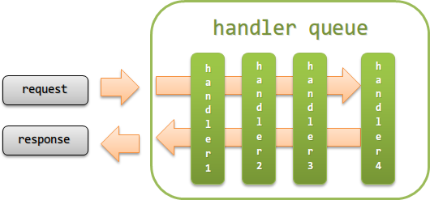

.. _nablarch_architecture:

Architecture
============================

.. contents:: Table of contents
  :depth: 3
  :local:

This chapter describes the architecture of the Nablarch application framework.

.. warning::
  The architecture described in this chapter does not apply to :ref:`jsr352_batch` (See :ref:`jsr352_architecture` of :ref:`jsr352_batch` for more details).

Main components of the Nablarch application framework
------------------------------------------------------------
The main components of the Nablarch application framework are as follows:

.. image:: images/fw-design.png
  :scale: 80

.. _nablarch_architecture-handler_queue:

Handler queue
------------------------------------------------------------
A handler queue refers to a queue in which a group of handlers performing traverse processing for requests or responses is defined in a predetermined order.

The handler queue executes the same processes as the chain execution of a servlet filter as shown in the following figure.

.. _nablarch_architecture-handler_responsibility:

The handler mainly performs the following processes.

 * Filtering of requests. (accepts only requests with access permissions, etc.)
 * Conversion of request and response.
 * Acquiring and releasing resources. (acquiring and releasing database connections, etc.)

.. tip::

  Processing of requests and responses, as well as common processing are handled by implementing a handler in the project.

  Although there are many cases where common processes are implemented in the parent class of the class that implements business logic, 
  implementing them as a separate handler it is recommended. 
  (to add processes before and after individual handlers,  :ref:`nablarch_architecture-interceptor` it is recommended.)
  
  When implemented by individual handlers
    Since the responsibility of individual handlers are clarified, testing is easy and maintainability increases. 
    Since the process for each handler is independent, it is possible to easily add and remove common processes.

  When implementing common processes in the parent class
    When common processes increase, the parent class expands and has multiple responsibilities.
    Not only does this increase maintenance costs, but also complicates testing and becomes a hotbed for bugs.
    Even if the class to be inherited originally is not inherited correctly, detecting failures is difficult because the process can be executed without abnormal termination, depending on the content of the common processes.

Nablarch executes the handlers defined in the handler queue in order from the top for the requests received. 
If a response for a request is returned in the handler process, the handlers executed for the response so far are executed in the reverse order.

Some handlers do not function normally unless they are configured in a handler queue considering the context. 
Since the constraints of handlers (context, etc.) are described in the chapters for each handler, see the documentation for each handler when constructing the handler queue.

.. _nablarch_architecture-interceptor:

Interceptor
~~~~~~~~~~~~~~~~~~~~~~~~~~~~~~~~~~~~~~~~~~~~~~~~~~~~~~~~~~~~
An interceptor is a handler that is dynamically added to the handler queue during execution.

For example, if a process (handler) is added only for a specific request, or to execute a process (handler) by switching the configuration value for each request, an interceptor would be more suitable than a handler.

.. tip::
  Interceptors perform the same process as the interceptors defined in Jakarta Contexts and Dependency Injection of Jakarta EE.

.. important::
  The execution order of interceptors must be configured in the configuration file. 
  Note that if not configured, the execution order of interceptors will be depend on JVM.

  The execution order of interceptors provided by default in Nablarch must be configured as follows.

  #. :java:extdoc:`nablarch.common.web.token.OnDoubleSubmission`
  #. :java:extdoc:`nablarch.common.web.token.UseToken`
  #. :java:extdoc:`nablarch.fw.web.interceptor.OnErrors`
  #. :java:extdoc:`nablarch.fw.web.interceptor.OnError`
  #. :java:extdoc:`nablarch.common.web.interceptor.InjectForm`

  See :java:extdoc:`nablarch.fw.Interceptor.Factory` for details on configuring the execution order of interceptors.

Library
--------------------------------------------------
A library refers to a group of components that can be called from a handler, such as database access, file access and log output.

Refer to :ref:`library`  for the libraries provided by the Nablarch application framework.

