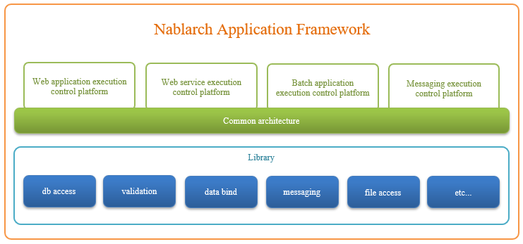

.. _nablarch_big_picture:

Big Picture
============================
The big picture of the Nablarch application framework is given below.

The Nablarch application framework consists of a runtime platform adapted to processing architectures such as web and batch, and a library providing individual functions such as database access and validation.

The Nablarch application framework has the following features.

Supports various processing architectures
 The Nablarch application framework can support various processing architectures by combining the runtime platform and :ref:`library <library>` .

 .. _runtime_platform:

 Runtime platform
  * :ref:`web_application`
  * :ref:`web_service`
  * :ref:`batch_application`
  * :ref:`messaging`

Uses a common architecture for all runtime platforms
 The :ref:`common architecture <nablarch_architecture>`  processes all data according to the pipeline type processing model. 
 In particular, systems that are constructed by combining multiple processing architectures have the following advantages with the use of the :ref:`common architecture <nablarch_architecture>` .

 Flexible addition and changes of functions
  Replacing handlers that are components of the pipeline is easy in the pipeline type processing model .
  This enables a very flexible response to requests for addition and changes of functions.
  Since handlers can be shared between processing architectures, 
  it is not necessary to create duplicate functions for each processing architecture, as required in conventional development.

 Common development method
  Since applications running on each runtime platform can be created and tested with a similar method,
  developers who have development skills in a certain processing architecture can develop using other processing architectures with minimal learning. 
  This makes it possible to improve the productivity of developers and reduce the learning cost, and also facilitates the securing of development personnel.

