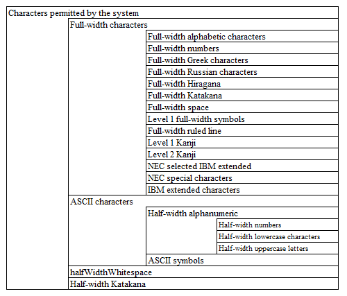

============================================
Procedure to add available characters
============================================

Summary
========

In projects generated from archetypes, there are the following three patterns by which validation error messages for available characters can be configured.

* Those that can be used simply by configuring the message ID
* Those requiring component definition, which cannot be used simply by configuring the message ID
* Those that cannot be used alone

Available character set definition
====================================

Character set inclusion relation
---------------------------------

The available character sets consist of multiple character sets (that is, there is an inclusion relation).

The figure representing a character set is shown below:

Location of the character set definition
-----------------------------------------

For the following character set, the characters included in each character set are defined
by literals in the configuration file in the default configuration (jar).

* Full-width alphabets
* Full-width numbers
* Full-width Greek characters
* Full-width Russian characters
* Full-width Hiragana
* Full-width Katakana
* Full-width space
* Level 1 full-width symbols
* Full-width ruled line
* Level 1 Kanji
* Level 2 Kanji
* NEC selected IBM extended
* NEC special characters
* IBM extended characters
* Half-width numbers
* Half-width lowercase characters
* Half-width uppercase letters
* ASCII symbols
* Half-width kana
  
.. tip::
   
   It is defined in the following resources of the default configuration (jar)
   
   .. code-block:: text
       
     nablarch/core/validation/charset-definition.config

However, for the following character set,
Unicode code points are defined in the component configuration file.

* halfWidthWhitespace

.. tip::
   
   It is defined in the following resources of the default configuration (jar)
   
   .. code-block:: text
       
    nablarch/core/validation/charset-definition.xml

How to Configure
======================

How to configure each available character is shown below.

Available characters that can be used simply by configuring the message ID
---------------------------------------------------------------------------

* Characters permitted by the system
* Full-width characters
* Half-width alphanumeric
* ASCII characters
* Half-width numbers
* Full-width Katakana

The validation error messages for these available characters can be used configuring the message ID.

See the :download:`Default configuration list <../../configuration/default-configuration-list.xlsx>` for the placeholder corresponding to the specified message ID.

See :doc:`./CustomizeMessageIDAndMessage` for the procedure to change the message ID and the message content.

Available characters that cannot be used simply by specifying the message ID
------------------------------------------------------------------------------

* Full-width alphabets
* Full-width numbers
* Full-width Greek characters
* Full-width Russian characters
* Full-width Hiragana
* Level 1 full-width symbols
* Full-width ruled line
* Level 1 Kanji
* Level 2 Kanji
* Full-width space
* Half-width lowercase characters
* Half-width uppercase letters
* ASCII symbols
* Half-width kana
* NEC selected IBM extended
* NEC special characters
* IBM extended characters

The validation error messages for these available characters can be used by carrying out component definition.

.. tip::

  The reason why the message IDs for the above available characters are not included in the default configuration is that if a message ID is not defined,
  a warning will be output when starting the Nablarch application.

Available characters that cannot be used alone
-----------------------------------------------

* halfWidthSpace

How to configure available characters that cannot be used simply by specifying the message ID
==============================================================================================

You need to add component definitions to the Nablarch configuration file (`web-component-configuration.xml` and the like in the case of web projects)
for available characters that cannot be used simply by specifying the message ID.

The following is an example of a definition. Users only need to configure only what is required to be used from these.

.. code-block:: xml

  <!-- Nablarch core function -->
  <import file="nablarch/core.xml"/>

  <!-- Define after nablarch/core.xml to override the default configuration of Nablarch -->

  <!-- Full-width alphabets -->
  <component name="Full-width alphabets" class="nablarch.core.validation.validator.unicode.LiteralCharsetDef">
    <property name="allowedCharacters" value="${nablarch.zenkakuAlphaCharset.allowedCharacters}"/>
    <property name="messageId" value="${nablarch.zenkakuAlphaCharset.messageId}"/>
  </component>

  <!-- Full-width numbers -->
  <component name="Full-width numbers" class="nablarch.core.validation.validator.unicode.LiteralCharsetDef">
    <property name="allowedCharacters" value="${nablarch.zenkakuNumCharset.allowedCharacters}"/>
    <property name="messageId" value="${nablarch.zenkakuNumCharset.messageId}"/>
  </component>

  <!-- Full-width Greek characters-->
  <component name="Full-width Greek characters" class="nablarch.core.validation.validator.unicode.LiteralCharsetDef">
    <property name="allowedCharacters" value="${nablarch.zenkakuGreekCharset.allowedCharacters}"/>
    <property name="messageId" value="${nablarch.zenkakuGreekCharset.messageId}"/>
  </component>

  <!-- Full-width Russian characters -->
  <component name="Full-width Russian characters" class="nablarch.core.validation.validator.unicode.LiteralCharsetDef">
    <property name="allowedCharacters" value="${nablarch.zenkakuRussianCharset.allowedCharacters}"/>
    <property name="messageId" value="${nablarch.zenkakuRussianCharset.messageId}"/>
  </component>

  <!-- Full-width Hiragana -->
  <component name="Full-width Hiragana" class="nablarch.core.validation.validator.unicode.LiteralCharsetDef">
    <property name="allowedCharacters" value="${nablarch.zenkakuHiraganaCharset.allowedCharacters}"/>
    <property name="messageId" value="${nablarch.zenkakuHiraganaCharset.messageId}"/>
  </component>

  <!-- Full-width symbols -->
  <component name="Level 1 full-width symbol" class="nablarch.core.validation.validator.unicode.LiteralCharsetDef">
    <property name="allowedCharacters" value="${nablarch.jisSymbolCharset.allowedCharacters}"/>
    <property name="messageId" value="${nablarch.jisSymbolCharset.messageId}"/>
  </component>

  <!-- Full-width ruled line -->
  <component name="Full-width ruled line" class="nablarch.core.validation.validator.unicode.LiteralCharsetDef">
    <property name="allowedCharacters" value="${nablarch.zenkakuKeisenCharset.allowedCharacters}"/>
    <property name="messageId" value="${nablarch.zenkakuKeisenCharset.messageId}"/>
  </component>

  <!-- Level 1 Kanji -->
  <component name="Level 1 Kanji" class="nablarch.core.validation.validator.unicode.LiteralCharsetDef">
    <property name="allowedCharacters" value="${nablarch.level1KanjiCharset.allowedCharacters}"/>
    <property name="messageId" value="${nablarch.level1KanjiCharset.messageId}"/>
  </component>

  <!-- Level 2 Kanji -->
  <component name="Level 2 Kanji" class="nablarch.core.validation.validator.unicode.LiteralCharsetDef">
    <property name="allowedCharacters" value="${nablarch.level2KanjiCharset.allowedCharacters}"/>
    <property name="messageId" value="${nablarch.level2KanjiCharset.messageId}"/>
  </component>

  <!-- Full-width space -->
  <component name="Full-width space" class="nablarch.core.validation.validator.unicode.LiteralCharsetDef">
    <property name="allowedCharacters" value="${nablarch.zenkakuSpaceCharset.allowedCharacters}"/>
    <property name="messageId" value="${nablarch.zenkakuSpaceCharset.messageId}"/>
  </component>

  <!-- Half-width alphabets -->
  <component name="Half-width alphabets" class="nablarch.core.validation.validator.unicode.LiteralCharsetDef">
    <property name="allowedCharacters" value="${nablarch.lowerAlphabetCharset.allowedCharacters}"/>
    <property name="messageId" value="${nablarch.lowerAlphabetCharset.messageId}"/>
  </component>

  <!-- Half-width uppercase letters -->
  <component name="Half-width uppercase letters" class="nablarch.core.validation.validator.unicode.LiteralCharsetDef">
    <property name="allowedCharacters" value="${nablarch.upperAlphabetCharset.allowedCharacters}"/>
    <property name="messageId" value="${nablarch.upperAlphabetCharset.messageId}"/>
  </component>

  <!-- ASCII symbols -->
  <component name="ASCII symbols" class="nablarch.core.validation.validator.unicode.LiteralCharsetDef">
    <property name="allowedCharacters" value="${nablarch.asciiSymbolCharset.allowedCharacters}"/>
    <property name="messageId" value="${nablarch.asciiSymbolCharset.messageId}"/>
  </component>

  <!-- Half-width Katakana -->
  <component name="Half-width Katakana" class="nablarch.core.validation.validator.unicode.LiteralCharsetDef">
    <property name="allowedCharacters" value="${nablarch.hankakuKanaCharset.allowedCharacters}"/>
    <property name="messageId" value="${nablarch.hankakuKanaCharset.messageId}"/>
  </component>

  <!-- NEC selection IBM extension-->
  <component name="NEC selection IBM extension" class="nablarch.core.validation.validator.unicode.LiteralCharsetDef">
    <property name="allowedCharacters" value="${nablarch.necExtendedCharset.allowedCharacters}"/>
    <property name="messageId" value="${nablarch.necExtendedCharset.messageId}"/>
  </component>

  <!-- NEC special characters -->
  <component name="NEC special characters" class="nablarch.core.validation.validator.unicode.LiteralCharsetDef">
    <property name="allowedCharacters" value="${nablarch.necSymbolCharset.allowedCharacters}"/>
    <property name="messageId" value="${nablarch.necSymbolCharset.messageId}"/>
  </component>

  <!-- IBM extended characters -->
  <component name="IBM extended characters" class="nablarch.core.validation.validator.unicode.LiteralCharsetDef">
    <property name="allowedCharacters" value="${nablarch.ibmExtendedCharset.allowedCharacters}"/>
    <property name="messageId" value="${nablarch.ibmExtendedCharset.messageId}"/>
  </component>

See :doc:`./CustomizeMessageIDAndMessage` for the procedure to change the message ID and the message content.
