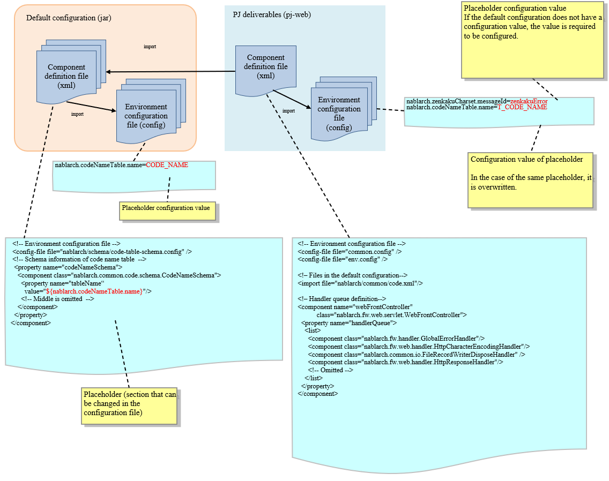

===============================================================
How to Change the Configuration from the Default Configuration
===============================================================

.. contents:: Table of Contents
  :depth: 2
  :local:

Structure of configuration file
================================

Nablarch configuration consists of the configuration files in the default configuration and configuration files in the PJ deliverables.

Structure of the configuration file is shown below.

.. list-table::
  :header-rows: 1
  :class: white-space-normal
  :widths: 5,18

  * - Module
    - Description

  * - Default configuration (jar)
    - Default configuration is packaged in the jar format such as nablarch-main-default-configuration-XXXX.jar and nablarch-testing-default-configuration-XXXX.jar, and distributed as Maven artifacts.|br|
      Some items have values set for placeholders, and some have only placeholders defined.|br|
      For items that are changed very rarely, placeholders are not used and values are set directly.

  * - PJ deliverables
    - When using the archetypes provided by Nablarch, the dependency on the default configuration (jar) is set in advance.
      In the component configuration file of PJ deliverables, the components are provided immediately after they are generated from the archetype, with default values set.

How to customize
======================

Pattern of customization
-------------------------

Following are the patterns by which the configuration files of PJ deliverables can be customized.

* :ref:`how_to_customize_config_files`
* :ref:`how_to_customize_overwite_config_files`
* :ref:`how_to_customize_overwite_componet_file`
* :ref:`how_to_customize_handler_queue`

The details will be described later.

Customization procedure
=======================

.. _how_to_customize_config_files:

Overwriting environment configuration values
---------------------------------------------

The environment configuration values that are frequently changed in PJ are configured in the configuration file of a blank project generated by the archetype.

See \ :doc:`config_key_naming`\ for the naming rules for configuration item names.

.. toctree::
   :maxdepth: 1
   :hidden:

   config_key_naming

Modifying the configuration items where TODO comment is embedded
~~~~~~~~~~~~~~~~~~~~~~~~~~~~~~~~~~~~~~~~~~~~~~~~~~~~~~~~~~~~~~~~~

TODO comment is embedded in the configuration file (properties file) at places to be modified almost certainly in each project, such as DB connection configuration. Modify the set values at such places.

Changing the default value if the PJ requirements are not met with the default value
~~~~~~~~~~~~~~~~~~~~~~~~~~~~~~~~~~~~~~~~~~~~~~~~~~~~~~~~~~~~~~~~~~~~~~~~~~~~~~~~~~~~~

Check the \ :download:`Default configuration list <../../configuration/default-configuration-list.xlsx>`\  and wherever the default value does not meet the PJ requirements, modify the configuration file (properties file).

.. _how_to_customize_overwite_config_files:

Overriding environment configuration values
--------------------------------------------

If you want to override the environment configuration values configured in the configuration file (properties) of the default configuration, redefine them with a placeholder of the same name.

In the \ :download:`Default configuration list <../../configuration/default-configuration-list.xlsx>`\, you can check the contents configured in the default configuration.

.. _how_to_customize_overwite_componet_file:

Overriding the component definition
--------------------------------------

If a placeholder is not used for the property of the component in the component configuration file of the default configuration that you want to change,
or if you want to change the component itself to a different class that you customized in the project,
redefine each component in the component configuration file of the PJ deliverables.

The settings for which placeholder is not used can be checked in the default configuration in the \ :download:`Default configuration list <../../configuration/default-configuration-list.xlsx>`\.

If you need to change the component definition from the default settings,
follow these steps to redefine the component.

Defining a component with the same name
~~~~~~~~~~~~~~~~~~~~~~~~~~~~~~~~~~~~~~~~

Identify the component to be changed from the component definition (xml) of the default configuration, and fetch the component name.

For example, when replacing the following component, you can see that the component name is ``idGenerator``\.

.. code-block:: xml
  
  <!-- Numbering module configuration -->
  <component name="idGenerator"
      class="nablarch.common.idgenerator.TableIdGenerator">
    <!-- Numbering table definition -->
    <property name="tableName" value="ID_GENERATE" />
    <property name="idColumnName" value="ID" />
    <property name="noColumnName" value="NO" />
  </component>

Define a component with the same name as the component you want to replace in any component configuration file.

**[Contents of the redefinition file]**

.. code-block:: xml

  <!-- Numbering module configuration (use Oracle sequence) -->
  <component name="idGenerator"
             class="com.example.common.idgenerator.OracleSequenceIdGenerator">
    <property name="idTable">
      <map>
        <entry key="1101" value="USER_ID_SEQ"/>
      </map>
    </property>
  </component>

.. tip ::

  If more than one component definition has the same name, the setting described later takes precedence.

  Redefine components using this Nablarch specification.

(When a component configuration file is created) Read the created component configuration file
~~~~~~~~~~~~~~~~~~~~~~~~~~~~~~~~~~~~~~~~~~~~~~~~~~~~~~~~~~~~~~~~~~~~~~~~~~~~~~~~~~~~~~~~~~~~~~~

The description example of the component configuration file is shown below.

.. code-block:: xml

     <!-- Previous is omitted-->
     <!-- Numbering function -->
     <import file="nablarch/common/idgenerator.xml" />
    
     <!-- Read component definition of PJ and override the default component definition -->
     <import file="pj_component.xml"/>

     </component>
   </component-configuration>

.. _how_to_customize_handler_queue:

Customization of handler configuration
---------------------------------------

Based on the handler configuration of the generated component, examine the necessary handler configuration for PJ.

An example of customization is given below.

* A dedicated handler will be added to support feature phones.
* Handlers of functions not used by PJ will be excluded.

In the component configuration file
(\ ``XXX_component_configuration.xml``\ ) generated by the Maven archetype,
the minimum handler configuration for the processing architecture is defined in advance.
To change the handler configuration in PJ, edit this file.

Example of configuration change
================================

See below for specific examples of changing the configuration of the component configuration file and the configuration file (properties file).

* :doc:`CustomizeMessageIDAndMessage`
* :doc:`CustomizeAvailableCharacters`
* :doc:`CustomizeSystemTableName`

.. toctree::
   :maxdepth: 1
   :hidden:

   CustomizeMessageIDAndMessage
   CustomizeAvailableCharacters
   CustomizeSystemTableName

.. |br| raw:: html

   
