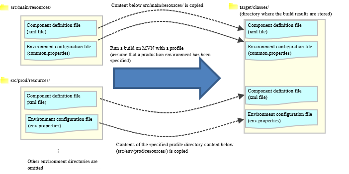

=========================================================================================
How to Manage the Configuration Depending on the Processing Architecture and Environment
=========================================================================================

.. contents:: Table of Contents
  :depth: 2
  :local:

Summary
========

In many cases, a system is organized by multiple processing architectures,
and multiple environments (such as development environment, production environment) are used for developing and operating the system.
Therefore, multiple application configurations must be managed according to each processing architecture and environment.

This chapter describes how to manage the processing architectures and environment-dependent configurations in Nablarch.

Organize application configuration
====================================

Organize application configuration
----------------------------------------------------

Nablarch recommends organizing the application configuration from two perspectives.

.. list-table::
  :header-rows: 1
  :class: white-space-normal
  :widths: 4,6,16

  * - Perspective
    - Specific examples
    - Description

  * - Processing architecture
    - Online, batch
    - The component definition and environment configuration values vary for different processing architectures.

  * - Environment
    - Development environment and production environment
    - Some of the component definitions need to be changed (such as mocks).

The following figure shows the difference in configurations for each approach.

.. image:: method_and_staging.png

Prerequisites and how to switch application configuration files
================================================================

Prerequisites for switching application configuration files
------------------------------------------------------------

Prepare the minimum application configuration files required for the combination of processing architecture and environment.

The directory structure concerning the application configuration files of the project immediately after it is generated from the archetype is shown below.

.. code-block:: text

    web/batch
    |
    \---src
        +---env
        |   +---dev                   … development environment
        |   |   |
        |   |   \---env.properties    … Environment configuration file for development environment (properties)
        |   |
        |   \---prod                  … Production environment
        |       |
        |       \---env.properties    … Environment configuration file for production environment (properties)
        |
        +---main
        |   +---java
        |   |
        |   +---resources             … Resources that do not differ for each environment
        |       |
        |       \---common.properties … Environment-independent configuration files (properties)
        |
        \---test
            +---java
            |
            \---resources             … Unit test environment

.. tip::

 * The environment-independent environment configuration file (properties) is used in all environments.
 * If the environment is not sufficient, see :ref:`how_to_add_profile` below to add an environment.
 * When using a common project that is referenced from an execution-based project (such as web application, batch application), the application configuration files for each environment of the single common project are not required.

How to switch the application configuration
--------------------------------------------

When the application server is launched locally and when the deliverables are generated (when war and jar are generated)
^^^^^^^^^^^^^^^^^^^^^^^^^^^^^^^^^^^^^^^^^^^^^^^^^^^^^^^^^^^^^^^^^^^^^^^^^^^^^^^^^^^^^^^^^^^^^^^^^^^^^^^^^^^^^^^^^^^^^^^^^

Application configuration files are switched
using the \ [#profile]_\  function of Apache Maven
(hereinafter referred to as Maven).

.. [#profile] Profiles are initially defined in projects generated from the archetype. See :ref:`mavenModuleStructuresProfilesList` for the defined profiles.

The operation when built with Maven by specifying the production environment in the profile is shown below.

**[Build command example]**

.. code-block:: bat
  
  mvn -P prod package -DskipTests=true

.. tip::
 The options used in the above command are as follows:
 
 - -P … Specifies the profile
 - -DskipTests=true  … Specifies skipping the unit test

**[Maven operation (application configuration switching part only)]**

.. important::

 If the file name is duplicated in src/main/resources and the directory for each environment, the file in the directory for each environment is given priority.

.. tip::

 In the above figure, only the "component configuration file (xml)" and "environment configuration value definition file (properties file)" are described, but all the files under resources are copied.

.. tip::
 To confirm which environment the artifact was created for,
 the target environment entry (\ ``Target-Environment``\) is added to `META-INF/MANIFEST.MF`\.

 **[Example of MANIFEST.MF when built by specifying the production environment]**

 .. code-block:: none
  
  Manifest-Version: 1.0
  Built-By: tie301686
  Build-Jdk: 1.7.0_60
  Created-By: Apache Maven 3.2.3
  Target-Environment: Production Environment
  Archiver-Version: Plexus Archiver

When the unit test is run
^^^^^^^^^^^^^^^^^^^^^^^^^^^^^^^^^^^^^^^^^^^^^^^^^^^^^^^^^^^

When the unit test is run, the specified profile and the resources in ``src/test/resources`` are used.

If a profile is not specified explicitly, the dev profile is used by default.

An example of the command to run a unit test using the dev profile is shown below.

.. code-block:: bat
  
  mvn test

.. _how_to_change_componet_define:

How to switch components in each environment (how to switch to mock)
=====================================================================

This is achieved by switching the component configuration file (xml file).

How to create a component configuration file (xml file)
-------------------------------------------------------

First, create production component definitions for each processing architecture based on the default configuration values provided by Nablarch.

Next, create a component definition for each environment as a difference from production for those component definitions.

Place the created component configuration file in the directory of each environment, and replace it when building.

.. _how_to_switch_env_values:

How to switch the environment configuration value for each environment
========================================================================

This is achieved by switching the environment configuration file (env.properties) placed in each environment.

.. tip::

 * Configuration items that are unlikely to change in each environment are described in common.properties immediately after being generated from the archetype. |br|
   To change the values described in common.properties for each environment, move (cut and paste) the items to env.properties.

.. _how_to_add_profile:

How to increase the defined environment
====================================================

If the environment defined by default is insufficient, add an environment definition.

Additions can be made using the following methods

.. _addProfile:

Define profiles
--------------------------------------------------

Add a profile definition in the profiles of pom.xml for the project of each processing architecture (such as web and batch).

Below, an integration test environment A has been added as an example.

.. code-block:: xml

  <profiles>
    <!-- Middle is omitted -->

    <!-- Integration test environment A -->
    <profile>
      <id>integration-test-a</id>
      <properties>
        <env.name>Integration test environment A</env.name>
        <env.dir>ita</env.dir>
        <env.classifier>ita</env.classifier>
        <webxml.path>src/main/webapp/WEB-INF/web.xml</webxml.path>
      </properties>
    </profile>

    <!-- Middle is omitted -->
  </profiles>

The items are described below.

.. list-table::
  :header-rows: 1
  :class: white-space-normal
  :widths: 4,18

  * - Item
    - Description

  * - id
    - Profile ID specified when executing the maven command. Specify a profile that does not overlap with other profiles.
    
  * - env.name
    - The environment name to be included in the manifest of war and jar files. Give it an arbitrary name.    

  * - env.dir
    - The directory where the resource is stored.

  * - env.classifier
    - The identifier to be added to the end of the file name part of war and jar.Give it an arbitrary name with alphanumeric characters. |br|
      The process of adding an identifier at the end of the file name is realized by configuring a value for the classifier property of the maven-war-plugin and maven-jar-plugin in pom.xml.

  * - webxml.path
    - Specifies the web.xml to use. |br|
      JNDI configuration must also be described in web.xml.Environmental differences may occur, and the web.xml to be used is configurable. |br|
      If the path is the same as that for production and there is no problem, set "src/main/webapp/WEB-INF/web.xml" as in the example.

Adding a directory
--------------------------------------------------

Add the directory specified in the profile definition.

In the case of the :ref:`addProfile` example, create "src/env/ita/resources/".

Creation and modification of application configuration files
-------------------------------------------------------------

Copy and modify the application configuration files of similar profiles.

.. |br| raw:: html

   