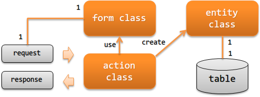

.. _`application_design`:

アプリケーションの責務配置
================================

.. contents:: 目次
  :depth: 3
  :local:

ウェブアプリケーションを作成する際に実装すべきクラスとその責務について説明する。

**クラスとその責務**

アクションクラス(action class)
  アクションクラスはリクエストを元に業務ロジックを実行し、レスポンスの生成と返却を行う。

  例えば、フォームクラスからエンティティクラスを作成し、その内容をデータベースに永続化するなどの処理を行う。

フォームクラス(form class)
  画面からの入力値(http request)をマッピングするクラス。

  リクエストをバリデーションするためのアノテーションの設定や相関バリデーションのロジックを持つ。
  外部からのリクエストによっては、階層構造(formがformを持つ)となる場合もある。

  .. _`application_design-form_html`:

  フォームクラスは、htmlのform単位に作成する
    フォームクラスは画面とのインタフェースを定義するものであり、インタフェース(htmlのform)が異なる場合は別のフォームクラスとして作成する。
    例えば、似たような入力項目を持つことが多い登録画面や更新画面の場合であっても、
    インタフェース(htmlのform)が異なるため別のフォームクラスとする必要がある。

    インタフェース(htmlのform)単位でフォームクラスを作成することで、サーバサイドで受け付けるリクエストパラメータをhtmlのformに定義したものに限定できる。
    これにより、クライアントから想定外のパラメータ(不正なパラメータ)が送信された場合でも、
    フォームクラスへの変換時にそのパラメータは除外され、セキュリティを向上できる。
    また、1つのインタフェースに対応したバリデーションロジックだけを持つため、責務が明確で可読性や保守性が高くなる。

    なお、相関バリデーションのロジックは複数のフォームクラスで共通となることがある。
    この場合は、相関バリデーションのロジックを別クラスに抽出しロジックを共通化すると良い。

  フォームクラスのプロパティは全て `String` で定義する
    プロパティを `String` とすべき理由は、 :ref:`Bean Validation <bean_validation-form_property>` を参照。

  フォームクラスのオブジェクトをセッションに保存しない
    セッションに保存すべきでない理由は、 :ref:`セッションストア <session_store-form>` を参照。

エンティティクラス(entity class)
  テーブルと1対1で対応するクラス。カラムに対応するプロパティを持つ。

