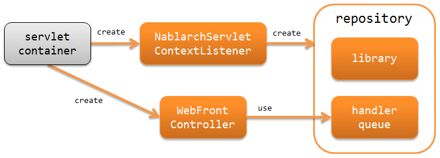

Architecture Overview
==============================

.. contents:: Table of Contents
  :depth: 3
  :local:

Nablarch provides functions for building web applications with HTML-based screen UI.

.. _web_application-structure:

Structuring a web application
----------------------------------------
The use of the Servlet API is assumed when building a web application with Nablarch.
Structure of the web application in Nablarch is shown below.

:ref:`nablarch_servlet_context_listener` (NablarchServletContextListener)
  Servlet context listener that performs the initialization process of the system repository, logs, etc.

:ref:`web_front_controller` (WebFrontController)
  Servlet filter that delegates the processing of the received request to the handler queue.

Web application process flow
----------------------------------------
The process flow of web applications, from processing a request to returning a response, is shown below.

.. image:: images/web-design.png
  :scale: 80

1. :ref:`web_front_controller` (implementation class of `jakarta.servlet.Filter`) receives a request.
2. :ref:`web_front_controller` delegates the processing of the request to a handler queue (handler queue).
3. `DispatchHandler` configured in the handler queue specifies the action class to be processed based on the URI and adds it to the end of the handler queue.
4. The action class executes business logic using a form class and an entity class.
   For more information on each class, see :doc:`application_design`.

5. The action class creates and returns a HttpResponse indicating the process result.
6. The HTTP response handler (`HttpResponseHandler`) in the handler queue converts the `HttpResponse` into a response to be returned to the client. For example, JSP Servlet Forward.
7. Response is returned.

Handler used by the web application
--------------------------------------------------
Nablarch provides several handlers required for building web applications.
Build the handler queue in accordance with the requirements of the project. (a custom handler will have to be created for the project depending on the requirements)

For details of each handler, refer to the link.

Handlers that convert request and response
  * :ref:`http_character_encoding_handler`
  * :ref:`http_response_handler`
  * :ref:`forwarding_handler`
  * :ref:`multipart_handler`
  * :ref:`session_store_handler`
  * :ref:`normalize_handler`
  * :ref:`secure_handler`

Handler for filtering requests
  * :ref:`service_availability`
  * :ref:`permission_check_handler`

Handlers associated with database
  * :ref:`database_connection_management_handler`
  * :ref:`transaction_management_handler`

Handlers for request verification
  * :ref:`csrf_token_verification_handler`

Error handling handler
  * :ref:`http_error_handler`
  * :ref:`global_error_handler`

Others
  * :ref:`http_request_java_package_mapping`
  * :ref:`nablarch_tag_handler`
  * :ref:`thread_context_handler`
  * :ref:`thread_context_clear_handler`
  * :ref:`http_access_log_handler`
  * :ref:`file_record_writer_dispose_handler`
  * :ref:`health_check_endpoint_handler`

Minimum handler configuration
~~~~~~~~~~~~~~~~~~~~~~~~~~~~~~~~~~~~~~~~~~~~~~~~~~
When building a web application in Nablarch, the minimum required handler queue is as below:
With this as the base, add standard handlers of Nablarch or custom handlers created in the project according to the project requirements.

.. list-table:: Minimum handler configuration
   :header-rows: 1
   :class: white-space-normal
   :widths: 4,24,24,24,24

   * - No.
     - Handler
     - Request process
     - Response process
     - Exception handling

   * - 1
     - :ref:`http_character_encoding_handler`
     - Configure the character encoding for the request and response.
     -
     -

   * - 2
     - :ref:`global_error_handler`
     -
     -
     - Outputs the log for a runtime exception or error.

   * - 3
     - :ref:`http_response_handler`
     -
     - Performs any one of servlet forward, redirect, or response writing.
     - Displays the default error page in the case of a runtime exception or error.

   * - 4
     - :ref:`secure_handler`
     -
     - Set the security-related response header in the response object(:java:extdoc:`HttpResponse <nablarch.fw.web.HttpResponse>`)
     - 

   * - 5
     - :ref:`multipart_handler`
     - If the request is in multipart format, the request contents are saved to a temporary file.
     - Deletes the temporary file that is saved.
     -

   * - 6
     - :ref:`session_store_handler`
     - Read the content from the session store.
     - Write content to the session store.
     -

   * - 7
     - :ref:`normalize_handler`
     - Performs normalization process of request parameter
     - 
     -

   * - 8
     - :ref:`forwarding_handler`
     -
     - If the transition destination is an internal forward, the subsequent handlers are re-executed.
     -

   * - 9
     - :ref:`http_error_handler`
     -
     -
     - Outputs the log output and generates response according to the exception type.

   * - 10
     - :ref:`nablarch_tag_handler`
     - Performs pre-processing required for the Nablarch custom tag behavior.
     -
     -

   * - 11
     - :ref:`database_connection_management_handler`
     - Acquires DB connection.
     - Releases the DB connection.
     -

   * - 12
     - :ref:`transaction_management_handler`
     - Being a transaction.
     - Commits the transaction.
     - Rolls back a transaction.

   * - 13
     - :ref:`router_adaptor`
     - Determines the action to call based on the request path.
     -
     -

