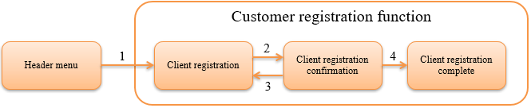

.. _`client_create`:

Create a Registration Function (Hands-on Format)
==================================================
This section describes how to develop the registration function in the web application using Nablarch,
while implementing the client information registration function in the example application.

Description of the function to be created
  1. Click the "Client registration"(顧客登録) link in the header menu.

    .. image:: ../images/client_create/header_menu.png

  2. The client registration screen is displayed.

    .. image:: ../images/client_create/input_display.png

  3. Enter a full-width string for the client name and an arbitrary value with the industry type pull-down and click the "registration"(登録) button.

    .. image:: ../images/client_create/input_name_select.png

  4. The registration confirmation screen is displayed.

    .. image:: ../images/client_create/confirm_display.png

  5. Click the "Confirm"(確定) button to register the client in the database and display the completion screen.

    .. image:: ../images/client_create/complete_display.png

Specification of the Client Registration Function
--------------------------------------------------
Mapping of each process of the client registration function, URL and business action methods are shown below.

=== ====================================== ====================== ====================== ============
NO. Process name                           URL                    Action                 HTTP method
=== ====================================== ====================== ====================== ============
1   Initial display                        /action/client/        ClientAction#input     GET
2   Confirmation of Registration Contents  /action/client/confirm ClientAction#confirm   POST
3   Returns to the registration screen     /action/client/back    ClientAction#back      POST
4   Executes the registration process      /action/client/create  ClientAction#create    POST
=== ====================================== ====================== ====================== ============

The definition of the table to be used is shown below.

  .. image:: ../images/client_create/client_table.png

----

The description of the registration function consists of the following four chapters.

.. toctree::
  :maxdepth: 1

  client_create1
  client_create2
  client_create3
  client_create4