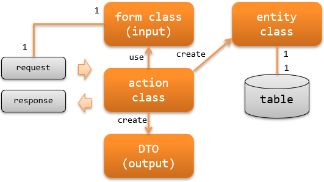

.. _rest-application_design:

Responsibility Assignment of RESTful Web Service
=================================================

.. contents:: Table of Contents
  :depth: 3
  :local:

This section describes the classes to be implemented and their responsibilities when creating RESTful web service.

**Classes and their responsibilities**

Action class
  The action class executes the business logic based on the request and generates and returns the response.

  For example, create an entity class from a form class and persist its contents to a database.

Form class
  Class to map the value (HTTP body) sent from the client (browser, external system, smartphone application, etc.).

  The form class that holds the value submitted by the client has annotations to validate the value and correlation validation logic.

  Depending on the API specification, a form class may have a hierarchical structure (form class has a form class).

  .. _`rest-application_design-form_html`:

  Form class is created for each API
    The form class defines the interface with the client, and a separate form class is created if the interface (API) is different.
    For example, even the registration and update APIs, which often have similar items, are different APIs and should be different form classes.

    Creating a form class for each API has the advantage of limiting the influence of interface changes.
    Since the form class only has validation logic for one interface, its responsibilities are clear and is more readable and maintainable.

    The logic of correlation validation may be the same for multiple form classes
    In this case, it is better to extract the logic of correlation validation into a separate class and make the logic common.

  All the form class properties must be defined by a `String`.
    See :ref:`Bean Validation <bean_validation-form_property>` for the reason why the property must be a `String`.

DTO(data transfer object)
  A class that holds the value to be mapped to the value (response body) that responds to the client.

Entity class
  A class with a one-to-one correspondence with a table. Has the property corresponding to columns.
