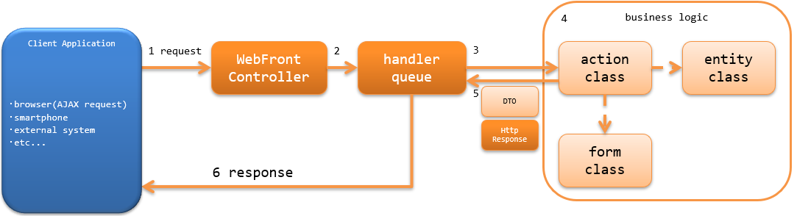

.. _`restful_web_service_architecture`:

Architecture Overview
==============================

.. contents:: Table of Contents
  :depth: 3
  :local:

Nablarch provides the functions to create RESTful web service using the business action of a web application (JAX-RS support)
in the same way JAX-RS resource class is created.

JAX-RS support is based on web applications of Nablarch.
Therefore, JAX-RS cannot use Servlet resource injection or CDI using @Context annotations, which can be used in JAX-RS.
The following annotations are available for JAX-RS support.

 - Produces (specify media type for the response)
 - Consumption (specify the media type of the request)
 - Valid (runs BeanValidation for the request)

For comparison of functions between JSR339 and JAX-RS support , see :ref:`restful_web_service_functional_comparison`.

.. important::

 JAX-RS support does not provide client-side functions.
 If you need to use a JAX-RS client, use a JAX-RS implementation (such as Jersey or RESTEasy).

Structure of RESTful web service
----------------------------------------
It has the same structure as the Nablarch web application.
For more information, see :ref:`web_application-structure`.

Process flow of RESTful web service
----------------------------------------
The process flow of RESTful web service, from processing a request to returning a response, is shown below.

1. :ref:`web_front_controller` (implementation class of `javax.servlet.Filter`) receives a request.
2. :ref:`web_front_controller` delegates the processing of the request to a handler queue (handler queue).
3. `DispatchHandler` configured in the handler queue specifies the action class to be processed based on the URI and adds it to the end of the handler queue.
4. The action class executes business logic using a form class and an entity class. |br|
   For more information on each class, see :ref:`rest-application_design`.

5. The action class creates and returns a form class and `HttpResponse` that shows the processing result.
6. The HTTP response handler (`JaxRsResponseHandler`) in the handler queue converts the `HttpResponse` into a response to be returned to the client, and returns the response to the client. |br|
   If the processing result of the action class is a form class, it will be converted into `HttpResponse` by `BodyConvertHandler`. |br|
   The format of the `HttpResponse` body to be converted is the media type configured in the action class.

Handlers used by RESTful web service
--------------------------------------------------
Nablarch provides several handlers required for building RESTful web service.
Build the handler queue in accordance with the requirements of the project (a custom handler will have to be created for the project depending on the requirements)

For details of each handler, refer to the link.

Handlers that convert request and response
  * :ref:`jaxrs_response_handler`
  * :ref:`body_convert_handler`

Handlers associated with database
  * :ref:`database_connection_management_handler`
  * :ref:`transaction_management_handler`

Handlers for request verification
  * :ref:`jaxrs_bean_validation_handler`
  * :ref:`csrf_token_verification_handler`

Error handling handler
  * :ref:`global_error_handler`

Other handlers
  * :ref:`Handler to link request URI and action <router_adaptor>`
  * :ref:`health_check_endpoint_handler`

Standard handler configuration
~~~~~~~~~~~~~~~~~~~~~~~~~~~~~~~~~~~~~~~~~~~~~~~~~~
When building RESTful web service application in Nablarch, the minimum required handler queue is as below:
With this as the base, add standard handlers of Nablarch or custom handlers created in the project according to the project requirements.

.. list-table:: Minimum handler configuration
  :header-rows: 1
  :class: white-space-normal
  :widths: 4 24 24 24 24

  * - No.
    - Handler
    - Request process
    - Response process
    - Exception handling

  * - 1
    - :ref:`global_error_handler`
    -
    -
    - Outputs the log for a runtime exception or error.

  * - 2
    - :ref:`jaxrs_response_handler`
    - 
    - Writes the response.
    - Generates responses for exceptions (errors), writes and outputs the responses to logs.

  * - 3
    - :ref:`database_connection_management_handler`
    - Acquires DB connection.
    - Releases the DB connection.
    -

  * - 4
    - :ref:`transaction_management_handler`
    - Begin a transaction.
    - Commits the transaction.
    - Rolls back a transaction.

  * - 5
    - :ref:`Handler to link request URI and action <router_adaptor>`
    - Determine the action (method) to call based on the request path.
    -
    -

  * - 6
    - :ref:`body_convert_handler`
    - Converts request body to a form class that is accepted by an action.
    - Converts the form content of the action process results to a response body.
    -

  * - 7
    - :ref:`jaxrs_bean_validation_handler`
    - Executes the validation for the form class converted by No6.
    - 
    -

.. tip::

   Handlers configured after :ref:`Handler to link request URI and action <router_adaptor>`
   are not configured directly in the handler queue but for :ref:`Handler to link request URI and action <router_adaptor>`.

   If :ref:`jaxrs_adaptor` is used, :ref:`body_convert_handler` and :ref:`jaxrs_bean_validation_handler` are added to the handler queue.

   To configure handlers other than :ref:`body_convert_handler` and :ref:`jaxrs_bean_validation_handler` or to increase the media types that are supported,
   build a handler queue referring to the configuration example or implementation of :ref:`jaxrs_adaptor`.

   .. code-block:: xml

    <component name="webFrontController" class="nablarch.fw.web.servlet.WebFrontController">
      <property name="handlerQueue">
        <list>
          <!-- Handler of the previous stage is omitted -->

          <!-- Configure a handler to link request URIs and actions -->
          <component name="packageMapping" class="nablarch.integration.router.RoutesMapping">
            <!-- Configuration values other than handlers are omitted -->
            <property name="methodBinderFactory">
              <component class="nablarch.fw.jaxrs.JaxRsMethodBinderFactory">
                <property name="handlerList">
                  <list>
                    <!--
                    Configure the handler queue after the handler that links the request URI to the action
                    *Configuration values of each class are omitted
                    -->
                    <component class="nablarch.fw.jaxrs.BodyConvertHandler">
                      <!-- Configure the supported media types of converters -->
                    </component>
                    <component class="nablarch.fw.jaxrs.JaxRsBeanValidationHandler" />
                  </list>
                </property>
              </component>
            </property>
          </component>
        </list>
      </property>
    </component>

.. |br| raw:: html
 
    
 
