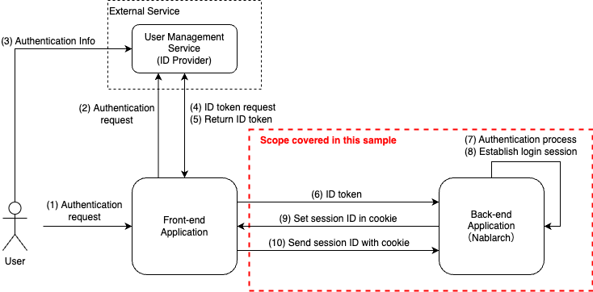
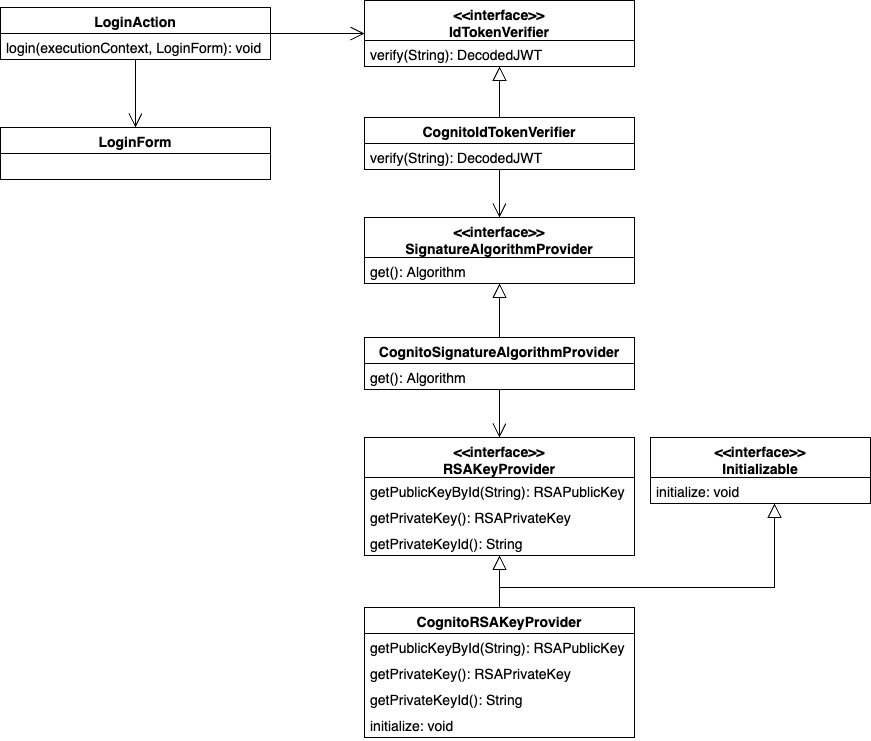

============================================
Authentication sample using OIDC ID token
============================================

-----------------
Delivery package
-----------------

`Source code <https://github.com/nablarch/nablarch-biz-sample-all>`_

The sample is provided in the following package.

  *please.change.me.*\ **common.oidc.verification**

--------------
Summary
--------------

In this sample, authentication is performed using an ID token that can be obtained from OpenID  (hereafter referred to as "OIDC").

Although the method of acquiring ID token and the implementation location may vary depending on the application configuration, the following configuration is assumed in this sample.

* Running a RESTful web services application with Nablarch on back-end.
* ID token are acquired on the front-end (SPA, mobile app, etc.) and then sent to back-end.
* Establish login session upon successful authentication and stateful session management after authentication.
* Authentication processes are implemented in business action.

OIDC is supported by a variety of services, but this sample deals with ID token issued by the following services.

* Amazon Web Services（hereafter referred to as "AWS"）

  * `Amazon Cognito User pool <https://aws.amazon.com/cognito/>`_ (hereafter referred to as "User pool")

* Microsoft Azure（hereafter referred to as "Azure"）

  * `Azure Active Directory B2C <https://learn.microsoft.com/en-us/azure/active-directory-b2c/>`_ （hereafter referred to as "ADB2C"）

Within the offering packages, the packages are further divided by targeted services.

Sample handling ID token issued by User pool.

  *please.change.me.common.oidc.verification.*\ **cognito**

Samples of handling ID token issued by ADB2C.

  *please.change.me.common.oidc.verification.*\ **adb2c**

Since the concept is the same for all packages, this page is based on the sample cognito package.
When using the adb2c package, replace it with the corresponding component as appropriate.

.. tip::

  This sample is implemented according to the specifications of User pool and ADB2C as of March 2023.
  Be sure to check the latest specifications of the services you use and customize accordingly.

~~~~~~~~~~~~~~~~~~~~~~~~~
Scope of this sample
~~~~~~~~~~~~~~~~~~~~~~~~~

The overall process flow and the scope addressed in this sample are described below.

This sample deals only with back-end application that use Nablarch, and does not cover how to obtain ID token for front-end application (web, mobile apps, etc.).

--------------
Structure
--------------

~~~~~~~~~~~~~~~~~~~~~~~~~
Class diagram
~~~~~~~~~~~~~~~~~~~~~~~~~

A class diagram is shown below for the classes provided in this sample.

~~~~~~~~~~~~~~~~~~~~~~~~~~~~~~~~
Responsibilities of each class
~~~~~~~~~~~~~~~~~~~~~~~~~~~~~~~~

Responsibilities of each class are described below.

^^^^^^^^^^^^^^^^
Interface
^^^^^^^^^^^^^^^^

================================== =================================================================================================
Interface name                     Summary
================================== =================================================================================================
IdTokenVerifier                    Provide a function to verify that the ID token is valid.
SignatureAlgorithmProvider         Provide an algorithm to be used for signature verification of token.
================================== =================================================================================================

^^^^^^^^^^^^^^^^^^^^^^^^^^
Class (Component)
^^^^^^^^^^^^^^^^^^^^^^^^^^

================================== =================================================================================================
Class name                         Summary
================================== =================================================================================================
CognitoIdTokenVerifier             Provides the ability to verify the validity of identity tokens provided by Cognito.
CognitoSignatureAlgorithmProvider  Provide the algorithm used for signature verification of tokens provided by Cognito.
CognitoRSAKeyProvider              Provides the RSA public key used to verify token issued by Cognito.
================================== =================================================================================================

^^^^^^^^^^^^^^^^^^^^^^^^^^
Class（Business action）
^^^^^^^^^^^^^^^^^^^^^^^^^^

================================== =================================================================================================
Class name                         Summary
================================== =================================================================================================
LoginAction                        Business Action for authentication process.
LoginRequestForm                   Form to store authentication request information.
================================== =================================================================================================

--------------
How to Use
--------------

~~~~~~~~~~~~~~~~~~~~~~~~~~~~~
Adding Dependency Libraries
~~~~~~~~~~~~~~~~~~~~~~~~~~~~~

ID token are created in the format of JSON Web Tokens (hereafter referred to as "JWT").
Although many libraries for handling JWT are available in OSS, the sample uses "java-jwt" and "jwks-rsa-java" published by Auth0.

.. tip::

  Libraries for working with JWT are also introduced in `OpenID Foundation <https://openid.net/developers/jwt-jws-jwe-jwk-and-jwa-implementations/>`_ and `jwt.io <https://jwt.io/libraries>`_ .

To make the library available, add the following dependencies to dependency settings

.. code-block:: xml

  <dependencies>
    ...
    <!-- JWT Library -->
    <dependency>
      <groupId>com.auth0</groupId>
      <artifactId>java-jwt</artifactId>
      <version>4.2.2</version>
    </dependency>
    <dependency>
      <groupId>com.auth0</groupId>
      <artifactId>jwks-rsa</artifactId>
      <version>0.21.3</version>
    </dependency>
    ...
  </dependencies>

The following dependencies should also be added to the ADB2C package to use the HTTP client.

.. code-block:: xml

  <dependencies>
    ...
    <!-- HTTP client -->
    <dependency>
      <groupId>org.apache.httpcomponents.client5</groupId>
      <artifactId>httpclient5</artifactId>
      <version>5.2.1</version>
    </dependency>
    ...
  </dependencies>

~~~~~~~~~~~~~~~~~~~~~~~~~~~~~~~~~~~~~
Setting environment dependent values
~~~~~~~~~~~~~~~~~~~~~~~~~~~~~~~~~~~~~

The process for verification of ID token is created as a component. Environment dependent values are referenced as properties to set information for accessing the service.
Therefore, the following environment dependent values should be set in the execution environment.

=============================== =================================================================================================
Name                             Summary
=============================== =================================================================================================
aws.cognito.region              Region code where Cognito is created (e.g. ap-northeast-1) .
aws.cognito.userPool.id         User pool ID.
aws.cognito.userPool.clientId   Client ID of application registered in the User pool.
=============================== =================================================================================================

See :ref:`repository-overwrite_environment_configuration` and :ref:`repository-overwrite_environment_configuration_by_os_env_var` for how to set environment dependent values.

.. tip::

  Information required to access services may include information that should be kept confidential.
  If such information is available, it is advisable to avoid writing it in files that are subject to management by a version control system to prevent its leakage to the outside.
  When dealing with such information, it can be safely set as a system property or OS environment variable.

~~~~~~~~~~~~~~~~~~~~~~~~~~~~~~~~
Component Definition Settings
~~~~~~~~~~~~~~~~~~~~~~~~~~~~~~~~

The process for verification of ID token is created as a component, taking into account the use of properties and initialization at startup.
Therefore, those components are defined in the component configuration file.

.. code-block:: xml

  <!-- ID token verification component -->
  <component name="idTokenVerifier" class="please.change.me.common.oidc.verification.cognito.jwt.CognitoIdTokenVerifier">
    <property name="region" value="${aws.cognito.region}" />
    <property name="userPoolId" value="${aws.cognito.userPool.id}" />
    <property name="clientId" value="${aws.cognito.userPool.clientId}" />
    <property name="signatureAlgorithmProvider" ref="signatureAlgorithmProvider" />
  </component>
  <!-- Token Signature Verification Algorithm Provisioning Component -->
  <component name="signatureAlgorithmProvider" class="please.change.me.common.oidc.verification.cognito.jwt.CognitoSignatureAlgorithmProvider">
    <property name="rsaKeyProvider" ref="rsaKeyProvider" />
  </component>
  <!-- RSA public key provisioning component for token signature verification -->
  <component name="rsaKeyProvider" class="please.change.me.common.oidc.verification.cognito.jwt.CognitoRSAKeyProvider">
    <property name="region" value="${aws.cognito.region}" />
    <property name="userPoolId" value="${aws.cognito.userPool.id}" />
  </component>

~~~~~~~~~~~~~~~~~~~~~~~~~
ID token Verification
~~~~~~~~~~~~~~~~~~~~~~~~~

The component that verifies ID tokens should do so in accordance with the verification method provided by the service that issues the ID token.

Note that the signature verification included in the verification method requires access to the JWKS endpoint provided by the service to obtain public key information.
In the sample, in order to facilitate the implementation of tests in the local development environment for processes other than signature verification, the information necessary for signature verification shall be provided by a separate component for easy replacement.

.. code-block:: java

  /**
   * Provides the function to verify the validity of ID token issued by Cognito.
   */
  public class CognitoIdTokenVerifier implements IdTokenVerifier {

      /** Region */
      private String region;

      /** User pool ID */
      private String userPoolId;

      /** Client ID */
      private String clientId;

      /** Signature Algorithm Provider */
      private SignatureAlgorithmProvider signatureAlgorithmProvider;

      @Override
      public DecodedJWT verify(String idToken) throws JWTVerificationException {
          // Follow Cognito's guide on how to verify a token is valid.
          //   https://docs.aws.amazon.com/cognito/latest/developerguide/amazon-cognito-user-pools-using-tokens-verifying-a-jwt.html
          // Assuming that the ID token is sent immediately after acquisition on the front-end, the allowed duration of validity is 60 seconds.
          JWTVerifier verifier = JWT.require(signatureAlgorithmProvider.get())
                  .acceptExpiresAt(60)
                  .withAudience(clientId)
                  .withIssuer(createUserPoolUrl(region, userPoolId))
                  .withClaim("token_use", "id")
                  .build();
          return verifier.verify(idToken);
      }

      /**
       * Create a URL for the User pool.
       *
       * @param region Region
       * @param userPoolId User pool ID
       * @return URL of the User pool
       */
      private String createUserPoolUrl(String region, String userPoolId) {
          return "https://cognito-idp." + region + ".amazonaws.com/" + userPoolId;
      }
      ...
  }

The Algorithm Provisioning Component for Token Signature Verification returns algorithm information according to the algorithm used by the service to sign the token.
The sample uses RSA signatures, so a public key is required, but the process of obtaining the public key information provided by the service shall be provided by a separate component.

.. code-block:: java

  /**
   * Provides the algorithm used for signature verification of tokens issued by Cognito.
   */
  public class CognitoSignatureAlgorithmProvider implements SignatureAlgorithmProvider {

      /** RSA Public Key Provider */
      private RSAKeyProvider rsaKeyProvider;

      @Override
      public Algorithm get() {
          return Algorithm.RSA256(rsaKeyProvider);
      }
      ...
  }

The component that provides public key information for RSA signing implements the RSAKeyProvider interface to obtain the public key information provided by the library from outside.
The component obtains the Json Web Key (hereafter referred to as "JWK") and public key information from the Json Web Key Set (hereafter referred to as "JWKS") endpoint published by the service.

.. tip::

  Some services may rotate the information used for signatures at regular intervals to improve security.
  In addition to rotation, information may also be changed in emergency situations such as information leaks.
  To ensure signature verification, it is preferable to obtain the latest information from the published endpoints instead of using fixed values even if the key information is known in advance.

.. code-block:: java

  /**
   * Provides RSA public key used to verify token issued by Cognito.
   */
  public class CognitoRSAKeyProvider implements RSAKeyProvider, Initializable {

      /** Region */
      private String region;

      /** User pool ID */
      private String userPoolId;

      /** JWK Provider */
      private JwkProvider provider;

      @Override
      public RSAPublicKey getPublicKeyById(String keyId) {
          try {
              Jwk jwk = provider.get(keyId);
              return (RSAPublicKey) jwk.getPublicKey();
          } catch (JwkException e) {
              return null;
          }
      }

      @Override
      public RSAPrivateKey getPrivateKey() {
          // Only public keys can be obtained, private key acquisition is not supported.
          throw new UnsupportedOperationException("Get private key is not supported");
      }

      @Override
      public String getPrivateKeyId() {
          // Because it is undefined, null is returned according to the interface specification.
          return null;
      }

      @Override
      public void initialize() {
          // Create a provider to obtain public keys from JWKS endpoints published by Cognito.
          // This provider allows the following settings.
          // ・How long and how many results for each key ID (value of kid claim) should be cached.
          // ・How long and how many accesses to the JWKS endpoints are allowed.
          // ・Whether to go through a proxy server when accessing JWKS endpoints.
          // The following is set out here.
          // ・Cache up to 4 key IDs per hour (range cached for normal use even when key rotation is crossed)
          // ・Allow up to 10 accesses to JWKS endpoints per minute (range not reached in normal use considering cache)
          // ・Do not use a proxy server
          this.provider = new JwkProviderBuilder(createUserPoolUrl(region, userPoolId))
                  .cached(true)
                  .cached(4, 1, TimeUnit.HOURS)
                  .rateLimited(true)
                  .rateLimited(10, 1, TimeUnit.MINUTES)
                  .proxied(Proxy.NO_PROXY)
                  .build();
      }

~~~~~~~~~~~~~~~~~~~~~~~~~~~~~~~~~~~~~~~~~~~~~~~~~~~~~
Path setting of business action for authentication
~~~~~~~~~~~~~~~~~~~~~~~~~~~~~~~~~~~~~~~~~~~~~~~~~~~~~

In the sample, the path of the business action for authentication is set with the Path annotation of JAX-RS.

.. code-block:: java

  @Path("/cognito/login")
  public class LoginAction {

See :ref:`router_adaptor_path_annotation` for mapping by Path annotation in JAX-RS.

~~~~~~~~~~~~~~~~~~~~~~~~~~~~~~~~~~~~~~~~~~~~~~~~~~~~
Authentication and login status settings on success
~~~~~~~~~~~~~~~~~~~~~~~~~~~~~~~~~~~~~~~~~~~~~~~~~~~~

The business action that implements the authentication process calls for ID token verification and establishes a login session if no abnormality is detected.
If an abnormality is detected, a response with HTTP status 401 (Unauthorized) is returned as error information.

.. tip::

  This sample assumes the use of a CSRF token verification handler to counter CSRF (Cross Site Request Forgery).
  See :ref:`csrf_token_verification_handler` for details on CSRF countermeasures.

.. code-block:: java

  /**
   * Authentication is performed with the ID token, and if successful, a login session is established.
   *
   * @param context Execution Context
   * @param form Request body
   */
  @POST
  @Consumes(MediaType.APPLICATION_JSON)
  @Valid
  public void login(ExecutionContext context, LoginRequestForm form) {
      // Verify that the ID token is valid.
      DecodedJWT decodedJWT = verifyIdToken(form.getIdToken());

      // Change session ID and CSRF token after successful authentication to improve security.
      SessionUtil.changeId(context);
      CsrfTokenUtil.regenerateCsrfToken(context);

      // Identifies user information from information linked with ID token and maintains authentication status in the session.
      String userId = decodedJWT.getSubject();
      SessionUtil.put(context, "user.id", userId);
  }

  /**
   * Verify that the ID token is valid.
   *
   * @param idToken ID Token
   * @return Decoded ID token
   * @throws HttpErrorResponse If it is an invalid ID token (HTTP status code is 401)
   */
  private DecodedJWT verifyIdToken(String idToken) {
      // Define components for validation using environment dependent values, which are retrieved from the system repository.
      IdTokenVerifier idTokenVerifier = SystemRepository.get("idTokenVerifier");
      try {
          // Verify ID token.
          return idTokenVerifier.verify(idToken);
      } catch (JWTVerificationException e) {
          if (LOGGER.isDebugEnabled()) {
              LOGGER.logDebug("ID token verification failed...", e);
          }
          // If the verification detects an abnormality, an error response with status code 401 (Unauthorized) is returned.
          throw new HttpErrorResponse(HttpResponse.Status.UNAUTHORIZED.getStatusCode());
      }
  }
