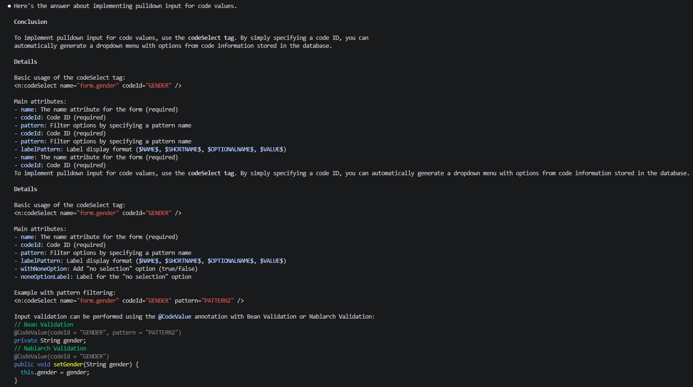
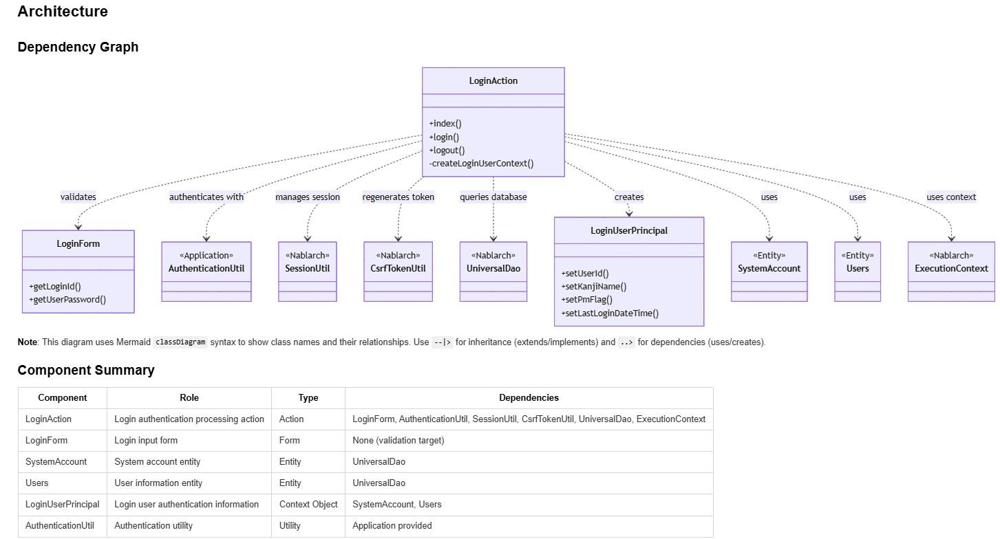
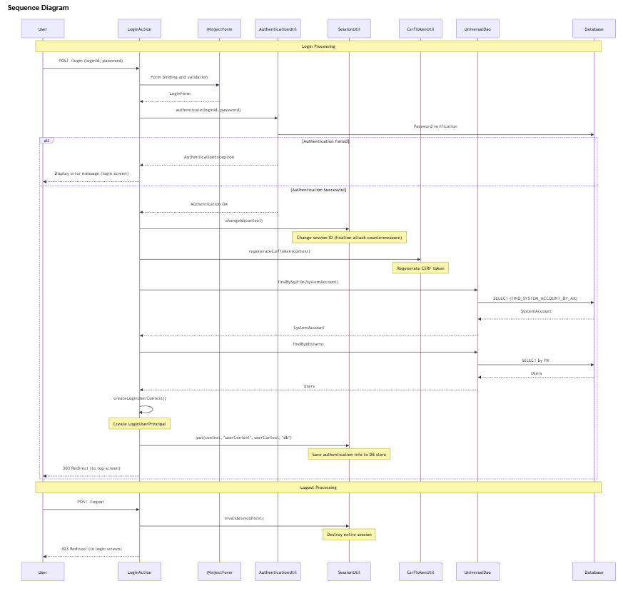

==========================================================================
Nablarch-specific AI Coding Tool Plugin
==========================================================================

.. contents:: Table of Contents
  :depth: 2
  :local:

Prerequisites
==========================================================================

This plugin requires `Claude Code(External site) <https://claude.ai/code>`_ or `GitHub Copilot(External site) <https://github.com/features/copilot>`_.

What is the Nablarch-specific AI Coding Tool Plugin
==========================================================================

The Nablarch-specific AI Coding Tool Plugin is an AI assistant equipped with knowledge from the official Nablarch documentation, system development guides, and sample projects.
It operates as a plugin for Claude Code or GitHub Copilot, providing accurate answers to Nablarch-specific specifications and conventions.

Background
--------------------------------------------

In recent years, generative AI has rapidly penetrated development sites, and developers are using AI on a daily basis.
However, Nablarch information is scattered across multiple sources on the web, requiring cross-sectional understanding.
Therefore, generative AI cannot accurately answer Nablarch-specific specifications and conventions.

Common Challenges in Development
--------------------------------------------

Have you experienced these challenges in Nablarch development?

* "Which documentation contained that configuration?"
* "Looking up API usage requires going back and forth through multiple official documentation pages..."
* "When I ask AI, it suggests non-existent methods, causing more confusion"
* "Explaining Nablarch to team members takes time away from design work"

Solved by This Plugin
--------------------------------------------

By introducing this plugin, you can simply type ``/n6`` in Claude Code or GitHub Copilot Chat and ask questions to get immediate, evidence-based answers about Nablarch specifications and conventions from AI.

Functions Provided
============================================

Knowledge Search
--------------------------------------------

Answers questions based on Nablarch documentation.

Usage example::

  /n6 How do I implement a pull-down input for code values?

Searches related sections across Nablarch documentation and returns answers including code examples and configuration examples.

**Answer Example**

How it works:

* Converts official Nablarch documentation to AI-readable JSON format
* Ensures accuracy through two-stage process: keyword full-text search + AI-based relevance determination
* Fallback mechanism where AI selects files from the table of contents when full-text search finds no hits

Code Analysis
--------------------------------------------

Analyzes application code within the project from a Nablarch perspective and documents the overall picture.

Usage example::

  /n6 code-analysis

Visualizes the following information:

* Class dependencies
* Handler queue configuration
* Processing flow visualized in Mermaid diagrams

**Output Example**

Class dependency diagram and component summary:

Processing flow diagram (sequence diagram):

Along with the diagrams above, detailed documentation is generated including the role of each component, how to use Nablarch framework features, and implementation points.

Main use case: Quick understanding of the overall picture when new members join the project.

Features
============================================

**Answers Based Only on Official Documentation**
  Knowledge files are created through rule-based transformation of official Nablarch documentation.
  AI does not introduce external information through web search or speculation; answer sources are always limited to official information.

**Clearly States When Information Is Unavailable**
  For questions without information in the knowledge files, explicitly states "Not included in knowledge files."
  Never returns incorrect answers through plausible speculation.

**Always Provides Section-Level References in Answers**
  All answers clearly indicate their sources, allowing immediate verification of AI answer accuracy.

  **Reference Presentation Structure**
    * Line 1: Page title (e.g., HTTP Error Control Handler, etc.)
    * Line 2: File path (.md knowledge file)
    * Line 3: Title of each cited section

Supported Versions
============================================

This plugin supports the following Nablarch versions.

.. list-table::
   :header-rows: 1
   :widths: 60, 40

   * - Supported Version
     - Plugin
   * - Nablarch 6u3
     - `nabledge-6(External site) <https://github.com/nablarch/nabledge/blob/main/plugins/nabledge-6/README.md>`_
   * - Nablarch 5u26
     - `nabledge-5(External site) <https://github.com/nablarch/nabledge/blob/main/plugins/nabledge-5/README.md>`_
   * - Nablarch 1.4.11
     - `nabledge-1.4(External site) <https://github.com/nablarch/nabledge/blob/main/plugins/nabledge-1.4/README.md>`_
   * - Nablarch 1.3.7
     - `nabledge-1.3(External site) <https://github.com/nablarch/nabledge/blob/main/plugins/nabledge-1.3/README.md>`_
   * - Nablarch 1.2.8
     - `nabledge-1.2(External site) <https://github.com/nablarch/nabledge/blob/main/plugins/nabledge-1.2/README.md>`_

Installation
============================================

This plugin is freely available as OSS on GitHub.
It can be easily installed by executing a single command in the terminal.

For Nablarch 6
--------------------------------------------

Execute the following command in the terminal::

   curl -sSL https://raw.githubusercontent.com/nablarch/nabledge/main/setup-cc.sh | bash -s -- -v 6

or::

   curl -sSL https://raw.githubusercontent.com/nablarch/nabledge/main/setup-ghc.sh | bash -s -- -v 6

This will make the ``/n6`` command available.

For Other Versions
--------------------------------------------

Check the setup procedure from the "Plugin" column link in the supported versions table for the corresponding version.

